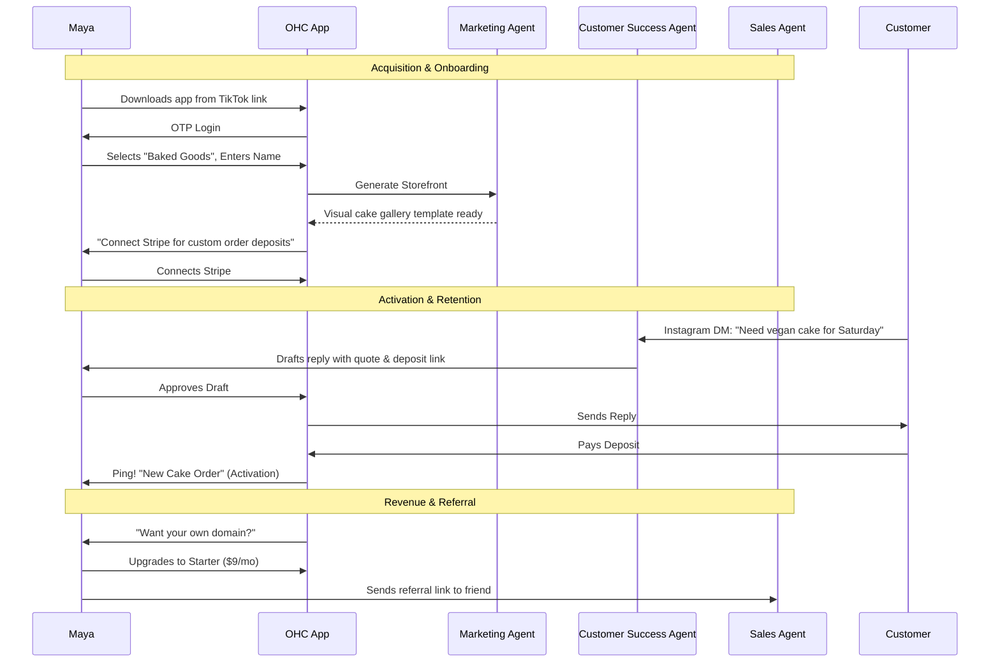
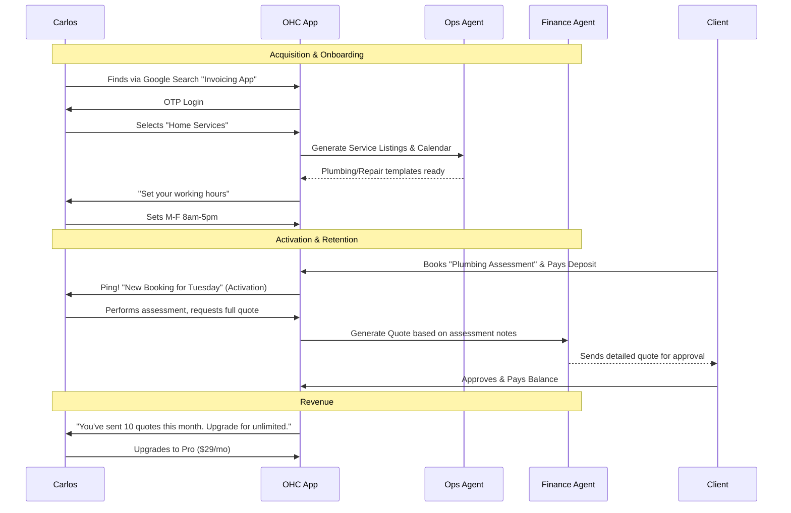
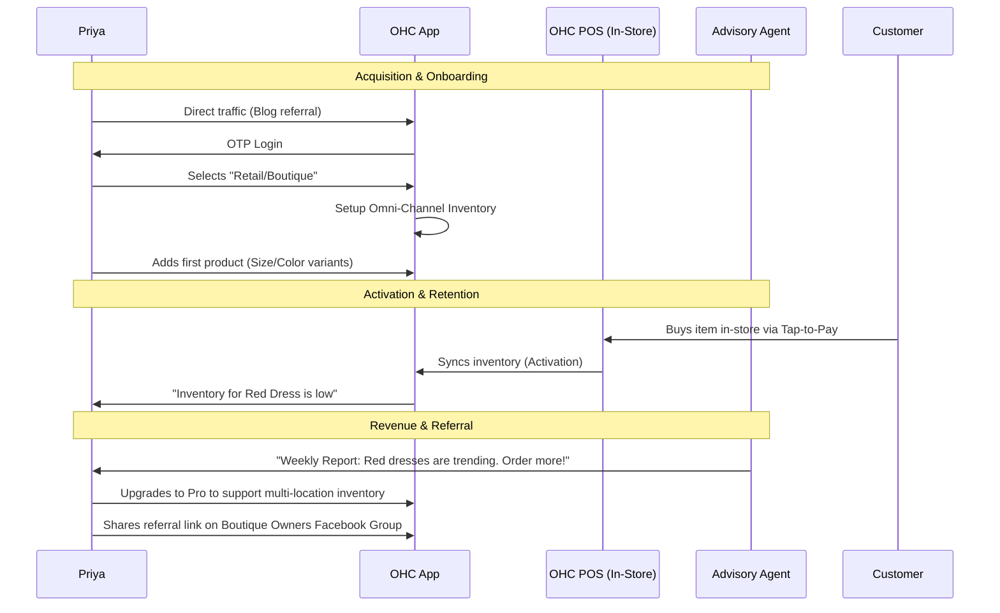
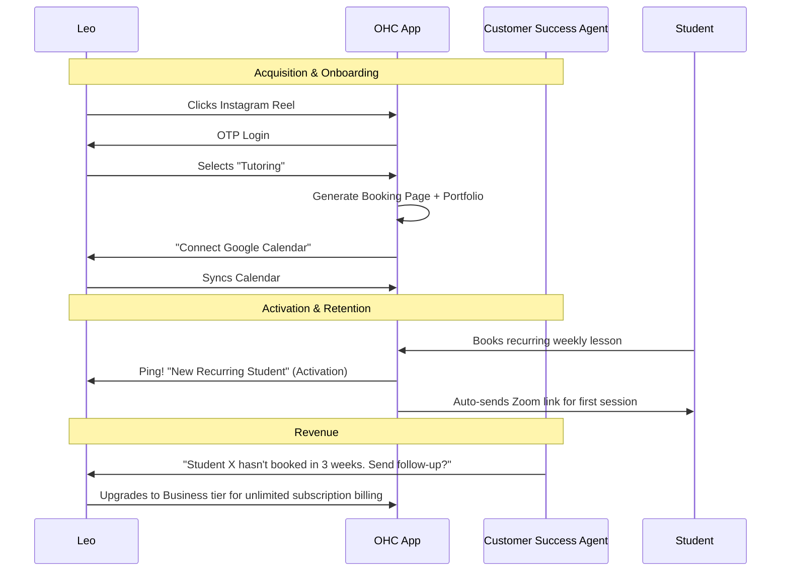
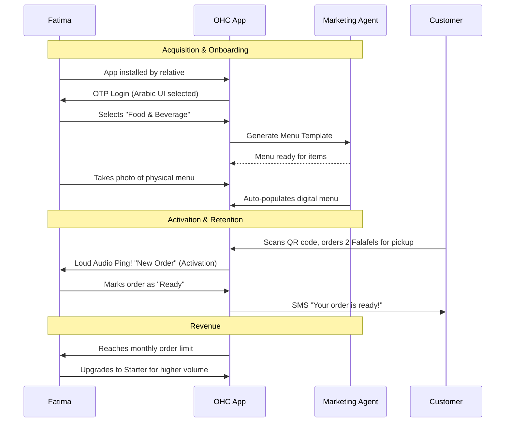

# Title: Complete End-to-End User Journey Architecture for OHC

## Problem Statement
Small business owners (our personas: Maya, Carlos, Priya, Leo, Fatima) have vastly different business models, yet they all need a simple, intuitive, and frictionless path from discovery to becoming active, revenue-generating users on OneHumanCorp (OHC). Currently, we lack a unified architectural map that details the exact lifecycle stages—Acquisition, Onboarding, Activation, Retention, Revenue, and Referral—for each of these distinct personas. Without this, we risk creating fragmented user experiences or building features that do not align with how non-technical users actually discover and use software to run their businesses.

## Research Report
The success of platforms like Shopify and Wix lies in their ability to abstract complex workflows into simple steps. However, OHC's target demographic is even less technical ("zero technical knowledge needed") and heavily mobile-first.

### Persona Analysis
1.  **Maya (Home Baker, 28):** Driven by social media. Needs seamless Instagram integration.
2.  **Carlos (Freelance Handyman, 42):** Driven by local word-of-mouth. Needs simple booking and invoicing.
3.  **Priya (Boutique Owner, 35):** Needs an omnichannel solution syncing physical store inventory with an online presence.
4.  **Leo (Music Tutor, 22):** Digital-native, needs scheduling, subscription management, and social media tools.
5.  **Fatima (Food Cart, 50):** Requires extreme simplicity, multi-language support, and clear notification flows for orders.

### Competitive Gap
Competitors often provide generic onboarding (e.g., "What is your industry?") but fail to tailor the *entire* journey to the specific business model. OHC must proactively configure the AI agents and platform features based on the initial onboarding signal.

## Design Doc

### Key Design Decisions
1.  **Mobile-First Journey:** The entire journey, from signup to configuring complex features like subscriptions or booking systems, must be executable on a 375px mobile screen.
2.  **Progressive Profiling:** We collect only essential information during onboarding (Name, Business Type, Contact). The rest is collected gradually through "Next Best Action" prompts driven by the Business Advisory AI.
3.  **AI-Driven Setup:** Instead of making users build a site or configure products manually, the "Marketing & Advertising" agent generates a starting point based on their business type and a brief description.

### Lifecycle Stages Map

#### 1. Acquisition
*   **Maya:** Sees a TikTok ad showing another baker easily managing orders. Clicks link to download app.
*   **Carlos:** Hears about OHC from another contractor. Searches Google, lands on SEO-optimized landing page highlighting "Get paid faster."
*   **Priya:** Reads a blog post about syncing physical and online stores. Clicks through to OHC site.
*   **Leo:** Sees an Instagram reel about a "link-in-bio on steroids."
*   **Fatima:** A younger relative downloads the app for her after hearing it supports Arabic.

#### 2. Onboarding (Zero to Live in < 10 mins)
*   **Universal Flow:** Enter Phone Number -> OTP -> "What do you do?" (Select Category) -> "What's your business name?" -> AI Agent generates initial storefront and operational setup.
*   **Maya:** AI generates a visual gallery template for cakes. Prompted to connect Stripe to accept custom order deposits.
*   **Carlos:** AI generates a service listing template. Prompted to set available hours for bookings.
*   **Priya:** AI generates a retail catalog template. Prompted to add first product variant.
*   **Leo:** AI generates a portfolio/booking template. Prompted to connect Google Calendar.
*   **Fatima:** AI generates a menu template (Arabic/English). Prompted to enable push notifications for orders.

#### 3. Activation (The "Aha!" Moment)
*   **Maya:** Receives her first deposit for a custom cake order via an Instagram DM handled by the AI agent.
*   **Carlos:** A client books a plumbing fix and pays the deposit online.
*   **Priya:** Syncs her first in-store sale with her online inventory via the OHC POS.
*   **Leo:** A student books a recurring weekly lesson package.
*   **Fatima:** Her phone pings with her first pickup pre-order.

#### 4. Retention (Daily Habit)
*   **Maya:** Checks the app daily to manage cake delivery dates and respond to complex DMs escalated by the AI.
*   **Carlos:** Uses the app to send quotes after inspecting jobs and checks his daily schedule.
*   **Priya:** Reviews daily analytics (sales trends, inventory alerts).
*   **Leo:** Manages student communications and checks his upcoming Zoom links.
*   **Fatima:** Keeps the app open during service hours to manage incoming orders and toggle sold-out items.

#### 5. Revenue (Monetization Trigger)
*   **Trigger:** Users upgrade from Free to Starter ($9/mo) when they hit limits or need premium features.
*   **Maya:** Upgrades to get a custom domain (`mayascakes.com`) to look more professional.
*   **Carlos:** Upgrades to access advanced quote generation and follow-up sequences.
*   **Priya:** Upgrades to Pro to support unlimited products and in-person tap-to-pay.
*   **Leo:** Upgrades to enable subscription billing for his students.
*   **Fatima:** Upgrades to support higher order volumes and custom SMS notifications.

#### 6. Referral
*   **Mechanism:** Built-in incentivized referral program managed by the "Sales & Acquisition" agent.
*   **Scenario:** Priya loves the inventory sync and shares a referral link with another boutique owner. Both get a month of the Pro tier free.

### Friction Points & Abandonment Risks
1.  **Stripe/Payment Connection:** Often requires SSN/EIN or complex verification. If this interrupts the "10 minutes to live" flow, users will bounce. *Mitigation:* Allow "cash on delivery/pickup" or standard bank transfer initially, deferring full Stripe setup until the first actual online payment is required.
2.  **Initial Catalog/Service Entry:** Manually typing out 20 services or products on a mobile keyboard is tedious. *Mitigation:* Use AI to scrape an existing Instagram page or let the user take a single photo of a paper menu to auto-generate the catalog.
3.  **Domain Setup:** Non-technical users struggle with DNS records. *Mitigation:* We handle DNS entirely on our end. Users only ever see "Pick your domain name" within OHC.
4.  **AI Trust:** Users might fear the AI will send a wrong or inappropriate message on their behalf. *Mitigation:* AI always drafts messages for review ("Approval Mode") until the user explicitly toggles "Auto-Send" after gaining confidence.

### Architecture Diagrams (Mermaid.js)

#### 1. Maya (The Home Baker) Full Journey

#### 2. Carlos (The Handyman) Full Journey

#### 3. Priya (The Boutique Owner) Full Journey

#### 4. Leo (The Music Tutor) Full Journey

#### 5. Fatima (The Food Cart) Full Journey

## Implementation Prompt
**Task:** Build the core user onboarding flow and database schema to support the Business Journey Architecture.
**CUJ:** A new user downloads the app, creates an account using phone OTP, selects their business type, and lands on an AI-generated dashboard tailored to their business model.
**Acceptance Criteria:**
1.  Implement a robust authentication flow (e.g., using existing auth mechanisms) tailored for quick mobile entry.
2.  Create database tables/structures to store user profiles, business metadata, and onboarding state.
3.  Implement an API endpoint that takes the selected business type and orchestrates a call to the AI agent service to generate the initial tenant configuration (storefront layout, enabled features).
4.  Ensure all UI elements match the required design tokens (mobile-first, 375px base, touch targets >= 44px).
5.  Include E2E tests validating the full onboarding flow for at least two distinct persona types (e.g., a service business and a product business).

## Priority
P0

## Estimated Scope
Large
