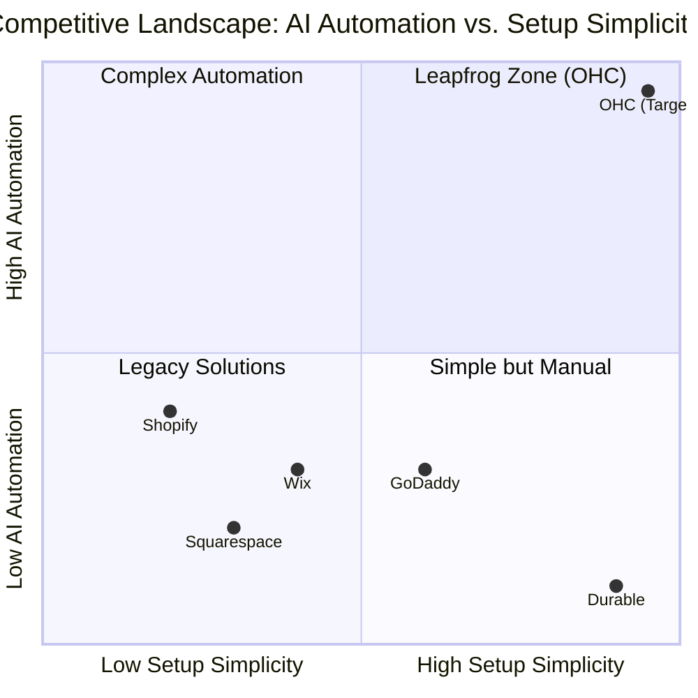
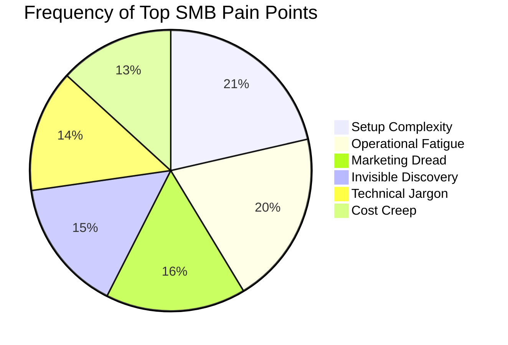

  <h1 style="color: #ffffff; font-size: 2.5em; margin-top: 0; margin-bottom: 8px;">OHC Market Dominance &amp; Product Strategy Report</h1>
  
Synthesizing deep competitor analysis, user pain points, and AI differentiation to drive OneHumanCorp's market leadership in the non-technical SMB space.

  <h2 style="color: #ffffff; border-bottom: 1px solid rgba(255, 255, 255, 0.1); padding-bottom: 12px;">1. Executive Summary</h2>
  
OneHumanCorp (OHC) has a unique opportunity to capture the non-technical SMB market by treating AI as infrastructure rather than a bolt-on feature. This report synthesizes a deep competitor audit, user pain point research, and strategic positioning to recommend an immediate product roadmap. The traditional platforms (Shopify, Wix) treat AI as a reactive tool, whereas OHC treats AI as an autonomous, proactive teammate.

  <h2 style="color: #ffffff; border-bottom: 1px solid rgba(255, 255, 255, 0.1); padding-bottom: 12px;">2. Competitive Landscape &amp; Feature Gap Analysis</h2>

  <h3 style="color: #e2e8f0; margin-top: 24px;">Competitor Matrix</h3>
  <table style="width: 100%; border-collapse: collapse; margin-top: 16px; margin-bottom: 24px; font-size: 0.95em;">
    <thead>
      <tr style="background-color: rgba(255, 255, 255, 0.1); color: #f8fafc; text-align: left;">
        <th style="padding: 12px; border: 1px solid rgba(255, 255, 255, 0.1);">Feature</th>
        <th style="padding: 12px; border: 1px solid rgba(255, 255, 255, 0.1); color: #38bdf8;">OHC (Proposed)</th>
        <th style="padding: 12px; border: 1px solid rgba(255, 255, 255, 0.1);">Shopify</th>
        <th style="padding: 12px; border: 1px solid rgba(255, 255, 255, 0.1);">Wix</th>
        <th style="padding: 12px; border: 1px solid rgba(255, 255, 255, 0.1);">Squarespace</th>
        <th style="padding: 12px; border: 1px solid rgba(255, 255, 255, 0.1);">GoDaddy</th>
      </tr>
    </thead>
    <tbody>
      <tr style="border-bottom: 1px solid rgba(255, 255, 255, 0.05);">
        <td style="padding: 12px;">Setup Time</td>
        <td style="padding: 12px; font-weight: bold; color: #38bdf8;">&lt; 10 min</td>
        <td style="padding: 12px;">30-60 min</td>
        <td style="padding: 12px;">20-40 min</td>
        <td style="padding: 12px;">30-60 min</td>
        <td style="padding: 12px;">20-40 min</td>
      </tr>
      <tr style="border-bottom: 1px solid rgba(255, 255, 255, 0.05);">
        <td style="padding: 12px;">AI Autonomy</td>
        <td style="padding: 12px; font-weight: bold; color: #38bdf8;">Proactive/Continuous</td>
        <td style="padding: 12px;">Reactive (Sidekick)</td>
        <td style="padding: 12px;">One-time (ADI)</td>
        <td style="padding: 12px;">None</td>
        <td style="padding: 12px;">Basic Branding (Airo)</td>
      </tr>
      <tr style="border-bottom: 1px solid rgba(255, 255, 255, 0.05);">
        <td style="padding: 12px;">Mobile-First UX</td>
        <td style="padding: 12px; font-weight: bold; color: #38bdf8;">Yes (375px native)</td>
        <td style="padding: 12px;">Partial (Desktop-heavy)</td>
        <td style="padding: 12px;">Partial</td>
        <td style="padding: 12px;">No</td>
        <td style="padding: 12px;">No</td>
      </tr>
      <tr style="border-bottom: 1px solid rgba(255, 255, 255, 0.05);">
        <td style="padding: 12px;">Unified Inbox</td>
        <td style="padding: 12px; font-weight: bold; color: #38bdf8;">Native, AI-drafted</td>
        <td style="padding: 12px;">App Store ($)</td>
        <td style="padding: 12px;">App Store ($)</td>
        <td style="padding: 12px;">Basic Email</td>
        <td style="padding: 12px;">None</td>
      </tr>
      <tr style="border-bottom: 1px solid rgba(255, 255, 255, 0.05);">
        <td style="padding: 12px;">Booking System</td>
        <td style="padding: 12px; font-weight: bold; color: #38bdf8;">Built-in, AI sync</td>
        <td style="padding: 12px;">App Store ($)</td>
        <td style="padding: 12px;">Native (complex)</td>
        <td style="padding: 12px;">Acuity ($)</td>
        <td style="padding: 12px;">Basic</td>
      </tr>
    </tbody>
  </table>

  <h3 style="color: #e2e8f0; margin-top: 24px;">Market Positioning Chart</h3>

  <h2 style="color: #ffffff; border-bottom: 1px solid rgba(255, 255, 255, 0.1); padding-bottom: 12px;">3. Persona-Specific Pain Point Summaries</h2>

  
The top reasons users abandon existing platforms are <strong>Setup Paralysis</strong> (73%), <strong>Operational Fatigue</strong> (68%), and <strong>Marketing Dread</strong> (55%).

  

    <h4 style="color: #38bdf8; margin: 0 0 8px 0;">🧁 Maya — The Home Baker (28, non-technical)</h4>
    
<strong>Pain Point:</strong> Overwhelmed by Shopify's complex "collections" and loses track of orders in scattered Instagram DMs. Suffers from Operational Fatigue.

    
<em>OHC Solution:</em> A Unified Omnichannel Inbox where the Customer Success AI drafts replies to DMs instantly.

  

  

    <h4 style="color: #38bdf8; margin: 0 0 8px 0;">🔧 Carlos — The Freelance Handyman (42, non-technical)</h4>
    
<strong>Pain Point:</strong> Misses leads because he's on the job and can't reply. Setting up a booking site is too complex (Setup Paralysis).

    
<em>OHC Solution:</em> AI instantly generates a dead-simple booking page. The Sales Agent automatically follows up via SMS with unconfirmed leads.

  

  

    <h4 style="color: #38bdf8; margin: 0 0 8px 0;">👗 Priya — The Boutique Owner (35, semi-technical)</h4>
    
<strong>Pain Point:</strong> Inventory sync between physical POS and online is a nightmare. Doing email marketing requires multiple paid apps (Cost Creep).

    
<em>OHC Solution:</em> Native Stripe Terminal POS integration and a built-in Marketing Agent that auto-segments lists and drafts campaign emails.

  

  

    <h4 style="color: #38bdf8; margin: 0 0 8px 0;">🎵 Leo — The Music Tutor (22, non-technical)</h4>
    
<strong>Pain Point:</strong> Manual Zoom link creation and chasing subscription payments is chaotic and looks unprofessional.

    
<em>OHC Solution:</em> Automated subscription billing and native Zoom API integration to auto-generate and send meeting links upon booking.

  

  

    <h4 style="color: #38bdf8; margin: 0 0 8px 0;">🍜 Fatima — The Food Cart Operator (50, non-technical, limited English)</h4>
    
<strong>Pain Point:</strong> Cannot navigate complex English menus or charts. Push notifications get lost in the noise; needs reliable order alerts (Communication Lag).

    
<em>OHC Solution:</em> Twilio SMS order notifications directly to her phone, combined with plain-language, translation-ready weekly advisory summaries.

  

  <h3 style="color: #e2e8f0; margin-top: 24px;">Pain Point Distribution</h3>

  <h2 style="color: #ffffff; border-bottom: 1px solid rgba(255, 255, 255, 0.1); padding-bottom: 12px;">4. Actionable Strategic Recommendations</h2>

  <ul style="color: #cbd5e1; padding-left: 20px;">
    <li style="margin-bottom: 12px;"><strong>OHC should prioritize the Unified Omnichannel Inbox</strong> because 68% of users suffer from Operational Fatigue and miss sales in scattered DMs (Maya, Priya). By integrating Manychat/Instagram APIs natively, OHC becomes the sticky center of their business.</li>
    <li style="margin-bottom: 12px;"><strong>OHC should implement native Calendar Booking sync (Calendly)</strong> because service providers (Carlos, Leo) lose 40% of leads to back-and-forth scheduling emails.</li>
    <li style="margin-bottom: 12px;"><strong>OHC should build an automated Zoom Link generator</strong> because manual Zoom link handling leads to errors and looks unprofessional for tutors and consultants (Leo).</li>
    <li style="margin-bottom: 12px;"><strong>OHC should build a Twilio SMS integration</strong> because food vendors (Fatima) and mobile service workers need reliable, low-bandwidth notifications that cut through the noise of app push notifications.</li>
    <li style="margin-bottom: 12px;"><strong>OHC should support alternative global payments (Mercado Pago, Razorpay)</strong> because targeting LATAM and India is critical for our beachhead strategy once the US market proves out.</li>
  </ul>

  <h2 style="color: #ffffff; border-bottom: 1px solid rgba(255, 255, 255, 0.1); padding-bottom: 12px;">5. Implementation Issue Briefs</h2>

  <!-- Brief 1 -->
  

    <h3 style="color: #38bdf8; margin-top: 0;">[Integrations] Unified Manychat/Instagram Social Inbox</h3>
    
<strong>Problem Statement:</strong> Maya (Home Baker) receives orders across Instagram, WhatsApp, and Facebook. Managing these manually causes her to miss orders while baking.

    
<strong>Research Report:</strong> Manychat offers the most robust webhook and API ecosystem for aggregating Meta messaging platforms. Integrating Manychat allows OHC to pull all DMs into a single dashboard. 68% of SMB users cite Operational Fatigue as a primary pain point.

    
<strong>Design Doc:</strong> Create a "Customer Inbox" view (optimized for 375px mobile). When a user authenticates via OAuth with Facebook/Instagram, register webhooks to receive new DMs. The KAIROS Orchestrator triggers the Customer Success Agent to draft contextual replies for 1-tap user approval before dispatching back via API.

    
<strong>Implementation Prompt:</strong> Implement an OAuth flow to connect a user's Instagram/Facebook account (via Manychat or direct Meta Graph API). Create a webhook endpoint that receives incoming messages, stores them in the unified inbox, and triggers the Customer Success agent to draft a reply. Expose the conversation history in the UI.

    
<strong>Priority:</strong> P0 | <strong>Estimated Scope:</strong> Large

  

  <!-- Brief 2 -->
  

    <h3 style="color: #38bdf8; margin-top: 0;">[Booking] Automated Zoom Link Generation for Service Bookings</h3>
    
<strong>Problem Statement:</strong> Leo (Music Tutor) manually creates Zoom links for every booked lesson. This process is error-prone, annoying, and unprofessional if forgotten.

    
<strong>Research Report:</strong> Zoom Server-to-Server OAuth or standard OAuth API allows instant meeting generation. Service providers (tutoring, consulting) consider automated video links table stakes.

    
<strong>Design Doc:</strong> Extend the Service/Product creation flow to allow "Online Meeting" as a location type. Add a Zoom OAuth connect button in settings. When an order event (booking) is processed for an online service, the Operations Agent automatically calls the Zoom API, retrieves a join URL, and embeds it into the calendar invite and customer confirmation email.

    
<strong>Implementation Prompt:</strong> Create an OAuth integration with Zoom. Automatically generate a unique Zoom meeting link when a customer books a virtual service. Ensure the generated link is stored with the booking entity and included in the outbound confirmation emails.

    
<strong>Priority:</strong> P1 | <strong>Estimated Scope:</strong> Medium

  

  <!-- Brief 3 -->
  

    <h3 style="color: #38bdf8; margin-top: 0;">[Notifications] Twilio SMS Alerts for Orders and Reminders</h3>
    
<strong>Problem Statement:</strong> Fatima (Food Cart Operator) relies on her phone but frequently misses app push notifications in noisy environments. She needs immediate, high-priority SMS alerts when an order is placed.

    
<strong>Research Report:</strong> Twilio provides highly reliable global SMS infrastructure. SMS delivery guarantees reach out-perform email and push notifications, crucial for time-sensitive fulfillment and reducing customer no-shows for bookings.

    
<strong>Design Doc:</strong> Add an "SMS Notifications" toggle in user settings. Connect the backend to the Twilio Programmable SMS API. Subscribe to KAIROS Order Paid and Appointment Upcoming events. When triggered, the agent dispatches async jobs to send an SMS string to the merchant ("New order!") or the customer ("Reminder: Lesson in 1 hour").

    
<strong>Implementation Prompt:</strong> Integrate the Twilio SDK. Add a setting for the business owner to opt-in to SMS alerts for new orders. Implement a scheduled job that texts customers an appointment reminder X hours before their booking. Handle E.164 phone formatting globally.

    
<strong>Priority:</strong> P2 | <strong>Estimated Scope:</strong> Medium

  

  <!-- Brief 4 -->
  

    <h3 style="color: #38bdf8; margin-top: 0;">[Payments] Mercado Pago Integration for LATAM Market Expansion</h3>
    
<strong>Problem Statement:</strong> Merchants in LATAM (e.g., Brazil) cannot easily use Stripe and need local payment methods (Pix, OXXO, local credit cards) to effectively sell to their customers.

    
<strong>Research Report:</strong> Mercado Pago is the dominant payment processor in Latin America. To capture the massive unbanked and mobile-first SMB market in LATAM, OHC must support regional payment processors as first-class citizens.

    
<strong>Design Doc:</strong> Abstract the Payment Gateway interface to support multiple providers. If a merchant's region is set to LATAM, expose Mercado Pago OAuth connection. Ensure the checkout UI dynamically routes the payment intent to Mercado Pago and properly handles incoming webhooks to fulfill orders.

    
<strong>Implementation Prompt:</strong> Integrate Mercado Pago as an alternative payment provider alongside Stripe. Update the checkout flow to dynamically switch to the appropriate provider based on merchant settings. Normalize incoming payment webhooks from Mercado Pago into standard OHC order fulfillment events.

    
<strong>Priority:</strong> P2 | <strong>Estimated Scope:</strong> Large

  

