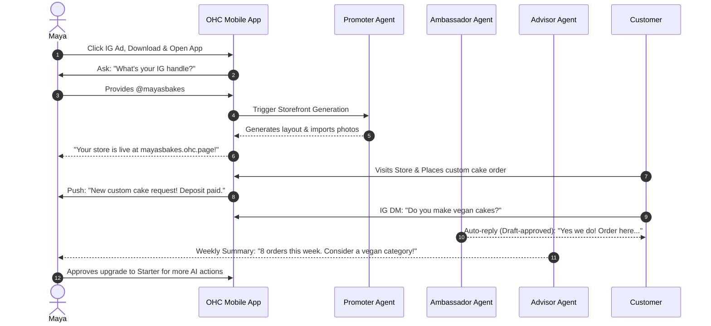
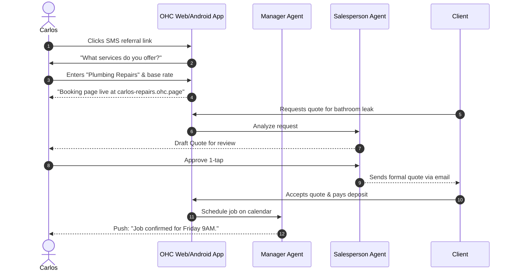
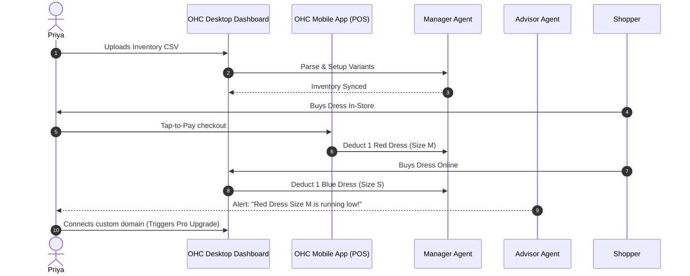
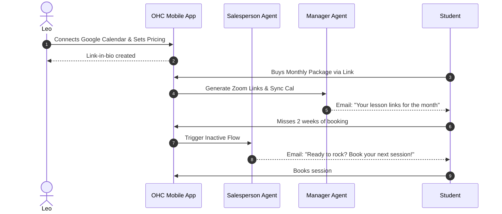
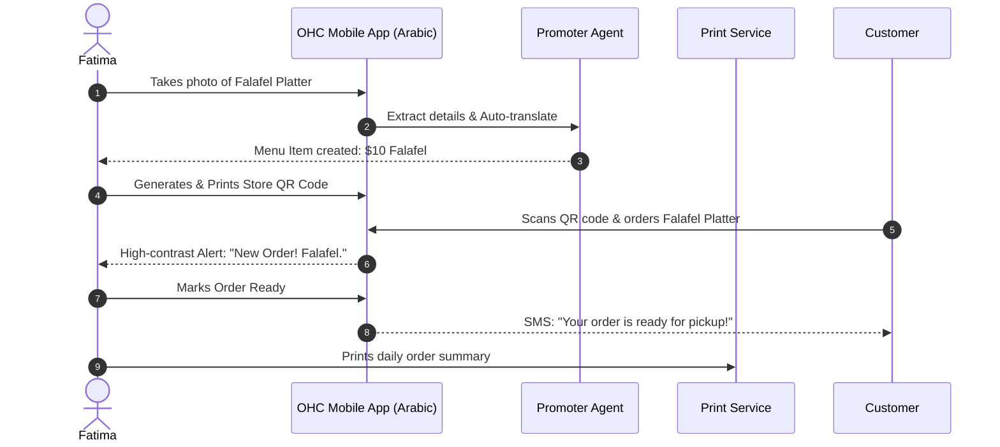

# [architecture] Business Journey Architecture

## Problem Statement
Small business owners (SMBs) consistently struggle with the complexity, technical jargon, and disjointed tools required to launch and operate online. Current market solutions (Shopify, Wix, Squarespace) force non-technical users into steep learning curves involving DNS setup, complex template editing, and multi-app integration, leading to high abandonment rates and "operational fatigue." We need a seamless, guided, mobile-first business journey where AI invisibly handles complexity.

## Research Report
Based on SMB pain point analyses, non-technical founders abandon the setup process when faced with technical hurdles (DNS, SKUs) or design decisions. The "invisible discovery" (SEO) and "marketing dread" (social content creation) are persistent issues post-launch. OHC’s differentiator is eliminating setup complexity (reducing time-to-live to under 10 minutes) and using specialized AI agents (Departments) to drive operations.

### Competitive Analysis
| Competitor | Setup Complexity | Time to Launch | AI Assistance | Mobile-First |
|---|---|---|---|---|
| OHC | Zero | < 10 mins | Deep Integration (Departments) | Yes (375px native) |
| Shopify | Medium | 30-60 mins | Chatbot (Sidekick) | Partial |
| Wix | Medium | 20-40 mins | Website Generator | Partial |
| Squarespace | Medium | 30-60 mins | Basic Copywriting | No |

## Design Doc: Business Journey Architectures

This section details the end-to-end journeys for our 5 core personas, from acquisition to referral.

### Key friction points identified across personas:
1. **Domain/DNS Config:** Deferred. All users start on an OHC subdomain (e.g., `maya.ohc.page`).
2. **Initial Content Creation:** Avoided. AI auto-generates menus, service descriptions, and policies.
3. **Payment Setup:** Abstracted. Users can accept payments immediately via Stripe Connect; deep banking info can be filled out after the first transaction.
4. **App Installation:** Eliminated. All required tools are built-in (booking, ecommerce, POS, analytics).

---

### Persona 1: Maya — The Home Baker (Physical Products)
**Profile:** 28, non-technical, relies on Instagram DMs, sells custom cakes.
**Goals:** Beautiful catalog, deposit-based orders, AI DM replies.

*   **Acquisition:** Sees an Instagram ad showcasing "Start selling cakes on Instagram in 5 minutes. No coding." The CTA is "Get Your Store."
*   **Onboarding:** Downloads iOS app. Wizard asks for business name ("Maya's Bakes"), Instagram handle (to auto-import photos), and business type ("Bakery").
*   **Activation:** AI Promotor builds storefront from IG photos. First order with deposit via Stripe is received on Day 1.
*   **Retention:** Daily push notification from the Advisor Agent summarizing views and pending DM inquiries answered by the Ambassador Agent.
*   **Revenue Upgrade:** Upgrades to Starter plan when she reaches the 100-action AI limit, triggered by the Ambassador handling a surge in holiday cake requests.
*   **Referral:** Shares her storefront link via IG Story with an automated "Powered by OHC: Start your own shop" banner.

---

### Persona 2: Carlos — The Freelance Handyman (Services & Bookings)
**Profile:** 42, non-technical, word-of-mouth only. Needs structured service listings.
**Goals:** Booking system, deposits, quote generation, Android-first.

*   **Acquisition:** A friend texts him a referral link: "Carlos, you need this for your plumbing jobs."
*   **Onboarding:** Opens web link on Android. Enters services ("Plumbing", "Painting") and hourly rate.
*   **Activation:** The Promotor generates a clean service page. First booking lands via the new link on his business card.
*   **Retention:** Push notifications from the Manager Agent for upcoming jobs and the Ambassador Agent for post-job review requests.
*   **Revenue Upgrade:** Upgrades to Pro to unlock unlimited quote generation via the Salesperson Agent during his busy summer season.
*   **Referral:** Tells other contractors at the hardware store about his new automated booking system.

---

### Persona 3: Priya — The Boutique Owner (Omnichannel)
**Profile:** 35, semi-technical, sells in-store and online.
**Goals:** Inventory sync, product variants, tap-to-pay, analytics.

*   **Acquisition:** Searches Google for "Easy inventory management with POS phone."
*   **Onboarding:** Signs up on MacBook. Imports CSV of current inventory or scans barcodes via iPhone app.
*   **Activation:** Sets up OHC Tap-to-Pay on iPhone. Completes first in-store sale which instantly syncs with online inventory.
*   **Retention:** Daily opening check of the Advisor's dashboard on iPhone: sales metrics, trending items, and low-stock alerts.
*   **Revenue Upgrade:** Uses the custom domain feature to map her existing domain, prompting the Pro tier upgrade.
*   **Referral:** Recommends OHC in a Facebook group for local business owners.

---

### Persona 4: Leo — The Music Tutor (Digital Services & Subscriptions)
**Profile:** 22, TikTok active.
**Goals:** Link-in-bio, automated Zoom links, subscription packages, re-engagement.

*   **Acquisition:** Sees a TikTok video by another creator using OHC's link-in-bio feature.
*   **Onboarding:** Uses mobile app. Sets up "Guitar Lessons" and connects Google Calendar.
*   **Activation:** First student purchases a 4-lesson monthly subscription. Zoom links are auto-generated.
*   **Retention:** Relies on the Salesperson Agent to follow up with students who canceled or missed lessons.
*   **Revenue Upgrade:** Upgrades to Starter to use advanced Promoter features for TikTok video ideas and SEO.
*   **Referral:** Puts OHC link-in-bio on TikTok, capturing organic student sign-ups.

---

### Persona 5: Fatima — The Food Cart Operator (Food & Beverage)
**Profile:** 50, limited English, low-end Android.
**Goals:** Pre-orders, simple menu, phone notifications, printable orders.

*   **Acquisition:** Approached by a community organizer helping street vendors digitize.
*   **Onboarding:** Scans a QR code. Uses Arabic language option. Takes photos of 5 dishes. AI extracts dish names and prices.
*   **Activation:** Prints QR code for her cart. First customer scans and orders ahead.
*   **Retention:** Large, high-contrast notifications on her Android phone for incoming orders.
*   **Revenue Upgrade:** Remains on the Free tier. Volume-based transaction fee model supports her usage.
*   **Referral:** Other cart operators in her commissary kitchen notice her phone alerts and ask to sign up.

## Implementation Prompt
**For Implementer Agent:**
Implement the core onboarding and journey tracking mechanisms for the OHC platform. Ensure the setup wizard (mobile-first, 375px) dynamically adjusts based on the persona's selected business type. The outcome should be a frictionless <10 min flow from signup to a published `tenant.ohc.page` storefront, with the respective AI Agents immediately subscribing to tenant events. Include full E2E testing using Playwright to verify the onboarding journey for each persona type.

**Priority:** P0
**Estimated Scope:** Large
