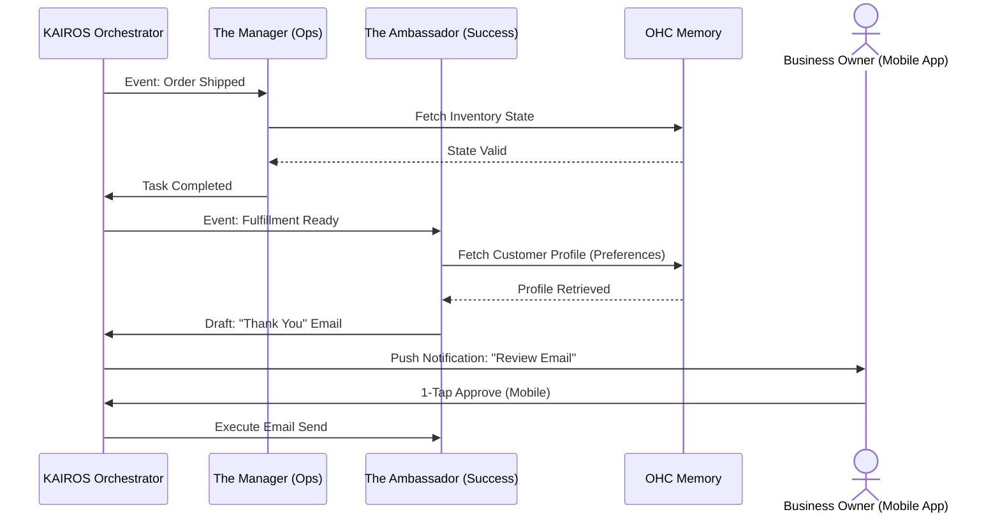

# Comprehensive Research Report: AI Agent Department Architecture

## 1. Executive Summary
This report outlines the architectural vision for the AI Agent Department within OneHumanCorp (OHC). OHC is the hybrid agentic OS designed for small business owners—like Maya the baker or Carlos the handyman—to launch and run a real business entirely from their phones in under 10 minutes. The core philosophy is to hide technical complexity behind AI agents organized into familiar business "departments." This report evaluates the current market gap, establishes the conceptual architecture for these departments, and outlines the memory retention, tier usage, and approval flows necessary for a premium, non-technical user experience.

## 2. Market Gap & Competitive Landscape

Current platforms treat software as a tool the user must learn. OHC treats software as an employee that works for the user.

| Feature Category | Shopify / Wix / Squarespace | OneHumanCorp (OHC) |
| :--- | :--- | :--- |
| **Setup Process** | Manual drag-and-drop, configuration of shipping, taxes, and domains. Requires hours/days. | **AI-First Setup:** "The Marketing Agent" builds the store from a single text prompt. Live in < 10 mins. |
| **Daily Operations** | Business owner must log in, read reports, manually fulfill orders, and write customer emails. | **Invisible Operations:** "The Manager" handles operations; "The Ambassador" drafts customer replies for 1-tap approval. |
| **Complexity Level** | High cognitive overhead (Liquid templates, CNAMEs, SSL, API keys). | **Plain Language:** No technical jargon. Interfaces use terms like "Website Address" instead of "CNAME". |
| **Mobile Experience** | Mobile apps are secondary; complex tasks require a desktop. | **Mobile-First:** 100% functional from a 375px mobile screen. |

The gap is clear: small business owners don't want to learn how to use a CRM or an email marketing tool; they want the results those tools provide. OHC's AI Agent Departments fulfill this need.

## 3. The 7 AI Agent Departments

OHC organizes its AI capabilities into seven distinct, understandable departments:

1.  **Operations ("The Manager"):** Handles order processing, inventory sync, and booking management.
2.  **Marketing & Advertising ("The Promoter"):** Builds and updates the website, creates social media posts, and designs promotional campaigns.
3.  **Sales & Acquisition ("The Salesperson"):** Generates quotes, follows up on leads, and manages referral loops.
4.  **Customer Success ("The Ambassador"):** Drafts replies to customer inquiries, sends order updates, and handles reviews.
5.  **Finance & Payments ("The Accountant"):** Tracks payments, manages subscriptions, and generates financial summaries.
6.  **Legal & Compliance ("The Protector"):** Manages terms, policies, and simple contracts.
7.  **Business Advisory ("The Advisor"):** Analyzes all data to provide weekly health reports and actionable suggestions (e.g., "Your vegan cakes are trending, let's create a bundle").

## 4. Architectural Design Principles

The architecture must support these agents operating autonomously while keeping the human in control.

### 4.1 Memory Model
Agents need context to be effective.
- **Short-term Memory:** Current session and active task payload (e.g., a specific order).
- **Long-term Memory:** Uses embedded vector truth memory retrieval. This allows agents to recall seasonal trends, customer preferences (e.g., "Customer X always asks for vegan options"), and past successful campaigns without complex database joins.

### 4.2 Multi-Tenancy & Isolation
- Every agent action, memory, and task is strictly scoped to the `tenant_id` (organization ID) to guarantee complete data isolation and privacy. This is enforced via PostgreSQL Row Level Security (RLS).

### 4.3 Execution & Coordination
Agents coordinate via the KAIROS Orchestrator's shared task list.

### 4.4 The "Draft-for-Review" Workflow
To build trust, agents must not execute high-risk external actions autonomously.
- **Auto-Execute:** Low-risk, internal changes (e.g., updating internal tags).
- **Draft-for-Review:** High-risk, external actions (e.g., sending an email, publishing a social post, generating a quote). The agent drafts the action and pauses, sending a notification to the owner. The owner reviews and approves the action with a single tap on their mobile device.

### 4.5 SaaS Tier Budgets
Agent capabilities are scaled based on the tenant's subscription tier:
- **Free:** 1 Department, 100 Actions/month.
- **Starter:** 3 Departments, 1,000 Actions/month.
- **Pro / Business:** Unlimited Departments & Actions.
The system gracefully pauses agent activity when limits are reached, prompting a simple upgrade path instead of a technical error.

## 5. Conclusion
The AI Agent Department architecture is the defining differentiator of the OHC platform. By organizing complex LLM capabilities into friendly, functional roles and utilizing a robust "Draft-for-Review" memory model, OHC empowers non-technical users to scale their businesses with confidence.
