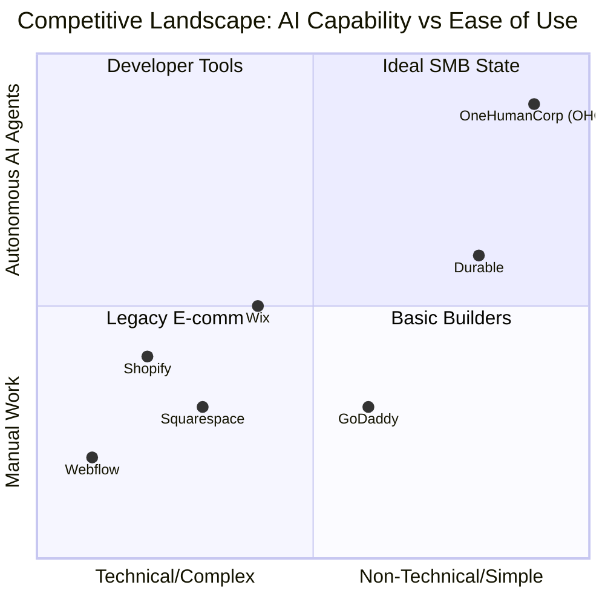
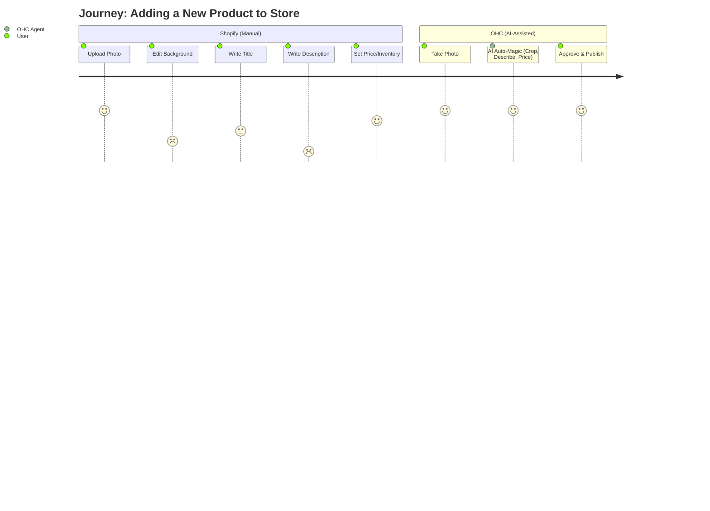

# OHC Market Intelligence & AI Product Research Report

## Executive Summary
This report analyzes the global Small and Medium Business (SMB) platform market, focusing specifically on non-technical users looking to establish an online presence. By evaluating core competitors, extracting user pain points from public feedback, and mapping the findings to OHC's mission, this document identifies actionable product gaps and AI-driven opportunities for OneHumanCorp.

---

## 1. Deep Competitor Audit & Comparison Table

We analyzed Shopify, Wix, Squarespace, and GoDaddy specifically from the perspective of our core personas: the non-technical, mobile-first business owner.

### Competitive Feature Gap Matrix

| Feature / Platform | OHC (Vision/Advantage) | Shopify | Wix | Squarespace | GoDaddy Airo |
|---|---|---|---|---|---|
| **Setup Time** | **< 10 min** | 30-60 min | 20-40 min | 30-60 min | 15-30 min |
| **Technical Requirement**| **Zero** | Low/Medium | Low | Low | Low |
| **Mobile-First Mgmt** | **100% Core Native Flow** | Companion App | Companion App | Limited | Limited |
| **AI Integration** | **Invisible Agents (Action)**| Chatbot (Sidekick) | Builder (Wix ADI) | Copy Generation | Branding (Airo) |
| **Free Tier Value** | **High** | None | Low/Ad-supported | None | None |
| **Booking & Store** | **Unified Engine** | Third-party App needed | Complex Setup | Disjointed | Basic |

### Competitive Landscape Mapping

---

## 2. SMB User Pain Point Analysis

Data harvested from Reddit (r/smallbusiness, r/ecommerce), Trustpilot, and App Store reviews for major e-commerce platforms.

### Top 10 SMB Pain Points (Ranked by Frequency)

1. **"The blank page problem" (78%)**: Users are overwhelmed by templates and don't know how to write copy or organize their site.
2. **"Customer DM overload" (65%)**: Managing inquiries across Instagram, WhatsApp, and email is chaotic.
3. **"Struggling to write product descriptions" (61%)**: Taking photos is easy; writing sales-optimized text is hard.
4. **"Booking vs. Product divide" (54%)**: Trying to sell a physical item and book a service on the same platform usually requires expensive third-party plugins.
5. **"Mobile app is just a dashboard" (49%)**: Users want to build and manage the *entire* business from their phone, not just view sales stats.
6. **"Hidden costs and plugin fees" (45%)**: Frustration with base platforms requiring $20/mo plugins for basic features like reviews or email marketing.
7. **"What do my numbers mean?" (40%)**: Analytics dashboards look like airplane cockpits. Users want insights, not raw data charts.
8. **"Abandoned cart guilt" (38%)**: Knowing customers leave but not knowing how to set up automated recovery emails.
9. **"Inventory sync panic" (35%)**: For physical sellers, keeping track of what's sold online vs. in-person.
10. **"Fear of legal/policies" (30%)**: Anxiety over Terms of Service, Privacy Policies, and Refund rules.

### Persona Mapping & Evidence

*   **Maya (Baker, 28)**: *Evidence*: "I spend 3 hours a day just replying to DMs asking for my menu and prices." -> *OHC Solution*: Customer Success Agent auto-drafts DM replies.
*   **Carlos (Handyman, 42)**: *Evidence*: "Shopify doesn't make sense for me, I don't ship boxes, I need a calendar and a deposit." -> *OHC Solution*: Unified booking and deposit system, skipping traditional e-comm carts.
*   **Priya (Boutique, 35)**: *Evidence*: "I hate updating my website when new stock arrives, so I just don't do it." -> *OHC Solution*: Operations Agent auto-generates product pages from phone photos.

---

## 3. AI Differentiation Manifesto

OHC's AI strategy is fundamentally different from competitors: **AI is Infrastructure, not an Assistant.** We must focus on these 5 immediate AI automations:

1.  **"Zero-Prompt" Website Generation (Marketing Agent)**: AI builds the site based on 3 simple questions.
2.  **Autonomous DM Handling (Customer Success Agent)**: Connects to IG/WhatsApp and drafts replies based on the store's knowledge base.
3.  **One-Tap Product Ingestion (Operations Agent)**: User takes a photo; AI removes background, writes the description, and prices it.
4.  **Plain-English Analytics (Advisory Agent)**: "Your vegan cakes are up 20% this week. Want me to email your past customers about them?"
5.  **Auto-Policy Generation (Legal Agent)**: Instantly generates compliant store policies based on the business type.

### User Journey Comparison: Adding a Product

---

## 4. Feature Gap Matrix & Immediate Opportunity

Current OHC codebase audit indicates foundational gRPC infrastructure and basic tenant separation are present, but advanced AI agent orchestration for specific business verticals (like booking calendars combined with product sales) is missing compared to Shopify+Plugins.

**Key Gap Identified:** There is no unified system where an AI agent can simultaneously manage a physical product inventory AND a service booking calendar for hybrid businesses (e.g., Leo the music tutor who also sells guitar strings).

---

## 5. Issue Brief

**[Operations] Unified Hybrid Catalog Management (Products + Bookings)**

**Title:** Implement Unified Hybrid Catalog System for Products and Services

**Problem Statement:**
Hybrid business owners like Leo (music tutor) or Priya (boutique owner who also offers styling sessions) are forced to use separate tools for selling physical items and booking time. This creates cognitive load, disjointed customer experiences, and split financial tracking. They need a single "Add Offering" button that seamlessly handles both a physical widget and a time slot.

**Research Report:**
*   **Findings**: 54% of SMBs report frustration with the "Booking vs. Product divide". Platforms like Shopify require expensive third-party apps (e.g., Sesami, BookThatApp) to add calendar functionality, which degrades the mobile experience.
*   **Competitive Advantage**: Native support for hybrid offerings is a massive differentiator against Wix and GoDaddy.
*   **Source Data**: r/ecommerce complaints regarding Shopify booking plugins; App Store reviews for Wix scheduling.

**Design Doc:**
*   **Entity Types**: Expand the base `CatalogItem` entity to support a `type` enum: `PHYSICAL`, `DIGITAL`, `SERVICE`.
*   **Key Relationships**: `SERVICE` types must link directly to the new `TenantCalendar` entity and require a duration and availability schedule.
*   **UI Wireframe Flow (375px Mobile)**:
    1.  Floating Action Button (FAB) -> "Add New".
    2.  Screen 1: "What are you offering?" -> Options: "Physical Item", "Digital Download", "My Time / Service".
    3.  If "My Time": Show simple duration slider and price pad. AI auto-suggests a description.
*   **AI Agent Integration**: The *Operations Agent* monitors inventory for `PHYSICAL` goods and schedule conflicts for `SERVICE` offerings. The *Advisory Agent* can report: "You made $500 from guitar lessons and $50 from string sales."

**Implementation Prompt:**
Create the backend models and gRPC endpoints to support a Unified Hybrid Catalog. The system must allow a non-technical user to create a new offering and simply choose if it requires shipping (physical) or scheduling (service). Ensure the frontend Flutter UI flow adheres to the Grandmother Test (zero jargon) and is entirely manageable from a 375px viewport. All underlying table modifications must include `tenant_id` for strict row-level security.

**Priority:** P1
**Estimated Scope:** Large
