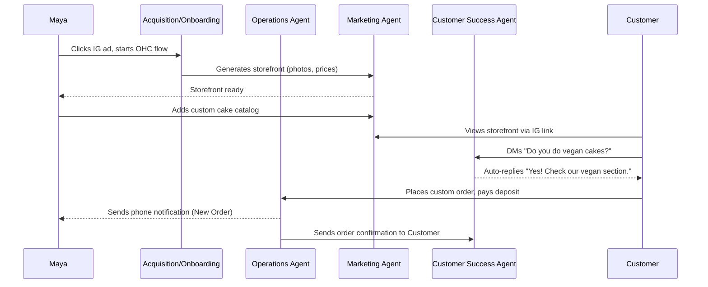
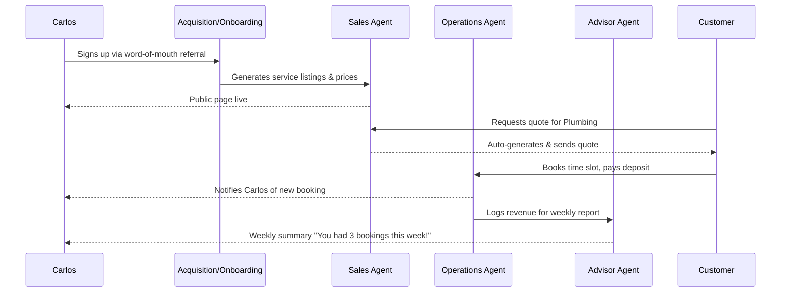
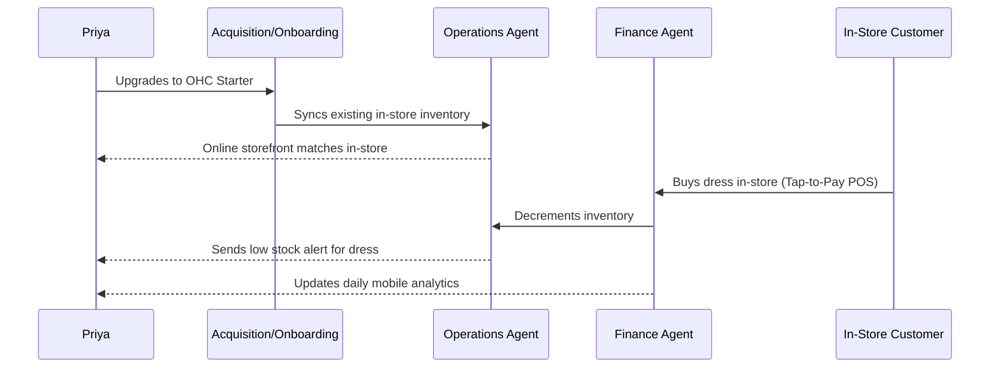
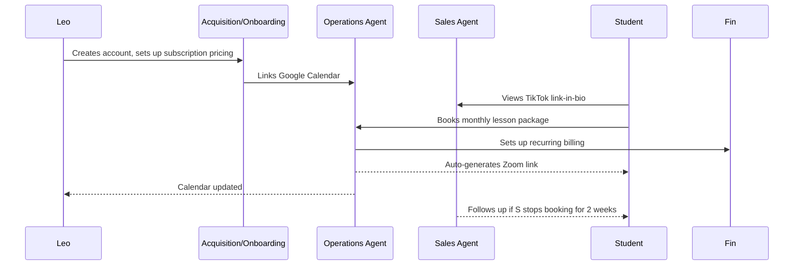
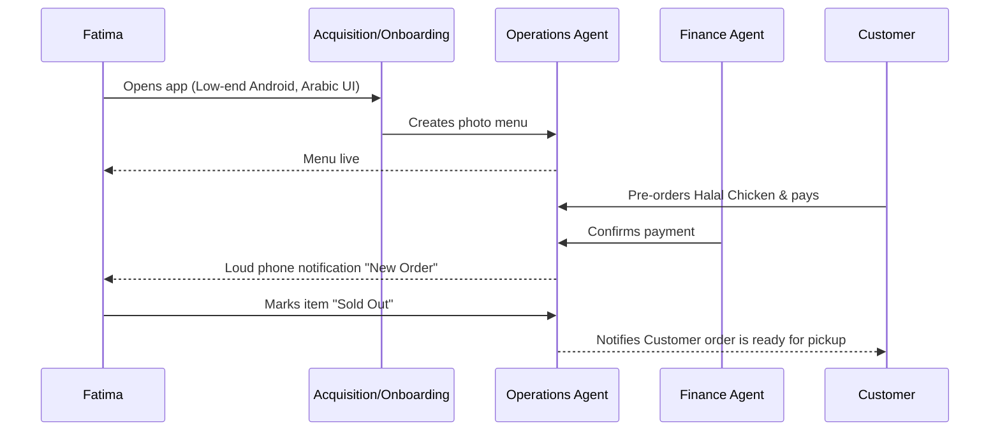

# Business Journey Architecture

## Title
Business Journey Architecture

## Problem Statement
Small business owners—from bakers to handymen to food cart operators—often lack technical expertise and the budget to hire developers. Current solutions like Shopify or Wix still require considerable setup time, domain knowledge, and manual management. The gap lies in the absence of a truly frictionless, cohesive, end-to-end journey that takes a non-technical user from zero to a live, functioning digital storefront in under 10 minutes, entirely driven by invisible AI agents managing operations, marketing, sales, customer success, finance, legal, and business strategy.

## Research Report
### Competitive Landscape & Gap Analysis
| Feature | OHC | Shopify | Wix | Squarespace | GoDaddy |
|---|---|---|---|---|---|
| Setup time | **< 10 min** | 30-60 min | 20-40 min | 30-60 min | 20-40 min |
| Technical knowledge needed | **Zero** | Low | Low | Low | Low |
| AI agents (invisible) | **Yes, built-in** | Sidekick (chat only) | Wix AI | Limited | Airo (limited) |
| Mobile-first management | **Yes** | Partial | Partial | No | No |
| Booking + Store + Portfolio | **All-in-one** | Store only | All (complex) | Portfolio + store | Basic |
| Free tier | **Yes (useful)** | No | Yes (limited) | No | No |
| Target user | **Non-technical** | SMB/Tech-savvy | Semi-technical | Creative professional | Basic user |

### Journey Stages
1. **Acquisition:** Users discover OHC organically, through targeted social media ads, or word of mouth (e.g., Priya sharing with a friend). The CTA must be frictionless ("Start your business in 5 minutes for free").
2. **Onboarding:** A step-by-step, wizard-driven flow entirely on mobile. It extracts minimal initial data (business name, category) and defers non-critical inputs (like legal policies) to AI agents in the background.
3. **Activation:** The "Aha!" moment—adding the first product or getting the first booking. OHC must guarantee this happens on Day 1.
4. **Retention:** Daily engagement driven by proactive notifications (e.g., new order alerts) and actionable weekly summaries from the "Advisor" agent.
5. **Revenue:** Transition from Free to Starter tier is triggered by reaching capacity limits or needing a custom domain, presented naturally as the business scales.
6. **Referral:** A built-in viral loop where successful owners share their "link-in-bio" or storefront, showcasing OHC's capabilities.

## Design Doc

### Mobile UX Flows (375px First)
- **Onboarding Flow:**
  - Screen 1: "What do you do?" (Grid of icons: Bake, Teach, Fix, Sell, etc.)
  - Screen 2: "What's the name of your business?" (Text input + AI suggestions)
  - Screen 3: "Generating your store..." (Loading animation with AI agent status updates)
  - Screen 4: "You're live! Let's add your first item." (Direct to product/service creation)
- **Dashboard Flow:**
  - Top: Daily Revenue & Actionable insight ("Tuesday was busy!").
  - Middle: Pending orders/bookings needing attention.
  - Bottom: Quick actions (Add Item, View Store, Share Link).

### Key Design Decisions
- **Mobile Parity:** The entire onboarding, management, and reporting experience is built for 375px viewports. Native mobile keyboards are strictly enforced.
- **AI as Infrastructure:** Instead of a chat widget, AI operates in defined "Departments" (e.g., "The Promoter" designing the site, "The Ambassador" drafting replies) seamlessly integrated into the flow.
- **Glassmorphism Aesthetic:** All UI elements use the OHC Premium Token library with blur, saturation, and Outfit/Inter typography to ensure a beautiful default state.

### Architecture Diagrams (Mermaid.js)

#### 1. Maya — The Home Baker (Physical Products / Custom Orders)

#### 2. Carlos — The Freelance Handyman (Services & Bookings)

#### 3. Priya — The Boutique Owner (Inventory & In-Person POS)

#### 4. Leo — The Music Tutor (Subscriptions & Digital)

#### 5. Fatima — The Food Cart Operator (Food & Beverage)

## Implementation Prompt
**To the Implementer Agent:**
Implement the end-to-end "Onboarding Wizard" mobile flow as designed in the Business Journey Architecture.
1. Create the UI screens using Flutter (targeting web and mobile) strictly adhering to the 375px mobile-first constraint and Glassmorphism design tokens (Outfit/Inter fonts, 20px blur).
2. The flow should consist of minimal steps: selecting a business category, entering a name, and a "loading" screen that simulates AI agents generating the site, landing the user directly on an active dashboard.
3. Ensure robust error handling and offline/low-data mode considerations.
4. Integrate basic telemetry (OpenTelemetry/Prometheus) for the onboarding funnel.
5. Create comprehensive E2E Playwright/Flutter tests covering this onboarding journey from a clean state to dashboard activation, asserting the final UI state matches this design.

## Priority
P0 (Critical)

## Estimated Scope
Large
