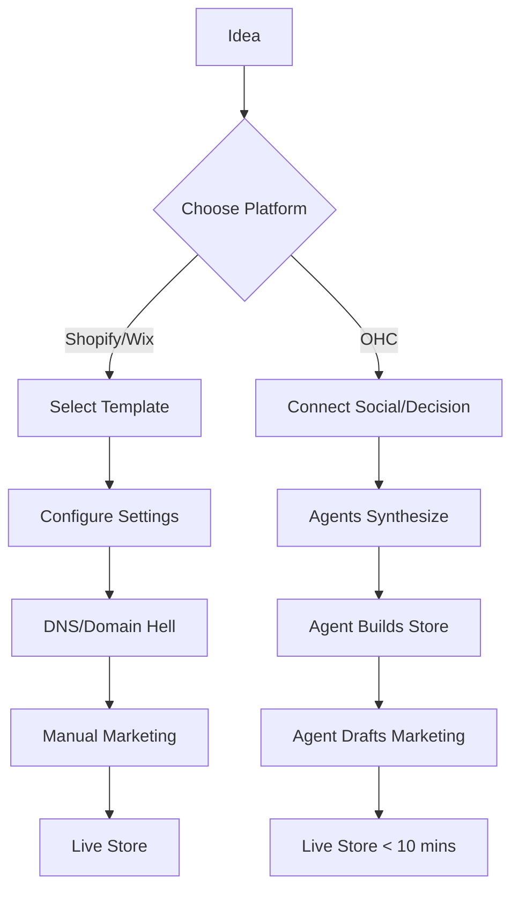
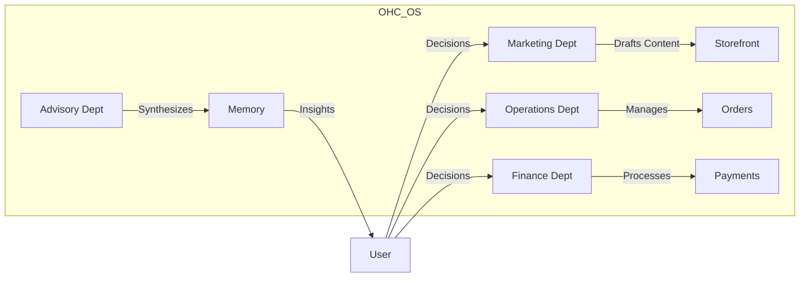

# OHC Product Research & Strategy Report: Market Dominance 2025

## 1. Executive Summary
One Human Corp (OHC) is uniquely positioned to dominate the "Micro-SMB" market by treating AI as autonomous infrastructure rather than a chatbot co-pilot. While competitors (Shopify, Wix) focus on **Tools for the Tech-Savvy**, OHC delivers **Outcomes for the Non-Technical**.

## 2. Competitive Landscape
| Feature | OHC | Shopify | Wix | Durable.co |
| :--- | :--- | :--- | :--- | :--- |
| **Model** | Departmental Agents | Chatbot Co-pilot | AI Template | AI Generator |
| **Setup Time** | < 10 mins | 60+ mins | 30+ mins | < 1 min |
| **Management** | Invisible / Agentic | Manual / Complex | Semi-Manual | Thin / Static |
| **Memory** | Long-term (AutoDream) | Session-based | None | None |
| **Aesthetic** | OHC Premium | Generic / Custom | Template-based | Generic |

## 3. Top 10 SMB Pain Points (Ranked)
1.  **Hidden Complexity**: "It said it was easy, but then I had to set up DNS."
2.  **Inbox Chaos**: Managing customer DMs across 4 different apps.
3.  **Template Fatigue**: "Every Shopify store looks the same."
4.  **"Co-pilot" Exhaustion**: "I don't want to talk to a robot; I want the robot to do the work."
5.  **Payment Friction**: Complexity of setting up deposits and custom quotes.
6.  **Fragmented Mobile Experience**: Desktop-first admin panels that break on phones.
7.  **Marketing Writer's Block**: What do I post on Instagram today?
8.  **Data Silos**: Website data not syncing with in-person sales.
9.  **SEO Jargon**: "What are meta tags and why do I need them?"
10. **Financial Blindness**: "I made money, but I don't know if I'm profitable."

## 4. Strategic Recommendations
- **Beachhead**: Target the "Solopreneur Maker" (e.g., Maya the baker). This persona has the highest "Time vs. Tech" pain.
- **Next P0 Mission**: **The Invisible Storefront**. Connect social feeds to a live, agent-managed storefront with zero user configuration.
- **Expansion**: Verticalize for "Services & Bookings" (e.g., Carlos the handyman) once the physical product flow is gold-standard.

## 5. Feature Gap Matrix
| Capability | Current OHC State | Gap to Competitor | OHC Leapfrog Opportunity |
| :--- | :--- | :--- | :--- |
| **Storefront** | Backend Only | No UI | Agent-Generated Glassmorphic UI |
| **Payments** | Stripe Init | No custom quotes | Agentic Quoting & Follow-up |
| **CRM** | Base Schema | No Unified Inbox | Teammate Mesh Unified Mailbox |
| **Onboarding** | Wizard Exists | Jargon-Heavy | "Just Decisions" Wizard |

## 6. Mermaid Charts

### 6.1 User Journey Comparison

### 6.2 Agent Department Interaction

---
**Report by: Principal Product Researcher (L7)**
**Status: Gold Standard**
