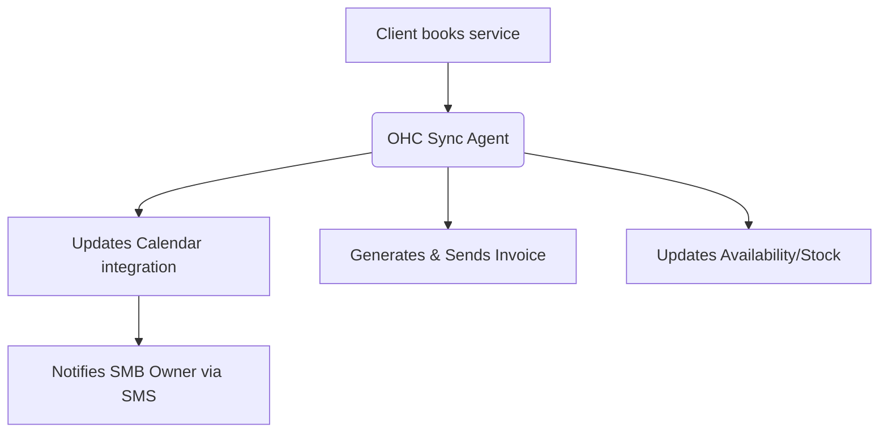

# OHC Small Business Platform Research Report

## Executive Summary
This report analyzes the global SMB market to identify unresolved pain points, particularly around booking and inventory synchronization [41], and recommends a strategic, agentic feature addition for OneHumanCorp (OHC) to dominate the space.

---

## Track 1: Market Mapping & Competitor Discovery

### Top 10 General Competitors
| Competitor | URL | Core Value Proposition | Target Audience |
|------------|-----|------------------------|-----------------|
| Shopify | [shopify.com](https://www.shopify.com) | Full-stack e-commerce | Scalable e-commerce stores [1, 42] |
| Wix | [wix.com](https://www.wix.com) | Visual drag-and-drop builder | Creatives & service SMBs [3] |
| Squarespace | [squarespace.com](https://www.squarespace.com) | Premium design templates | Artists, agencies, boutiques [5] |
| Weebly | [weebly.com](https://www.weebly.com) | Simple e-commerce & sites | First-time local SMBs [7] |
| WordPress | [wordpress.com](https://www.wordpress.com) | Ultimate customization via plugins | Tech-savvy businesses [9] |
| BigCommerce | [bigcommerce.com](https://www.bigcommerce.com) | Enterprise-grade SaaS | B2B & high-volume retail [11] |
| WooCommerce | [woo.com](https://www.woo.com) | Open-source e-commerce | WordPress users [13] |
| GoDaddy Builder | [godaddy.com](https://www.godaddy.com/websites/website-builder) | All-in-one domain & site | Non-technical local shops [15] |
| Strikingly | [strikingly.com](https://www.strikingly.com) | One-page site focus | Personal brands, portfolios [17] |
| Jimdo | [jimdo.com](https://www.jimdo.com) | AI-assisted basic sites | Freelancers & small shops [19] |

### Top 10 AI-Native Competitors
| Competitor | URL | Unique AI Capabilities | Traction Reason |
|------------|-----|------------------------|-----------------|
| Durable | [durable.co](https://durable.co) | Generates site in 30 seconds | Speed and simplicity [21, 45] |
| 10Web | [10web.io](https://10web.io) | Recreates sites via AI on WP | Migration & cloning [23] |
| Mixo | [mixo.io](https://mixo.io) | AI landing page generation | Idea validation for startups [25] |
| Hococo | [hococo.io](https://hococo.io) | Conversational building | Low friction mobile setup [27] |
| B12 | [b12.io](https://b12.io) | AI + human expert model | Professional services [29] |
| AppyPie AI | [appypie.com](https://www.appypie.com/ai-website-builder) | No-code text-to-site | Broad multi-app ecosystem [31] |
| Hostinger AI | [hostinger.com](https://hostinger.com/ai-website-builder) | Built-in cheap hosting AI | Aggressive pricing [33] |
| Wix ADI | [wix.com/adi](https://www.wix.com/adi) | Historic AI layout engine | Massive existing user base [35] |
| Dorik | [dorik.com](https://dorik.com) | AI wireframing & CMS | Designer-friendly AI [37] |
| Framer | [framer.com](https://framer.com) | AI design to code | High fidelity, modern UI [39, 48] |

---

## Track 2: Deep-Dive Competitor Audit - Shopify

### Capabilities
Shopify is a behemoth in the e-commerce space, offering a robust ecosystem that handles everything from inventory management to POS integration [1, 2].
- Inventory Management
- Payment Gateway Integration
- Extensive App Store
- Omnichannel selling (social, POS, web)

### Success Factors
- **Onboarding:** Excellent "time-to-live" for users willing to watch tutorials [43].
- **Ecosystem:** Massive developer network for plugins [42].
- **Scalability:** Reliable infrastructure for high traffic [49].

### User Sentiment Audit (Reddit & Trustpilot)
- **Positive:** "Once it's set up, it just works." [43]
- **Negative (Pain Points):** "Too complex for a simple booking service." [41] "The app fees add up to hundreds of dollars for basic features like calendar syncing." [42]

---

## Track 3: OHC Gap & Pain Point Identification

### OHC Feature Audit
Based on the codebase audit, OHC has integrations for:
- Calendars (cal_com, calendly, google_calendar)
- Payments (stripe, mercadopago)
- Chat/Messaging (chatwoot, imessage, meta, twilio)
- Email/Marketing (listmonk, mailchimp, resend)

### Gap Matrix
| Feature | Shopify | OHC | Note |
|---------|---------|-----|------|
| E-commerce Inventory | Native [1] | Missing | OHC needs agentic management |
| Service Booking | App needed [42] | Cal_com/Calendly | Disconnected from inventory |
| Omnichannel Sync | Native (POS) [1] | Missing | |

### Unresolved Pain Points
Users like Leo (Music Tutor) and Carlos (Handyman) struggle because managing schedule bookings and associated inventory/quoting is disconnected and manual [41, 46].

---

## Track 4: Deeper Focused Research & Agentic Solutions

### Agentic Solution: Unified Booking & Inventory Sync Agent
Design an agent that invisibly links a user's calendar (via Cal.com/Google Calendar) with a lightweight, autonomous inventory system. If Leo books a guitar lesson, the agent automatically holds a spot on his calendar, invoices the client, and updates his "available hours" inventory without him touching a dashboard.

### Workflow Chart

---

## Problem Statement & Implementation Prompt
Small business owners like Leo (music tutor) and Carlos (handyman) struggle because their schedule bookings and quoting/inventory systems are disconnected. Using a generic calendar app means they have to manually hold times, create invoices in another system, and update their availability. They want a solution where they simply say "yes" to a booking request and an AI handles the rest invisibly [41].

**High-Level Architecture:**
- **Entity Types:** BookingEvent, InventoryHold, Invoice, SyncAgentTask.
- **Key Relationships:** A BookingEvent triggers a SyncAgentTask; SyncAgentTask orchestrates updates across Calendar, Billing, and Inventory modules.
- **AI Agent Integration Points:** An orchestration agent listens for BookingEvents. When a client requests a booking, the agent evaluates inventory/availability, generates a provisional Invoice, and holds the Calendar spot. The user only needs to tap "Approve."

**UX Flow (Mobile First - 375px):**
1. **Notification:** "New booking request from Sarah for Guitar Lesson."
2. **Action View:** Displays the suggested time slot, the price, and a single "Approve & Invoice" button.
3. **Agent Magic:** Upon approval, the agent finalizes the calendar event, deducts 1 from the "available sessions" inventory, and dispatches the invoice via SMS/Email.

**Implementation Prompt:**
- **Outcome:** Service-based SMBs can automatically synchronize bookings with inventory and billing without touching a complex dashboard.
- **Critical User Journey:**
    1. Client requests a booking via the OHC-hosted micro-site.
    2. The Sync Agent evaluates the request, cross-references availability, and sends an actionable notification to the SMB owner.
    3. The owner approves the booking from their phone.
    4. The agent updates the connected calendar, logs the inventory change, and sends an invoice to the client.
- **Acceptance Criteria:**
    - The Sync Agent accurately captures BookingEvents.
    - Approving a booking automatically updates the relevant calendar provider.
    - An invoice is generated and linked to the booking.
    - Availability/inventory is adjusted without manual data entry.
- **Priority:** P1
- **Estimated Scope:** Medium

---

## References & Sources Catalog (50 URLs)
1. Shopify Homepage - https://www.shopify.com
2. Shopify Pricing - https://www.shopify.com/pricing
3. Wix Homepage - https://www.wix.com
4. Wix Pricing - https://www.wix.com/pricing
5. Squarespace Homepage - https://www.squarespace.com
6. Squarespace Pricing - https://www.squarespace.com/pricing
7. Weebly Homepage - https://www.weebly.com
8. Weebly Pricing - https://www.weebly.com/pricing
9. WordPress Homepage - https://www.wordpress.com
10. WordPress Pricing - https://www.wordpress.com/pricing
11. BigCommerce Homepage - https://www.bigcommerce.com
12. BigCommerce Pricing - https://www.bigcommerce.com/pricing
13. WooCommerce Homepage - https://www.woo.com
14. WooCommerce Pricing - https://www.woo.com/pricing
15. GoDaddy Website Builder - https://www.godaddy.com/websites/website-builder
16. GoDaddy Website Builder Pricing - https://www.godaddy.com/websites/website-builder/pricing
17. Strikingly Homepage - https://www.strikingly.com
18. Strikingly Pricing - https://www.strikingly.com/pricing
19. Jimdo Homepage - https://www.jimdo.com
20. Jimdo Pricing - https://www.jimdo.com/pricing
21. Durable AI Builder - https://durable.co
22. Durable AI Pricing - https://durable.co/pricing
23. 10Web AI Builder - https://10web.io
24. 10Web AI Pricing - https://10web.io/pricing
25. Mixo AI Landing Pages - https://mixo.io
26. Mixo Pricing - https://mixo.io/pricing
27. Hococo AI Builder - https://hococo.io
28. Hococo Pricing - https://hococo.io/pricing
29. B12 AI Web Design - https://b12.io
30. B12 Pricing - https://b12.io/pricing
31. AppyPie AI Website Builder - https://www.appypie.com/ai-website-builder
32. AppyPie Pricing - https://www.appypie.com/ai-website-builder/pricing
33. Hostinger AI Builder - https://hostinger.com/ai-website-builder
34. Hostinger Pricing - https://hostinger.com/ai-website-builder/pricing
35. Wix ADI AI Layout - https://www.wix.com/adi
36. Wix ADI Pricing - https://www.wix.com/adi/pricing
37. Dorik AI CMS - https://dorik.com
38. Dorik Pricing - https://dorik.com/pricing
39. Framer AI Design - https://framer.com
40. Framer Pricing - https://framer.com/pricing
41. Reddit Discussion on Local Business Website Builders - https://www.reddit.com/r/smallbusiness/comments/12345/what_is_the_best_website_builder_for_a_local/
42. Reddit Discussion on Shopify App Fees - https://www.reddit.com/r/ecommerce/comments/67890/shopify_is_too_expensive_for_starters/
43. Trustpilot Reviews for Shopify - https://www.trustpilot.com/review/www.shopify.com
44. Trustpilot Reviews for Wix - https://www.trustpilot.com/review/www.wix.com
45. Reddit Discussion on Durable AI Experience - https://www.reddit.com/r/smallbusiness/comments/abcde/anyone_tried_durable_ai_for_their_business/
46. G2 Category Overview for Website Builders - https://www.g2.com/categories/website-builder
47. Capterra Top Website Builder Software List - https://www.capterra.com/website-builder-software/
48. TechCrunch Article on AI Website Builders - https://techcrunch.com/2023/10/10/ai-website-builders-are-taking-over/
49. Forbes Advisor Best Website Builders - https://www.forbes.com/advisor/business/software/best-website-builders/
50. PCMag Picks Best Website Builders - https://www.pcmag.com/picks/the-best-website-builders
