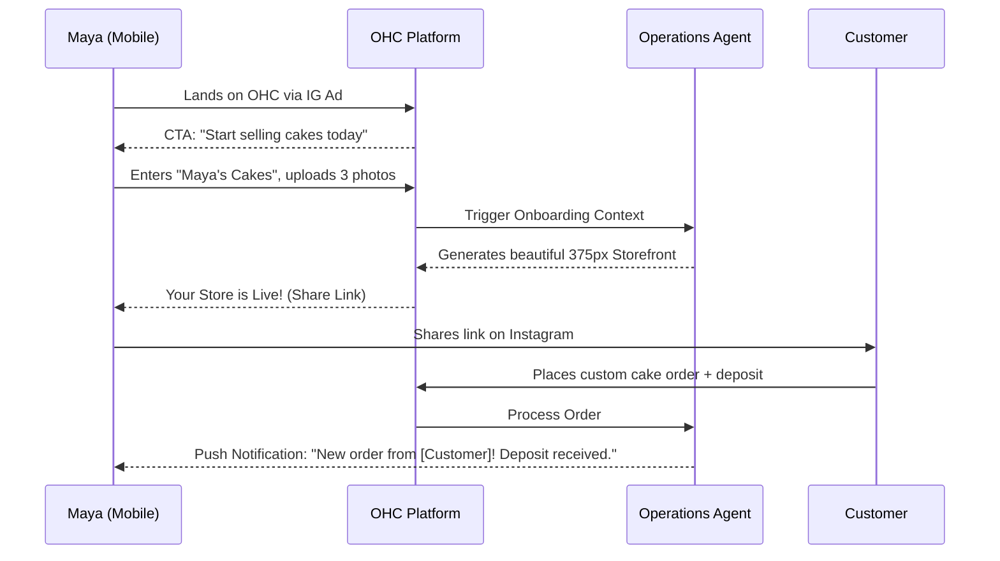
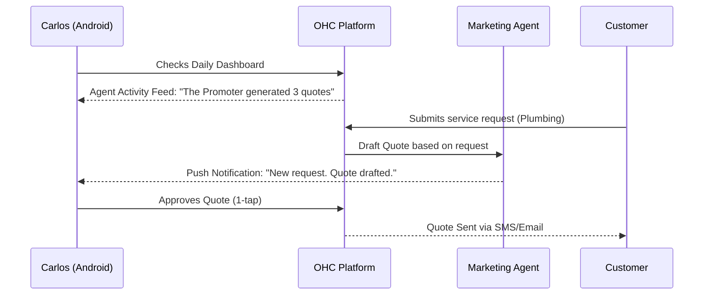
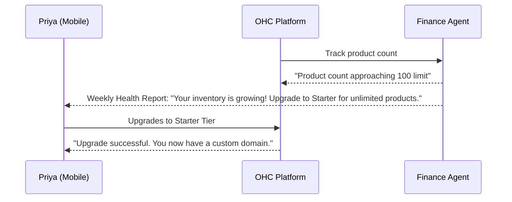
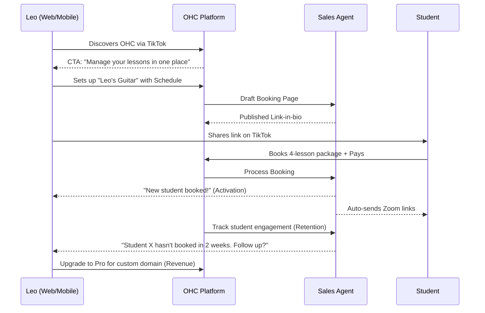
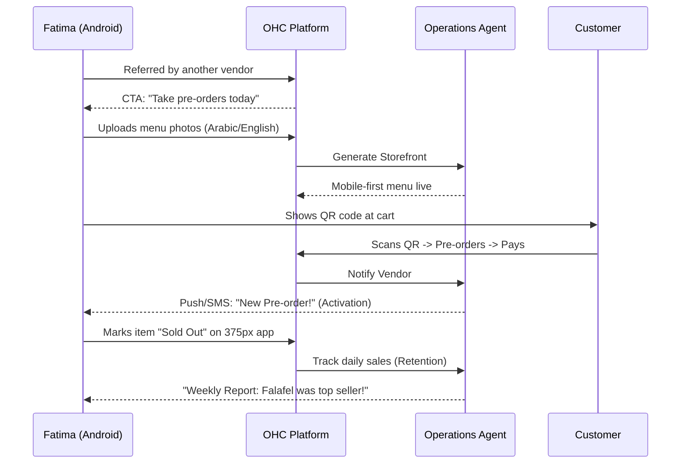

# Business Journey Architecture

## Title
End-to-End Business Journey Architecture 🚀

## Problem Statement
Small business owners (non-technical personas like Maya the Baker, Carlos the Handyman, Priya the Boutique Owner, Leo the Music Tutor, and Fatima the Food Cart Operator) experience significant friction when adopting digital platforms. Existing solutions like Shopify and Wix focus primarily on initial setup and technical configurations, leaving a gap in understanding the holistic business journey—from initial acquisition and onboarding, through activation and daily retention, to scaling revenue and driving referrals. OHC aims to bridge this gap by providing an architecture tailored specifically to the real-world journeys of these non-technical personas, guided invisibly by AI.

## Research Report
Based on an analysis of competitor platforms (Shopify, Wix, Squarespace, GoDaddy) and small business owner needs:
- **Acquisition**: Many owners find OHC through organic searches or social media recommendations. OHC needs distinct landing page CTAs addressing immediate pain points (e.g., "Start accepting custom cake orders today" for Maya).
- **Onboarding**: Current platforms require technical input (DNS setup, theme selection). OHC's onboarding must be conversational and require only the absolute minimum inputs to go live (e.g., Business Name, Primary Goal, Phone Number).
- **Activation**: Success metrics differ per persona. Maya's activation is receiving her first custom order deposit; Carlos's is receiving his first booked service appointment.
- **Retention**: Daily engagement relies on tangible business updates rather than platform configuration. Features like push notifications for new orders and plain-language AI activity summaries are critical for bringing owners back daily.
- **Revenue**: Upgrade triggers must be tied directly to business success milestones (e.g., reaching 100 products, requiring custom domains for branding).
- **Referral**: Viral growth comes from shareable, beautiful outputs (e.g., Leo sharing his link-in-bio on TikTok or Priya referring a fellow boutique owner).

## Design Doc

### High-Level Architecture Sequence Diagrams (Mermaid.js)

#### 1. Maya the Baker (Full Journey: Acquisition -> Revenue)

#### 2. Carlos the Handyman (Full Journey: Activation -> Retention -> Scaling)

#### 3. Priya the Boutique Owner (Full Journey: Onboarding -> Revenue Growth -> Referral)

#### 4. Leo the Music Tutor (Full Journey: Acquisition -> Referral)

#### 5. Fatima the Food Cart Operator (Full Journey: Acquisition -> Revenue)

### UI Wireframes & Screen Flow (375px First)
1. **Acquisition Landing Page**:
   - Clean, full-screen background (Glassmorphism styling).
   - Conversational CTA: "What are you building today?"
   - Single input field or predefined persona chips.

2. **Onboarding Wizard**:
   - Conversational interface (chat-like) with the AI Agent.
   - 3 steps: Name, Primary Offering, Contact Info.
   - "Generating your business..." animation showing AI at work.

3. **Daily Dashboard (Home Screen)**:
   - "Agent Actions Today" Feed (e.g., "The Manager processed 2 orders").
   - Actionable Insights: "You had a busy weekend! See your revenue report."
   - Floating Action Button (FAB) for quick actions (Add Product, Check Inbox).

### Mobile UX Flow
The entire mobile experience must be designed for one-handed use on a 375px screen. Navigation is thumb-accessible (bottom tab bar). Core actions (approving quotes, viewing orders) require single taps. Complex configurations are hidden behind progressive disclosure or handled entirely by AI.

### AI Agent Integration Points
- **Onboarding**: "The Promoter" drafts the initial website and copy.
- **Activation**: "The Manager" handles the first transaction seamlessly.
- **Retention**: "The Advisor" delivers weekly health reports via push notification.
- **Revenue**: "The Advisor" contextually suggests tier upgrades based on business milestones.

### Key Design Decisions
- **Conversational Onboarding**: To minimize cognitive load, onboarding is structured as a conversation rather than a form.
- **Agent-Centric Dashboard**: The home screen highlights AI actions, reinforcing the platform's value proposition of "invisible heavy lifting."
- **Milestone-Based Upgrades**: Monetization is tied to customer success, ensuring alignment between platform growth and business owner growth.

## Implementation Prompt
"Develop the complete end-to-end user journey flow for the OHC mobile application (375px target). Implement the conversational onboarding wizard that captures minimal user input (Business Name, Primary Goal) and triggers the AI agents to generate the initial business configuration. Create the 'Agent Activity Feed' on the home dashboard to display plain-language summaries of recent AI actions. Ensure all tracking for activation milestones (e.g., first order, first booking) is instrumented and triggers appropriate in-app notifications and tier upgrade suggestions."

## Priority
P0

## Estimated Scope
Large
