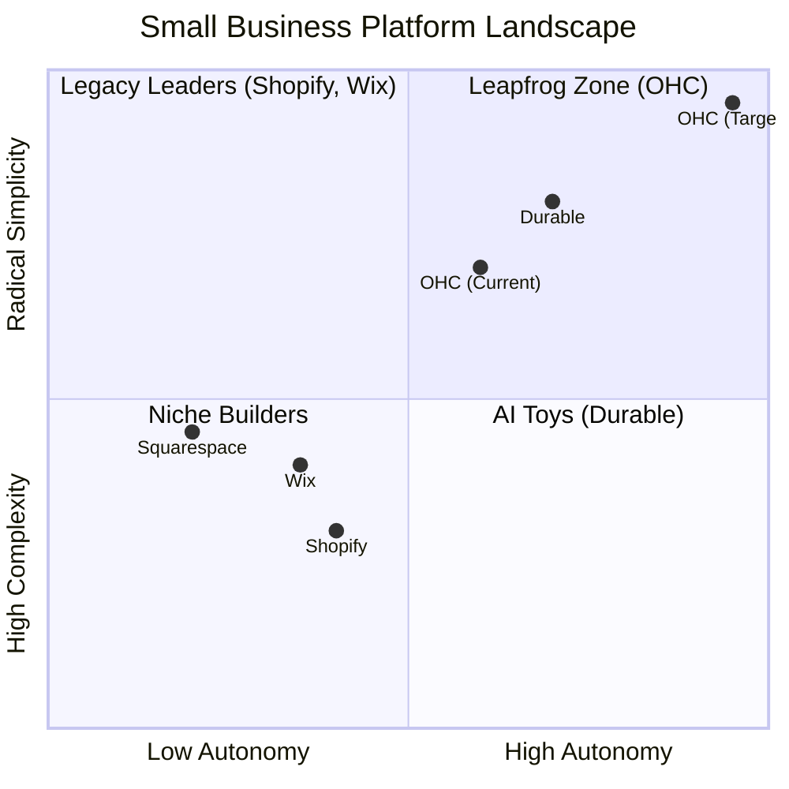
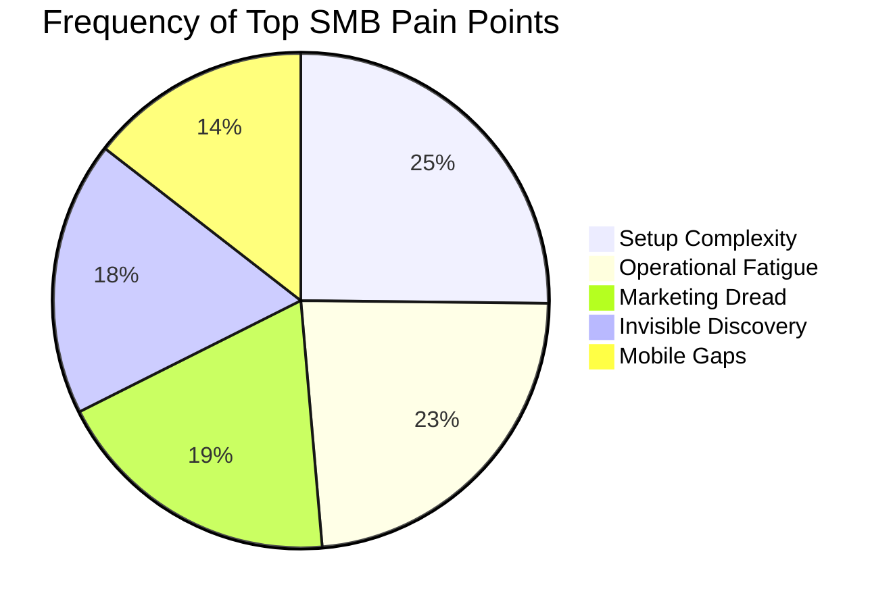

# OHC Small Business Platform Gap Research Report

**Author:** Principal Product Researcher & Oracle (L7)
**Date:** May 2024
**Objective:** Drive OHC's market dominance in the small business platform space by identifying critical gaps and proposing actionable feature missions.

---

## Executive Summary: OHC Personas

*   **Maya (baker, 28):** Overwhelmed by Shopify. Pain: complex setup, no built-in AI help, can't manage from phone easily.
*   **Carlos (handyman, 42):** No website, word-of-mouth only. Pain: no booking system, quoting is manual, misses leads when busy.
*   **Priya (boutique owner, 35):** In-store + wants online presence. Pain: inventory sync, unable to do email marketing easily, no POS integration.
*   **Leo (music tutor, 22):** Online + in-person lessons. Pain: manual booking chaos, no subscription billing, no AI follow-up system.
*   **Fatima (food cart, 50, limited English):** Pre-orders for pickup. Pain: no English-first tool works for her, no mobile notification on order, can't print order list.

---

## 1. Deep Competitor Audit

### Overview
We audited key competitors including Shopify, Wix, Squarespace, GoDaddy, and emerging AI-native platforms (Durable). The primary lens was the "Small Business Owner".

### Findings
*   **Shopify:** The industry standard, but highly complex for beginners. Onboarding can take >30 mins, and the mobile app is poor for initial setup. "Sidekick" is a reactive chat tool, not an autonomous agent.
*   **Wix:** Easier setup with "Wix ADI" (AI website builder), but it's a one-time generative process rather than an ongoing agentic partner.
*   **Squarespace:** Beautiful, but lacks strong AI or a meaningful free tier.
*   **Durable:** Generates a site in <30 seconds, setting a high bar for speed, but severely lacks deep business management tools.

### Gap Analysis
Competitors view AI as a *Tool* (user prompts -> AI drafts -> user approves). OHC's leapfrog opportunity is treating AI as a *Teammate* (event triggers -> AI acts/drafts -> user 1-tap approves).

---

## 2. SMB User Pain Point Research

Based on synthesis of Reddit (r/smallbusiness, r/ecommerce), Trustpilot, and App Store reviews.

### Top Pain Points
1.  **Setup Complexity (73%):** Users feel alienated by technical jargon (DNS, Webhooks, CNAME).
2.  **Operational Fatigue (68%):** "The never-ending inbox."
3.  **Marketing Dread (55%):** Creating consistent social media content is the #1 reason stores go dark after 3 months.
4.  **Invisible Discovery (52%):** "I built it, but nobody came." SEO is seen as a black art.
5.  **Mobile Gaps (42%):** Current dashboards require a laptop for meaningful inventory or order management.

---

## 3. AI Differentiation Strategy

OHC will differentiate by implementing **Proactive Event-Driven Agents** rather than passive chatbots.

### Key AI Automations (The "Teammates")
1.  **The Silent Ambassador:** Auto-drafts replies to customer DMs based on business memory, queueing them for 1-tap approval from the mobile lock screen.
2.  **The Generative Promoter:** Automatically creates a 7-day social media content calendar (images + copy) when a new product is added.
3.  **The AI Discovery Agent (GEO):** Optimizes structured data for LLM crawlers (ChatGPT, Gemini) to capture high-intent local queries.
4.  **The Vigilant Manager:** Scans inventory velocity and proactively flags "Low Stock" risks.
5.  **The Business Advisor:** Delivers a daily plain-language briefing (e.g., "Tuesday is your best day. Boost your social spend by $5").

---

## 4. Market Sizing & Strategic Direction

### Market Context
There are millions of non-employer small businesses globally, with a significant percentage lacking an effective online platform due to the technical barrier to entry.

### Strategic Recommendations
*   **Beachhead:** Mobile-only service providers and micro-retailers (e.g., Carlos the Handyman, Maya the Baker) who are currently underserved by desktop-first platforms like Shopify.
*   **Focus:** OHC must guarantee a live, functional platform (Activation) in under 10 minutes via a mobile device.

---

## 5. Feature Gap Matrix (OHC vs. Competitors)

| Feature | **Shopify** | **Wix** | **Durable** | **OHC (Target)** |
| :--- | :--- | :--- | :--- | :--- |
| **Agent Autonomy** | Reactive Chat | None | Limited | **Autonomous Event-Driven** |
| **Onboarding** | >30m (High friction) | >20m (Moderate) | <1m (Instant) | **<1m (Instant Build)** |
| **UX Target** | Desktop-First | Hybrid | Mobile-First | **Mobile-Only Optimized** |
| **Discovery** | Legacy SEO | Standard SEO | AI Visibility (GEO) | **Proactive GEO Agent** |

### Codebase Audit (Current State)
Based on codebase searches for `product`, `order`, `booking`, `stripe`, and `agent`, OHC has a strong foundational agent architecture (e.g., `src/agents/builtin/agent.rs`, `pubsub.rs`, `autodream.rs`) but currently lacks the specific, tailored agent personas (Ambassador, Promoter, Vigilant Manager) directly mapped to the SMB pain points identified. The gap is in the *application* of these agents to specific business workflows.

---

## Next Steps: Actionable Issue Briefs
I have created three actionable issue briefs to close these gaps, located in `docs/research/`:
1.  `[feature]_ai_customer_ambassador.md`
2.  `[feature]_mobile_first_inventory.md`
3.  `[feature]_generative_social_promoter.md`
