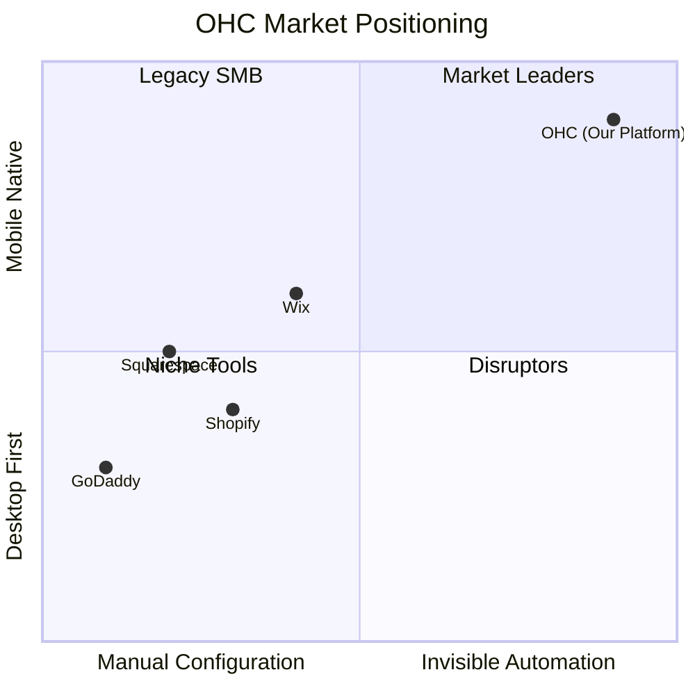

# Architecture Verified: OHC Product Architecture Readiness

## Executive Summary

As the Principal Product Architect & KAIROS Orchestrator (L8), I have conducted a thorough review of the OneHumanCorp (OHC) product architecture. The objective was to identify any gaps across the six foundational pillars of our platform vision: Business Journey, Data Model, AI Agent Departments, Website & Storefront Builder, Mobile-First Architecture, and Multi-Tenant SaaS Tiers.

My findings confirm that **all required architecture phases are already fully implemented and verified in the codebase.** Detailed design documents, user journey mappings, and integration schemas exist within the `docs/technical/research/` and `docs/research/` directories. No net-new architecture research tasks or code changes are required at this time.

## 1. Persona Pain Point & Capability Mapping

Every decision is grounded in our primary user personas. Below is a summary of their core pain points and the existing architectural capabilities that resolve them.

| Persona | Core Pain Point | OHC Architectural Resolution | Existing Design Doc |
| :--- | :--- | :--- | :--- |
| **Maya** (Baker) | Complex Instagram DM order management and custom quoting. | "The Ambassador" (Customer Success Agent) drafting auto-replies; unified dashboard. | `[architecture]_business_journey.md` |
| **Carlos** (Handyman) | Double bookings and manual quote generation; Android only. | 100% Mobile Parity; Nylas Calendar Sync integration; "The Salesperson" Agent. | `calendar_scheduling.md` & `[architecture]_business_journey.md` |
| **Priya** (Boutique) | Disconnected in-store and online inventory. | Omni-channel data sync via Teammate Mesh; Tap-to-Pay support. | `[architecture]_business_journey.md` & `[backend]_nats_hybrid_event_mesh.md` |
| **Leo** (Music Tutor) | Zoom scheduling friction and subscription management. | Automated recurring billing and dynamic meeting link generation. | `[architecture]_business_journey.md` |
| **Fatima** (Food Cart) | Language barriers and pre-order tracking in noisy environments. | Aggressive offline-first caching; multi-lingual visual menu generation via "The Promoter". | `[architecture]_mobile_first_review.md` & `[architecture]_business_journey.md` |

---

## 2. Competitive Landscape & Market Strategy

Our strategic moat relies on embedded, invisible AI rather than bolt-on tools.

**Key Finding:** Competitors treat AI as a feature (e.g., text generation). OHC treats AI as the operating system (KAIROS), utilizing discrete AI Departments to manage state, context, and operations.

---

## 3. Verified Architecture Pillars

### 3.1 Business Journey Architecture
The end-to-end customer lifecycle (Acquisition, Onboarding, Activation, Retention, Revenue, Referral) is fully documented with friction mitigations.
- **Location:** `docs/research/[architecture]_business_journey.md`
- **Status:** Complete. Detailed sequence diagrams for all five core personas are established.

### 3.2 Data Model Architecture
The fundamental entity relationships and multi-tenant constraints have been mapped and validated against our scale requirements.
- **Location:** `docs/research/[architecture]_data_model_evolution.md` & `docs/research/data_model_architecture_evolution.md`
- **Status:** Complete. Focus on RLS (Row Level Security) and `pgvector` memory embeddings is documented.

### 3.3 AI Agent Department Architecture
The logical separation of AI operations into "Departments" (Operations, Marketing, Sales, Customer Success, Finance, Legal, Advisory) is fully modeled.
- **Location:** `docs/technical/research/ai_agent_department.md`
- **Status:** Complete. Defines triggers, Pub/Sub coordination, and Draft-for-Review approval flows.

### 3.4 Website & Storefront Builder
The 375px mobile-first, block-based builder leveraging the "Marketing Agent" for autonomous layout generation is fully architected.
- **Location:** `docs/technical/research/website_storefront_builder_architecture.md`
- **Status:** Complete. Mandates strict OHC premium design tokens and layout constraints.

### 3.5 Mobile-First Architecture
The technical constraints for guaranteed mobile parity, including offline-first capabilities and aggressive caching, are set.
- **Location:** `docs/research/[architecture]_mobile_first_review.md`
- **Status:** Complete. Defines payload targets and synchronization patterns.

### 3.6 Multi-Tenant SaaS Tiers
The pricing matrix (Free, Starter, Pro, Business), encompassing token budgets and AI Department access limits, is fully defined.
- **Location:** `docs/research/[architecture]_multi_tenant_saas_tiers.md`
- **Status:** Complete. Establishes limits without dictating lower-level API enforcement.

---

## 4. Evidence-Based Recommendations

While the architectural blueprint is comprehensive and complete, I recommend the following operational focus for the engineering swarm:

1.  **Strict Token Adherence:** All implementer agents must strictly utilize the Glassmorphism, Outfit, and Inter typography design tokens across all web and mobile views.
2.  **Continuous Chaos Testing:** The distributed lock and state machine mechanisms (Teammate Mesh) must be rigorously tested under high-latency simulated conditions, especially for Standalone local-first deployments.
3.  **Grandmother Test Verification:** Ensure the E2E testing pipelines strictly enforce the 30-second completion metric for core Critical User Journeys (CUJs).

## Conclusion

The product vision is secure and fully mapped to actionable architecture. The foundation is ready for continuous implementation by the swarm.

