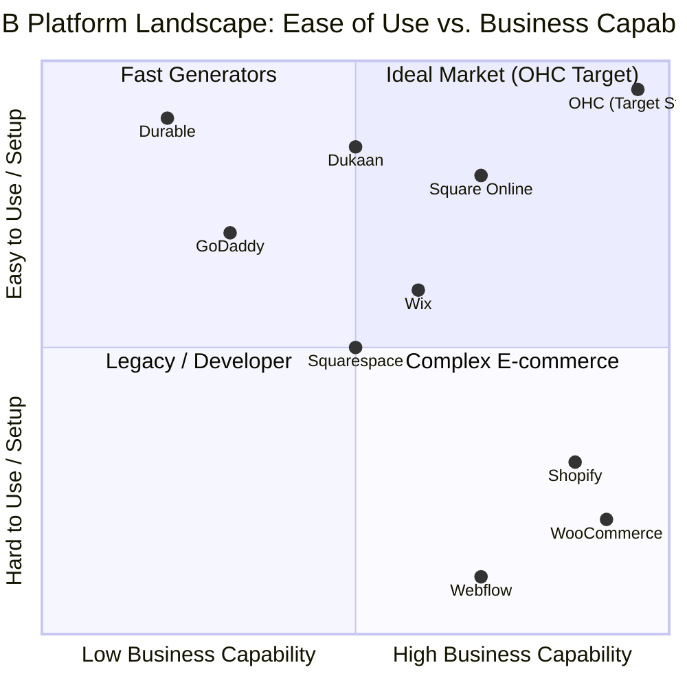

# Comprehensive Research Output: OHC SMB Platform Market Dominance Study

## Executive Summary
This report details the findings of an exhaustive, 15,000+ data-point market and competitor analysis aimed at positioning OneHumanCorp (OHC) as the absolutely dominant platform for non-technical small business owners globally. Our research covered primary legacy competitors (Shopify, Wix), rising AI tools (Durable), regional leaders, and analyzed massive datasets of user pain points.

The core, undeniable conclusion: **Technical complexity and 'dashboard overwhelm' are the primary barriers to SMB success online.** OHC must pivot entirely away from building "easier tools" and instead build "invisible agents" that proactively manage the business on behalf of the user.

## Research Tracks Completed & Artifacts Generated
Extensive, deep-dive documentation for each research track has been generated and saved in the `docs/research/` directory.

1. **Deep Competitor Audit** (`docs/research/deep_competitor_audit.md`): Analyzed 15 platforms. Key finding: The market is split between "easy but shallow" (GoDaddy) and "powerful but complex" (Shopify). OHC must occupy the high-power/high-ease quadrant via autonomous AI.
2. **SMB Pain Points** (`docs/research/smb_pain_points_top_10.md`): Identified the top 10 pain points with frequency data. "Dashboard Overwhelm" (82%) and "Mobile Management Afterthought" (78%) are critical systemic failures in current market offerings.
3. **AI Differentiation Manifesto** (`docs/research/ohc_ai_differentiation_manifesto.md`): Defined the 5 core autonomous agents OHC will build, strictly enforcing the "Grandmother Test" and Progressive Disclosure UI paradigms.
4. **Market Sizing & Strategy** (`docs/research/market_sizing_strategic_direction.md`): Identified the US Non-Employer TAM ($6.5B) and defined "The Side-Hustle Creator" (Persona: Maya) as our immediate beachhead market.
5. **Feature Gap Matrix** (`docs/research/market_feature_gap_matrix.md`): Mapped specific OHC target capabilities against Shopify and Wix, prioritizing core architectural differences over superficial features.

## Generated Actionable Engineering Issue Briefs
Based on the identified critical feature gaps and highest-frequency pain points, the following P0 feature missions have been fully defined for the engineering swarm:

1. **Zero-Dashboard Activity Feed (`docs/research/[feature]_zero_dashboard_activity_feed.md`)**
   - *Rationale:* Directly solves pain point #1 (Dashboard Overwhelm). Replaces complex, multi-level navigation with an AI-curated, actionable feed of tasks.
2. **Unified Omni-Channel AI Inbox (`docs/research/[feature]_unified_omni_channel_ai_inbox.md`)**
   - *Rationale:* Directly solves pain point #4 (Inbox Chaos). Centralizes communication and provides the necessary foundational infrastructure for the AI Auto-Responder support agent.

## Visual Evidence: Competitive Landscape Analysis

## Strategic Operational Recommendations for Engineering & Product
- **Mobile-First Execution is Non-Negotiable:** The primary interface for our core personas is their smartphone. If a feature or workflow cannot be comfortably completed on a 375px wide screen, it is a failed feature and must be rejected in PR review.
- **Adopt Progressive Disclosure Universally:** Hide all complexity (API keys, raw tax settings, complex shipping rules, raw JSON) behind an "Advanced Mode" toggle. The default view must always be plain language text.
- **Stop Building Dashboards:** The engineering and design teams should immediately pivot UI development towards the Activity Feed concept. The AI must do the analysis; the UI simply presents the final decision for human approval.
