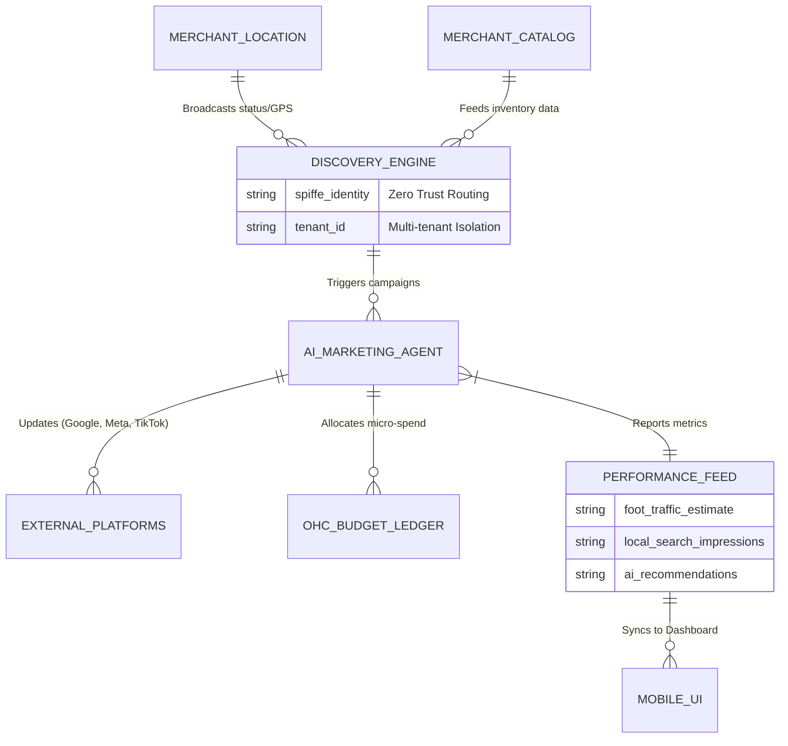

# [architecture] Hyper-Localized Omni-Channel Discovery & Foot-Traffic Engine

## Title
Hyper-Localized Omni-Channel Discovery & Foot-Traffic Engine

## Problem Statement
Small business owners like Fatima (food cart operator) and Priya (boutique owner) struggle with acquiring new local customers. Traditional SEO and digital marketing platforms (Google Ads, Facebook Ads, Yelp) are highly complex, require manual bid management, and demand technical expertise that these owners do not have. Furthermore, these platforms are disjointed—running a localized ad campaign, managing a Google Business Profile, and optimizing local discovery on TikTok require different apps and constant monitoring. When Fatima moves her food cart to a new street corner, she needs nearby foot traffic to know instantly, without manually updating five different platforms. Small business owners need an invisible, autonomous marketing engine that automatically optimizes their local visibility across all platforms, drives foot traffic, and converts local searches into direct sales, requiring zero manual configuration or marketing knowledge.

## Research Report
*   **Shopify:** Focuses heavily on digital product marketing (Google Shopping integrations, Facebook Pixel). It lacks built-in tools for hyper-localized, real-time foot-traffic generation (e.g., dynamically updating location on maps or pushing localized notifications).
*   **Wix / Squarespace:** Offer basic SEO checklists and Google Business Profile integrations. These are static and require the merchant to actively manage their listings, respond to reviews, and run campaigns manually.
*   **Yelp / Google Ads:** Powerful but overwhelming. The "smart campaigns" still require budget setting, keyword understanding, and copy creation. They often result in wasted ad spend for small local businesses.
*   **OneHumanCorp (OHC) Differentiation - "Autonomous Discovery":** OHC replaces the concept of a "Marketing Dashboard" with an **Autonomous Discovery Agent**. By leveraging the merchant's real-time physical context (via mobile GPS or fixed POS location) and business calendar, the OHC Marketing Department dynamically updates local search profiles, generates localized social content (e.g., "We are at 5th and Main until 8 PM!"), and allocates micro-budgets autonomously to drive immediate foot traffic. The merchant just turns it on.

## Design Doc

### Architecture Diagram

### UI Wireframes & 375px Baseline
**Core Layout: macOS-style Translucent Glass + Ubiquiti UniFi Modular Dashboard Cards**
*   **Global Viewport:** 375px width (Mobile First). No horizontal scrolling.
*   **App Bar:** Blurred glass top nav with the business logo and a quick toggle: `[AI Local Discovery: Active / Paused]`.
*   **Main Dashboard (The Pulse):**
    *   A frosted glass card (`rgba(255, 255, 255, 0.05)` with `backdrop-filter: blur(20px)`) dominating the top half. It displays a real-time "Local Visibility Score" (e.g., "🔥 High Traffic Nearby").
    *   **Actionable Map Widget:** A translucent map view showing the business's current broadcast radius and nearby customer density hotspots.
    *   **Automated Actions Feed:** A scrolling list of micro-cards below the map showing what the AI is doing right now (e.g., "✨ Updated Google Maps location," "✨ Boosted TikTok post to 500 locals," "✨ Replied to 3 new Yelp reviews").
*   **Campaign Approval (If Escalated):**
    *   When the AI suggests spending over the pre-approved daily limit, a priority notification card appears with a 1-click "Approve $10 Boost" button, styled in a vibrant, gradient-filled button to indicate revenue generation.
*   **Advanced Settings (Hidden):** Behind a swipe-left gesture, merchants can view strict budget caps, specific API connections (Meta/Google), and toggle off specific channels.

### Mobile UX Flow
1. **Activation:** Fatima opens her OHC app in the morning and taps "Open for Business."
2. **Context Sync:** The app securely pings her location. The AI Marketing Agent instantly updates her Google Business Profile, Apple Maps, and Instagram bio to reflect the new cross-street.
3. **Autonomous Action:** Because she has a surplus of Chicken over Rice, the AI drafts a hyper-local geo-targeted post: "Lunch special at 5th & Main! Show this post for a free drink."
4. **Notification:** Fatima gets a push notification: "✨ AI boosted your location to 1,200 locals. Traffic incoming."
5. **Monitoring:** She checks the app to see a beautifully clean, translucent card showing live foot-traffic estimates and coupon redemptions directly integrated with her POS. No complex charts, just real-world business impact.

### AI Agent Integration Points
*   **Marketing Department:** The core driver. Monitors local trends, writes copy, and executes API calls to external ad/listing platforms.
*   **Operations Department:** Continuously feeds the Marketing Agent with real-time inventory (e.g., "We are running out of vegan cakes, stop promoting them").
*   **Finance Department:** Maintains strict governance over the AI's ad spend budget, auto-reconciling any micro-transactions via the OHC Budget Ledger.

### Key Design Decisions (Why, not How)
*   **Context-Aware Automation:** Small businesses (especially mobile ones like food carts or pop-up shops) are highly dynamic. Static SEO fails them. The system must use real-time contextual triggers (location, inventory surplus, weather) to drive marketing.
*   **"No Charts" Philosophy:** Complex analytics dashboards cause fatigue. The UI must synthesize data into simple, actionable insights (e.g., "It's raining; I paused your outdoor foot-traffic ads") to pass the grandmother test.
*   **Zero-Trust Budget Constraints:** The AI will have access to real money for ad spend. The architecture MUST ensure cryptographic validation of spending limits and isolate tenant funds at the ledger level to prevent rogue spending.

## Implementation Prompt
**To the Implementer Swarm:**
Your goal is to build the foundational architecture and mobile UI for the "Hyper-Localized Omni-Channel Discovery & Foot-Traffic Engine." This feature will allow a user like Fatima to automatically update her business presence across multiple local discovery platforms and let the AI run micro-campaigns without touching any settings.

**Customer User Journey (CUJ):**
1. The merchant toggles "AI Local Discovery" to Active on their mobile device.
2. The OHC mobile app captures the current geographic location (with permission) and business status.
3. The AI Marketing Agent intercepts this event and simulates updating external platforms (e.g., Google Maps, Yelp).
4. The Agent generates a real-time "Action Feed" card on the mobile dashboard (e.g., "Updated location," "Promoted surplus inventory").
5. The UI displays a simple "Local Visibility Score" without requiring the merchant to read complex charts.

**Acceptance Criteria:**
*   **Mobile Parity:** The UI must be flawlessly executed on a 375px viewport using the macOS-style Translucent Glass aesthetics and UniFi modular cards.
*   **Real-Time Feed:** Implement the "Automated Actions Feed" that visually displays the AI's autonomous marketing actions as they happen.
*   **Cross-Department Mocking:** The system must demonstrate the Marketing Agent communicating with the Operations (inventory) and Finance (budget caps) departments to inform its actions.
*   **Isolation Guarantee:** Strict multi-tenant isolation must be enforced for all generated campaigns and budget allocations via `tenant_id` and SPIFFE identities.
*   **Simplicity:** No developer terms (APIs, SEO, CPM, Bids) may appear on the primary dashboard screens.

## Priority
P1

## Estimated Scope
Large
