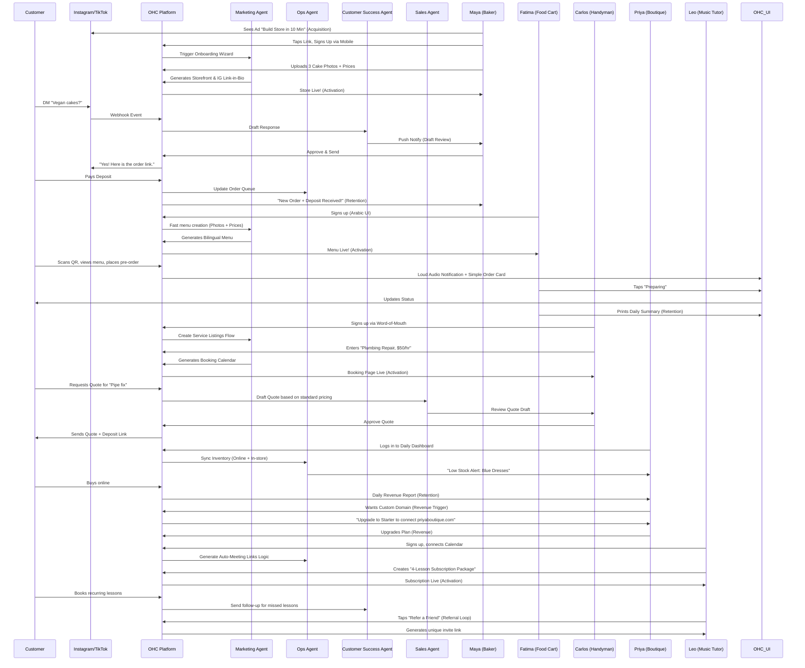

# Architecture Document: Business Journey Mapping

## Problem Statement
The OHC platform must serve a diverse set of real-world small business owners (e.g., Maya the Baker, Carlos the Handyman, Priya the Boutique Owner, Leo the Music Tutor, and Fatima the Food Cart Operator) who share a common goal: launching and growing their business entirely from a mobile device without technical expertise. Currently, the overarching business journeys—from initial acquisition to sustainable revenue generation and referral loops—are fragmented. We need a unified architectural map of the end-to-end user journeys for these personas to ensure that the system naturally supports their progression through Acquisition, Onboarding, Activation, Retention, Revenue generation, and Referral, while identifying critical friction points where non-technical users might abandon the platform.

## Research Report
### Context and Personas
The business journey is evaluated against the following core personas:
1.  **Maya (Home Baker, 28)**: Needs a mobile-first storefront, Instagram integration, order management with deposit payments, and AI handling direct messages.
2.  **Carlos (Handyman, 42)**: Requires clean service listings, a robust booking system with deposits, a unified customer inbox, and an AI quote generator.
3.  **Priya (Boutique Owner, 35)**: Wants omnichannel support (in-store/online), POS integration (tap-to-pay), inventory sync, and actionable daily analytics.
4.  **Leo (Music Tutor, 22)**: Needs subscription-based packages, schedule syncing, automated meeting links, and a strong public profile (link-in-bio).
5.  **Fatima (Food Cart Operator, 50)**: Prioritizes extreme simplicity, pre-order management, multi-language UI, and fast low-data mobile performance.

### Journey Stages
-   **Acquisition**: The entry point. Organic search, social media ads (Instagram/TikTok), or word-of-mouth. The call-to-action (CTA) must clearly promise a functional business setup in under 10 minutes.
-   **Onboarding**: A highly guided, AI-driven wizard flow. Crucial to minimize initial input; deferring advanced configurations (like custom domains) to a later stage.
-   **Activation**: The "Aha!" moment. A live storefront, the first booking, or the first payment. Must be achieved within Day 1.
-   **Retention**: Kept engaged through actionable notifications (e.g., new order alerts) and AI-generated weekly health reports.
-   **Revenue**: The upgrade path. Evolving from Free to Starter when feature limits are reached or custom domains are desired.
-   **Referral**: The viral loop. Sharing the OHC platform with other small business owners organically.

### Friction Points
1. **Decision Paralysis during Onboarding**: Requesting too much upfront information (e.g., exact tax rates, detailed shipping zones) will cause non-technical users to abandon the flow.
2. **First Sale Frustration**: If payment gateways (like Stripe or Mercado Pago) require complex technical API keys, users like Fatima or Maya will churn.
3. **Overwhelming Analytics**: Complex graphs without actionable summaries will be ignored. Users need direct insights ("Your sales dropped 10% this week, want to run a promo?").

## Design Doc

### UI Wireframes & Screen Flow (375px)
1.  **Welcome Screen**: Simple "Start your business in 10 minutes" CTA.
2.  **Business Type Selection**: Large touch targets for "Selling Products", "Booking Services", "Food Cart", etc.
3.  **AI Generation State**: Glassmorphism progress indicator while AI generates the initial layout.
4.  **The "Aha!" Moment**: Live preview of their new storefront with a prominent "Share Link" button.
5.  **Dashboard Home**: Single feed of actionable items (e.g., "New Message from Carlos", "Review this drafted response").

### AI Agent Integration Points
-   **Onboarding**: The 'Promoter' agent analyzes the chosen business type and name to instantly generate a logo, color scheme, and placeholder copy.
-   **Messaging**: The 'Ambassador' agent intercepts inbound DMs (e.g., via IG integration) and drafts context-aware replies for approval.
-   **Operations**: The 'Manager' agent automatically updates inventory levels when a sale occurs and notifies the owner if stock is low.

### Key Design Decisions
-   **Optimistic UI over Synchronous Loading**: To guarantee mobile performance, UI actions (like approving a message) execute instantly on the client, with the KAIROS Orchestrator ensuring eventual consistency via background sync. Why? Non-technical users associate slow loading spinners with broken software.
-   **Progressive Disclosure Pattern**: Advanced settings (DNS configuration, complex tax rules) are hidden by default behind "Advanced Options" toggles. Why? To prevent overwhelming users during initial activation.

### Architecture Diagram

### Mobile UX Flow Notes
-   **375px First**: All onboarding forms utilize native mobile keyboards appropriately (e.g., numeric for prices, email for contacts).
-   **Progress Indicators**: Clear visual indicators during the onboarding wizard.
-   **Optimistic UI**: Immediate feedback on actions (like saving a setting), with background sync handled by the KAIROS Orchestrator.

## Implementation Prompt
**To Implementer Agent:**
Implement the foundational user onboarding flow and dashboard state management that supports the progression from Acquisition to Activation. The system should define the required data models to capture the user's business type and minimal initial configuration. Build the mobile-first (375px) UI wizard that guides a user through the initial setup, ensuring that advanced configurations are deferred via progressive disclosure. The final step of the wizard should instantly generate a functional "Storefront/Booking Page" view, satisfying the 'Activation' milestone. Ensure that interactions feel premium (Glassmorphism, correct typography) and are resilient to network issues (optimistic updates). Do not prescribe the specific database schema or backend routing; focus on the unified API contract and the user journey transitions. Include E2E test coverage verifying a successful run-through from login to the generated storefront.

Priority: P0
Estimated Scope: Large
