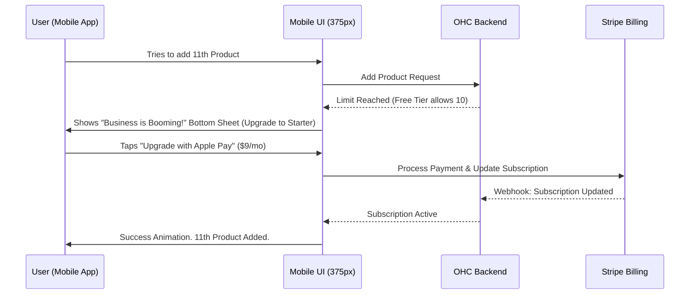

# [architecture] Multi-Tenant SaaS Tier Architecture Design

## Title
Multi-Tenant SaaS Tier and Upsell Architecture

## Problem Statement
Small business owners start on OHC because it's free and easy, but as they grow (adding more products, getting more orders, needing more AI help), they hit limits. Currently, non-technical users like Maya (baker) or Carlos (handyman) may find pricing tiers confusing, full of jargon like "bandwidth limits" or "API quotas." They need to understand exactly what they get at each tier (Free, Starter, Pro, Business) in plain English. More importantly, when they reach a limit, they shouldn't feel punished or blocked—they should see it as an exciting milestone of business growth and be gently guided to upgrade without interrupting their flow.

## Research Report
### Competitive Analysis
- **Shopify**: Tiers are $39/mo, $105/mo, $399/mo. Limits are mostly on staff accounts and reporting. Too expensive for a starting micro-business.
- **Wix**: Very confusing tiers (Combo, Unlimited, Pro, VIP) with arbitrary storage limits (2GB, 10GB, 50GB, 100GB). They use jargon like "Video Hours."
- **Squarespace**: $16/mo (Personal), $23/mo (Business), etc. Transaction fees are higher on lower tiers.
- **GoDaddy**: Has free tier but very limited commerce. Upgrades feel forced and transactional.

### OHC Differentiation
OHC's tiers must be transparent and directly tied to business value, not technical constraints:
| Tier | Price | Products | AI Departments | AI Actions/mo | Storage | Custom Domain |
|---|---|---|---|---|---|---|
| Free | $0 | 10 | 1 | 100 | 500MB | No (OHC subdomain) |
| Starter | $9/mo | 100 | 3 | 1,000 | 5GB | Yes |
| Pro | $29/mo | Unlimited | 10 | Unlimited | 50GB | Yes + SSL |
| Business | $79/mo | Unlimited | Unlimited | Unlimited | 500GB | Yes + multi-domain |

Our metrics are easy to understand: "Products" (how many items you sell), "AI Departments" (how many AI helpers you employ), and "Custom Domain" (your own .com).

## Design Doc

### Key Design Decisions and Why
- **Plain Language Limits**: Instead of saying "Storage limit reached," the UI will say "You've uploaded a lot of beautiful photos! Upgrade to Starter to add more."
- **In-Flow Upgrades**: If a user tries to enable a 2nd AI Department on the Free tier, they aren't blocked by an error screen. They see a glassmorphic bottom sheet presenting the Starter tier as an "Hire more AI staff" upgrade.
- **Graceful Degradation for AI Actions**: If "AI Actions/mo" are depleted, the user's business does not break. The AI simply stops auto-drafting replies or generating new content, and the user must do it manually until the next month or they upgrade. The core storefront and checkout remain 100% operational.
- **Mobile-First Upgrades**: The upgrade flow uses native Apple Pay / Google Pay via Stripe to make upgrading a one-tap experience on mobile.

### Architecture Diagram (Mermaid)

### UI Wireframes & Screen Flow (375px Mobile First)

**Screen 1: The "Limit Reached" Bottom Sheet (Glassmorphism)**
- **Trigger**: User hits a limit (e.g., adding 4th AI department on Starter tier).
- **UI**: A bottom sheet slides up with a 20px blur background.
- **Copy**: "Your team is growing! 🚀 You've hired all 3 AI departments included in the Starter plan. Upgrade to Pro to unlock up to 10 AI departments and infinite products."
- **Action**: A large, 44px minimum touch target button: [Upgrade to Pro - $29/mo] (Uses native payment sheet).

**Screen 2: The Subscription Dashboard**
- **Location**: Settings > My Plan.
- **UI**: Simple progress bars for limits.
  - "Products: 95 / 100" (turns yellow at 90%)
  - "AI Actions this month: 450 / 1,000"
- **Action**: "Manage Plan" button to view other tiers in a horizontal carousel.

### AI Agent Integration Points
- The **Business Advisory** ("The Advisor") agent proactively warns users when they are nearing a limit (e.g., at 90% usage). Example: "Hey Maya! You're getting lots of customer messages. You have 50 AI actions left this month. Want me to handle upgrading to Pro so I don't stop replying to your customers?"
- Agents track their own usage against the `tenant` quota and gracefully yield if the limit is hit.

## Implementation Prompt

**Role**: Feature Implementer
**Context**: We are building the user-facing subscription and tier limit enforcement flow for the mobile app and backend. We need to display limits gracefully and provide friction-free upgrade paths via Stripe.

**User-Facing Outcome (CUJ)**:
As a small business owner, I want to clearly see my current usage limits in a simple dashboard. If I try to do something beyond my tier (like adding too many products), I want to be congratulated on my growth and offered a one-tap upgrade via Apple Pay/Google Pay, without losing the data I was just trying to input.

**Acceptance Criteria**:
1. Implement the "My Plan" mobile UI (375px wide) showing progress bars for Products, AI Departments, and AI Actions.
2. Implement the "Limit Reached" bottom sheet using the OHC Premium Token library (Glassmorphism). It must intercept actions that exceed tier limits.
3. Ensure the bottom sheet provides a native mobile checkout experience (via Stripe Payment Sheet).
4. Integrate with the Business Advisory AI agent so it can surface a plain-language warning message when a limit reaches 90%.
5. **No Technical Jargon**: All limits must be described in business terms.
6. Write full E2E test starting from login to hitting a limit and completing an upgrade mock flow.

## Priority
`P0`

## Estimated Scope
Medium
