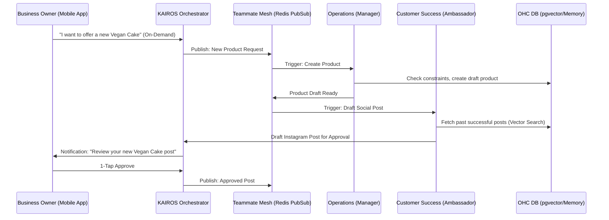

# OHC AI Agent Department Architecture

## Title
[architecture] AI Agent Department Architecture Design

## Problem Statement
Small business owners (like Maya the Baker or Carlos the Handyman) are overwhelmed by the complexity of managing operations, marketing, sales, customer support, finances, and legal compliance. They lack the time and technical expertise to use disparate software tools or manage complex AI prompts. The gap is the lack of an integrated, invisible AI workforce that automatically handles these business functions in a coordinated, easy-to-understand way.

## Research Report
The current market offerings (Shopify, Wix, Squarespace) either lack built-in autonomous AI agents or treat them as bolted-on chatbots.
- **Shopify Sidekick**: Operates as an assistant for the merchant but does not autonomously execute cross-departmental workflows.
- **Wix AI**: Primarily focused on initial site generation, lacking continuous operational support.
- **OHC's Opportunity**: By structuring AI agents as familiar "Departments" (Operations, Marketing, Sales, Customer Success, Finance, Legal, Advisory), we map the platform's capabilities directly to the user's mental model of running a business.

## Design Doc

### Functional Departments
1. **Operations ("The Manager")**: Order processing, bookings, inventory, fulfillment, refunds.
2. **Marketing & Advertising ("The Promoter")**: Website design, SEO, social media, promotional content.
3. **Sales & Acquisition ("The Salesperson")**: Quotes, lead follow-up, referral tracking, upselling.
4. **Customer Success ("The Ambassador")**: Message replies, order updates, reviews, re-engagement.
5. **Finance & Payments ("The Accountant")**: Payments, financial reporting, subscriptions, tax summaries.
6. **Legal & Compliance ("The Protector")**: Policies, contracts, GDPR, liability tracking.
7. **Business Advisory ("The Advisor")**: Weekly health reports, action suggestions, pricing recommendations.

### Architecture Diagram

### Execution Triggers & Coordination
- **Scheduled**: Cron jobs (e.g., Weekly Advisory reports).
- **Event-Driven**: System events routed via the Teammate Mesh (Redis Pub/Sub).
- **On-Demand**: Direct user requests via the mobile dashboard.

### Memory & Context
- **Short-Term**: Current request context and session state.
- **Long-Term**: `pgvector` embeddings in the OHC PostgreSQL database, ensuring agents recall tenant-specific history and preferences. Multi-tenant isolation is enforced via Row-Level Security (`tenant_id`).

### Approval Workflows
- **Auto-Execute**: Low-risk internal actions (e.g., tagging an order as processed).
- **Draft-for-Review**: High-risk, external-facing actions (e.g., publishing social posts, sending emails). Requires 1-tap approval in the mobile app.

### Usage Limits (Tier-Based)
Agent actions are throttled per tenant tier:
- Free: 100 actions/mo
- Starter: 1,000 actions/mo
- Pro/Business: Unlimited

### Mobile UX Flow
- The user's dashboard prominently features an "Inbox" of pending AI actions (Drafts for Review).
- Each action is presented in plain English (e.g., "The Ambassador drafted a reply to Maya's inquiry about vegan cakes.").
- The UI includes two main buttons per item: "Approve" (large, green) and "Edit/Reject" (secondary).

## Implementation Prompt
**Objective:** Implement the foundational routing and approval workflow for the AI Agent Departments in the KAIROS Orchestrator.
**User Journey:** Maya receives an Instagram DM. The Customer Success Agent drafts a reply and places it in the "Drafts for Review" queue. Maya receives a push notification, opens the OHC mobile app, sees the draft, and taps "Approve". The Orchestrator then publishes the reply event to be sent via the integrations service.
**Acceptance Criteria:**
- The orchestrator can accept tasks tagged for a specific AI Department.
- Tasks categorized as `HighRisk` enter a pending state and do not execute.
- A mobile API endpoint exposes pending tasks for a given `tenant_id`.
- An approval endpoint allows transitioning a task from pending to approved, triggering execution via the Teammate Mesh.
- 100% E2E test coverage of the draft-to-approval flow.

## Priority
P0

## Estimated Scope
Large
