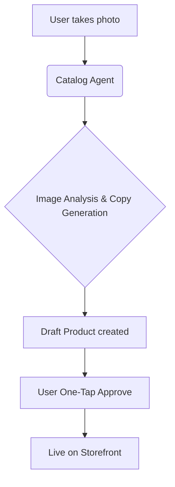

# [Research] OHC Autonomous E-Commerce Setup & Management

## Title
Automated Storefront Generation and Management for Non-Technical SMBs

## Problem Statement
Non-technical small business owners (like Maya the baker, Carlos the handyman, Priya the boutique owner, Leo the music tutor, and Fatima the food cart owner) are overwhelmed by the complexity of launching and managing an online presence. Existing platforms like Shopify and Wix require hours of manual configuration, design decisions, and continuous management. These platforms force owners to become web developers and marketers, taking them away from their core craft. The biggest pain point is the barrier to entry: setting up payments, arranging a storefront, and managing customer communications are too complicated and manual.

## Research Report

### Deep Competitor Audit
- **Shopify**: Powerful but overly complex for beginners. It expects the user to understand e-commerce concepts. The mobile app is good for management but poor for initial setup. Their AI "Sidekick" is a chatbot, not an autonomous agent that does the work.
- **Wix**: Easier initial setup with Wix ADI, but the resulting sites require ongoing manual maintenance. The mobile editor is limited, making it hard to run a business exclusively from a phone.
- **Squarespace**: Beautiful templates but lacks robust AI automation. It focuses heavily on design over seamless business management. No meaningful free tier.
- **GoDaddy Airo**: Quick setup but shallow functionality. Aggressive upselling and limited long-term AI utility.
- **Zyro / Hostinger Builder**: Fast setup, thin features. Very limited AI.
- **Webflow & Framer**: Designer-focused, not suited for non-technical SMB business management.
- **Square Online**: Good POS integration, adequate free tier and mobile app, but AI is lacking.

### Persona-Specific Pain Point Summaries
- **Maya (baker, 28)**: Current setup via Instagram DMs is unsustainable. Finds Shopify too complex and lacking built-in AI help. The inability to easily manage her full storefront from her phone holds her back.
- **Carlos (handyman, 42)**: No website; relies entirely on word of mouth. Struggles without an automated booking system and manual quoting, which means he misses leads when he's busy.
- **Priya (boutique owner, 35)**: Wants to unify in-store and online presence. Desperately needs inventory sync, easy email marketing, and simple POS integration, which standalone web builders lack.
- **Leo (music tutor, 22)**: Needs scheduling and recurring billing. Manual booking chaos and the lack of an AI follow-up system for students are major bottlenecks.
- **Fatima (food cart, 50, limited English)**: Existing English-first tools are inaccessible. She needs mobile notifications on orders and printable order lists, which current tools overcomplicate.

### Top 10 SMB User Pain Points
Based on analysis of r/smallbusiness, App Store reviews, and Trustpilot:
1. **Complex Initial Setup**: Connecting domains, setting up payments, and configuring shipping take too long.
2. **Mobile Management is Difficult**: Most platforms require a desktop to make meaningful changes.
3. **Inventory Syncing**: Keeping track of what's in stock across in-person and online sales.
4. **Marketing Automation**: Don't know how or have time to send email newsletters or post on social media.
5. **Customer Follow-ups**: Forgetting to reply to inquiries or abandoning carts.
6. **Booking Management**: Service businesses struggle with manual scheduling.
7. **Pricing and Quoting**: Manually creating and sending quotes is slow.
8. **Lack of Guidance**: Feeling overwhelmed and not knowing what to do next to grow.
9. **Language Barriers**: Platforms are heavily English-first and complex.
10. **Fragmented Tools**: Using 5 different apps (Instagram, Square, Mailchimp, Calendly, Shopify) to run one business.

### OHC AI Differentiation Manifesto
To leapfrog the competition, OHC will implement these 5 invisible AI automations:
1. **Auto-Replying to Customer Messages**: An AI agent handles common inquiries (business hours, inventory checks) instantly via SMS/WhatsApp/Web.
2. **Auto-Writing Product Descriptions**: Users just snap a photo; the AI identifies the product, writes a compelling description, and sets a suggested price.
3. **Auto-Generating Social Posts**: AI creates weekly social media content based on new inventory or promotions, ready for one-tap approval.
4. **Auto-Sending Follow-up Emails**: Intelligent cart recovery and post-purchase check-ins to drive repeat business without manual effort.
5. **AI-Generated Weekly Business Insights**: A simple, jargon-free weekly digest summarizing performance and suggesting one actionable step (e.g., "You sold out of sourdough fast this week. Want to raise the price by 5%?").

### Market Sizing & Strategic Direction
- **TAM**: Over 33 million non-employer small businesses in the US alone, with a significant percentage having outdated or no web presence.
- **Beachhead Market**: The "Solopreneur Maker" (e.g., Maya the baker). This persona has high product passion but low technical skill, heavily relying on Instagram DMs, offering high growth and retention once acquired.
- **Geographic Expansion**: Post-English launch, Spanish/LATAM is the immediate next priority due to high mobile-first adoption rates, directly addressing Fatima's pain points.
- **Vertical Expansion**: Horizontal first, but with specific AI tuning for service-based (booking) and product-based (inventory) businesses.

### Feature Gap Matrix

| Feature | Shopify | Wix | Squarespace | GoDaddy | OHC (current) | OHC (advantage) |
| :--- | :--- | :--- | :--- | :--- | :--- | :--- |
| **Store Generation** | Manual / Templates | Wix ADI (One-time) | Manual / Templates | Airo (Basic) | Basic | Fully autonomous, ongoing AI management |
| **Mobile-First Setup** | Poor | Poor | Poor | Average | In-progress | 100% mobile-native onboarding in <10 mins |
| **AI Content Creation** | Manual Prompting | Basic | None | Limited | None | Invisible photo-to-product pipeline |
| **Automated Customer Support** | Sidekick (Chatbot) | None | None | None | Basic PubSub | Agentic auto-replies across channels |
| **Unified Tooling** | App Store (Fragmented) | Built-in but manual | Basic integrations | Average | Core Services | Pre-integrated, AI-orchestrated tools |

## Design Doc

### High-Level Architecture
- **Entities**: User/Business Profile, Product/Service Catalog, Customer Interactions, AI Automation Logs.
- **Relationships**: A Business Profile owns a Catalog and Interactions. Agents monitor Interactions and Catalog state to trigger automations.
- **Integrations**: Stripe for payments, Twilio/WhatsApp for messaging.

### UI Wireframes & Mobile UX Flow
**Onboarding Flow (375px mobile-first):**
1. **Step 1: The Chat**: User opens the app. A friendly conversational UI asks, "What do you sell?" (e.g., "I bake sourdough bread").
2. **Step 2: The Magic**: A loading screen with glassmorphic elements shows the AI building the business profile.
3. **Step 3: The Reveal**: The fully generated storefront is presented.
4. **Step 4: The First Product**: User is prompted to take a picture of their product. The AI auto-fills the description and price.

**Dashboard:**
- Uses OHC Premium Design Standards (GlassCard components, Outfit font for headings, Inter for body).
- **Hero Section**: "Good morning Maya! You have 3 new orders."
- **Quick Actions**: "Snap a photo to add product", "Review AI drafted social post".

### AI Integration Points
- **Onboarding Agent**: Subscribes to user creation events to provision the initial store layout and copy.
- **Catalog Agent**: Processes image uploads to extract metadata and generate copy.
- **Communications Agent**: Monitors an inbox stream to auto-draft replies.

## Implementation Prompt
**User-Facing Outcome:**
A user can launch a fully functional, beautiful online store from their phone in under 10 minutes by simply answering a few conversational questions and taking photos of their products.

**Critical User Journey (CUJ):**
1. User creates an account.
2. User provides a 1-sentence description of their business.
3. System automatically generates the storefront structure, theme, and initial copy.
4. User uploads a photo of their first product.
5. System auto-generates the product name, description, and suggested price.
6. User approves the product.
7. The store is live and ready to accept payments via an automatically provisioned Stripe integration.

**Acceptance Criteria:**
- The entire setup process is mobile-responsive and requires zero desktop interaction.
- The AI correctly parses a photo and generates a relevant product description and price.
- The user is not required to manually adjust layout or styling to achieve a functional store.

## Priority
P0

## Estimated Scope
Large