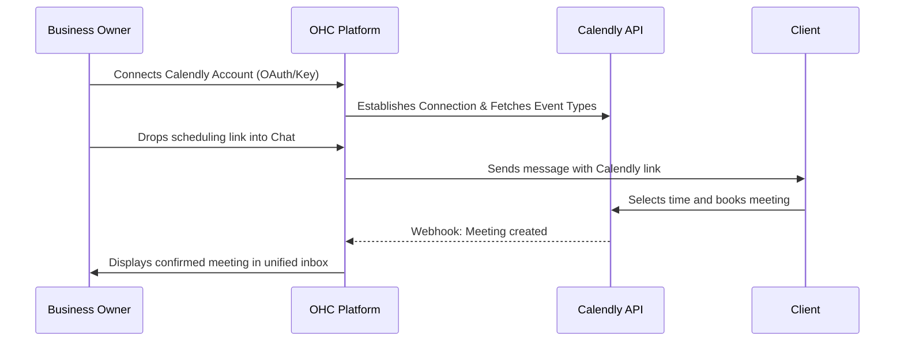
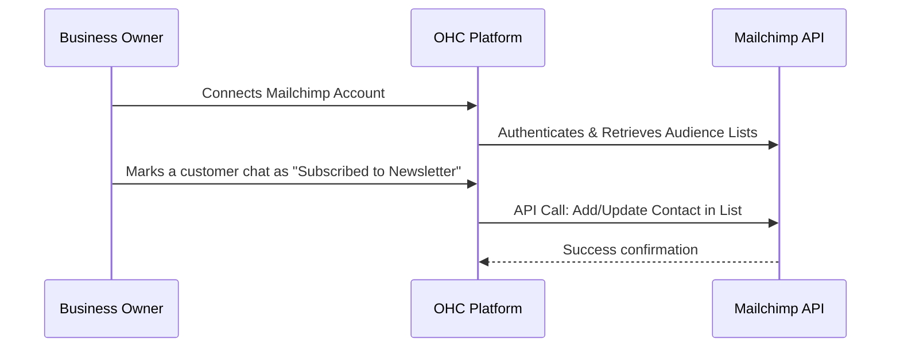
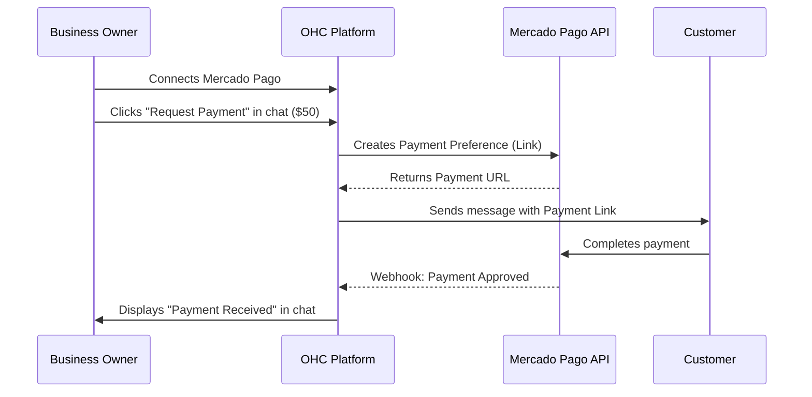
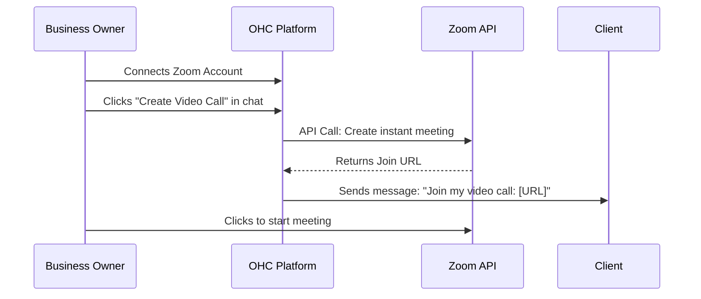

# OHC Tool Integration Research Q4

This report evaluates four specific tools that directly benefit small business owners for integration into the OHC unified inbox platform.

The selected tools cover four key categories:
1. **Calendar & Scheduling:** Calendly
2. **Email Marketing:** Mailchimp
3. **Payment Processing:** Mercado Pago
4. **Video Conferencing:** Zoom

---

## 1. Calendar & Scheduling: Calendly

**Title**: Implement Calendly Integration for Seamless Client Bookings
**Problem Statement**: Small business owners (like personal trainers, consultants, and tutors) waste hours each week playing "email ping-pong" to find a time to meet with clients. Manually creating events and generating links often leads to double bookings, time zone confusion, and lost business from friction in the booking process.
**Research Report**: Calendly is the industry standard for simplified scheduling. It natively solves time zone translation, eliminates double bookings by syncing with existing calendars, and provides customizable booking pages.
* *Ease of Use*: High. The UX is incredibly intuitive for both the business owner and the client booking the meeting.
* *Pricing*: Offers a free tier for basic 1:1 meetings. Paid plans start at $10/user/mo (Standard) to unlock multiple meeting types, group meetings, and automated reminders.
* *Reputation*: Best-in-class reliability and widespread familiarity.
* *Mode Compatibility*: Can be configured via OAuth for Cloud (multi-tenant) and via local API keys/OAuth for Standalone mode.
**Design Doc**:

**Implementation Prompt**: Create an integration that allows a business owner to securely connect their Calendly account. In the unified inbox UI, provide a "Share Booking Link" button that lets the owner quickly copy/paste their default Calendly link into a customer conversation. The integration should listen for Calendly webhooks and push a "Meeting Confirmed" notification card into the relevant customer conversation thread when a booking is made. No technical jargon should be visible—label the action "Connect my Calendar".
**Priority**: P1
**Estimated Scope**: Medium

---

## 2. Email Marketing: Mailchimp

**Title**: Implement Mailchimp Integration for Audience Syncing
**Problem Statement**: Many small businesses build a list of loyal customers but struggle to proactively market to them. Manually exporting contacts from a unified inbox into a marketing tool like Mailchimp is tedious, error-prone, and often neglected, leading to missed revenue opportunities from promotions or newsletters.
**Research Report**: Mailchimp is a widely used, accessible email marketing platform designed specifically for small businesses and e-commerce.
* *Ease of Use*: Very high for non-technical users. It offers drag-and-drop template builders and AI generative features for copy.
* *Pricing*: Free tier available for up to 500 contacts (1,000 monthly sends). Paid plans (Essentials) start at $13/mo for additional templates, a/b testing, and more sends.
* *Reputation*: Very strong brand recognition and trust among small business owners.
* *Mode Compatibility*: Works well in both Cloud (OAuth) and Standalone (API Key).
**Design Doc**:

**Implementation Prompt**: Build a Mailchimp integration that syncs contacts. When an owner connects Mailchimp, OHC should fetch their primary "Audience" list. In the unified inbox customer profile sidebar, add a simple toggle: "Add to Email Newsletter". When toggled on, OHC should automatically sync that customer's name and email to Mailchimp. Label the settings area "Connect my Mailchimp" rather than "API Keys".
**Priority**: P2
**Estimated Scope**: Medium

---

## 3. Payment Processing: Mercado Pago

**Title**: Implement Mercado Pago Integration for LATAM Payments
**Problem Statement**: Small business owners in Latin America often find Stripe unsupported or too expensive/complex. They need a localized, trusted way to send payment links directly in chat (WhatsApp/Instagram) to close sales instantly without forcing customers through a complex checkout flow.
**Research Report**: Mercado Pago is the dominant payment processor in Latin America, deeply trusted by consumers and merchants alike.
* *Ease of Use*: High. Customers are very familiar with the Mercado Pago checkout flow. Merchants can easily generate payment links.
* *Pricing*: Varies by country, typically taking a percentage of the transaction. Settlement speeds are fast, often immediate for a higher fee.
* *Reputation*: The "PayPal of LATAM", essential for doing business in countries like Brazil, Argentina, and Mexico.
* *Mode Compatibility*: Fully supported via API in both Cloud and Standalone modes.
**Design Doc**:

**Implementation Prompt**: Create an integration for Mercado Pago. In the unified chat window, add a "Request Payment" button. When clicked, the owner enters an amount and description. OHC should call the Mercado Pago API to generate a payment link and insert it into the chat draft. The system must listen for payment confirmation webhooks from Mercado Pago and display a clear "Payment Received" success message in the chat timeline so the owner knows it's safe to fulfill the order. Use plain language like "Connect Mercado Pago" for setup.
**Priority**: P1
**Estimated Scope**: Large

---

## 4. Video Conferencing: Zoom

**Title**: Implement Zoom Integration for Auto-Generated Meeting Links
**Problem Statement**: Tutors, consultants, and therapists need to quickly send video meeting links to clients. Creating a meeting in the Zoom app, copying the link, and pasting it back into a customer chat is a clunky, multi-step process that slows down communication.
**Research Report**: Zoom remains the most popular dedicated video conferencing tool for small businesses.
* *Ease of Use*: High. Ubiquitous adoption means clients rarely struggle to join a Zoom meeting.
* *Pricing*: Free tier allows 40-minute meetings. Pro tier ($15.99/mo) removes the time limit and adds features.
* *Reputation*: Industry leader, synonymous with video calls.
* *Mode Compatibility*: Requires OAuth app approval, functioning well in both Cloud and Standalone (with appropriate redirect URI handling).
**Design Doc**:

**Implementation Prompt**: Build a Zoom integration that allows business owners to instantly generate meeting links from within a chat. Add a "Start Video Call" button near the chat input. When clicked, OHC should request a new meeting via the Zoom API and automatically insert the join link into the chat box for the owner to send. The setup screen should guide the user through a simple "Connect my Zoom" OAuth flow.
**Priority**: P2
**Estimated Scope**: Small
