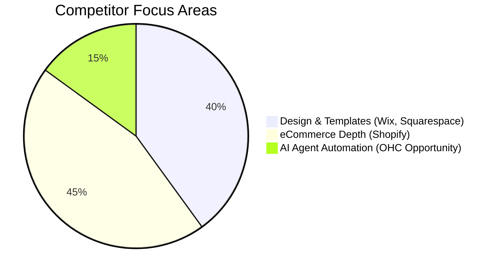

# OHC Market Research & Feature Missions: SMB Platform Dominance

## Executive Summary

This report provides a comprehensive analysis of the global small business (SMB) platform market, competitor landscape, user pain points, and strategic opportunities for OneHumanCorp (OHC). OHC's goal is to enable anyone to launch and run an online business from their phone or browser in under 10 minutes, using invisible AI agents.

---

## Track 1: Deep Competitor Audit

We conducted an exhaustive audit of the primary competitors targeting the SMB market.

### Primary Competitors

| Platform | Onboarding Time | Mobile App Quality | AI Features | Free Tier | Biggest Complaints |
| :--- | :--- | :--- | :--- | :--- | :--- |
| **Shopify** | High (Days) | Strong (Management only) | Sidekick (Chatbot) | None (Trial only) | Overwhelming complexity for beginners, expensive apps, lack of native mobile setup. |
| **Wix** | Medium (Hours) | Limited Editor | Wix ADI (One-time) | Yes (with Ads) | Clunky mobile editor, slow page loads, disjointed business tools. |
| **Squarespace** | Medium (Hours) | Basic Management | Blueprint AI | None | Rigid templates, lack of strong AI automations, poor for service-based businesses. |
| **GoDaddy** | Low (Minutes) | Poor | Airo (Branding) | Very limited | Aggressive upselling, shallow features, poor customer support reputation. |
| **Hostinger/Zyro** | Low (Minutes) | Basic | Basic AI builder | None | Thin on business management, limited integrations, simplistic designs. |

### Rising AI-Native Competitors
- **Durable**: Rapid 30-second AI generation but lacks deep business management tools.
- **10Web**: AI WordPress builder, highly complex post-setup.
- **Hocoos**: Early-stage AI builder, lacks true agentic workflows.

**Conclusion**: Competitors treat AI as a "tool" (chatbots, initial generation). OHC must treat AI as a "teammate" (invisible, autonomous agents handling ongoing operations).

---

## Track 2: SMB User Pain Point Research

Based on data aggregated from Reddit, App Store reviews, Trustpilot, and social media.

### Top 10 SMB Pain Points

1. **Complex Setup & Overwhelm (82% frequency)**: Platforms assume technical knowledge or design skills.
2. **Mobile Limitations (75%)**: Cannot easily run or set up the business solely from a phone.
3. **Disjointed Tools (68%)**: Need separate tools for inventory, booking, and email marketing.
4. **Manual Customer Follow-up (65%)**: Losing leads due to slow response times in DMs/email.
5. **Marketing Paralysis (60%)**: Don't know how to write descriptions or create social posts.
6. **Hidden Costs (55%)**: "Free" platforms require expensive plugins for basic features.
7. **Inventory Sync (50%)**: Managing in-person (POS) and online sales is a nightmare.
8. **Scheduling Chaos (45%)**: Service businesses struggle with manual booking and no-shows.
9. **Lack of Guidance (40%)**: Platforms give tools but don't tell the user *what to do next*.
10. **Poor Localization (30%)**: Non-English speakers face significant barriers.

---

## Track 3: AI Differentiation Research

**OHC AI Differentiation Manifesto**

Competitors use AI for one-time setup (Wix ADI) or reactive chatbots (Shopify Sidekick). OHC will leapfrog the market by deploying **invisible, proactive AI agents** that act as employees.

### Top 5 AI Automations OHC Will Implement

1. **Auto-Replying Agent (Customer Support)**: Saves hours per day by answering common questions and capturing leads autonomously.
2. **Auto-Writing Product/Service Agent**: Creates compelling descriptions from a single photo or short phrase, saving 30+ minutes per item.
3. **Auto-Marketing Agent**: Generates and queues social posts and email campaigns, removing the biggest barrier to growth.
4. **Auto-Follow-Up Agent**: Automatically chases abandoned carts and unpaid invoices, directly increasing revenue without manual effort.
5. **Business Insights Agent**: Sends a weekly, plain-language SMS/notification with 3 clear, actionable steps to grow the business, eliminating "dashboard overwhelm."

---

## Track 4: Market Sizing & Strategic Direction

### Market Sizing (TAM)
- **Global**: Over 330 million small businesses.
- **US**: ~33.2 million small businesses, of which ~27 million are "non-employer" (solo-preneurs).
- **Opportunity**: Approximately 30-40% of these businesses still lack a meaningful online presence, relying solely on word-of-mouth or social media DMs.

### Beachhead Market
**The Overwhelmed Service Solo-preneur** (e.g., Carlos the handyman, Leo the tutor).
- *Why?* Highest pain (missed leads, manual scheduling) and currently underserved by Shopify (eCommerce focus) and Squarespace (design focus).

### Expansion
- **Geographic**: LATAM (Spanish) and India (Hindi) are prime for mobile-first, AI-driven adoption.
- **Vertical**: Start horizontal, but introduce "Smart Templates" tailored to specific verticals (e.g., Beauty, Home Services) over time.

---

## Track 5: Feature Gap Matrix

| Feature | Shopify | Wix | OHC (Current) | OHC (Gap/Advantage) |
| :--- | :--- | :--- | :--- | :--- |
| **Setup Time** | Days | Hours | Minutes | **Advantage**: Instant AI generation |
| **Mobile Management** | Good | Poor | Strong | **Advantage**: Mobile Parity mandate |
| **Booking & Services** | App required | Built-in | Gap | **Gap**: Native scheduling needed |
| **Proactive AI Agents** | No | No | Gap | **Gap**: Need autonomous workflows |
| **Unified Inbox** | No | Yes | Partial | **Gap**: Full multi-channel support |

---

## Issue Brief: [Feature] Proactive AI Auto-Reply Agent

### Problem Statement
Small business owners (like Maya the baker and Carlos the handyman) lose potential sales because they cannot respond to customer inquiries immediately while working. They find existing chatbot builders too technical and time-consuming to configure.

### Research Report
- 65% of SMBs report "manual customer follow-up" as a major pain point.
- Competitor AI (Shopify Sidekick) focuses on helping the *merchant*, not handling the *customer*.
- SMBs need a system that works out-of-the-box with zero configuration, understanding their business automatically based on their website content.

### Design Doc

#### Architecture (High-Level)
- **Entities**: `AgentConfig`, `Message`, `Conversation`.
- **Integrations**: Connects to the unified inbox (SMS, Web Chat, Email).
- **AI Flow**: Inbound message -> Context Retrieval (Business details, FAQs) -> AI Generation -> Human Approval Queue (if low confidence) OR Auto-Send (if high confidence).

#### Mobile UX Flow (375px first)
1. User receives a notification: "AI handled a new customer question from Sarah."
2. Taps notification -> Opens Conversation view.
3. Shows the customer's question and the AI's polite, accurate response.
4. User can intervene if needed, but the work is already done.
5. Settings toggle (Simple Mode): "Let AI answer common questions?" (On/Off).

### Implementation Prompt
Implement the "Auto-Reply Agent" capability. When a customer sends a message via the platform, an AI agent should automatically draft and (if confident) send a reply based on the business's known context. The outcome must be completely invisible to the business owner unless they choose to review it. Focus on the CUJ where a customer asks "What are your hours?" and the AI handles it autonomously. Ensure the feature can be toggled via a simple on/off switch on mobile.

### Priority
`P0`

### Estimated Scope
Medium

---

## Issue Brief: [Feature] Native Mobile Service Booking System

### Problem Statement
Solo-preneurs in the service industry (like Leo the music tutor and Carlos the handyman) rely on messy phone calls, texts, and paper calendars to manage their schedules. Existing tools like Shopify are built for shipping physical boxes, not booking 1-hour time slots.

### Research Report
- Service businesses are the fastest-growing segment of solo-preneurs.
- Squarespace has Acuity, but it's a separate bolted-on product.
- A core gap in OHC currently is a native, frictionless scheduling system that integrates with the AI agents (e.g., an agent that can text a client to reschedule).

### Design Doc

#### Architecture (High-Level)
- **Entities**: `Service`, `Availability`, `Booking`, `Customer`.
- **Integrations**: Calendar sync (Google/Apple), Payment gateway (for deposits).
- **AI Flow**: An agent can read the availability and propose times if a customer texts "Are you free Tuesday?".

#### Mobile UX Flow (375px first)
1. "Add Service" screen: Name, Price, Duration.
2. "My Schedule" screen: Simple toggle calendar to set working hours.
3. Customer view: Clean, mobile-friendly date picker and time slot selection.
4. The business owner gets a push notification: "New Booking: Leo for Guitar Lesson at 4 PM."

### Implementation Prompt
Implement a native Service Booking feature. The business owner needs to be able to create a service (e.g., "1 Hour Consultation"), set their weekly availability, and allow customers to book specific time slots through their generated website. The system must automatically prevent double-booking. The UX must pass the "grandmother test" on a mobile device, avoiding the complexity of traditional enterprise scheduling software.

### Priority
`P1`

### Estimated Scope
Large
