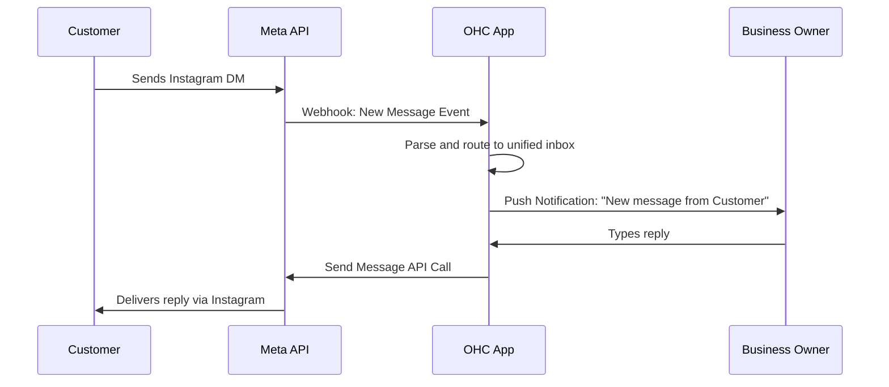
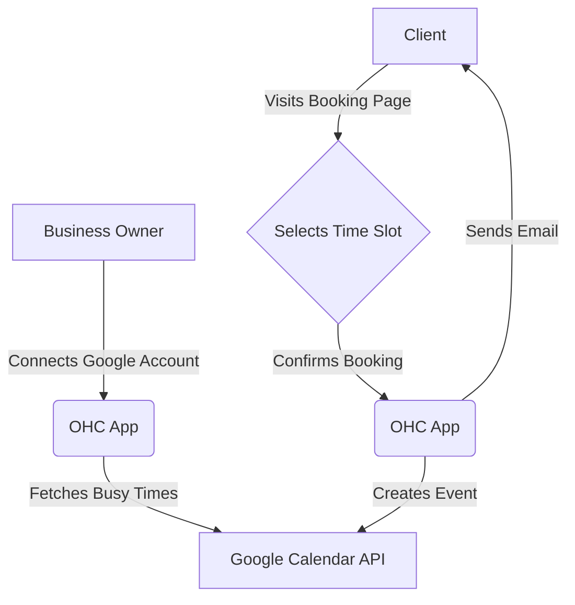
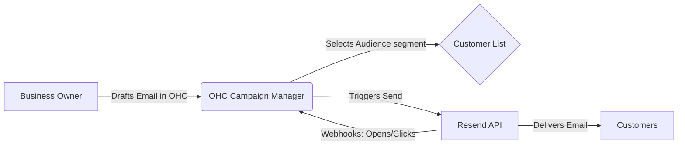
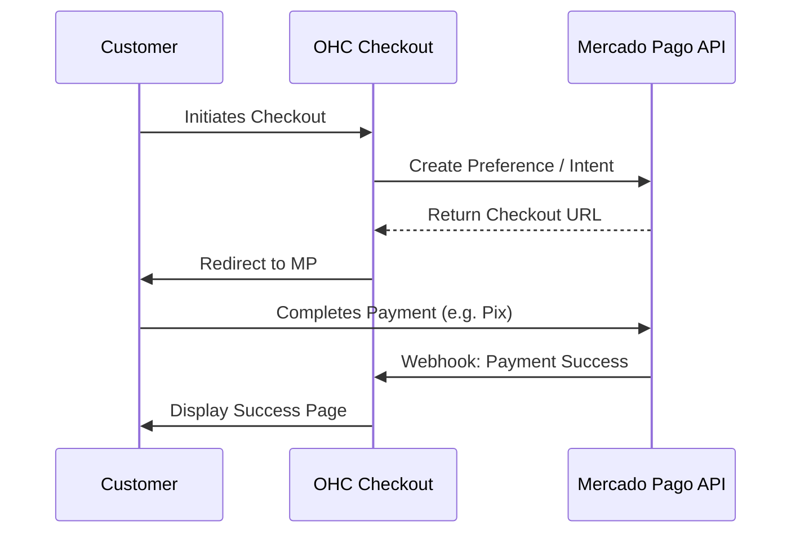
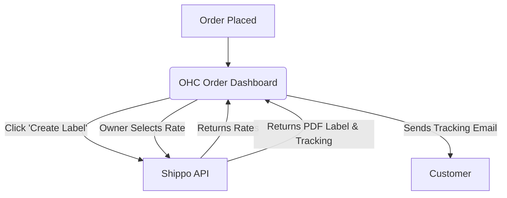
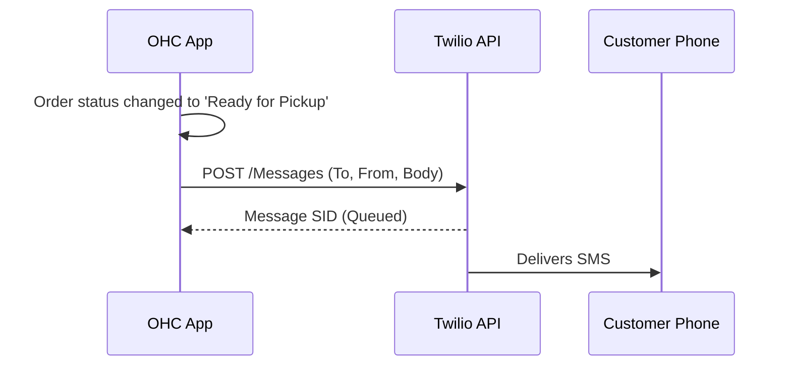
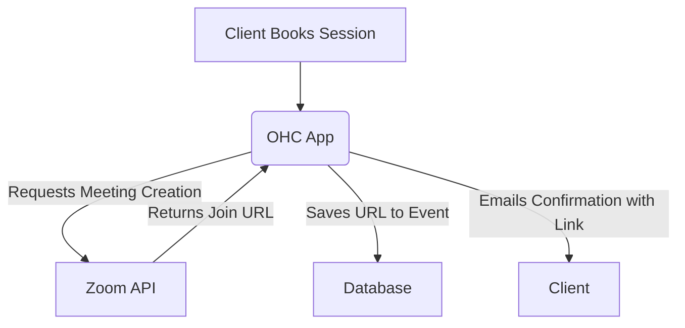

# Tool Integration Research Report Q4

## 1. Social Media Integration: Unified Inbox
### Problem Statement
Small business owners, like local bakers or florists, receive customer inquiries scattered across Instagram DMs, Facebook Messenger, WhatsApp, and TikTok. It is overwhelming to monitor all channels, leading to missed messages, delayed responses, and lost revenue. They need a single, easy-to-use inbox to view and reply to all customer messages.

### Research Report
**Evaluated Tool**: Meta Business Suite / WhatsApp Business API
**Advantages**:
- Official API for Instagram, Facebook, and WhatsApp.
- Extremely high market penetration for target demographics.
- Free for basic Meta Business Suite usage; WhatsApp API has per-conversation pricing.
**Risks**:
- Complex approval process for WhatsApp Business API.
- Strict 24-hour reply window for WhatsApp messages.
**Target Persona**: Fatima, the local florist who gets custom arrangement requests via Instagram and WhatsApp.
**Cloud vs Standalone**:
- Works well in Cloud via Webhooks.
- Standalone mode may require a central cloud proxy to route webhooks to local instances.
**Source**: Meta for Developers (https://developers.facebook.com/docs/messenger-platform)

### Design Doc

### Implementation Prompt
Implement a unified inbox interface within OHC where users can connect their Meta (Facebook/Instagram) and WhatsApp Business accounts. The user should see a simple "Connect to Facebook" button. Once authenticated, messages from all connected channels should appear in a single chronological feed. Users must be able to read and reply directly from the OHC interface. Ensure clear visual indicators of which platform a message originated from.
**Priority**: P0
**Estimated Scope**: Large

---

## 2. Calendar & Scheduling: Zero-Touch Booking
### Problem Statement
Service-based business owners waste hours going back and forth with clients to find a suitable meeting or service time. Managing manual calendar entries leads to double bookings and missed appointments. They need a simple, self-serve booking link that automatically syncs with their personal and business calendars.

### Research Report
**Evaluated Tool**: Google Calendar / Google Workspace
**Advantages**:
- Ubiquitous; almost every small business owner uses Google Calendar.
- Robust recurring event and timezone handling.
- Free tier available for basic usage.
**Risks**:
- Requires managing OAuth refresh tokens reliably.
- Privacy concerns around reading user's personal events to check for conflicts.
**Target Persona**: David, a freelance consultant who charges for hourly online sessions.
**Cloud vs Standalone**:
- Fully supported in both. Standalone will need its own OAuth app credentials or a guided setup.
**Source**: Google Calendar API Documentation (https://developers.google.com/calendar)

### Design Doc

### Implementation Prompt
Create a "Scheduling" feature where business owners can connect their Google Calendar. Generate a public booking link for their customers. When a customer visits the link, they should only see available times (automatically excluding times the owner is busy in Google Calendar). When booked, an event should be automatically created on the owner's Google Calendar.
**Priority**: P1
**Estimated Scope**: Medium

---

## 3. Email Marketing: Automated Customer Engagement
### Problem Statement
Business owners struggle to keep customers engaged after a purchase. Setting up complex marketing campaigns in tools like Mailchimp is intimidating. They want to effortlessly send professional updates, newsletters, or promotional offers directly to their customer list without juggling CSV exports.

### Research Report
**Evaluated Tool**: SendGrid / Resend
**Advantages**:
- Resend offers a modern, developer-friendly API and excellent email deliverability.
- Generous free tiers (Resend offers 3,000 emails/month free).
- Simplifies spam compliance (DKIM/SPF handling).
**Risks**:
- Potential account suspension if a business owner sends spammy content.
- Requires domain verification for best deliverability, which can be highly technical for users.
**Target Persona**: Sarah, a boutique owner who wants to announce new seasonal collections to past buyers.
**Cloud vs Standalone**:
- Supported in Cloud. Standalone may require users to supply their own API keys to prevent abuse.
**Source**: Resend Pricing and Documentation (https://resend.com)

### Design Doc

### Implementation Prompt
Add a "Campaigns" tab where users can draft an email using a simple, rich-text editor (no complex drag-and-drop HTML needed initially). Allow them to select customer segments (e.g., "All past customers") and send the email. Display basic analytics like "Sent" and "Opened" after the campaign is sent. Handle domain verification smoothly or use a generic verified sending domain by default.
**Priority**: P2
**Estimated Scope**: Medium

---

## 4. Payment Processing: Global Point of Sale
### Problem Statement
Depending on the region, small businesses cannot always use Stripe. In LATAM, they need Mercado Pago; in India, Paytm or UPI. Without local payment options, they lose sales due to friction at checkout or exorbitant cross-border fees.

### Research Report
**Evaluated Tool**: Mercado Pago (LATAM focus)
**Advantages**:
- Dominant player in Latin America.
- Supports local payment methods like Pix in Brazil and OXXO in Mexico.
- Fast settlement speeds for local merchants.
**Risks**:
- Documentation is often fragmented or region-specific.
- Testing requires country-specific test accounts.
**Target Persona**: Carlos, a specialty coffee roaster in Brazil selling online and in-person via Pix.
**Cloud vs Standalone**:
- Works in both. Webhook handling required for async payments (like Pix).
**Source**: Mercado Pago Developers (https://www.mercadopago.com/developers)

### Design Doc

### Implementation Prompt
Introduce a modular payment settings area where users can enable "Mercado Pago" alongside existing payment methods. When enabled, customers checking out will be redirected to the Mercado Pago secure checkout page. Ensure webhooks are configured to mark orders as "Paid" automatically once the payment clears, especially for asynchronous methods like bank transfers.
**Priority**: P1
**Estimated Scope**: Large

---

## 5. Shipping & Logistics: Automated Fulfillment
### Problem Statement
Calculating accurate shipping rates and manually typing customer addresses into carrier websites to generate labels is highly error-prone and time-consuming. Small e-commerce sellers need a seamless way to print shipping labels and provide tracking numbers instantly.

### Research Report
**Evaluated Tool**: Shippo
**Advantages**:
- Aggregates multiple carriers (USPS, UPS, FedEx, DHL, etc.) through one API.
- Pay-as-you-go pricing (only pay for the labels you buy).
- Automatically standardizes addresses to prevent delivery failures.
**Risks**:
- Label generation can fail if user-provided weights/dimensions are inaccurate.
- International customs forms require complex data mapping.
**Target Persona**: Emma, an artist shipping physical prints domestically and internationally.
**Cloud vs Standalone**:
- Fully supported in both modes.
**Source**: Shippo API Docs (https://goshippo.com/docs/)

### Design Doc

### Implementation Prompt
Within an order detail view, add a "Generate Shipping Label" flow. The owner inputs package weight and dimensions. Fetch and display available shipping rates from Shippo. Allow the owner to purchase the label and download it as a PDF. Automatically update the order status to "Shipped" and surface the tracking number so it can be sent to the customer.
**Priority**: P2
**Estimated Scope**: Large

---

## 6. SMS & Notifications: Reliable Local Alerts
### Problem Statement
In many markets or demographics with lower English proficiency or limited email usage, SMS is the only reliable way to send order confirmations, appointment reminders, or pickup alerts. Missed notifications result in no-shows and lost revenue.

### Research Report
**Evaluated Tool**: Twilio
**Advantages**:
- Unmatched global carrier coverage and reliability.
- Highly programmable API for automated SMS.
**Risks**:
- Compliance with local SMS regulations (e.g., A2P 10DLC in the US) is very complex for small businesses.
- High cost per message compared to email or WhatsApp.
**Target Persona**: Fatima, sending a simple "Your flowers are ready for pickup!" text to an older customer who doesn't use email.
**Cloud vs Standalone**:
- Works in both, but Standalone users might need to provide their own Twilio SID/Auth Token.
**Source**: Twilio Documentation (https://www.twilio.com/docs/sms)

### Design Doc

### Implementation Prompt
Build a simple automated notification settings panel. Let the user enable "SMS Notifications" for specific triggers (e.g., "Appointment Reminder 24h before" or "Order ready for pickup"). Provide default message templates that the user can lightly customize. Handle the underlying Twilio integration so the user doesn't need to touch an API key (in Cloud mode) or provide a simple input for keys (in Standalone mode).
**Priority**: P1
**Estimated Scope**: Medium

---

## 7. Video Conferencing: Auto-Generated Meeting Links
### Problem Statement
Service professionals offering online consultations often forget to create and send Zoom links, causing last-minute panic and unprofessional delays before a session starts. They need meeting links to be generated and shared automatically when a client books a slot.

### Research Report
**Evaluated Tool**: Zoom API
**Advantages**:
- The industry standard for video conferencing.
- Familiar to almost all clients.
**Risks**:
- Requires users to have a Zoom account and authorize the OHC app.
- Zoom API requires strict adherence to security and token refresh protocols.
**Target Persona**: David, the freelance consultant doing virtual strategy sessions.
**Cloud vs Standalone**:
- OAuth flow works seamlessly in Cloud. Standalone might require Server-to-Server OAuth or a proxy.
**Source**: Zoom App Marketplace Docs (https://developers.zoom.us/docs/api/)

### Design Doc

### Implementation Prompt
Integrate a "Connect Zoom" option in the Scheduling/Services settings. When an online service is booked, automatically call the Zoom API to create a new meeting for that specific date and time. Embed the generated `join_url` directly into the booking confirmation email sent to the client, and display a "Start Meeting" button in the business owner's OHC dashboard.
**Priority**: P2
**Estimated Scope**: Medium
