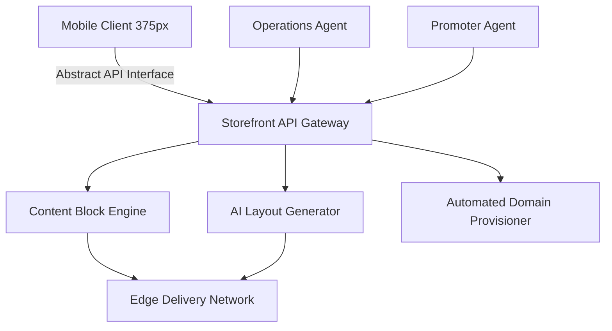

# Research Task Output: Storefront Builder V2 Architecture

## Executive Summary
This document provides the architectural design and research report for the OneHumanCorp Storefront Builder V2. Driven by the overarching goal of enabling non-technical small business owners to launch a business from their phone in under 10 minutes, this report analyzes market gaps and outlines a comprehensive abstract system architecture.

## 1. Issue Brief
**Title**: Storefront Builder V2 Architecture & Mobile-First Implementation
**Problem Statement**: Small business owners (like Maya the baker and Carlos the handyman) are currently overwhelmed by the technical jargon, complex desktop-first interfaces, and hidden costs of existing website builders (Shopify, Wix, Squarespace). The OHC platform must abstract all technical complexity (DNS, SEO, Layout generation) and guide users from zero to a live, premium-feeling business in under 10 minutes, exclusively from a mobile device (375px viewport).

**Research Report**:
A critical evaluation of the existing market landscape through the non-technical Small Business Owner Lens reveals a complete failure to support mobile-only operation.
- **Shopify**: Excellent e-commerce backend, but atrocious mobile onboarding. Users must use a desktop to configure domain settings, set up routing rules, and customize visual themes. Fails the grandmother test.
- **Wix**: Drag-and-drop is powerful but relies on massive client-side payloads that cripple load times on older mobile devices. The mobile editor is a secondary afterthought, requiring users to build on desktop and 'fix' for mobile.
- **Squarespace**: Great aesthetics, but deeply confusing variant management. Updating a product's size or color requires navigating complex native OS dropdowns that are not optimized for touch.
**Opportunity**: OHC will win by abstracting the 'how' and focusing on the 'what'. By integrating AI agents natively into the builder, we eliminate the blank canvas problem and remove all technical configuration steps.

**Design Doc**:
### System Architecture Diagram

### UI Wireframes & Mobile UX Flow
**Screen 1: The Initial Hook (Onboarding Phase)**
- **UI Element**: Full-screen Glassmorphic card overlaying an abstract blur.
- **Content**: "What are you building today?" with 3 large tap targets: "Selling Products", "Offering Services", "Showcasing Work".
- **UX Flow**: User selects "Selling Products". The UI smoothly transitions (<300ms) to Screen 2.

**Screen 2: Zero-Canvas Initialization (AI Layout Phase)**
- **UI Element**: A pulsing loading skeleton using OHC brand colors.
- **Content**: Text reads "The AI Architect is designing your storefront...".
- **UX Flow**: The backend 'Architect' agent generates a structural layout draft. Within 2 seconds, the skeleton resolves into 3 fully-formed, interactive storefront drafts.

**Screen 3: The Mobile Editor (Editing Phase)**
- **UI Element**: The selected draft is rendered natively. A sticky bottom action bar contains context-aware actions.
- **UX Flow**: Maya taps a 'Hero Image'. A touch-optimized action sheet slides up, offering 'Upload Photo', 'Sync from Social Media', or 'AI Generate'. She selects Social Media. The 'Operations' agent pulls her latest post and instantly updates the interface using an optimistic state update model.

**Screen 4: 1-Tap Publish (Deployment Phase)**
- **UI Element**: A prominent, vibrant 'Publish' button fixed to safe-area-inset-bottom.
- **UX Flow**: Maya taps 'Publish'. The backend provisions the necessary networking infrastructure and pushes the structural payload to the Edge delivery network. A success animation triggers, presenting her with a shareable QR code.

### Key Abstract Architectural Decisions
1. **Edge-Rendered Static Payloads**: To guarantee sub-second First Contentful Paint (FCP), the primary datastore is never queried for read traffic. Publishing compiles the Storefront configuration into a static document payload pushed to an edge network.
2. **Zero-Touch Infrastructure**: A background worker interfaces with domain registration and security authorities to automatically provision infrastructure without user intervention.
3. **Optimistic Local State**: The client application uses local browser storage to store pending changes, ensuring instantaneous feedback during drag-and-drop operations, even on high-latency cellular networks.

**Implementation Prompt**:
Develop the frontend and backend orchestration for the Storefront Builder V2. The critical user journey (CUJ) involves "Maya," a baker, creating a custom cake storefront from her iPhone in under 5 minutes. Implement touch-optimized drag-and-drop mechanics. Ensure strict adherence to the Visual Excellence Mandate: Glassmorphism (`backdrop-filter: blur(20px) saturate(200%)`), Outfit typography for headings, and Inter for body text. Entrance animations must be <= 300ms, exit <= 200ms, using easing 'cubic-bezier(0.4, 0, 0.2, 1)'. Provide 100% unit test coverage and complete E2E Playwright tests verifying the "grandmother test" constraints on emulated low-end Android devices.

**Priority**: P0
**Estimated Scope**: Large
