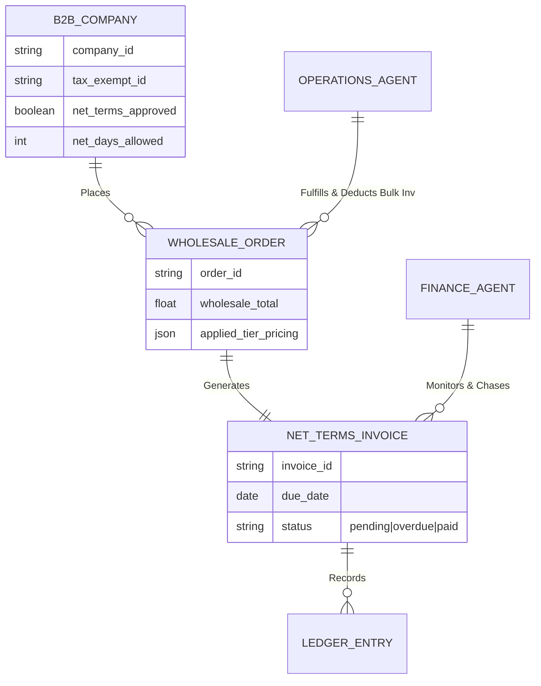

# [architecture] Autonomous B2B Wholesale & Net-Terms Engine

## Title
Autonomous B2B Wholesale & Net-Terms Engine for Micro-Merchants

## Problem Statement
When successful small business owners like Maya (the baker) start supplying their products to local cafes or Priya (the boutique owner) starts wholesaling her branded clothing to other shops, they hit a massive friction point. Consumer platforms (like standard Shopify or Wix) are designed for B2C retail (upfront credit card payments, single item pricing). B2B wholesale requires dynamic bulk pricing tiers, Minimum Order Quantities (MOQs), tax-exempt verification, and most critically, **Net-30/Net-60 invoicing** rather than upfront checkout.

Currently, Maya has to manage her retail customers on one platform and manually email PDF invoices, track unpaid Net-30 bills in a spreadsheet, and chase down payments for her B2B wholesale cafe clients. The jump to Enterprise B2B software is too expensive and complex. Maya and Priya need an invisible B2B portal that handles bulk ordering, automatic Net-Terms approval and tracking, and automated payment chasing without them lifting a finger.

## Research Report
**Market Gap Analysis:**
- **Shopify B2B / Plus:** Shopify restricts true B2B features (custom price lists, net terms, company profiles) to Shopify Plus, which starts at $2,000+/month. This prices out 99% of micro-merchants like Maya and Priya. Standard Shopify requires clunky workarounds (discount codes, duplicate draft orders) to simulate wholesale.
- **Wix / Squarespace:** No native B2B functionality. They rely entirely on third-party apps for wholesale, resulting in a fragmented experience and disjointed inventory.
- **Faire:** A popular wholesale marketplace, but Faire takes hefty commissions (up to 25% on new accounts) and controls the customer relationship. Merchants need to own their direct B2B relationships.

**OHC Differentiation:**
OneHumanCorp treats B2B as a first-class citizen, fully integrated into the existing inventory and ledger mesh. Using the `Finance Agent` and `Operations Agent`, we can offer zero-configuration Wholesale Portals. A buyer logs into Maya's site, gets automatically verified as a B2B partner, sees tiered wholesale pricing, and checks out using a "Net-30 Invoice" option. The Finance Agent then autonomously tracks the invoice and sends polite, escalating SMS/Email reminders to the buyer as the 30-day deadline approaches, while updating the Universal Ledger.

## Design Doc

### Architecture Diagram

### Mobile UX Flow (375px First)

**Screen 1: B2B Partner Setup (Business Owner View)**
- Maya opens the OHC mobile app to a specific customer's profile.
- She toggles a beautifully simple switch: "Enable Wholesale B2B".
- A Translucent Glass bottom sheet slides up: "Select Payment Terms". Options: `Due on Receipt`, `Net-15`, `Net-30`, `Net-60`. She taps `Net-30`.
- No complex configuration. The agent handles the rest.

**Screen 2: The B2B Portal (Buyer View)**
- The local cafe owner logs into Maya's storefront on their phone.
- The UI automatically shifts to "Wholesale Mode". Products show tiered pricing: `Croissants: $4 ea | Buy 50+: $2.50 ea (MOQ: 20)`.
- At checkout, instead of a credit card form, there is a bold, one-tap button: `Place Order (Net-30)`.

**Screen 3: The Autonomous Chaser (Action Feed)**
- 25 days later, Maya sees an item in her Daily Briefing feed: "Invoice #1042 for Local Cafe is due in 5 days. Finance Agent has scheduled a polite reminder SMS. [Cancel Reminder]".

## Implementation Prompt
**To the Implementer Agent:**
Implement the B2B Wholesale & Net-Terms Engine.
1. Expand the Buyer Identity model to support a `B2B_Company` entity linked to user accounts, storing attributes like `net_terms_approved` and `net_days_allowed`.
2. Introduce a dynamic pricing override in the catalog that activates when an authenticated B2B buyer is viewing the storefront (enabling Tiered Pricing and MOQs).
3. Implement a new checkout strategy for "Net-Terms" that bypasses immediate payment gateway capture, instead generating a `Net_Terms_Invoice` with a calculated `due_date`.
4. Create an event-driven routine for the `Finance Agent` to monitor unpaid `Net_Terms_Invoices` and automatically trigger communication workflows (SMS/Email) based on the proximity to the due date.

Ensure all multi-tenant boundaries are strictly enforced so B2B pricing is securely isolated. Focus on Zero-Configuration for the business owner.

## Priority
P1

## Estimated Scope
Large