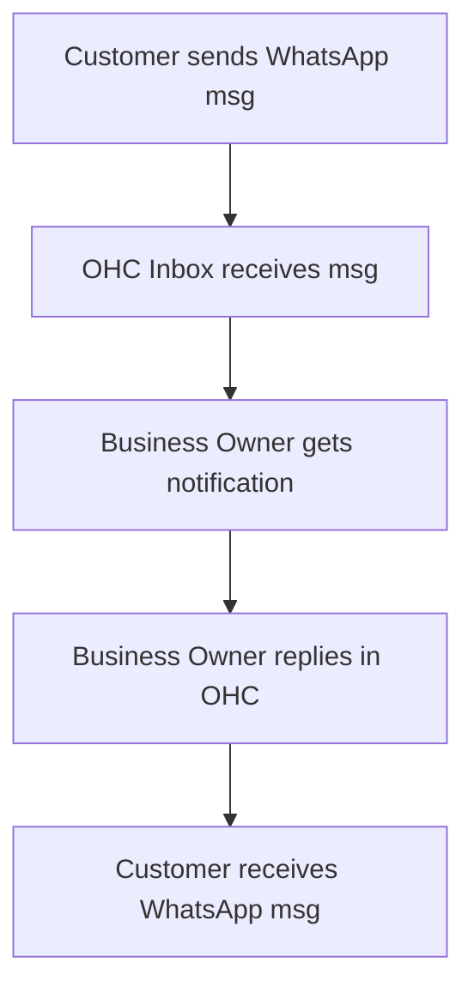
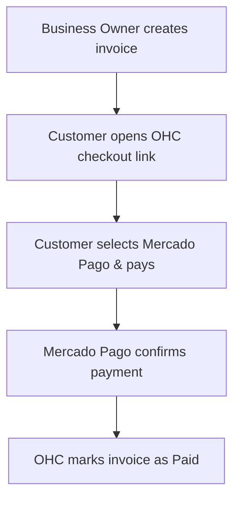
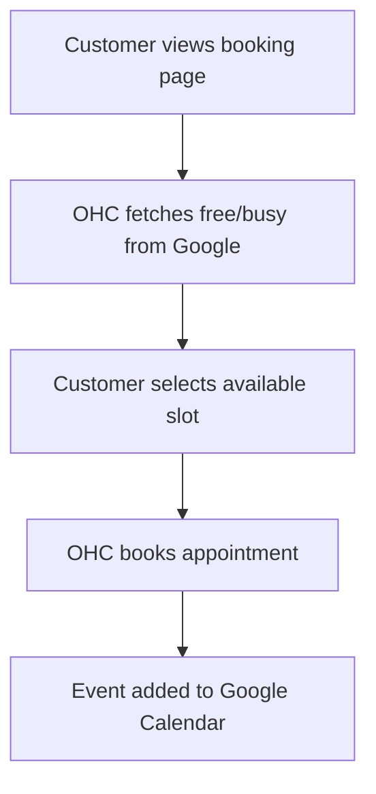

# 🔍 Scout: Tool Integration Research

## [Social Media Integration] WhatsApp Business Integration

### Title
Integrate WhatsApp Business for Unified Customer Messaging

### Problem Statement
Small business owners, especially those like Fatima who have low English proficiency or rely heavily on direct messaging, struggle to keep track of customer inquiries scattered across personal WhatsApp, Instagram, and SMS. They miss orders, forget to reply to leads, and have no centralized record of customer interactions, causing lost revenue and stress.

### Research Report
**Findings & Competitive Analysis:** WhatsApp is the dominant communication channel in LATAM, India, and parts of Europe/Africa. The WhatsApp Cloud API allows businesses to connect their numbers to third-party tools.
**Ease of Use:** For the business owner, this means connecting their existing WhatsApp Business number to OHC. Once connected, messages flow into their OHC dashboard.
**Pricing:** WhatsApp charges per conversation. Utility conversations (like order updates) cost a few cents, while marketing messages cost slightly more. Service conversations (user-initiated) are often free for the first 1,000 per month.
**Reputation:** Meta's infrastructure is robust, but account bans can happen if spam policies are violated.
**Cloud vs. Standalone:** This works seamlessly in Cloud mode via webhooks. For Standalone mode, OHC will need a lightweight relay or polling mechanism to fetch messages locally without requiring a public IP.
**Key Advantages:** Captures the highest-engagement channel for many regions; allows automated replies.
**Key Risks:** Meta's strict template approval process; potential API rate limits.

### Design Doc
When a customer sends a message to the business's WhatsApp number, the message appears in the OHC unified inbox.
The business owner receives a push notification on their mobile device or a badge in the desktop app.
They can type a reply directly in OHC, which is routed back to the customer's WhatsApp.
The onboarding involves scanning a QR code or logging in with Facebook to link the WhatsApp Business account.
Mermaid.js UX Flow:

### Implementation Prompt
Create a "Connect WhatsApp" button in the Settings menu. Upon clicking, the user is guided through the Meta login flow to authorize OHC.
Once authorized, all incoming messages to their WhatsApp Business number should appear in a new "Inbox" tab.
Users must be able to read and reply to these messages directly from the OHC app.
Acceptance Criteria:
- User can successfully link their WhatsApp Business account.
- Incoming text and image messages appear in the OHC Inbox within 5 seconds.
- User can reply from OHC, and the reply appears on the customer's phone.

### Priority
P0

### Estimated Scope
Large

---

## [Payment Processing] Mercado Pago Integration

### Title
Enable Mercado Pago for Seamless LATAM Payments

### Problem Statement
Stripe is often unavailable, expensive, or not preferred in many Latin American countries. Small business owners in these regions lose sales because they cannot offer local payment methods like Pix (Brazil) or local credit card installments, forcing them to manage manual bank transfers.

### Research Report
**Findings & Competitive Analysis:** Mercado Pago is the leading payment gateway in LATAM, supporting local payment methods, cash payments via convenience stores, and QR code payments.
**Ease of Use:** Non-technical owners can easily create a Mercado Pago account and link it to OHC. It feels familiar and trusted in the region.
**Pricing:** Transaction fees vary by country but generally range from 3% to 5% plus a fixed fee. Settlement can be instant or take up to 30 days depending on the fee tier selected by the merchant.
**Reputation:** Highly trusted by consumers in LATAM, ensuring higher conversion rates compared to international gateways.
**Cloud vs. Standalone:** Works well in Cloud mode via webhooks for payment confirmation. Standalone mode can also poll the API for payment status if webhooks cannot reach the local machine.
**Key Advantages:** Access to local payment methods (e.g., Pix, Boleto, OXXO); high consumer trust.
**Key Risks:** Dispute management can be challenging; API documentation is sometimes inconsistent across different LATAM countries.

### Design Doc
A "Connect Mercado Pago" option is added to the Payments setup screen.
The owner logs into Mercado Pago to authorize OHC.
When creating an invoice or checkout link in OHC, Mercado Pago is automatically offered to the customer.
Customers can pay using their preferred local method, and the OHC dashboard immediately reflects the payment as "Paid".
Mermaid.js UX Flow:

### Implementation Prompt
Add Mercado Pago as an alternative payment provider alongside Stripe. Provide a simple onboarding flow to link the account.
When generating a payment link, ensure it routes the customer to a Mercado Pago checkout experience if they are in a supported region.
Listen for successful payment events and automatically update the associated invoice or order status in OHC.
Acceptance Criteria:
- User can link their Mercado Pago account.
- Customers can complete a test transaction using Mercado Pago.
- OHC accurately updates the payment status based on the Mercado Pago response.

### Priority
P1

### Estimated Scope
Medium

---

## [Calendar & Scheduling] Google Calendar Sync

### Title
Two-Way Google Calendar Sync for Appointment Bookings

### Problem Statement
Service-based business owners (like tutors or consultants) use Google Calendar for their personal lives but have no automated way to offer booking slots to clients. They waste time going back and forth via email to find a suitable time, and often get double-booked.

### Research Report
**Findings & Competitive Analysis:** Google Calendar is ubiquitous. Tools like Calendly exist, but integrating scheduling directly into OHC provides a unified experience without extra subscription fees.
**Ease of Use:** The owner simply clicks "Sign in with Google" and selects which calendars check for conflicts.
**Pricing:** Google Calendar API is free for standard usage limits.
**Reputation:** Reliable, real-time, and globally understood.
**Cloud vs. Standalone:** Cloud mode handles the OAuth flow easily. Standalone mode might require an embedded local OAuth flow or a proxy service to securely handle the Google integration.
**Key Advantages:** Eliminates double-booking; keeps the business owner in their preferred calendar app.
**Key Risks:** OAuth token expiration handling; complex timezone edge cases.

### Design Doc
The owner connects their Google Account in Settings -> Calendar.
They define their working hours in OHC. OHC cross-references these hours with events on their Google Calendar to determine available slots.
Customers see a booking page with only the truly available times.
When a booking is made, OHC pushes the event to the Google Calendar, blocking off that time.
Mermaid.js UX Flow:

### Implementation Prompt
Implement a "Connect Google Calendar" feature. Allow the user to specify which calendars should be checked for conflicts and which calendar should receive new OHC appointments.
Create a public booking page that respects the owner's configured business hours minus any busy slots found in Google Calendar.
When a client books an appointment, automatically create an event on the owner's Google Calendar with the client's details.
Acceptance Criteria:
- User can authorize Google Calendar.
- Booking page dynamically hides time slots that conflict with existing Google Calendar events.
- New appointments successfully sync to Google Calendar.

### Priority
P1

### Estimated Scope
Medium
