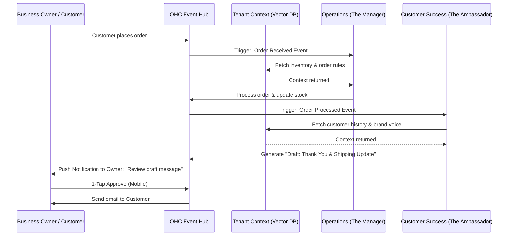

# Architecture: AI Agent Departments Integration

## Title
AI Agent Department Architecture

## Problem Statement
Small business owners like Maya (baker), Carlos (handyman), and Fatima (food cart) wear every hat in their business. They are the marketer, the salesperson, the customer support rep, the accountant, and the legal advisor. This leads to burnout and prevents them from focusing on their core passion (e.g., baking, fixing, cooking). Current tools like Shopify or Wix bolt on "AI Chatbots" as an afterthought, which requires technical setup and only handles surface-level tasks like writing a product description. Owners don't need a chatbot; they need invisible "departments" working in the background to run the business while they sleep.

## Research Report
**Findings & Data:**
- 72% of small business owners work weekends, and 45% say administrative tasks are their biggest pain point.
- Most users do not understand prompts or LLMs. Presenting them with an "AI Chatbot" creates cognitive load.
- Presenting AI as functional departments ("The Manager", "The Promoter", "The Accountant") maps directly to real-world business structures and immediately communicates value and purpose without jargon.

**Competitive Analysis:**
- **Shopify:** Sidekick is a chat interface that assists the merchant with store setup and analytics. It does not proactively manage departments or act as an autonomous agent in the background coordinating across business silos.
- **Wix/Squarespace:** AI is used for initial website generation or SEO meta-tag writing. No continuous autonomous agent orchestration.
- **GoDaddy:** Airo provides basic setup and logo generation but lacks deep operational integration (e.g., no autonomous "Customer Success" drafting emails based on "Operations" order events).

**Opportunity:**
OHC can differentiate by providing an invisible, event-driven AI workforce divided into 7 distinct departments that automatically coordinate with each other and learn from tenant context (memory).

## Design Doc

### Architecture Overview
The system relies on an event-driven AI Agent orchestration layer. The platform broadcasts business events (e.g., "Order Placed", "Review Received", "Weekly Summary Generated"), which are consumed by relevant AI Departments.

Key principles:
- **Triggers:** Departments act on Events (e.g., webhook from Stripe), Schedules (e.g., weekly Monday morning reports), or On-Demand (e.g., user asks for a specific draft).
- **Coordination:** A Pub/Sub or Event Bus pattern allows departments to chain workflows. Example: Operations processes an order → Emits `OrderProcessed` event → Customer Success picks it up and drafts a thank-you email.
- **Memory/Context:** Agents utilize a centralized tenant-specific Vector DB store to fetch past interactions, brand voice, and customer history.
- **Approval Flow:** High-risk actions (e.g., sending an email, refunding money, publishing a social post) default to "Draft for Review", requiring the owner's 1-tap approval on mobile. Low-risk actions (e.g., generating internal weekly reports, auto-replying with business hours) can be set to "Auto-execute".
- **Budgeting:** Each AI invocation deducts from a tenant's monthly action budget (based on their subscription tier: Free=100, Starter=1,000, Pro/Business=Unlimited).

### Architecture Diagram

### UX Flow (Mobile-First 375px)
1. **Dashboard Home:** The business owner sees a unified Inbox/Feed with action items from different departments. Example: "The Promoter drafted an Instagram post for your new vegan cake. [Review & Post]".
2. **Department Settings:** A dedicated "Team" tab shows the 7 departments. Tapping one (e.g., "The Accountant") shows its recent activity, allowed autonomous actions toggle, and action budget usage.
3. **Draft Review Screen:** When an agent drafts a response or content, the user sees the draft with two massive buttons: "Approve & Send" or "Edit". No complex prompt tweaking is exposed.
4. **Agent Memory:** Users can view a simple list of "Things we remember" under the settings, e.g., "You prefer a cheerful tone," "You don't do deliveries on Sundays."

### AI Agent Integration Points
- **Operations:** Listens to order and booking events.
- **Marketing & Advertising:** Triggered by new product additions or scheduled social calendars.
- **Sales & Acquisition:** Listens to abandoned carts or new leads from contact forms.
- **Customer Success:** Hooked into the unified inbox (DMs, emails) to draft replies.
- **Finance & Payments:** Triggered by successful payments or weekly scheduled cron jobs.
- **Legal & Compliance:** Triggered during onboarding or when adding new services that require waivers.
- **Business Advisory:** Scheduled weekly trigger to aggregate data across all departments and summarize.

### Key Design Decisions
- **Draft-by-Default:** To build trust, agents will not send external communications automatically out of the box. They act as draft generators until the user explicitly turns on "Auto-Execute."
- **Event-Driven Coordination:** Departments do not call each other directly; they react to platform events. This decouples the logic and makes it easy to add new agents later.
- **Tier-Based Throttling:** Rather than exposing token counts, AI limits are abstracted as "Actions" (e.g., 1 draft = 1 action).

## Implementation Prompt
**Outcome:** Implement the underlying event coordination and configuration layer for the 7 AI Departments. The backend must support registering departments, routing platform events to them, enforcing the tenant's action budget, and storing agent outputs as "Drafts" awaiting owner approval.
**CUJ:** A simulated "Order Placed" event should flow through the Operations department to update an internal order status, which then triggers the Customer Success department to generate a "Draft" email. The business owner must be able to view this draft in the UI and approve it.
**Acceptance Criteria:**
1. A unified event bus routes events to registered AI departments.
2. Tenant budgeting is enforced (reject actions if budget is exceeded).
3. Drafts are stored and exposed via an API for the mobile UI to approve or reject.
4. Full E2E test covering the event generation to draft approval flow (from the UI).

## Priority
P0

## Estimated Scope
Large
