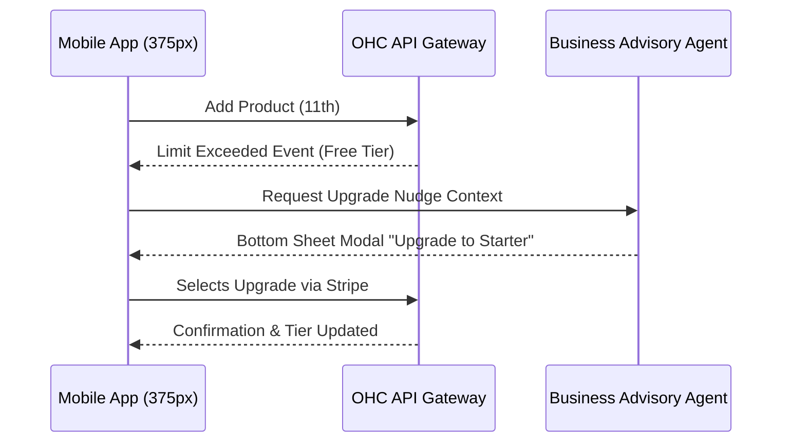

# Architecture Research: Multi-Tenant SaaS Tier Limits & Upgrades

## Title
Multi-Tenant SaaS Tier Architecture & UX Constraints

## Problem Statement
Small business owners coming to OneHumanCorp (OHC) need clear, friction-free paths from launching their first product on a Free tier to scaling up as their business grows. The challenge lies in balancing robust multi-tenant enforcement (data limits, AI action caps, domain mappings) without introducing technical barriers or confusing error states when limits are hit. The architecture must elegantly decouple the enforcement logic from the user-facing nudges and upgrade flows so that the progression feels natural, supportive, and completely non-technical.

## Research Report
### Market Landscape
- **Shopify**: Trial-based model heavily pushing to paid tiers. The jump from zero to paid is abrupt for micro-businesses.
- **Wix**: Offers a free tier with Wix branding and subdomains. Upgrade nudges are aggressive and sometimes confusing, leading to accidental feature lock-ins.
- **Squarespace**: No functional free tier (14-day trial only), immediately excluding hobbyists or low-budget starters.

### Current OHC Capabilities & Gaps
- OHC handles multi-tenancy efficiently for shared APIs, but usage limits must translate into actionable, plain-language business insights (e.g., "You're getting so many orders that your Free tier AI actions are almost used up!").
- Current gaps: Lack of a unified UX to bridge billing tiers, limit tracking, and AI-driven upgrade nudges without requiring the user to navigate complex "Billing" pages manually.

### Proposed Tiers Recap
| Tier | Price | Products | AI Departments | AI Actions/mo | Storage | Custom Domain |
|---|---|---|---|---|---|---|
| Free | $0 | 10 | 1 | 100 | 500MB | No (OHC subdomain) |
| Starter | $9/mo | 100 | 3 | 1,000 | 5GB | Yes |
| Pro | $29/mo | Unlimited | 10 | Unlimited | 50GB | Yes + SSL |
| Business | $79/mo | Unlimited | Unlimited | Unlimited | 500GB | Yes + multi-domain |

## Design Doc

### Core Architecture Concepts
1. **Tier Profile Visibility**: A single source of truth for the tenant's current tier, active limits, and current usage. This avoids scattering limit nudges across individual feature UIs.
2. **Graceful Degradation vs. Hard Stops**: When a limit is reached (e.g., AI actions), the system should fail gracefully. The orchestrator should return a structured response prompting the Business Advisory agent to send a friendly nudge.
3. **The "Advisor" Agent Upgrade Loop**: Upgrade prompts should come through the Business Advisory department in plain language (e.g., "Your store is booming! To keep the Salesperson agent replying automatically this month, let's upgrade to the Starter plan").

### Mobile-First UX Flows (375px)
1. **Limit Nearing (e.g., 90% AI Usage)**
   - The user opens the app and sees a dismissible notification card from "The Advisor".
   - Text: "Your AI helpers have been busy handling 90 customer messages this month! You have 10 actions left on the Free plan."
   - Button: "View Upgrade Options" (Takes the user to a simple, 3-card swipeable carousel of plans).
2. **Limit Reached (e.g., 10th Product Added)**
   - The user tries to add an 11th product.
   - The "Save" button transitions to a bottom sheet modal.
   - Text: "Your catalog is full! The Free plan holds 10 products. Upgrade to Starter to add up to 100 products."
   - Button: "Upgrade for $9/mo" (Triggers native Stripe Payment Link flow optimized for mobile keyboards/Apple Pay).

### Architecture Diagram (Mermaid.js)

## Implementation Prompt
Implement the limit enforcement and frontend upgrade flow for the Multi-Tenant SaaS Tiers.

- **Backend Context**: The system must verify the tenant's usage against the limits defined for their tier. When a limit is breached, it should return a standardized error containing the plain-language reason and the suggested upgrade tier. Ensure the implementer designs the appropriate API-layer enforcement mechanism.
- **Frontend Context (Flutter)**: Implement a reusable bottom-sheet widget (using the OHC Premium Token library for styling) that intercepts limit exceeded responses. The sheet must present the "Advisor" persona's message and a 1-tap "Upgrade" button that securely redirects to the corresponding Stripe Payment Link. Ensure the UI is strictly mobile-first (375px width bounds, large touch targets).

## Priority
P1

## Estimated Scope
Medium
