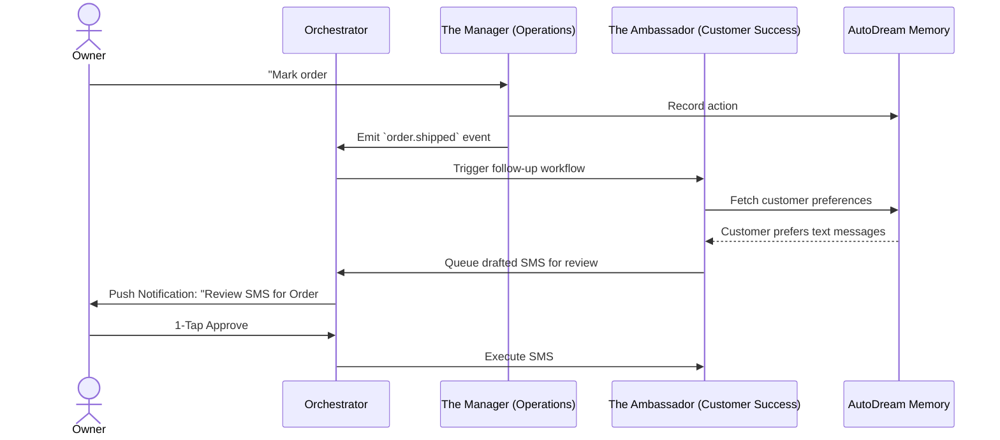

# OHC AI Agent Department Architecture

## Title
AI Agent Department Architecture: Orchestrating the Invisible Workforce

## Problem Statement
Small business owners—like Maya the baker, Carlos the handyman, and Priya the boutique owner—don't have the time, budget, or technical expertise to hire staff for every business function. Managing inventory, following up on leads, answering customer messages, and analyzing financials are fragmented tasks that pull them away from their core work. They need an invisible, proactive workforce that operates autonomously but seeks approval for high-risk actions, functioning as distinct "departments" that seamlessly integrate into their daily mobile workflows without overwhelming them with technical complexity.

## Research Report
### Current State & Market Gap
Traditional SaaS tools offer automation (e.g., Zapier) but require complex rule-building. Platforms like Shopify or Wix provide integrations but lack proactive agents that anticipate needs. OHC's unique advantage lies in providing pre-configured "employees" (agents) rather than tools.

### Key Findings
1.  **Cognitive Overload**: Users abandon platforms that require them to act as system integrators. They need agents that come with built-in domain expertise.
2.  **Trust vs. Autonomy**: Complete autonomy scares users. They want agents to handle the "heavy lifting" (drafting, analyzing, organizing) but require a "1-tap" approval mechanism for anything external (sending emails, publishing posts, issuing refunds).
3.  **Contextual Memory**: A customer support agent must know the history of a customer's orders and preferences (e.g., "always orders vegan") without the user having to bridge that data manually.
4.  **Mobile Primacy**: Business owners manage operations on the go. Agent notifications and approvals must be highly optimized for a 375px mobile screen.

## Design Doc

### Department Overview
The OHC invisible workforce is divided into seven core departments:
1.  **Operations ("The Manager")**: Handles fulfillment, inventory, and order processing.
2.  **Marketing & Advertising ("The Promoter")**: Creates website content, social posts, and ad campaigns.
3.  **Sales & Acquisition ("The Salesperson")**: Generates quotes and follows up with leads.
4.  **Customer Success ("The Ambassador")**: Replies to messages and requests reviews.
5.  **Finance & Payments ("The Accountant")**: Tracks deposits, recurring billing, and financial health.
6.  **Legal & Compliance ("The Protector")**: Manages terms, policies, and simple contracts.
7.  **Business Advisory ("The Advisor")**: Provides weekly insights and growth recommendations.

### Key Design Decisions
1.  **Unified Memory Access**: All agents share a centralized memory store (AutoDream), ensuring that context learned by Sales is instantly available to Operations and Customer Success.
2.  **Draft-for-Review Workflow**: All high-risk actions are queued as drafts. The business owner receives a mobile push notification and can approve, reject, or edit with a single tap. Low-risk internal actions auto-execute.
3.  **Event-Driven Coordination**: Departments communicate via a shared event mesh (Teammate Mesh). For example, Operations processing an order triggers Customer Success to draft a thank-you note.

### Architecture Diagram (Mermaid.js)

### Mobile UX Flow
-   **The Daily Briefing**: Upon opening the app (375px view), the owner sees a summarized card from "The Advisor" highlighting critical drafts needing approval (e.g., "3 quotes to review", "1 customer question").
-   **Approval Screen**: Swiping a draft reveals the proposed action (e.g., the exact text of a drafted email). A prominent "Approve" button completes the task.
-   **Department Health**: Each department has a simple status indicator (e.g., "The Promoter: Running a Mother's Day campaign").

## Implementation Prompt
**To Implementer Agent:**
Implement the core orchestration logic for the AI Agent Departments. Focus on establishing the `Draft-for-Review` workflow. Create the underlying mechanisms where an agent (e.g., Customer Success) can generate an action payload, but instead of executing it directly, it queues it in a "Pending Approval" state. Implement the corresponding mobile-optimized (375px) UI components that display these pending drafts to the user, allowing for a 1-tap approval or rejection. Ensure that the eventing system properly routes the approved action back to the originating agent for execution. Do not focus on specific DB schemas or API endpoints; focus on the robust state machine and the premium, intuitive user experience.

## Priority
P0

## Estimated Scope
Large
