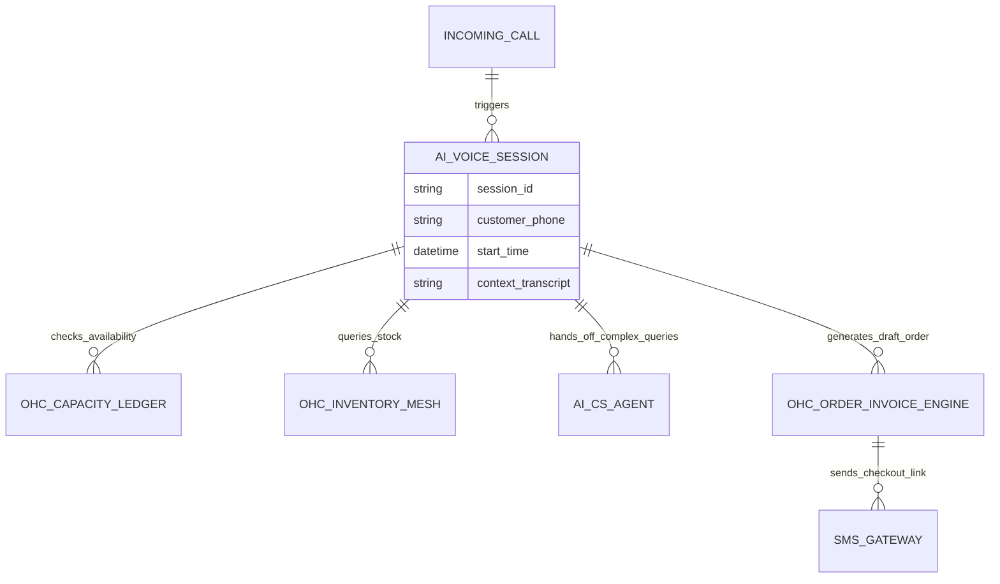

# [Architecture] AI Voice Receptionist and Phone Ordering Engine

**Title**: Implement AI Voice Receptionist & Phone Ordering Engine

## Problem Statement
Small business owners like Carlos (a handyman) and Fatima (a food cart operator) are frequently occupied with their primary tasks—whether that means being up on a ladder with a drill or frantically cooking during a lunch rush. They cannot answer the phone when customers call to ask for quotes, place food pre-orders, or book appointments. When they miss these calls, they lose revenue. Existing solutions involve hiring expensive receptionists or losing the customer to a competitor. They need an automated, invisible receptionist that sounds natural, understands context, answers FAQs, takes orders, schedules appointments, and texts customers a secure payment link—all without the business owner lifting a finger.

## Research Report
- **Market Gap**: Currently, small business platforms like Shopify, Wix, Squarespace, and GoDaddy offer excellent web and text-based chatbots, but completely ignore the traditional phone channel. Many high-value service inquiries and food orders still happen via voice call.
- **Competitor Analysis**:
  - **Shopify/Wix/Squarespace**: Require third-party app integrations (like Twilio + complex Zapier flows) for phone support, which is too technical for our core personas.
  - **Standalone AI Voice Products (e.g., Bland AI, Vapi)**: These exist but are disconnected from the business's core catalog, inventory, and ledger. A small business owner has to manually sync menus or availability.
- **Opportunity**: By natively integrating an AI Voice Receptionist into the OneHumanCorp platform, the agent can directly access the business's real-time inventory (Fatima's sold-out items), booking calendar (Carlos's available slots), and unified quoting engine.

## Design Doc

### Architecture Diagram

### UI Wireframes & Screen Flow (375px first)
1. **Settings / Voice Receptionist Card (Dashboard)**:
   - A clean, translucent glass card titled "AI Receptionist".
   - A simple toggle switch: "Answer my calls when I'm busy".
   - Three quick-select behaviors: "Take Orders", "Book Appointments", "Answer FAQs".
2. **Active Call Notification (Mobile Push)**:
   - "AI is talking to 📞 +1 (555) 0192. They are ordering 2 Vegan Cakes."
3. **Call Summary (Unified Inbox)**:
   - Displays a short summary of the call, the outcome (e.g., "Appointment booked for Tuesday 2 PM"), and an option to view the full transcript or listen to the recording.

### Mobile UX Flow
- The user navigates to the "Communications" tab.
- Taps "Voice Receptionist".
- Selects the desired persona/voice (e.g., friendly, professional).
- Turns the feature "On". The AI automatically provisions a local phone number or configures call forwarding from the owner's existing mobile number.
- When a customer calls, the AI answers, handles the request (syncing with OHC backend seamlessly), and upon completion, sends an SMS summary to the owner and a checkout link to the customer.

### AI Agent Integration Points
- **Operations Department**: Updates inventory or available time slots based on the phone conversation.
- **CS (Customer Service) Department**: Ingests the call transcript into the unified memory layer so future SMS or web chats have full context.
- **Finance Department**: Automatically drafts the invoice and manages the SMS checkout link state.

### Key Design Decisions
- **Zero-Config Setup**: The system must configure call forwarding and AI training implicitly by reading the existing business profile, catalog, and FAQ docs. No prompt engineering required by the user.
- **Immediate SMS Handoff**: Voice interactions are great for gathering intent, but payment and complex visual choices (like selecting a cake design) are pushed to an SMS link seamlessly.
- **Graceful Fallback**: If the AI cannot handle the request, it gracefully takes a message, marks it high priority in the Unified AI Inbox, and alerts the owner.

## Implementation Prompt
**Task for Implementer**: Build the AI Voice Receptionist Engine.
- **User-Facing Outcome**: A small business owner can toggle on an "AI Receptionist" from their mobile dashboard. When customers call, the AI successfully negotiates bookings or orders and texts a checkout link.
- **Core User Journey (CUJ)**:
  1. Business owner toggles AI Voice on.
  2. Customer calls the business number.
  3. AI answers, queries real-time availability/inventory, and finalizes a request.
  4. Customer receives an SMS with an OHC checkout link.
  5. Owner sees a summary card in their dashboard and the funds hit their ledger upon customer payment.
- **Acceptance Criteria**:
  - Full mobile parity (settings toggles and dashboard cards must fit and function perfectly on a 375px screen).
  - Must seamlessly integrate with the existing unified capacity and inventory ledgers.
  - Zero required configuration of LLM prompts by the business owner.
  - Graceful fallback to voicemail and inbox routing for unhandled queries.
  - Do not prescribe specific database schemas or internal API formats; ensure strict multi-tenant isolation for all voice sessions and call logs.

## Priority
`P0` (Critical) - Unlocks a massive TAM for hands-free operational businesses (contractors, food carts).

## Estimated Scope
Large
