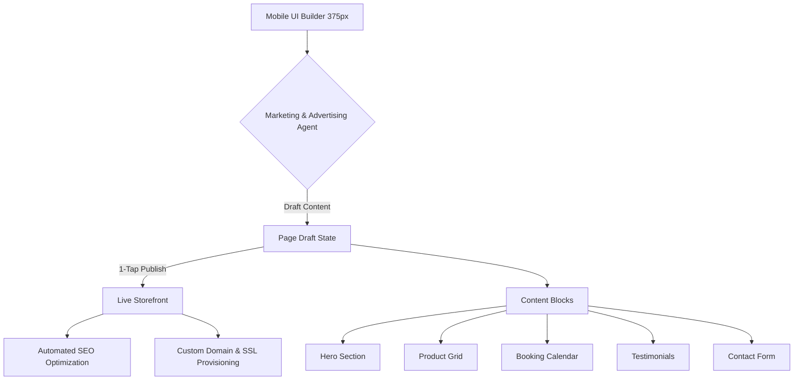

# Issue Brief: Website & Storefront Builder Architecture

## Title
Website & Storefront Builder Architecture: Mobile-First, Zero-Code Content Blocks

## Problem Statement
Building a website is overwhelming for a non-technical small business owner. Existing platforms like Shopify and WordPress force users into complex, desktop-centric editors with endless customization options that often result in broken, amateurish mobile sites. Maya (the baker) and Carlos (the handyman) need to publish beautiful, high-converting storefronts from their smartphones in under 10 minutes without touching code, configuring DNS, or wrestling with SEO plugins.

## Research Report
- **Competitive Analysis**:
  - **Shopify**: Desktop-heavy theme editor. Requires understanding of "sections" and "blocks." Mobile app editing is limited.
  - **Wix/Squarespace**: High learning curve. Too many formatting choices often lead to poor design outcomes for non-designers.
  - **OHC Advantage**: OHC restricts the "how" (styling) to ensure aesthetic excellence while allowing users to fully customize the "what" (content). We prioritize a 375px mobile-first builder and leverage AI to auto-fill content, handle SEO, and automatically structure pages.
- **Key Findings**:
  - Users drop off when asked to write copy or structure a layout.
  - 80% of small business sites consist of just 5-6 core block types (Hero, Products, Services, Testimonials, Contact, About).
  - Domain mapping and SSL provisioning are massive friction points for non-technical users.

## Design Doc

### Architecture Diagram

### Mobile UX Flow (375px First)
1. **The "Instant" Start**: The user opens the "Website" tab. Instead of a blank canvas, they see a 100% complete, AI-generated storefront based on their business profile (e.g., a bakery theme for Maya).
2. **Block-Based Editing**: The UI is a vertical stack of "Blocks". Tapping a block opens a full-screen mobile editor for that specific block.
   - *Example*: Tapping the "Hero" block allows the user to swap the photo, edit the headline, or tap "AI Rewrite".
3. **Adding Content**: Tapping a floating "+" button brings up a curated list of block types (Product Grid, Testimonials, Service List).
4. **Publishing**: Changes are auto-saved as "Draft". A persistent "Publish Changes" button at the bottom pushes the draft to the live site.

### Content Blocks & Customization
To prevent broken designs, OHC enforces rigid but beautiful templates (Glassmorphism, Outfit/Inter typography). Users cannot drag elements arbitrarily; they stack predefined blocks.
- **Hero**: Main image/video, headline, subheadline, Primary CTA (e.g., "Order Now").
- **Product Grid**: Auto-syncs with the Operations inventory. Displays physical/digital items with "Sold Out" toggles.
- **Booking Calendar**: Auto-syncs with the Operations schedule. Allows picking time slots.
- **Testimonials**: Text blocks or AI-curated reviews from past customers.
- **Contact Form**: Simple message intake routing directly to the Customer Success Agent inbox.
- **Text/About**: Rich text with optional image alignment.

### AI Agent Integration Points
- **The Promoter (Marketing & Advertising)**:
  - Generates the initial website layout and copy.
  - Auto-optimizes the site for SEO: writes meta titles, descriptions, and generates structured data (schema.org) based on the business type, without asking the user.
- **The Advisor (Business Advisory)**:
  - Suggests adding blocks. "You have 5 five-star reviews! Should I add a Testimonials block to your homepage?"

### Domain & Publishing Infrastructure
- **Draft -> Live**: The builder operates strictly on a draft state. Publishing atomically swaps the draft to the live state, ensuring visitors never see a half-edited site.
- **Custom Domains & SSL**: Free tiers get an `ohc.site` subdomain. Upgrading to Starter allows custom domains. The provisioning is abstract: the user types their domain, and OHC handles DNS verification (if purchased through OHC) or provides simple copy-paste records. SSL is provisioned automatically upon domain attachment without user intervention.

### Key Design Decisions
1. **No Drag-and-Drop Canvas**: True drag-and-drop is impossible to use well on a phone and ruins mobile responsiveness. We use a vertical stacking "Block" system instead.
2. **AI-First Copywriting**: Blank text fields paralyze users. Every block comes pre-filled with AI-generated copy that the user can tweak.
3. **Invisible SEO**: No SEO tabs or meta-tag inputs. The AI handles it perfectly based on the content.

## Implementation Prompt
**To Implementer Agent:**
Implement the "Website & Storefront Builder" UI and underlying state management. The builder must be mobile-first (375px) and use a vertical block-stacking paradigm rather than free-form drag-and-drop. Implement the following core blocks: Hero, Product Grid, Booking Calendar, and Contact Form. Ensure the builder supports a draft state with a clear "Publish" mechanism. Integrate the "Marketing Agent" to provide an "AI Rewrite" button for text fields. All UI components must use the OHC premium design system (Glassmorphism, Outfit/Inter). Do not prescribe the specific JSON schema for saving blocks or the CDN mechanism for publishing; focus on the unified API contract and the user journey transitions. Include E2E test coverage verifying a successful run-through from opening the builder to publishing a live site.

## Priority
P0

## Estimated Scope
Large
