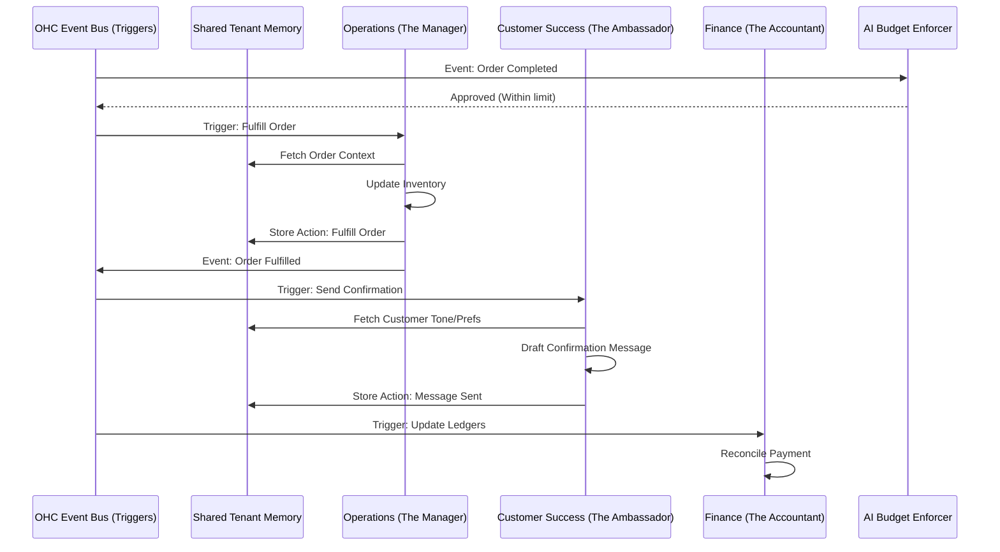

# [architecture] AI Agent Department Architecture

## Title
AI Agent Department Architecture for OneHumanCorp

## Problem Statement
Small business owners (like Maya the baker, or Carlos the handyman) are overwhelmed by the complexity of running a business. They don't have time to manage marketing, answer every customer DM instantly, balance books, and process orders. They need an invisible "staff" that works 24/7 to handle this complexity, organized in terms they understand—like a Manager, an Accountant, or a Promoter—without needing to configure complex AI pipelines or prompts.

## Research Report
Current platforms (Shopify, Wix, Squarespace) offer isolated AI tools—like a text generator for product descriptions or a basic chatbot. They require the user to actively "prompt" the AI and piece together workflows. This is fundamentally broken for non-technical users.

Our target personas need AI that operates autonomously, triggered by real business events (e.g., a new Instagram DM, a completed booking, or a weekly cycle). The AI must have shared memory across "departments" so "The Salesperson" knows what "The Manager" just did.

By structuring AI into clear, recognizable roles, we lower the cognitive load. Business owners understand what an "Accountant" does. They don't want to think about "LLM Orchestration."

## Design Doc

### Architecture Diagram

### UI Wireframes & Mobile UX Flow (375px First)

**Screen 1: The "Staff" Dashboard (Home)**
- **Header:** Glassmorphism overlay (`backdrop-filter: blur(20px) saturate(200%)`) with business name and daily summary. Outfit/Inter typography.
- **Content:** A vertical list of "Departments" (The Manager, The Promoter, The Accountant). Touch targets are large (>= 44x44px).
- **Status Indicators:** Next to each department is a pulsing dot indicating activity (e.g., "The Promoter: Drafting Instagram post").
- **Interaction:** Tapping a department opens its activity feed (entrance <= 300 ms, easing `cubic-bezier(0.4, 0, 0.2, 1)`).

**Screen 2: Department View (e.g., "The Salesperson")**
- **Header:** "The Salesperson"
- **Activity Feed:** A clear, conversational timeline of what the AI has done.
  - "Responded to Maya's DM about vegan cakes."
  - "Drafted a quote for Carlos's roof repair (Pending Approval)."
- **Approvals (Draft-for-Review):** Swipe right to approve a draft, swipe left to discard or edit.

**Screen 3: AI Settings & Throttling**
- **Sliders:** Simple "Autonomy Level" sliders (Full Autopilot vs. Draft for Review). Plain language labels, zero technical jargon.
- **Budget Bar:** A clear visual of AI actions used this month (e.g., 850/1000). Prompts to upgrade nicely before hitting limits, preventing hard errors.

### AI Agent Integration Points
- **Triggers:** Agents are woken up by the OHC Event Bus (webhook from Instagram, payment success from Stripe, cron job for weekly reports).
- **Coordination:** Agents do not call each other directly; they emit events back to the Event Bus which then routes to the relevant department.
- **Memory/Context:** A unified Vector/Context DB per tenant. When "The Ambassador" replies to a message, it pulls the customer's order history placed by "The Manager".
- **Approvals:** High-risk actions (e.g., refunds, binding quotes) default to "Draft-for-Review" status in the UI, requiring a tap to approve.
- **Budgeting:** Intercepts agent wake-ups to verify the tenant has sufficient AI action limits for their tier. Emits a notification if approaching limits.

### Key Design Decisions and Why
- **Metaphorical Names:** Using names like "The Accountant" instead of "Financial LLM Agent" ensures the Grandmother Test is passed.
- **Event-Driven Coordination:** Prevents complex, tightly coupled AI loops. Agents just react to events and emit events.
- **Shared Memory:** Prevents the customer from experiencing disjointed AI behavior where the Sales bot doesn't know the Operations bot already canceled the order.
- **Draft-for-Review Default for High Risk:** Protects the business owner from rogue AI mistakes, building trust gradually.

## Implementation Prompt
Implement the foundational AI Agent Department system for OHC.

**User-Facing Outcome:** The user should see a "Staff" tab in the app. They can view the activity feed for "Operations", "Customer Success", and "Marketing". They can set high-risk actions to "Review First" and approve them with a single tap.

**Critical User Journey (CUJ):**
1. Maya receives a DM asking about cake sizes.
2. "Customer Success" wakes up, sees the intent is sales, and drafts a reply with a quote.
3. The reply is set to "Draft-for-Review".
4. Maya opens the OHC app, sees the notification, taps "Approve", and the message is sent.

**Acceptance Criteria:**
- Create the core department definitions and event subscriptions.
- Implement the "Autopilot vs. Review" toggle logic.
- Ensure the AI budget throttle correctly pauses activity and alerts the user gracefully when limits are reached.
- Ensure all UI flows follow the Visual Excellence Mandate (Glassmorphism, 300ms entrance motion, 44x44px targets).

## Priority
P0

## Estimated Scope
Large