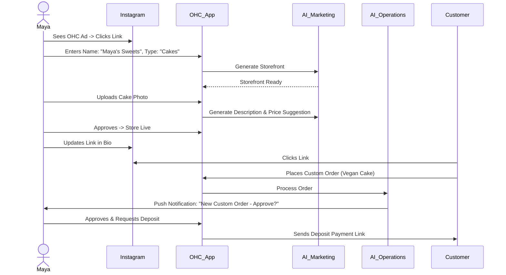
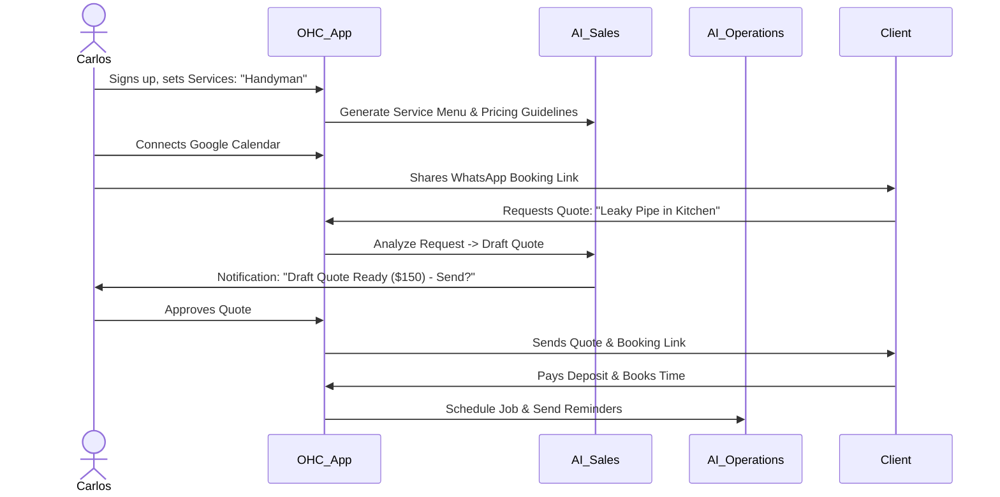
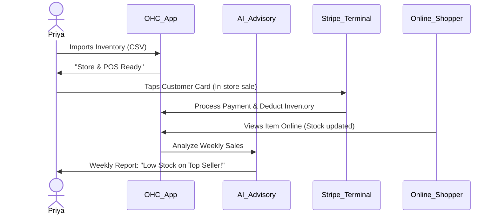
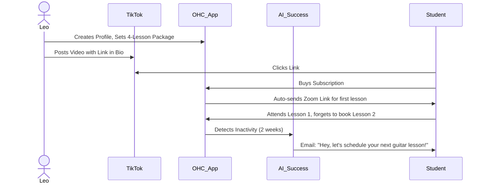
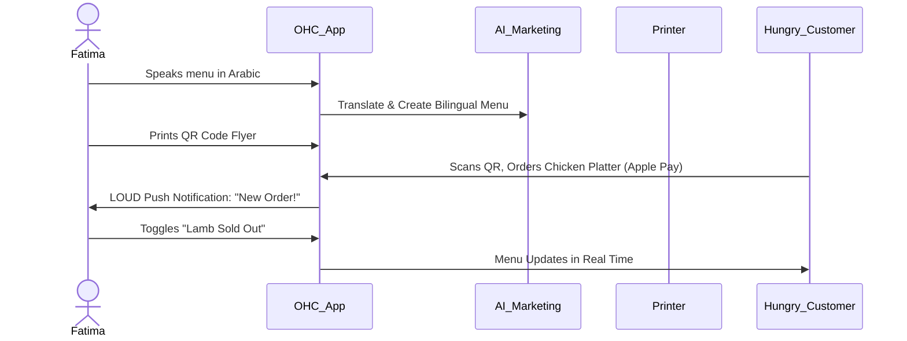

# [Business Journey Architecture] OneHumanCorp (OHC)

## 1. Title
Business Journey Architecture: End-to-End User Journeys for Small Business Owners

## 2. Problem Statement
Non-technical small business owners face significant friction when trying to move their offline business online or start a new digital business. Existing solutions (Shopify, Wix) demand technical knowledge, high setup time, and ongoing active management. OHC aims to solve this by providing a platform where anyone can launch a live business in under 10 minutes with AI agents handling the complexity. We need a clearly defined, friction-free journey from acquisition to referral to ensure users don't abandon the process.

## 3. Research Report
### Competitive Analysis
- **Shopify**: 30-60 min setup. Assumes high technical capability and knowledge of e-commerce concepts (SKUs, shipping zones).
- **Wix/Squarespace**: 20-60 min setup. Focuses heavily on visual website building rather than full business operations. Often leads to choice paralysis.
- **GoDaddy**: Basic setup, but up-sells aggressively and lacks integrated AI operations.
### OHC Differentiation
- Target setup time: < 10 minutes.
- Cognitive load: Zero jargon, plain language, mobile-first interaction.
- AI integration: Invisible, embedded operations across departments.
### Key Insights
- **Immediate Value (Aha! Moment)**: Users must see their business "live" quickly (Activation) before they hit the cognitive wall of complex setups.
- **Progressive Disclosure**: Ask for the bare minimum to go live (name, core product/service, payment method). Defer customization, domain names, and advanced settings.
- **Mobile Dependency**: 80% of our target market will manage their business entirely from a smartphone.

## 4. Design Doc

### Key Design Decisions
- **Mobile-First Progressive Onboarding**: Forms use native mobile keyboards, single-question-per-screen approach, and auto-generated defaults provided by AI.
- **Deferred Complexity**: Actions like custom domain setup, advanced tax rules, and multi-variant inventory are hidden until needed or managed entirely by AI.
- **Push-Driven Retention**: AI agents proactively notify owners of actions needed (e.g., "You have a new custom order to approve") rather than requiring owners to constantly check dashboards.

### Friction Points & Mitigations
- **Friction**: Connecting a bank account (Stripe setup).
  - **Mitigation**: Allow deferring payout setup until the *first sale is made*. Focus on accepting payments instantly.
- **Friction**: Writing product descriptions and taking professional photos.
  - **Mitigation**: Users snap a quick photo from their phone; the Marketing agent auto-enhances the image and writes the description.
- **Friction**: Choice paralysis in website design.
  - **Mitigation**: Provide 3 distinct, AI-generated options based on the business type. No blank canvases.
- **Friction**: Understanding pricing and upgrades.
  - **Mitigation**: Keep the Free tier fully functional. Trigger upgrade prompts contextually (e.g., "You've hit your 10 product limit. Upgrade to Starter for unlimited products.").

### Persona Journeys & Mermaid Diagrams

#### Persona 1: Maya (Home Baker)
**Profile:** Sells custom cakes via Instagram DMs. Needs storefront, custom order deposit, AI DM responder.
- **Acquisition:** Sees an Instagram ad showing a baker going from a kitchen photo to a live store in 5 minutes. Clicks the "Start Free" CTA.
- **Onboarding:** Answers 3 questions: "What do you sell?" (Custom Cakes), "Business Name?" (Maya's Sweets), "Connect Instagram?". The Marketing AI generates a storefront instantly.
- **Activation:** Uploads a photo of her latest cake. Marketing AI writes the description. She shares her OHC link in her Instagram bio. First order received.
- **Retention:** Receives a push notification: "New Custom Order Request: Vegan Chocolate. Approve and request $50 deposit?".
- **Revenue:** Upgrades to Starter tier ($9/mo) after 1 month to connect a custom domain (`mayassweets.com`).
- **Referral:** Adds a "Powered by OHC" badge to her storefront footer, driving organic traffic from her customers.

#### Persona 2: Carlos (Handyman)
**Profile:** Service listings, booking calendar, AI quote generator. Android only.
- **Acquisition:** Word-of-mouth referral from another tradesperson. Searches Google for "One Human Corp".
- **Onboarding:** Selects "Services". Inputs "General Repairs" and "Plumbing". AI sets up a simple service menu with estimated hourly rates.
- **Activation:** Sets his availability calendar. A customer books a "Fix leaky faucet" slot and pays a $20 booking deposit.
- **Retention:** AI sends Carlos a daily morning brief on his phone: "You have 2 jobs today. First job at 10 AM (123 Main St)."
- **Revenue:** Subscribes to Starter tier when he hits the 100 AI actions/mo limit due to high volume of auto-quotes generated by the Sales AI.
- **Referral:** Uses the "Share my booking link" feature via WhatsApp to past clients.

#### Persona 3: Priya (Boutique Owner)
**Profile:** Physical storefront + online, inventory sync, POS tap-to-pay.
- **Acquisition:** Searches "Easy POS and online store sync". Clicks organic search result.
- **Onboarding:** Imports basic inventory spreadsheet. AI Operations maps columns to product variants (Size, Color).
- **Activation:** Connects Stripe Terminal for in-store Tap-to-Pay. First in-store sale syncs inventory immediately, preventing an online oversell.
- **Retention:** Weekly Business Advisory report: "Red summer dresses are trending online. You have 5 left. Restock soon."
- **Revenue:** Upgrades to Pro tier ($29/mo) immediately for unlimited products and custom domain.
- **Referral:** Recommends OHC to a neighboring shop owner during a local business association meeting.

#### Persona 4: Leo (Music Tutor)
**Profile:** Online/in-person lessons, auto-Zoom links, subscriptions.
- **Acquisition:** TikTok video showing how another creator monetized their skills with OHC.
- **Onboarding:** Selects "Subscriptions/Lessons". Connects Zoom and Google Calendar. AI builds a vibrant Link-in-Bio profile.
- **Activation:** Shares link on TikTok. A student buys a "4-Lesson Monthly Package". Zoom links are auto-generated and emailed.
- **Retention:** AI Customer Success agent automatically emails students who haven't booked a lesson in 3 weeks: "Ready for your next session?"
- **Revenue:** Reaches Pro tier to manage an expanding student base and unlock unlimited AI follow-ups.
- **Referral:** His students see the smooth booking experience and ask what platform he uses.

#### Persona 5: Fatima (Food Cart)
**Profile:** Halal food pre-orders, sold-out toggles, multi-language (Arabic/English).
- **Acquisition:** Local community flyer distributed by an OHC brand ambassador.
- **Onboarding:** Uses voice-to-text in Arabic: "I sell chicken over rice and lamb gyros". AI translates to English, sets up bilingual menu, adds stock photos.
- **Activation:** Prints QR code. Customer scans QR code in line, orders "Chicken over rice", pays via Apple Pay. Fatima's phone pings loudly.
- **Retention:** Daily printable order list generated automatically. Simple toggle to mark "Lamb sold out" from her phone.
- **Revenue:** Remains on Free tier initially, pays transaction fees. Moves to Starter when daily volume hits 50+ orders to reduce transaction overhead (future tier perk).
- **Referral:** Other food cart vendors notice the shortened physical line and ask her how she manages pre-orders.

## 5. Implementation Prompt
**For the Implementer Agent:**
Implement the foundational business journey flows based on the "Business Journey Architecture" design document. Focus on the mobile-first onboarding wizard, deferring complex configurations.
- Ensure the user can create a business by answering a maximum of 3 questions.
- Integrate AI (mocked for E2E tests) to automatically generate the initial storefront/service menu based on the user's business type.
- Implement the 'Aha!' moment activation step: allow creating a product/service and simulating a checkout flow.
- Ensure all forms use native mobile inputs and that UI components follow the Glassmorphism design tokens.
- Add comprehensive Playwright E2E tests covering the full journey for at least two personas (e.g., Maya and Carlos), verifying that the user goes from the homepage to a live storefront in under a simulated 10 minutes.

## 6. Priority
P0 (Critical) - This is the core engine of user acquisition and retention.

## 7. Estimated Scope
Large
