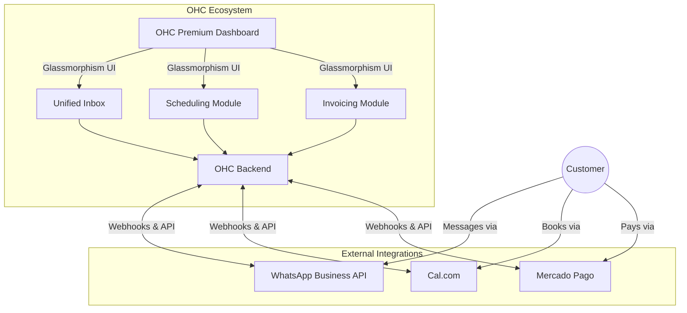

# OHC Tool Integration Research Report (Q4)

## Executive Summary
This report evaluates third-party tools to expand OHC's capabilities for small business owners in both Cloud and Standalone environments. The research focuses on tools that provide immediate value to non-technical users, specifically in the areas of social media messaging, scheduling, and regional payment processing.

## Visual Excellence Mandate
Below is the high-level architecture diagram demonstrating how these tools integrate into the OHC Hybrid OS.

## Evaluated Tools

### 1. WhatsApp Business API (Social Media Integration)
- **Persona Benefit**: Allows small business owners (especially in emerging markets) to consolidate customer communications into a single inbox, preventing missed messages.
- **User Experience**: Seamless. Users connect their account once, and WhatsApp messages appear directly in the OHC Unified Inbox alongside emails.
- **Pricing Estimate**: Inbound service conversations are free. Business-initiated templates incur a small per-message fee. Free API access.
- **Cloud vs Standalone**: Best suited for Cloud (multi-tenant) due to Meta's complex app review process. Standalone users would need to create their own Meta Developer Apps.
- **Action**: Created issue brief `docs/research/social_media_whatsapp_brief.md`.

### 2. Cal.com (Calendar & Scheduling)
- **Persona Benefit**: Eliminates the back-and-forth emails required to book consultations or services.
- **User Experience**: Clean, modern interface where customers can view available time slots and book instantly.
- **Pricing Estimate**: Free for individuals. $12/user/month for teams.
- **Cloud vs Standalone**: Excellent for both. Because Cal.com is open-source, it strongly aligns with OHC's Standalone, privacy-first philosophy and can be self-hosted.
- **Action**: Created issue brief `docs/research/calendar_calcom_brief.md`.

### 3. Mercado Pago (Payment Processing)
- **Persona Benefit**: Solves the payment barrier for LATAM business owners who cannot use Stripe, enabling them to accept local payment methods (PIX, OXXO, local cards).
- **User Experience**: Highly familiar checkout experience for Latin American consumers. Merchants simply generate an invoice link from OHC.
- **Pricing Estimate**: No monthly fee. Approx 3.49% to 4.49% + fixed fee per transaction (varies by country, e.g., Mexico).
- **Cloud vs Standalone**: Fully compatible with both environments via API keys.
- **Action**: Created issue brief `docs/research/payment_mercadopago_brief.md`.

### 4. Loops (Email Marketing)
- **Persona Benefit**: Simple, template-driven email campaigns to keep customers engaged.
- **User Experience**: Straightforward drafting and segmenting.
- **Pricing Estimate**: Free for up to 1,000 contacts.
- **Cloud vs Standalone**: Works in both via API.
- **Action**: Created issue brief `docs/research/[Email_Marketing]_loops_brief.md`.

### 5. Shippo (Shipping & Logistics)
- **Persona Benefit**: Saves time by calculating rates and printing labels directly from OHC.
- **User Experience**: Seamless label generation from the order view.
- **Pricing Estimate**: 5 cents per label or $19/mo.
- **Cloud vs Standalone**: Works in both via API.
- **Action**: Created issue brief `docs/research/[Shipping]_shippo_brief.md`.

### 6. Twilio (SMS & Notifications)
- **Persona Benefit**: Reliable SMS notifications for appointments and orders.
- **User Experience**: Automated reminders set up via toggles.
- **Pricing Estimate**: ~$0.0079/msg + number rental.
- **Cloud vs Standalone**: Works in both via API.
- **Action**: Created issue brief `docs/research/[SMS]_twilio_brief.md`.

### 7. Google Meet (Video Conferencing)
- **Persona Benefit**: Auto-generated video links for online consultations.
- **User Experience**: One-click "Add Meet link" during appointment creation.
- **Pricing Estimate**: Free with Google accounts.
- **Cloud vs Standalone**: Easier in Cloud (managed OAuth); harder in Standalone (requires user GCP project).
- **Action**: Created issue brief `docs/research/[Video_Conferencing]_google_meet_brief.md`.

## Next Steps
1. Prioritize the WhatsApp Business API integration (P0) to drive immediate engagement in the Unified Inbox.
2. Schedule Cal.com and Mercado Pago for subsequent sprints (P1).

## Detailed Issue Briefs

### 1. WhatsApp

**Title**: WhatsApp Business API Integration for Unified Inbox

**Problem Statement**:
Small business owners (especially in LATAM, India, and emerging markets like Fatima) use WhatsApp as their primary communication channel for customers. Currently, they have to manually switch between their personal/business WhatsApp app on their phone and the OHC platform, leading to missed messages, slow response times, and disorganized customer records. They need a way to see and respond to WhatsApp messages directly within the OHC unified inbox.

**Research Report**:
- **Tool**: WhatsApp Business API (via Meta Cloud API).
- **Ease of Use**: High for the end user. They link their phone number via OAuth-like flow once, and messages appear in the OHC inbox.
- **Pricing**: Meta shifted to per-message pricing. Inbound service conversations (customer-initiated) are free and unlimited since late 2024. Marketing and utility messages (business-initiated) cost a small fee per message depending on the country. Access to the Cloud API itself is free.
- **Reputation**: It is the global standard for messaging in many countries.
- **Compatibility**: Works well in Cloud mode (Meta Cloud API). In Standalone mode, users would need to configure their own Meta Developer App credentials, which requires a technical setup, so it is best suited for the multi-tenant Cloud version where OHC manages the API keys.

**Design Doc**:
- **Trigger**: Customer sends a WhatsApp message to the business's linked phone number.
- **Action**: Meta webhook sends the message payload to OHC. OHC creates or updates a conversation thread in the Unified Inbox.
- **User Interface**: Business owner sees a "WhatsApp" icon next to the message in their OHC inbox. They can type a reply, and OHC sends it back via the WhatsApp API.
- **Integration Flow**: A new "Connect WhatsApp" button in the Settings -> Integrations page triggers the Facebook Embedded Signup flow to link their number.

**Implementation Prompt**:
Implement the WhatsApp Business integration allowing users to connect their WhatsApp Business account via the Meta embedded signup flow. Incoming WhatsApp messages should appear in the existing OHC Unified Inbox, clearly marked as WhatsApp messages. Users should be able to reply directly from the inbox, and the replies should be sent back to the customer's WhatsApp. Handle webhook ingestion and basic message parsing (text, images).

**Priority**: P0
**Estimated Scope**: Large

### 2. Cal.com

**Title**: Cal.com Integration for Automated Meeting Scheduling

**Problem Statement**:
Small business owners spend too much time going back and forth with clients to find a time to meet (e.g., for consultations, estimates, or online lessons). They need a way to share a link where customers can pick an available time, and have it automatically sync to their calendar without manual intervention.

**Research Report**:
- **Tool**: Cal.com (Calendar & Scheduling).
- **Ease of Use**: Very high. Cal.com has a clean, simple UI. Non-technical users can easily set up meeting types and share their link.
- **Pricing**: Free tier available for individuals (unlimited event types and calendars). Teams tier is $12/month/user for collaborative scheduling.
- **Reputation**: Open-source, highly respected alternative to Calendly, with strong developer support.
- **Compatibility**: Excellent for both Cloud and Standalone modes. Cal.com can be self-hosted, making it a perfect fit for OHC's Standalone (local, private) mode.

**Design Doc**:
- **Trigger**: User configures Cal.com integration in OHC.
- **Action**: OHC syncs customer booking events via Cal.com webhooks.
- **User Interface**: A "Scheduling" tab where the business owner can view upcoming appointments. A "Share Booking Link" button that copies their Cal.com URL to the clipboard. Incoming bookings automatically create or update customer profiles in OHC.
- **Integration Flow**: OAuth connection to Cal.com or webhook URL generation to paste into Cal.com settings.

**Implementation Prompt**:
Integrate Cal.com into the OHC platform. Allow users to connect their Cal.com account. Display upcoming meetings in a new "Schedule" view within OHC. When a customer books a meeting on Cal.com, automatically ingest the webhook to create a new customer record or append the meeting to an existing customer's timeline in the CRM.

**Priority**: P1
**Estimated Scope**: Medium

### 3. Mercado Pago

**Title**: Mercado Pago Integration for LATAM Payment Processing

**Problem Statement**:
Small business owners in Latin America (especially Mexico, Brazil, Argentina) cannot effectively use Stripe, which has limited presence or higher barriers in these regions. They need a local, trusted payment provider to accept credit cards, debit cards, bank transfers, and cash payments (like OXXO in Mexico or PIX in Brazil) to sell their services online.

**Research Report**:
- **Tool**: Mercado Pago (Payment Processing).
- **Ease of Use**: High. It is the dominant payment platform in Latin America, familiar to both merchants and consumers.
- **Pricing**: Pay-as-you-go per transaction. For Mexico, fees typically range from 3.49% to 4.49% + a small fixed fee per transaction for cards. No monthly fees.
- **Reputation**: Highly trusted, backed by Mercado Libre.
- **Compatibility**: Works well via API for both Cloud and Standalone modes.

**Design Doc**:
- **Trigger**: Business owner generates an invoice or payment link in OHC.
- **Action**: OHC calls the Mercado Pago API to create a checkout preference and generates a payment link.
- **User Interface**: When sending an invoice to a customer, the owner can select "Mercado Pago" as the payment method. The customer receives a link to a secure Mercado Pago checkout page. Once paid, the invoice status in OHC automatically updates to "Paid".
- **Integration Flow**: User enters their Mercado Pago Access Token and Public Key in the OHC Settings -> Payments section.

**Implementation Prompt**:
Add Mercado Pago as an alternative payment gateway alongside the existing payment options. Allow business owners to enter their Mercado Pago API credentials. Update the invoicing module to generate Mercado Pago checkout links. Implement a webhook listener to automatically mark invoices as paid when Mercado Pago confirms the transaction.

**Priority**: P1
**Estimated Scope**: Medium

### 4. Loops (Email)
**Title**: Loops Integration for Email Marketing

**Problem Statement**:
Small business owners need an easy way to send newsletters or promotional emails to their customer base directly from their CRM. Existing tools like Mailchimp are often too complex, bloated, or expensive for simple use cases. They need a straightforward way to email their synced customer list.

**Research Report**:
- **Tool**: Loops (Email Marketing).
- **Ease of Use**: Very high. Designed for modern SaaS and simple campaign management. Clean UI and excellent template quality.
- **Pricing**: Free tier up to 1,000 contacts. Then scales predictably.
- **Reputation**: Highly regarded in the startup/modern business ecosystem for its simplicity and excellent API.
- **Compatibility**: Works well in Cloud mode via API. In Standalone mode, users would need their own API keys, which is standard for email sending.

**Design Doc**:
- **Trigger**: User selects a segment of customers in OHC and clicks "Send Email Campaign".
- **Action**: OHC syncs the selected contacts to Loops via API and triggers an email send, or uses the API to send a transactional/broadcast email directly.
- **User Interface**: A simple "Campaigns" tab where users can draft an email and select recipients. The actual sending is offloaded to Loops to handle spam compliance and deliverability.
- **Integration Flow**: User enters their Loops API Key in Settings -> Email Integrations.

**Implementation Prompt**:
Integrate Loops for email marketing. Allow users to configure their Loops API key. Add functionality to sync customer lists to Loops contacts. Enable sending basic email broadcasts to selected customer segments directly from the OHC interface using the Loops API.

**Priority**: P2
**Estimated Scope**: Medium

### 5. Shippo (Shipping)
**Title**: Shippo Integration for Shipping & Logistics

**Problem Statement**:
Small business owners who sell physical goods waste hours manually entering addresses into carrier websites to calculate rates and print labels. They need an integrated way to get shipping rates, generate labels, and track packages directly from their OHC orders dashboard.

**Research Report**:
- **Tool**: Shippo (Shipping API).
- **Ease of Use**: High for end-users. Once configured, they just click "Print Label" on an order.
- **Pricing**: Pay-as-you-go (5 cents per label) or $19/month for the professional tier without per-label fees. Excellent carrier discounts.
- **Reputation**: Very reliable API, strong coverage of global carriers (USPS, UPS, FedEx, DHL, etc.).
- **Compatibility**: Compatible with both Cloud and Standalone modes via API keys.

**Design Doc**:
- **Trigger**: Business owner clicks "Fulfill Order" in the OHC dashboard.
- **Action**: OHC requests shipping rates from Shippo API, displays them, and upon selection, generates a shipping label and tracking number.
- **User Interface**: Within an order view, show a "Create Shipping Label" button. Let the user compare rates from different carriers and download the PDF label.
- **Integration Flow**: OAuth connection to Shippo or API key entry in Settings.

**Implementation Prompt**:
Integrate the Shippo API. Add a shipping module to the order management flow. When an order is ready to fulfill, allow the user to request rates, purchase a label via Shippo, and save the tracking URL to the customer's order record.

**Priority**: P2
**Estimated Scope**: Large

### 6. Twilio (SMS)
**Title**: Twilio Integration for Global SMS Notifications

**Problem Statement**:
Business owners and their customers (especially those with lower English proficiency or in regions with poor internet) rely heavily on SMS. They need automated SMS reminders for appointments, order updates, and marketing to reduce no-shows and increase engagement.

**Research Report**:
- **Tool**: Twilio (SMS & Notifications).
- **Ease of Use**: The integration itself abstracts the complexity. The business owner just sees "Send SMS" toggles.
- **Pricing**: Pay-as-you-go. Roughly $0.0079 per message in the US, varies globally. Additional costs for phone number rental (e.g., $1.15/month).
- **Reputation**: The industry standard for programmable SMS. Highly reliable with global carrier coverage.
- **Compatibility**: Requires API key configuration. Works in both Cloud and Standalone modes.

**Design Doc**:
- **Trigger**: System events (e.g., appointment created, order shipped) or manual broadcast.
- **Action**: OHC sends a request to the Twilio API to dispatch the SMS.
- **User Interface**: A settings page to configure automated SMS templates (e.g., "Remind customer 24h before appointment").
- **Integration Flow**: User enters Twilio Account SID, Auth Token, and sender phone number in Settings.

**Implementation Prompt**:
Integrate Twilio for outbound SMS capabilities. Add settings for business owners to enter their Twilio credentials. Implement automated SMS triggers for key events like appointment reminders and order confirmations. Ensure opt-out compliance handling is documented or handled by the provider.

**Priority**: P1
**Estimated Scope**: Medium

### 7. Google Meet (Video)
**Title**: Google Meet Integration for Video Conferencing

**Problem Statement**:
Service-based businesses (tutors, consultants) need to generate video call links for online appointments. Manually creating meetings and copying links into emails is tedious and prone to errors. They need meeting links to be auto-generated when a client books an online service.

**Research Report**:
- **Tool**: Google Meet (via Google Workspace API).
- **Ease of Use**: Ubiquitous. Most users already have a Google account. Joining requires no software installation for clients.
- **Pricing**: Included with free Google accounts or Google Workspace subscriptions.
- **Reputation**: Highly reliable, universally recognized, and trusted.
- **Compatibility**: Works well via OAuth. In Cloud mode, OHC manages the OAuth app. In Standalone mode, users may need to set up their own Google Cloud project for OAuth, which adds friction.

**Design Doc**:
- **Trigger**: An online appointment is booked or created.
- **Action**: OHC authenticates via Google API, creates a calendar event with a Meet link, and saves the link to the appointment record.
- **User Interface**: When creating an event, the user checks a box "Add Google Meet video conferencing". The generated link is displayed in the event details and sent to the client.
- **Integration Flow**: "Sign in with Google" button in the Integrations settings to grant calendar access.

**Implementation Prompt**:
Integrate Google Meet API to auto-generate video conferencing links for scheduled appointments. Add a "Sign in with Google" OAuth flow to authorize calendar access. When an online meeting is scheduled, automatically provision a Google Meet link and attach it to the OHC appointment record and notification emails.

**Priority**: P1
**Estimated Scope**: Medium
