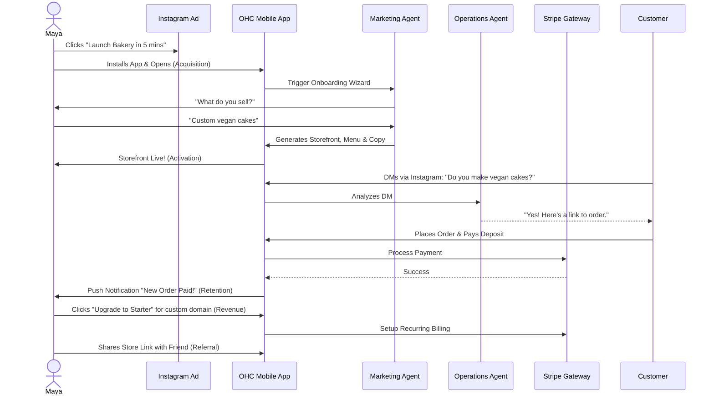
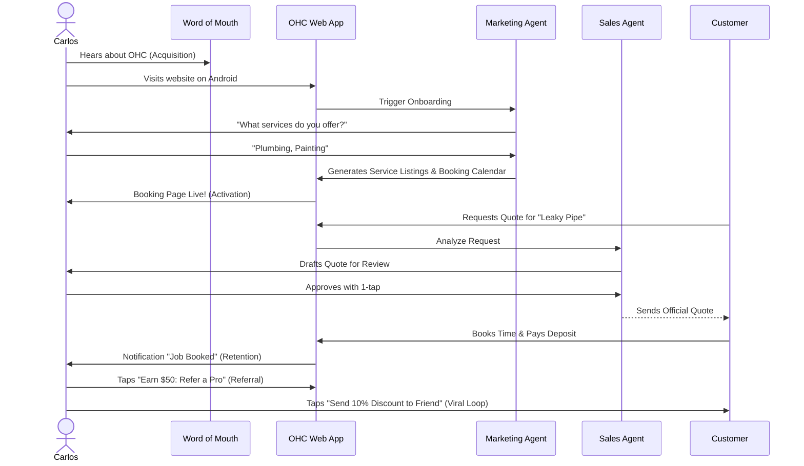

# Title: End-to-End Business Journey Architecture
## Problem Statement
The OneHumanCorp (OHC) platform aims to empower anyone—regardless of technical skill—to launch, run, and grow a business entirely from their phone in under 10 minutes. A critical challenge is ensuring that our architecture consistently supports diverse user personas (e.g., Maya the Baker, Carlos the Handyman, Priya the Boutique Owner, Leo the Music Tutor, Fatima the Food Cart Operator) through their entire lifecycle: Acquisition, Onboarding, Activation, Retention, Revenue generation, and Referral. If these journey stages are fragmented, non-technical users will encounter friction and abandon the platform. We need a cohesive, end-to-end architectural map of these business journeys that identifies friction points, establishes clear success criteria, and dictates how AI agents invisibly handle complexity at each step.

## Research Report

### Competitive Analysis & Market Gap
Current market solutions fail the OHC target audience:
*   **Shopify:** Powerful, but assumes desktop-first usage, requires technical knowledge for theme setup, and charges for basic integrations. Too complex for Maya or Fatima.
*   **Wix/Squarespace:** Drag-and-drop builders are overwhelming on mobile devices. They provide websites, not end-to-end business operations (missing unified inbox, AI operations, simple scheduling).
*   **GoDaddy:** Easy to start, but difficult to scale. Often relies on upselling disparate tools rather than providing a unified, AI-driven experience.

**The OHC Advantage:** Zero configuration. The user states their business type, and AI agents instantly provision the storefront, catalog, calendar, and operational workflows.

### Persona Business Journey Mapping

#### Maya (Baker, 28) - Custom Cakes via Instagram
*   **Acquisition:** Sees an Instagram Ad: "Turn your baking hobby into a business while you sleep." Clicks CTA.
*   **Onboarding:** AI Wizard asks, "What do you sell?" Maya types, "Vegan cakes."
*   **Activation:** Storefront is instantly generated with placeholder cake images and a deposit-based order form. Success: First cake ordered and deposit paid via Stripe.
*   **Retention:** Push notifications for new orders. The AI "Operations Manager" drafts replies to Instagram DMs ("Yes, we do vegan cakes!").
*   **Revenue:** Hits the 10-product limit on the Free tier. AI suggests upgrading to Starter ($9/mo) to add more cakes and a custom domain.
*   **Referral:** Maya shares a referral link on her Instagram story: "Built my store on OHC."

#### Carlos (Handyman, 42) - Service & Bookings
*   **Acquisition:** Hears about OHC from a fellow contractor.
*   **Onboarding:** AI Wizard asks for his services and prices.
*   **Activation:** A booking calendar with deposit requirements goes live. Success: First customer books a "Leaky Pipe" appointment.
*   **Retention:** AI "Salesperson" agent generates quotes for complex jobs and follows up on unpaid invoices.
*   **Revenue:** Upgrades to Pro ($29/mo) for the AI Sales department to handle unlimited quote requests.
*   **Referral:** Taps "Earn $50: Refer a Pro" in his dashboard and texts the link to a painter friend.

#### Priya (Boutique Owner, 35) - Physical Products (Omnichannel)
*   **Acquisition:** Searches Google for "easy online store with in-person tap-to-pay."
*   **Onboarding:** Syncs initial inventory via a quick CSV upload or photo scan.
*   **Activation:** Online storefront with size/color variants is live, and her phone is ready to accept tap-to-pay. Success: First in-store tap-to-pay transaction syncs with online inventory.
*   **Retention:** Daily mobile analytics report (e.g., "You sold 5 dresses today. 2 sizes are running low.").
*   **Revenue:** AI "Advisor" notes she needs more inventory space and automated re-order alerts, prompting an upgrade to the Business Tier ($79/mo).
*   **Referral:** Invites a local artisan to sell on OHC.

#### Leo (Music Tutor, 22) - Subscriptions & Portfolio
*   **Acquisition:** Adds OHC link to his TikTok bio.
*   **Onboarding:** AI generates a professional portfolio and subscription lesson packages.
*   **Activation:** Profile is live. Success: A student subscribes to 4 lessons/month.
*   **Retention:** AI "Operations" auto-generates Zoom links and syncs his calendar.
*   **Revenue:** Needs a custom domain to look more professional to older students; upgrades to Starter ($9/mo).
*   **Referral:** Shares his success metrics (e.g., "Fully booked this month!") on TikTok, driving signups.

#### Fatima (Food Cart, 50) - Pre-orders & Pickup
*   **Acquisition:** Local signage with a QR code.
*   **Onboarding:** Takes photos of her food. AI creates a bilingual (Arabic/English) menu with prices.
*   **Activation:** Menu is live via QR scan. Success: First pre-order placed and paid.
*   **Retention:** Loud audio notifications on her low-end Android phone for new orders; one-tap "Preparing" status updates.
*   **Revenue:** Stays on Free tier initially, but high transaction volume eventually justifies a custom plan.
*   **Referral:** Other cart operators in her commissary kitchen ask how she handles pre-orders so smoothly.

### Identified Friction Points & Mitigations
1.  **Cognitive Overload (Onboarding):** Users drop off if asked for shipping rules or tax setup early. **Mitigation:** Progressive profiling. Ask only "What do you sell?" and use AI to infer defaults. Defer advanced setup.
2.  **Payment Gateway Anxiety:** Technical jargon (e.g., "API Keys") scares users. **Mitigation:** One-click integration or OHC-managed payments.
3.  **Language/Tech Literacy:** Complex dashboards fail users like Fatima. **Mitigation:** "Simple Mode" UI by default (large buttons, translated text).
4.  **Offline Capability:** Mobile users may lose connection. **Mitigation:** Optimistic UI updates; the KAIROS orchestrator queues actions while offline.

## Design Doc

### Key Design Decisions
1.  **Progressive Disclosure & The 30-Second Rule:** The UI must hide complex settings by default. A first-time user must understand any screen within 30 seconds without reading a manual. All screens must be designed mobile-first (375px width).
2.  **Visual Excellence Mandate:** The platform will strictly adhere to premium design tokens: Glassmorphism (backdrop-filter: blur(20px) saturate(200%)), smooth transitions, and distinct typography (Outfit for headings, Inter for body text) to instill trust and professionalism.
3.  **AI-First Setup (The "Magic" Button):** Instead of empty states, AI agents instantly generate realistic, personalized content (menus, service lists, about pages) that the user can tweak, rather than build from scratch.
4.  **Asynchronous Orchestration:** Background jobs (e.g., sending emails, generating Zoom links) must run asynchronously via a robust event mesh so the mobile UI never blocks or stutters.

### Architecture Diagrams

#### End-to-End Journey Sequence (Maya - The Baker)

#### End-to-End Journey Sequence (Carlos - The Handyman)

## Implementation Prompt
**To Implementer Agent:**
Implement the foundational user onboarding flow and dashboard state management that supports the seamless progression from Acquisition to Activation. The system must capture the user's business type using progressive profiling (asking the minimum amount of questions). Build the mobile-first (375px) UI wizard that guides a user through this initial setup, ensuring advanced configurations are hidden behind a "Simple Mode" toggle.

The final step of the wizard must trigger the instant generation of a functional "Storefront/Booking Page" view, satisfying the 'Activation' milestone.

Strict requirements:
1.  Ensure all UI elements follow the Visual Excellence Mandate (Glassmorphism, Outfit/Inter typography, 44x44px touch targets).
2.  Ensure interactions are resilient to network issues via optimistic UI updates.
3.  Include complete E2E test coverage verifying a successful run-through from login to the generated storefront.
4.  Do NOT prescribe specific database schemas or backend routing; focus entirely on the unified API contract, the mobile UX flow, and the frontend state management.

## Priority
P0 (Critical)

## Estimated Scope
Large
