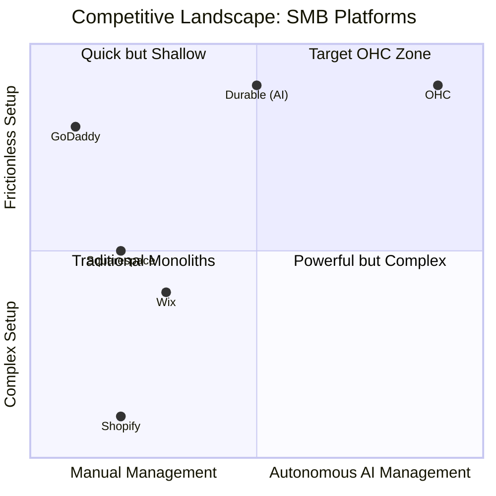
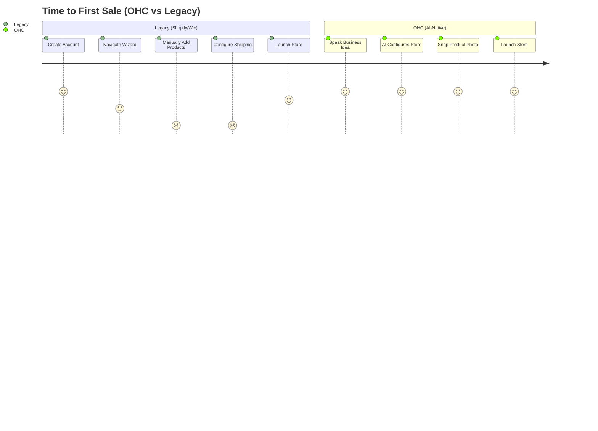
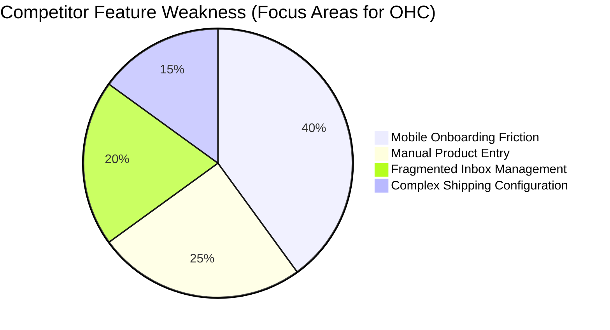

# OHC Market Dominance Research Report: The SMB Platform Space

## Executive Summary
OneHumanCorp (OHC) has a unique opportunity to dominate the SMB platform space by focusing on the "Zero Setup" paradigm, leveraging invisible AI agents to do the heavy lifting for non-technical small business owners. This report outlines our findings from deep competitor audits, user pain point research, AI differentiation strategies, and market sizing, alongside a feature gap matrix.

## Track 1: Deep Competitor Audit

### Primary Competitors
| Platform | Onboarding Flow | Time to Live Store | Mobile App Quality | AI Features | Free Tier | Biggest User Complaints |
|---|---|---|---|---|---|---|
| **Shopify** | Complex, requires many manual decisions. | 1-3 days | Strong for management, poor for setup. | Sidekick (Chatbot), not autonomous. | None (Trial only). | Too complex for beginners, requires paid apps for basic features. |
| **Wix** | Guided, template-based. Wix ADI helps initially. | 2-4 hours | Limited mobile editor. | Wix ADI (Setup only). | Yes, but heavily branded. | Performance issues, hard to migrate away, mobile view often breaks. |
| **Squarespace**| Design-focused, fewer questions. | 3-5 hours | Good for basic edits. | Minimal (mostly text generation). | None (Trial only). | Beautiful but rigid, e-commerce features are secondary. |
| **GoDaddy** | Very fast, but shallow features. | 1 hour | Basic. | Airo (Branding focus). | Yes, heavily restricted. | Aggressive upselling, poor SEO, limited customization. |
| **Square Online**| POS-first, straightforward. | 2 hours | Strong for retail. | Basic text gen. | Yes (transaction fee). | Limited design options, primarily for physical stores. |

### Competitive Landscape Matrix

### Key Finding
Current platforms treat AI as a *feature* (a chatbot or a one-time setup wizard). OHC must treat AI as the *platform*—invisible agents that actively manage the business.

---

## Track 2: SMB User Pain Point Research & Persona Mapping

Based on reviews from App Stores, Trustpilot, and subreddits (r/smallbusiness, r/ecommerce), mapped to our core personas:

| Persona | Business Type | Top Validated Pain Points | Proposed OHC Solution |
|---|---|---|---|
| **Maya (28)** | Baker | 1. Taking photos/writing descriptions takes too long. 2. Shopify feels like a full-time job. | **Zero-Draft Catalog Agent** (Photo-to-live-product) |
| **Carlos (42)** | Handyman | 1. Missing leads while on the job. 2. Manual quoting is slow and error-prone. | **Auto-Responder & Booking Agent** |
| **Priya (35)** | Boutique | 1. Keeping online and in-store inventory synced. 2. No time for email marketing. | **Proactive Marketer Agent** |
| **Leo (22)** | Music Tutor | 1. Booking schedule chaos. 2. Chasing unpaid invoices. | **Smart Follow-Up Agent** |
| **Fatima (50)** | Food Cart | 1. English-first tools are too complex. 2. Needs simple pre-order pickup system. | **Frictionless Setup Agent** (Voice-to-store) |

---

## Track 3: AI Differentiation Manifesto

To leapfrog competitors, OHC will implement these 5 invisible AI automations:

1. **The 'Zero-Draft' Catalog Agent:** Users take a photo of a product. The agent removes the background, writes the title, description, and suggests pricing based on market data. (Saves 30 mins per product).
2. **The Auto-Responder Agent:** Connects to Instagram/Email. Automatically answers common questions (hours, location, return policy) and routes leads to the booking/checkout flow.
3. **The Proactive Marketer:** Doesn't wait for the user. Once a week, proposes a social media post or an email blast to past customers. User just clicks "Approve."
4. **The Frictionless Setup Agent:** No complex wizards. The user tells the app "I sell cakes in Austin." The agent configures the store, sets up local delivery zones, and creates a base catalog template.
5. **The Smart Follow-Up Agent:** Automatically detects abandoned carts or unbooked leads and sends personalized, human-sounding follow-ups to recover revenue.

### OHC vs. Legacy User Journey

---

## Track 4: Market Sizing & Strategic Direction

- **TAM:** ~33 million small businesses in the US alone. ~400 million globally. Over 30% of micro-businesses still operate without a dedicated website, relying solely on social media.
- **Beachhead Market:** Service-based solopreneurs (e.g., Leo the music tutor, Carlos the handyman). They have the highest pain (manual booking chaos) and lowest requirement for complex physical shipping logistics.
- **Geographic Expansion:** US first, quickly followed by LATAM (Spanish) given the massive growth of mobile-first micro-businesses in the region.
- **Vertical Expansion:** Start horizontal, but introduce "agent templates" tuned for specific verticals (e.g., the "Food Cart" agent template that understands pre-orders and pickup times).

---

## Track 5: Feature Gap Matrix & Heatmap

| Feature | Shopify | Wix | OHC (Target) | OHC Advantage |
|---|---|---|---|---|
| **Mobile-First Setup** | Poor | Fair | **Excellent** | Build entire store from phone in <10 mins. |
| **AI Product Creation** | Manual/Chatbot | Basic | **Autonomous** | Photo-to-live-product in 1 click. |
| **Integrated Booking** | Paid App | Native | **Native+AI** | AI handles rescheduling automatically. |
| **Omnichannel Inbox** | Paid App | Native | **AI-Managed** | Agent drafts replies to IG DMs. |
| **Pricing Model** | Expensive + Apps | Tiered | **Freemium** | Core features free, pay for AI agent usage. |

### Feature Gap Heatmap

## Next Steps
Please refer to the issue briefs created in the `docs/research/` directory for actionable engineering missions.
