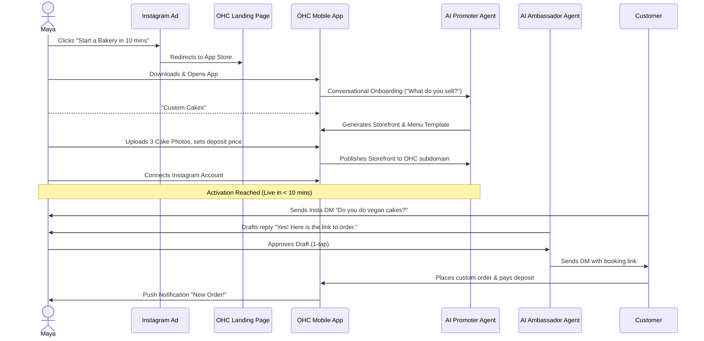
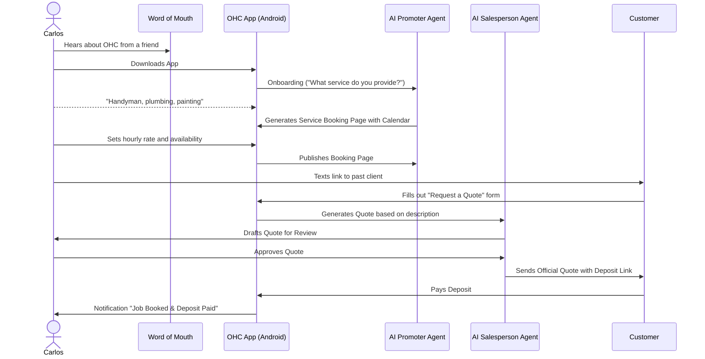
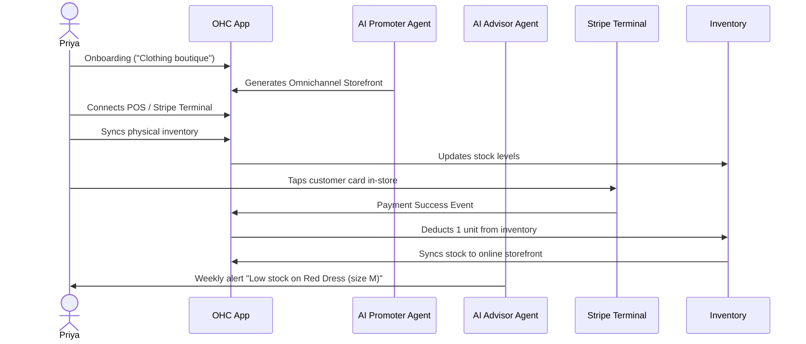
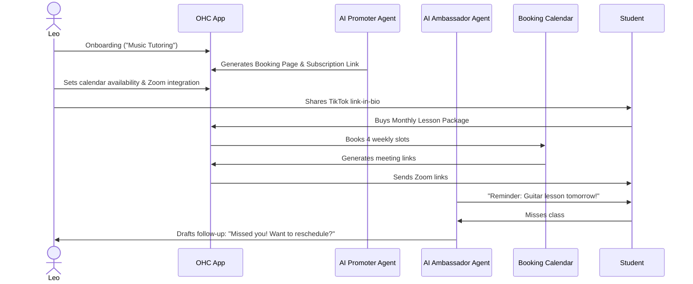
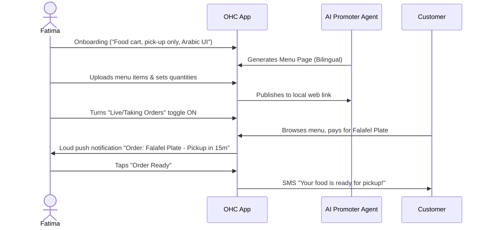

# [architecture] Business Journey Architecture

## Problem Statement
The OneHumanCorp (OHC) platform aims to empower non-technical users to go from zero to a live, functioning business in under 10 minutes. Without a cohesive, documented understanding of the end-to-end journey across diverse business personas, our product and engineering teams risk building isolated features that do not flow together naturally. We need a unified architecture document that maps out the exact sequence of actions for our key personas (Maya, Carlos, Priya, Leo, and Fatima) across acquisition, onboarding, activation, retention, revenue, and referral stages.

## Research Report
Based on our target personas and the OHC platform promise, the following patterns emerge:
- **Mobile-First is Mandatory:** Users like Maya (baker) and Fatima (food cart) run their operations exclusively from a mobile device (iOS and Android). Desktop is additive, not the baseline.
- **Immediate Value (Activation):** The "Aha!" moment happens when a user sees their first product live or receives their first booking/payment. The flow must aggressively prioritize this outcome over extensive configuration.
- **AI as an Invisible Guide:** Users are not configuring technical settings. Instead, AI departments (e.g., Marketing, Sales) handle the setup based on simple questions during onboarding.
- **Differentiated Needs but Unified Framework:** While a handyman (Carlos) needs a booking system and a boutique owner (Priya) needs physical inventory sync, the fundamental phases (Acquire, Onboard, Activate, Retain) remain consistent.

### Persona Analysis Summary
- **Maya (The Home Baker):** Focuses on visual catalog and custom order deposits. Heavily relies on Instagram integrations for DMs and auto-posting.
- **Carlos (The Freelance Handyman):** Needs service listings, booking with deposits, and automated quote generation based on customer descriptions. Android priority.
- **Priya (The Boutique Owner):** Requires online/in-store sync, variants, tap-to-pay (Stripe Terminal), and analytics. Omnichannel (mobile + desktop).
- **Leo (The Music Tutor):** Calendar sync, video meeting generation (Zoom/Google Meet), subscription packages, and TikTok link-in-bio presence.
- **Fatima (The Food Cart Operator):** Multi-language UI, pre-order pickup flows with notifications, and printable summaries. Low-end Android focus.

## Design Doc

### Journey Phases
1. **Acquisition:** How the user discovers OHC (e.g., social ad, referral link).
2. **Onboarding:** A conversational, AI-led wizard gathering minimum context (business name, type, primary goal) in under 3 minutes.
3. **Activation:** The system auto-generates the necessary infrastructure (storefront, booking page, AI agents) and the user takes the first meaningful action (e.g., adding a product, sharing a link).
4. **Retention:** Engagement loops powered by the Business Advisory Agent (e.g., weekly performance summaries, push notifications for new orders).
5. **Revenue:** Trigger points for upgrading from the Free tier to Starter/Pro (e.g., reaching product limits, needing custom domains).
6. **Referral:** Built-in sharing mechanics (e.g., "Powered by OHC" branding on free tier, explicit referral programs).

### Architecture Diagrams

#### Maya (The Home Baker) Journey

#### Carlos (The Freelance Handyman) Journey

## Implementation Prompt
**For Implementer Agents:**
Implement the core conversational onboarding flow and initial AI template generation.

**Critical User Journey (CUJ):**
1. A new user opens the mobile application for the first time.
2. The user is presented with a conversational UI (chat interface) powered by the AI Agent.
3. The AI asks three essential questions: Business Name, Business Category (Product, Service, Food, etc.), and Primary Goal (e.g., "Sell online", "Take bookings").
4. Upon completion, the system must invoke the Orchestrator to generate the initial required database records (Tenant, initial generic Products/Services, Agent configurations).
5. The user is transitioned to their dashboard, where a "Getting Started" checklist is populated based on their category.

**Acceptance Criteria:**
- The onboarding flow must operate entirely within the 375px mobile viewport constraint without horizontal scrolling.
- The UI must use the defined design tokens (Outfit/Inter typography, appropriate spacing).
- A full E2E Playwright/mocked-AI test must exist covering the complete flow from app launch, through the 3 questions, ending at the populated dashboard.

## Priority
P0

## Estimated Scope
Large

#### Priya (The Boutique Owner) Journey

#### Leo (The Music Tutor) Journey

#### Fatima (The Food Cart Operator) Journey

### Friction Point Analysis
- **Onboarding Drop-off:** Non-technical users like Maya and Fatima might abandon the flow if the AI asks more than 3-4 questions or requires complex technical jargon (e.g., "DNS", "Webhooks"). The conversational setup MUST remain extremely simple.
- **Payment Setup Friction:** Setting up Stripe (especially for POS like Priya) requires KYC verification, which can be overwhelming. The app must guide this process gently, perhaps allowing "Test Mode" activation before requiring full KYC to preserve the "Aha!" moment.
- **Inventory & Calendar Sync:** Leo and Priya will abandon the platform if syncing their existing tools (Google Calendar, existing POS) fails or causes double-booking/overselling. The sync must be robust and error-tolerant.
- **Mobile Usability:** Fatima uses a low-end Android device with potentially slow data. If the app is bloated, slow, or requires horizontal scrolling, she will abandon it. Strict adherence to mobile-first performance and 375px breakpoints is critical.
