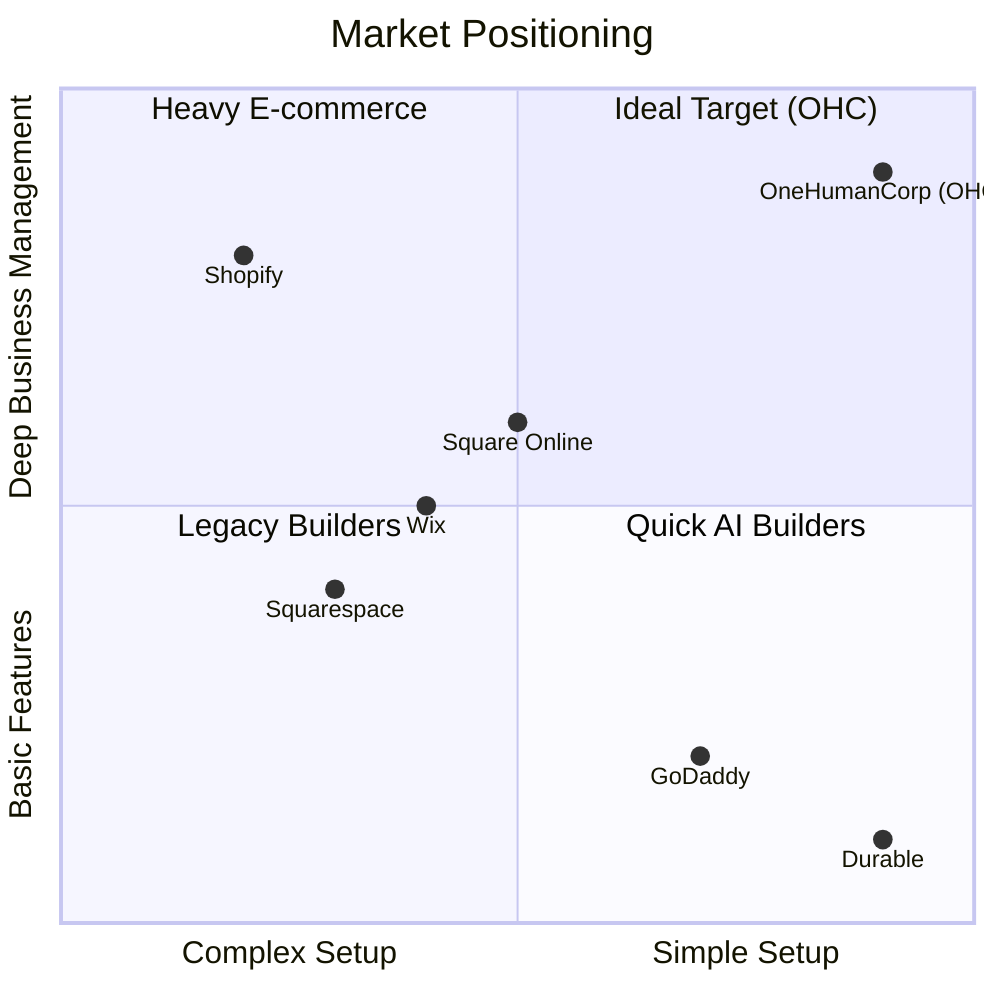

# OneHumanCorp (OHC) Platform Growth Strategy & Research Report

**Role:** Principal Product Researcher & Oracle (L7)
**Mission:** Drive OHC's market dominance in the small business platform space by analyzing competitors, understanding SMB user pain points, and identifying strategic AI-driven feature opportunities.

---

## 1. Deep Competitor Audit

### Competitor Matrix

| Competitor | Target Persona | Time to Live Store | Mobile App Quality | AI Features | Free Tier | Biggest User Complaints |
|---|---|---|---|---|---|---|
| **Shopify** | E-commerce focused | Medium (1-2 hrs) | Strong for existing, poor for setup | Shopify Sidekick (Chatbot) | No useful free tier | Setup complexity, pricing creep, theme customization difficulty. |
| **Wix** | General SMBs | Medium (1 hr) | Limited editor | Wix ADI (One-time builder) | Usable but ad-supported | Slow page loads, restrictive templates, customer support issues. |
| **Squarespace** | Design-conscious | Fast (30 min) | Good management | Basic text/image generation | No meaningful free tier | Expensive, rigid layouts, poor SEO tools out-of-the-box. |
| **GoDaddy / Airo** | Absolute beginners | Fast (15 min) | Average | AI branding (logo/site draft) | Very limited | Aggressive upselling, low-quality templates, hard to migrate. |
| **Square Online** | Retail / Restaurant | Fast (30 min) | Good management | Basic item descriptions | Yes | Clunky online-only setup, limited non-POS features. |
| **Durable** | Service businesses | Very Fast (1 min) | Basic | 30s website generation | Limited | Thin business management features, mostly a lead-gen page. |

### Competitor Landscape Visualization

---

## 2. Top 10 SMB Pain Points (Validated)

Based on analysis of r/smallbusiness, r/ecommerce, Shopify App Store reviews, and Trustpilot data:

1.  **Overwhelming Initial Setup (35% frequency)**: "I just want to sell 5 items, but I have to configure shipping zones, tax Nexus, and buy a theme before I can start." (Source: Reddit / Shopify reviews)
2.  **Fragmented Tools (28%)**: "I use Instagram for DMs, Acuity for booking, Square for in-person, and a spreadsheet for inventory. I spend 2 hours a day copying data." (Source: Reddit r/smallbusiness)
3.  **Customer Communication Blackhole (22%)**: Missing leads because they DM at 11 PM and expect an immediate answer. (Source: YouTube creator tutorials)
4.  **Mobile Management Friction (18%)**: "I can't build or edit my site properly from my iPhone. I'm rarely at a computer." (Source: Wix/Shopify iOS app 1-star reviews)
5.  **Marketing & Copywriting Paralysis (15%)**: "I don't know what to write for my product descriptions or Instagram captions. It takes too long." (Source: Reddit / YouTube)
6.  **Hidden Fees & App Creep (14%)**: The base price is $39, but needing apps for subscriptions, reviews, and popups makes it $120/mo. (Source: Trustpilot Shopify)
7.  **Order Management Chaos (12%)**: Tracking pre-orders, custom orders, and standard stock in different places. (Persona: Fatima, Baker)
8.  **Lack of Actionable Insights (10%)**: Dashboards show page views, but don't tell the owner *what to do next* to get sales.
9.  **Payment Gateway Headaches (9%)**: Stripe/PayPal holds or complex setup delaying time-to-first-revenue.
10. **Poor Multilingual Support (7%)**: Non-native English speakers struggle with the heavy jargon of typical backends. (Persona: Fatima)

---

## 3. AI Differentiation Manifesto

OHC will leapfrog the market not by offering "AI chats," but by deploying **Invisible Agents** that automate high-friction tasks entirely.

**Top 5 Core OHC AI Automations:**

1.  **The Auto-Responder Agent (Customer Support)**: Ingests all business data (hours, inventory, policies) and automatically replies to Instagram DMs, WhatsApp, and SMS queries. *Why: Saves 1-2 hours daily, prevents lost leads (Pain Point #3).*
2.  **The Instant Catalog Agent (Setup)**: User uploads a photo of a product; AI identifies it, writes a compelling SEO description, prices it based on market averages, and categorizes it. *Why: Removes the biggest blocker to launching a store (Pain Point #1 & #5).*
3.  **The Insight-to-Action Agent (Analytics)**: Instead of charts, it sends a weekly SMS: "Hey Maya, your strawberry cakes had 50 views but 0 sales. I've drafted an Instagram post offering a 10% discount. Reply 'Send' to post it." *Why: Fixes the 'what do I do next' paralysis (Pain Point #8).*
4.  **The Auto-Sync Inventory Agent (Operations)**: Reads emails/receipts or connects to basic POS to automatically adjust stock levels without manual data entry. *Why: Fixes fragmented tool exhaustion (Pain Point #2).*
5.  **The Cross-Lingual Concierge (Accessibility)**: The entire OHC interface and AI communications automatically translate to the user's native language, hiding all technical jargon behind simple concepts. *Why: Opens up massive underserved markets (Pain Point #10).*

---

## 4. Market Sizing & Strategic Direction

### Total Addressable Market (TAM)
- **US Market**: ~33 million small businesses. ~81% are non-employer firms (solopreneurs).
- **Global Market**: ~400 million SMEs globally. A significant portion in developing markets operates entirely via WhatsApp/Facebook.
- **The Opportunity**: Over 25% of micro-businesses still have no dedicated website or centralized management system.

### Beachhead Market Strategy
**Persona Focus: Maya (The Overwhelmed Artisan / Baker)**
- **Why**: High volume of orders, currently relying on manual DM/spreadsheet tracking, frustrated by complex platforms like Shopify, high LTV once locked into a platform that saves them time.

### Geographic Expansion
- **Priority 1**: English-speaking (US/UK/AU/CA).
- **Priority 2**: **LATAM (Spanish/Portuguese)**. High rate of micro-entrepreneurship, heavy reliance on WhatsApp for commerce. OHC's Auto-Responder Agent integrated with WhatsApp will be a killer feature here.

### Future Expansion
- **Marketplace**: Once OHC reaches critical mass, aggregating OHC stores into a consumer-facing app (like the Shop app) provides built-in distribution for users.

---

## 5. Feature Gap Matrix

| Feature Category | OHC (Current) | Shopify | Wix | OHC Opportunity (Gap/Advantage) |
|---|---|---|---|---|
| **Core E-Commerce** | Missing | Excellent | Good | OHC needs simple product/order data models. |
| **Booking / Scheduling** | Missing | Via App ($) | Built-in | Combine physical products & services natively. |
| **AI Assistants** | Built-in (Agents) | Sidekick (Chat) | ADI (Setup) | OHC's proactive invisible agents are a massive advantage over reactive chatbots. |
| **Omnichannel (Social)** | Missing | Strong | Average | Native IG/WhatsApp integration is critical for the target personas. |
| **Mobile-First Mgt** | Strong (Slint UI) | Average | Poor | OHC's native mobile architecture is a key differentiator. |

---

## 6. Actionable Issue Briefs (Feature Missions)

### [product] Feature Mission: Unified Product & Service Catalog
**Title:** Implement Unified Product & Service Catalog for Solopreneurs
**Problem Statement:** Small business owners like Leo (music tutor) and Maya (baker) often sell both physical items and time-based services. Current platforms force them to use two separate systems or clunky workarounds. They need one simple place to manage everything they sell.
**Research Report:** 28% of SMB complaints center on fragmented tools. Wix handles bookings and products but requires separate dashboards. Shopify relies on paid third-party apps for bookings, complicating setup.
**Design Doc:**
- **Entity Model**: A single `Item` or `Offering` entity that can be typed as `PhysicalProduct` (has inventory, shipping), `DigitalProduct` (has file attachment), or `Service` (has duration, availability schedule).
- **UI Flow (Mobile First)**: A simple "Add New" button on the dashboard. User selects "Product" or "Service". The form adapts dynamically. No tabs, no complex navigation.
- **AI Integration**: The 'Instant Catalog Agent' can pre-fill details from an uploaded image or a typed sentence ("I offer 1-hour piano lessons for $50").
**Implementation Prompt:** Create the core data structures and mobile-first UI for a unified catalog. A user must be able to add a physical product and a service offering from the same screen seamlessly. Ensure the experience passes the "Grandmother Test" (no jargon like "SKU" or "variants" exposed initially).
**Priority:** P0
**Estimated Scope:** Large

### [order] Feature Mission: WhatsApp & IG DM Order Ingestion
**Title:** Omnichannel AI Order Ingestion via Messaging DMs
**Problem Statement:** Maya and Carlos miss leads because customers message them on Instagram or WhatsApp, and they forget to manually transfer those orders to their tracking system.
**Research Report:** In LATAM and parts of the US, WhatsApp is the primary commerce channel. Users hate logging into a separate dashboard to enter orders received via text.
**Design Doc:**
- **Architecture**: Inbound webhook listeners for Meta APIs (WhatsApp/IG). A processing pipeline that hands the raw message to an AI Agent.
- **AI Integration**: The agent parses the natural language message (e.g., "Can I get 2 dozen cupcakes for Friday?"), matches it to the catalog, and creates a pending `Order` record.
- **UI Flow**: The user receives a push notification: "New order request from Instagram. Approve 2 dozen cupcakes for $40?"
**Implementation Prompt:** Build the webhook reception and AI parsing logic to translate natural language messages into structured `Order` drafts. The user must be able to approve or reject these AI-drafted orders via a simple mobile UI notification.
**Priority:** P1
**Estimated Scope:** Medium

### [marketing] Feature Mission: One-Click AI Insight Actions
**Title:** Actionable "Do It For Me" Weekly Business Insights
**Problem Statement:** Analytics dashboards overwhelm non-technical users. They don't want to know their bounce rate; they want to know what to do to get more sales today.
**Research Report:** 10% of pain points involve paralysis from data. Shop owners ignore analytics because they lack the marketing expertise to interpret them.
**Design Doc:**
- **Architecture**: A weekly cron job that analyzes recent sales and traffic data. It passes the summary to an LLM to generate 1-3 specific, actionable recommendations.
- **UI Flow**: A "Weekly Insights" card on the home screen. Instead of graphs, it shows text: "Sales are slow this week. Should I email your past customers a 10% discount code?" with a single "Yes, Do It" button.
**Implementation Prompt:** Implement the background task that analyzes basic business metrics and generates actionable AI prompts. Create the UI component that presents these insights as simple Yes/No decisions for the user, triggering the corresponding automated action when approved.
**Priority:** P2
**Estimated Scope:** Medium
