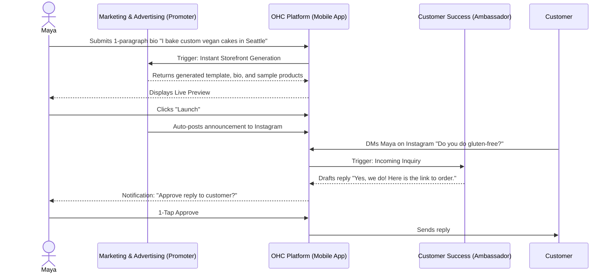
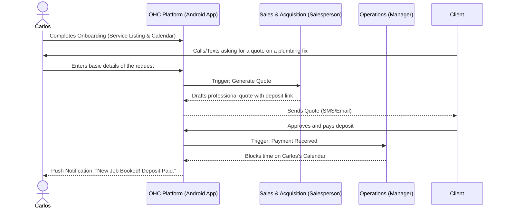
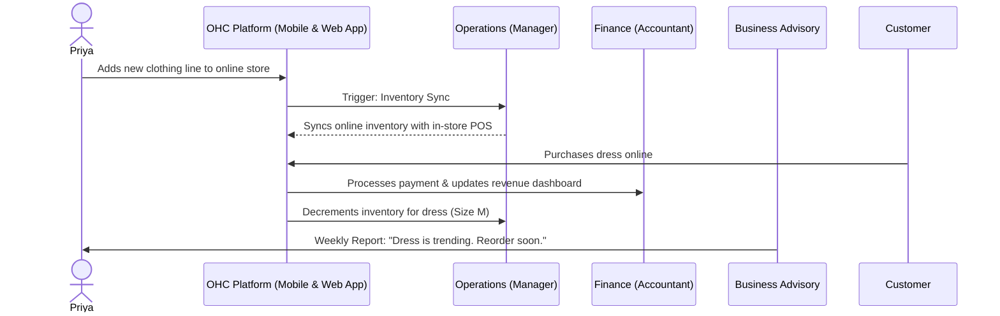
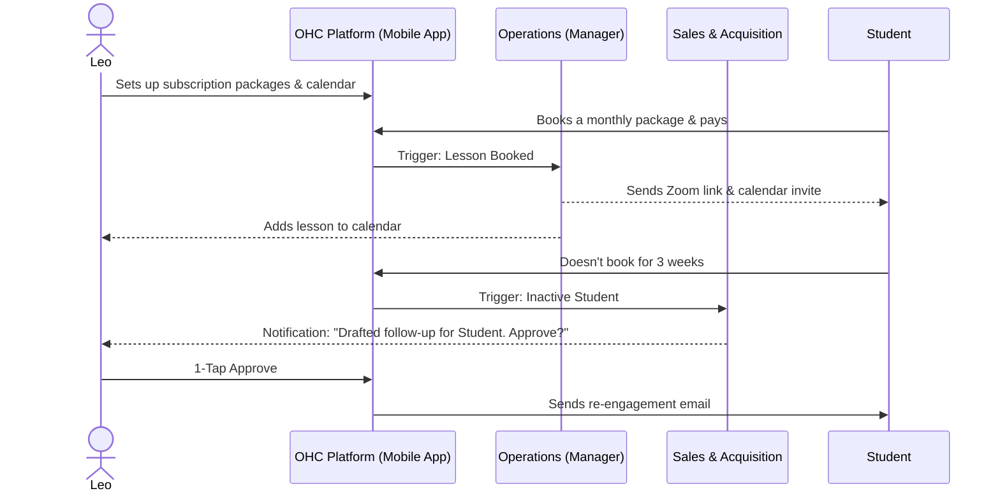
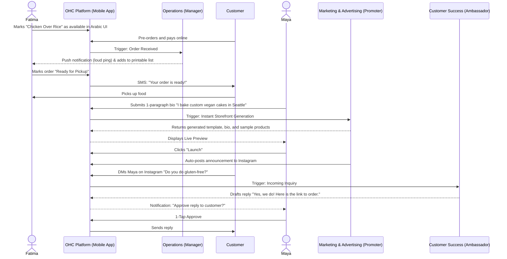

# Issue Brief: End-to-End Business Journey Architecture

## Problem Statement
The current onboarding and lifecycle flows for non-technical users are disjointed. Users like Maya (the baker) or Carlos (the handyman) need to go from idea to a live, functional business in under 10 minutes. Any friction or technical jargon during acquisition, onboarding, activation, retention, or revenue generation leads to drop-off. We need a unified architectural design mapping out the complete end-to-end user journeys for our key personas.

## Research Report
The core personas dictate the requirements of our journey flows:
- **Maya (The Home Baker):** Mobile-only, needs a beautiful visual storefront, custom order deposit flows, and an agent for Instagram DMs.
- **Carlos (The Handyman):** Android-only, relies on word-of-mouth, needs service listings with pricing, booking calendar, and AI quote generation.
- **Priya (The Boutique Owner):** Omni-channel, needs online/in-store sync, product variants, and daily mobile analytics.
- **Leo (The Music Tutor):** Needs calendar integration, Zoom auto-generation, subscription billing, and AI follow-ups for inactive students.
- **Fatima (The Food Cart Operator):** Multi-lingual (Arabic/English), low-end Android device, needs a simple pre-order pickup flow with push notifications and printable order lists.

**Friction Points to Avoid:**
- Complex DNS configuration for custom domains.
- Dense settings panels with technical jargon (e.g., "Webhooks", "SMTP settings").
- Empty state anxiety (starting with a blank screen instead of a generated draft).
- Multi-step account creation before showing value.

**Competitor Benchmarks:**
- Shopify/Wix require 30-60 minutes and significant technical configuration to go live. OHC aims for under 10 minutes with zero technical knowledge required.

## Design Doc

### User Journey Maps

#### 1. Acquisition & Onboarding
- **Trigger:** Organic search, social media ad, or referral link.
- **CTA:** "Launch your business in 10 minutes."
- **Flow:** User enters a 1-paragraph description of their business -> *The Advisor* agent extracts name, type, and drafts a tagline -> *The Promoter* agent selects a template and drafts the first product/service -> A Live Preview is generated -> User clicks "Launch" -> User creates an account.

#### 2. Activation
- **Success Criteria:** First product added, first payment link generated, or first booking received.
- **Action:** User shares their link-in-bio or storefront URL. *The Promoter* agent automatically drafts a social media post announcing the launch.

#### 3. Retention & Revenue
- **Daily Engagement:** *The Advisor* agent sends daily/weekly health reports (e.g., "Tuesday is your busiest day. The vegan cake is trending.").
- **Upsell Trigger:** When the user hits the limit of the Free tier (e.g., 100 AI actions), the system presents a clear, value-based upgrade prompt for the Starter tier.

#### 4. Referral
- **Viral Loop:** Satisfied users can share an affiliate link from their dashboard.

### Architecture Diagrams (Mermaid.js)

#### Persona: Maya (The Home Baker) Journey

#### Persona: Carlos (The Handyman) Journey

#### Persona: Priya (The Boutique Owner) Journey

#### Persona: Leo (The Music Tutor) Journey

#### Persona: Fatima (The Food Cart Operator) Journey

#### Persona: Carlos (The Handyman) Journey

### Mobile UX Flows
- **Zero-State to Live:** Single text box input for business description -> Loading spinner with AI agent activity text ("Designing your storefront...", "Writing product descriptions...") -> Live preview screen -> "Publish" button.
- **1-Tap Approvals:** Push notification for an agent-drafted action -> Tapping opens a bottom sheet with the drafted content and an "Approve" / "Reject" / "Edit" button.

### Key Architectural Decisions
- **AI as the Onboarding Engine:** Instead of forms, onboarding is driven by a single unstructured text input processed by agents to pre-fill the entire tenant configuration.
- **Progressive Profiling:** We only ask for essential information to launch. Additional details (tax info, specific shipping zones) are gathered progressively as the business grows.

## Implementation Prompt
Implement the End-to-End Business Journey orchestration logic. This involves replacing the current multi-step onboarding wizard with a single-prompt "Instant Build" flow that leverages the existing Agent infrastructure to extrapolate tenant configuration, generate a storefront, and draft initial content. Furthermore, integrate the retention loop by configuring `The Advisor` agent to schedule weekly plain-language health reports via the internal task queue. Ensure the entire flow is testable via a mobile-first UI layout (375px width minimum) and handles failures gracefully with optimistic UI updates.

## Priority
P1

## Estimated Scope
Large
