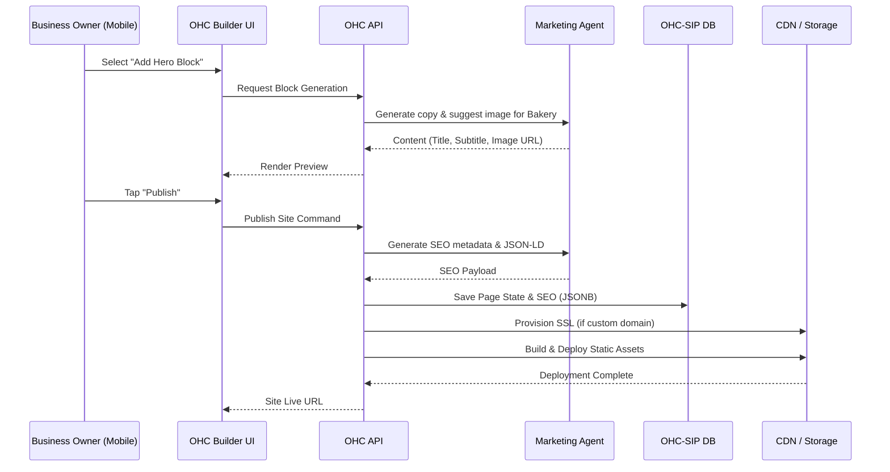

# [architecture] Website & Storefront Builder Architecture

## Title
Website & Storefront Builder Architecture 🎨

## Problem Statement
Small business owners (bakers, handymen, boutique owners, tutors, food cart operators) need a way to create a professional online presence without any technical knowledge. They are often overwhelmed by traditional website builders like Shopify, Wix, or Squarespace because those platforms require understanding concepts like themes, layouts, margins, DNS, and responsive design. The OHC platform must provide a "zero-configuration" storefront builder where AI does the heavy lifting, generating a beautiful, mobile-first website that works seamlessly on any device.

## Research Report
- **Goal**: Design a drag-and-drop website builder architecture that empowers non-technical users to launch an online storefront in under 10 minutes.
- **Competitive Analysis**:
  - **Shopify**: Highly customizable but steep learning curve. Requires significant setup for themes and plugins.
  - **Wix/Squarespace**: Flexible drag-and-drop, but overwhelming array of choices. Can easily lead to "broken" designs on mobile if the user is not careful.
  - **GoDaddy**: Simpler, but rigid templates that look dated.
- **OHC's Approach**:
  - **Constraint-Based Design**: Limit choices to ensure aesthetic excellence by default. Users select content blocks (hero, product grid, testimonials), not individual UI elements.
  - **Mobile-First**: The builder interface itself must be fully functional on a 375px mobile screen. All generated sites are optimized for mobile first.
  - **AI-Assisted**: AI generates initial copy, selects placeholder images, and suggests color palettes based on the business type.

## Design Doc

### 1. Architecture Components

- **Block System**: The atomic unit of the builder is a "Block" (e.g., `HeroBlock`, `ProductGridBlock`, `ContactFormBlock`, `BookingCalendarBlock`). Blocks have predefined schemas for their content (JSONB).
- **Page Model**: A page is an ordered list of Blocks.
- **Theme Engine**: Applies global design tokens (colors, typography, spacing) uniformly across all blocks.
- **Publishing Pipeline**: Compiles the JSON representation into a static PWA or server-side rendered application, deployed to a CDN.
- **Automated SEO Engine**: SEO is handled invisibly. When a site is published, the Marketing AI agent auto-generates meta titles, descriptions, and structured data (JSON-LD) based on the block content and business type. A dynamic `sitemap.xml` and `robots.txt` are automatically generated and updated with every publish.
- **Custom Domains & SSL Provisioning**: Custom domains are configured automatically without manual DNS records when purchased through OHC. For external domains, users are guided via a simple 2-step setup. SSL certificates are provisioned and renewed automatically via Let's Encrypt (or a managed provider like Cloudflare) at the edge CDN level, guaranteeing HTTPS by default.

### 2. Architecture Diagram

### 3. UX Flows

- **Onboarding Flow**:
  1. User enters business name and type.
  2. AI generates a full 3-page site (Home, Catalog/Services, About) in 10 seconds.
  3. User reviews on mobile and can tap any text or image to edit.
- **Editing Flow (Mobile)**:
  1. User taps "Edit Section".
  2. A bottom sheet appears with simple toggles (e.g., "Show Button", "Change Image").
  3. No free-form dragging; sections snap into place to prevent layout breakage.

## Implementation Prompt
"Implement the core backend API for the Website & Storefront Builder in `srcs/server/builder/`. Define the database models for `Site`, `Page`, and `Block` using PostgreSQL JSONB columns for flexible block content storage. Ensure tenant isolation with RLS. Create a REST API for the mobile app to fetch, create, update, and reorder blocks on a page. The API must validate block payloads against strict schemas to ensure data integrity. Finally, implement the `PublishSite` endpoint that triggers a background job to compile the site configuration, generate SEO metadata automatically via the AI Marketing agent, and trigger SSL provisioning for any linked custom domains."

## Priority
P0

## Estimated Scope
Large
