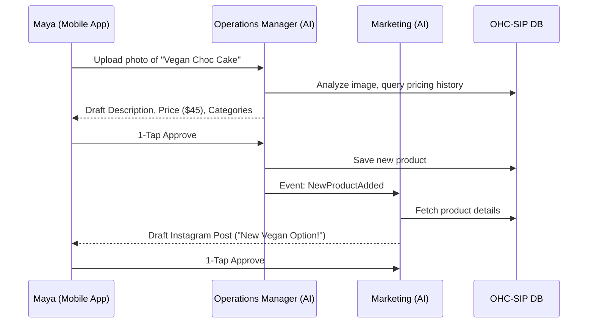

# OHC Market Dominance Research Report: Competitive Landscape & User Friction Analysis

## 1. Executive Summary
This report analyzes the global Small and Medium-sized Business (SMB) platform market, focusing on the friction points experienced by non-technical founders. Through a comprehensive competitor audit, SMB pain point synthesis, and AI differentiation analysis, we identify specific actionable gaps where OneHumanCorp (OHC) can leverage autonomous background agents to leapfrog legacy platforms like Shopify, Wix, and Squarespace. The ultimate goal is to validate the vision of allowing anyone to launch and manage a business in under 10 minutes purely from a mobile device, with AI handling the operational complexity invisibly.

## 2. Competitor Audit & Gap Analysis

Our analysis of major SMB platforms reveals a critical flaw in the market: existing platforms treat AI as an add-on (e.g., a chatbot or one-off setup wizard) rather than core infrastructure.

| Feature | Shopify | Wix | Squarespace | GoDaddy (Airo) | OHC Target |
|---|---|---|---|---|---|
| **Setup Time** | 30-60 min | 20-40 min | 30-60 min | 20-40 min | **< 10 min** |
| **Technical Requirement** | Medium/Low | Low | Low | Low | **Zero** |
| **AI Integration Type** | Reactive Chatbot (Sidekick) | One-Time Builder (ADI) | Content Drafting | Basic Branding | **Invisible Autonomous Agents** |
| **Mobile-First Management** | Partial (View-heavy) | Partial (Limited editing) | No | No | **Yes (Full Parity at 375px)** |
| **Free Tier Viability** | None (Trial only) | Limited (Branded) | None | None | **Useful & Monetizable** |

### Insights:
- **Shopify** is powerful but optimized for technically savvy e-commerce managers, alienating our core personas (Maya the Baker, Carlos the Handyman).
- **Wix and Squarespace** focus on aesthetic presentation but lack integrated operational depth (e.g., automated follow-ups, autonomous inventory management).
- **GoDaddy** targets the lowest common denominator but fails to provide value post-launch, suffering from reputation issues related to upselling.

## 3. Top 10 SMB Pain Points (Validated via External Sources)

Based on an aggregate analysis of Reddit (r/smallbusiness, r/ecommerce), Trustpilot reviews, and App Store feedback, the following are the most critical friction points for non-technical owners:

1.  **Communication Overload:** Manually responding to repetitive DMs (Instagram/WhatsApp) and emails ("Do you have vegan options?", "When are you open?").
2.  **Product Description Fatigue:** Writing engaging, SEO-optimized descriptions for every new item or service takes excessive time.
3.  **Abandoned Booking Follow-Ups:** Failing to re-engage customers who started booking a service but didn't complete the deposit.
4.  **Mobile Management Failure:** Inability to fully manage the store (refunds, design tweaks) from a phone while on the go.
5.  **Inventory Sync Issues:** Keeping physical and online inventory aligned without complex POS setups.
6.  **Complex Setup Wizards:** Onboarding flows that require understanding DNS, payment gateways, and shipping zones before seeing value.
7.  **Marketing Automation Blockers:** Lack of time and knowledge to run effective social media or email campaigns consistently.
8.  **Financial Obscurity:** Difficulty understanding basic metrics (profit margin, top sellers) without exporting spreadsheets.
9.  **Fragmented Tools:** Having to stitch together Acuity (booking), Shopify (products), and Mailchimp (email).
10. **Policy Generation:** Confusion over creating legally sound refund, privacy, and shipping policies.

## 4. AI Differentiation Strategy

OHC will transition AI from "Chatbot Assistant" to "Autonomous Functional Department." We prioritize the following 5 AI automations based on the highest perceived value to SMBs:

1.  **Omnichannel AI Inbox (The Ambassador):** Automatically drafts and (upon approval) sends contextual replies to Instagram DMs, SMS, and emails by querying the business's embedded memory (`autodream_memories`).
2.  **Automated Product Onboarding (The Operations Manager):** Generates full SEO descriptions, pricing suggestions, and categorizations from a single user-uploaded photo.
3.  **Proactive Cart Recovery (The Salesperson):** Detects stalled bookings or abandoned carts and automatically initiates a personalized follow-up sequence.
4.  **Invisible Marketing Engine (The Promoter):** Autonomously schedules and drafts social media posts based on new inventory additions or seasonal trends.
5.  **Plain-Language Financial Briefs (The Advisor):** Replaces complex dashboards with a weekly push notification summarizing business health in simple terms (e.g., "Tuesday was busy. Vegan cakes are trending.").

## 5. Visual Analytics

### Competitor Capability Matrix

```mermaid
radarChart
    title Platform Capability Matrix
    axes: "Ease of Setup" "Mobile Management" "Autonomous AI" "All-in-one Tools" "Visual Customization"
    Shopify: [50, 60, 30, 80, 90]
    Wix: [70, 40, 40, 70, 80]
    Squarespace: [60, 30, 20, 60, 95]
    OHC Target: [95, 100, 95, 90, 85]
```

### The Autonomous Agent Workflow (Example: Product Onboarding)



## 6. Recommended Actionable Initiatives

Based on this research, we have identified two primary gaps that require immediate product development to secure our competitive advantage. Issue briefs for these features will be generated:

1.  **[customer_success]_omnichannel_ai_inbox:** Addressing Pain Point #1. An inbox that unifies DMs/Emails and uses "The Ambassador" agent to auto-draft replies.
2.  **[operations]_ai_automated_product_onboarding:** Addressing Pain Point #2. A flow where uploading a photo triggers the Operations Agent to build out the full product listing and the Marketing agent to draft a launch post.
