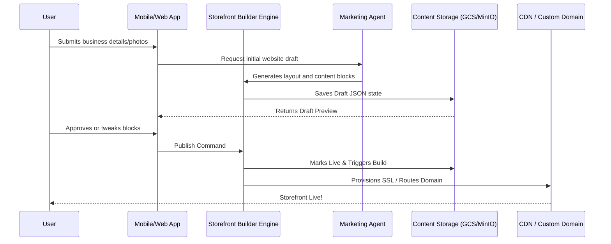

# Website & Storefront Builder Architecture

## Title
Website & Storefront Builder Architecture

## Problem Statement
Small business owners—from bakers to handymen—often find standard website builders (like Shopify, Wix, or Squarespace) too complex, requiring a learning curve and technical know-how. The pain point is configuring a storefront correctly while managing layout, SEO, mobile responsiveness, and custom domains. The opportunity is to create a frictionless, zero-technical-knowledge builder where an AI (the "Marketing & Advertising" agent) automatically generates, organizes, and publishes the website based on plain-language inputs and auto-detected business needs.

## Research Report
- **Goal**: Architect a seamless Website & Storefront Builder for OHC that works beautifully out-of-the-box. It must support multiple business categories (physical products, services/bookings, food pre-orders, digital products) without manual template wrestling.
- **Target Audience**: Maya (the baker), Carlos (the handyman), Priya (the boutique owner), Leo (the music tutor), and Fatima (the food cart operator).
- **Competitive Analysis**:
  - **Shopify/Wix/Squarespace**: Require high manual configuration. Users must pick themes, align blocks, set up payment gateways, and configure mobile layouts. Time-to-live is 30–60 minutes.
  - **OHC Advantage**: Zero code, zero jargon. Time-to-live is < 10 minutes. The layout is auto-generated and intrinsically mobile-first (375px baseline) with premium aesthetics built-in (Glassmorphism, specific typography).
- **Key Features Needed**:
  - Drag-and-drop block interface (or fully AI-generated with block-level tweaks).
  - Pre-defined, specialized blocks (e.g., hero, product grid, service list, booking calendar, contact form).
  - Automatic mobile responsiveness (no desktop/mobile split editing).
  - Invisible SEO handling and custom domain provisioning.

## Design Doc

### 1. Architecture Flow

### 2. User Experience (Mobile-First UX)
- **Baseline**: 375px width strictly enforced for all management tasks.
- **Flow**:
  1. **Input**: User answers 3 simple questions (Business name, type of business, uploads a few photos).
  2. **Generation**: A loading screen with premium motion graphics plays while the AI creates the site.
  3. **Review**: The user is presented with a complete, scrollable draft.
  4. **Customization**:
     - Users tap "Edit" on a block (e.g., Hero image).
     - They can swap photos, rewrite text, or ask the AI to "make it sound more professional."
     - They can tap "Add Section" and select clear categories: "Add Testimonials," "Add Booking Calendar," "Add FAQ."
  5. **Publish**: One-tap "Go Live" button.

### 3. Key Design Decisions
- **JSON-Driven Layouts**: The frontend reads a structured JSON payload defining the blocks and renders them natively using Flutter widgets. This avoids HTML/CSS generation complexity and ensures perfect mobile parity.
- **Component Primitives (Blocks)**: The builder uses a fixed set of high-quality, pre-designed blocks that automatically adhere to the OHC Premium Token library (Glassmorphism, Outfit/Inter typography). Users cannot break the design.
- **AI-First Content**: The Marketing Agent auto-fills blocks with relevant placeholder copy and images (or the user's uploaded images). It also automatically populates meta tags for SEO.
- **Publishing Pipeline**: When a user hits "Publish," the JSON layout is marked as active. For users on the Starter/Pro tiers, the builder interfaces with a domain registrar API to instantly provision SSL and route the custom domain.

## Implementation Prompt
"Implement the core logic for the Website & Storefront Builder Engine. It must accept a structured representation of a website (e.g., a list of content blocks) and save it as a draft or live version for a specific tenant. Ensure the API provides endpoints to retrieve the active storefront configuration for rendering. Implement the domain provisioning trigger (mocked for now) when a site transitions to 'published'. Remember, do not prescribe the exact database schema, but ensure the engine supports versioning (draft vs. live)."

## Priority
P0

## Estimated Scope
Large