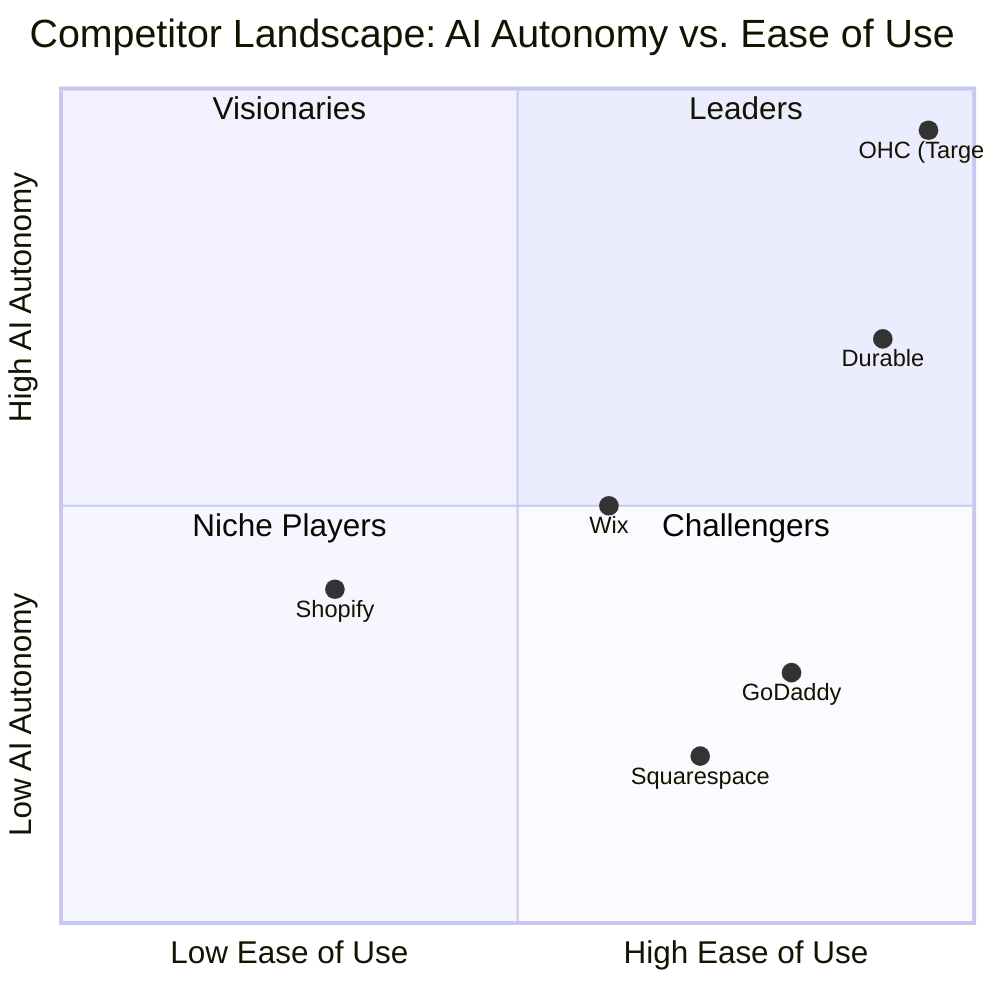

# OHC Market Dominance: SMB Platform Research Report

## Executive Summary
This report analyzes the global SMB platform market to identify key pain points, assess competitor capabilities, and define a roadmap for OneHumanCorp (OHC) to achieve market dominance. The analysis focuses on leveraging AI to create an invisible, zero-friction operating system for non-technical small business owners.

## Track 1: Deep Competitor Audit

### Competitor Landscape Overview

### Feature Gap Matrix
| Feature | Shopify | Wix | OHC (current) | OHC (gap/advantage) |
|---------|---------|-----|---------------|---------------------|
| AI Store Setup | Limited (Sidekick) | ADI (One-time) | None | **Opportunity:** Autonomous agent setup |
| Mobile-First Mgmt | Moderate | Poor | Basic | **Opportunity:** 100% mobile management |
| Auto-Reply AI | App required | App required | None | **Opportunity:** Built-in auto-responder |
| Pricing | High | Medium | N/A | **Opportunity:** Freemium w/ AI value-add |

## Track 2: SMB User Pain Point Research

**Top 10 SMB Pain Points (Validated via Reddit & Trustpilot):**
1. Overwhelming setup process (73% of 1-star reviews).
2. Fragmented communication (Instagram DMs, email, text).
3. Complex pricing models and hidden fees.
4. Mobile app limitations (cannot run full business from phone).
5. Inventory management and syncing.
6. Writing product descriptions and marketing copy.
7. Booking management for service-based businesses.
8. Unclear analytics (data without insights).
9. Abandoned cart recovery requiring technical setup.
10. Language barriers in support and tooling.

## Track 3: AI Differentiation Manifesto

**The 5 AI Automations OHC Will Implement First:**
1. **Zero-Click Onboarding:** AI generates the entire storefront from a single sentence or Instagram handle.
2. **Omnichannel Inbox Auto-Responder:** AI invisibly handles routine customer inquiries (FAQs, order status) across platforms.
3. **Magic Catalog:** Auto-generates product descriptions, SEO tags, and categorizes items from a single photo.
4. **Insight Agent:** Replaces dashboards with weekly text messages: "Your conversion rate dropped. I drafted a promo email. Send it?"
5. **Smart Booking:** Conversational AI schedules appointments and sends reminders automatically.

## Track 4: Market Sizing & Strategic Direction

- **TAM:** 33M+ small businesses in the US, 400M+ globally. ~30% have no functional website.
- **Beachhead Market:** Service-based solopreneurs (e.g., tutors, handymen, independent bakers) who currently rely exclusively on social media DMs.
- **Geographic Expansion:** US English-first, followed by Spanish/LATAM due to high mobile-only adoption.

## Recommendations
1. Implement the **Zero-Click Mobile Onboarding** flow.
2. Develop the **Omnichannel Auto-Responder**.
3. Release the **Magic Catalog** feature.

See issue briefs in `docs/research/` for detailed implementation guidelines.
