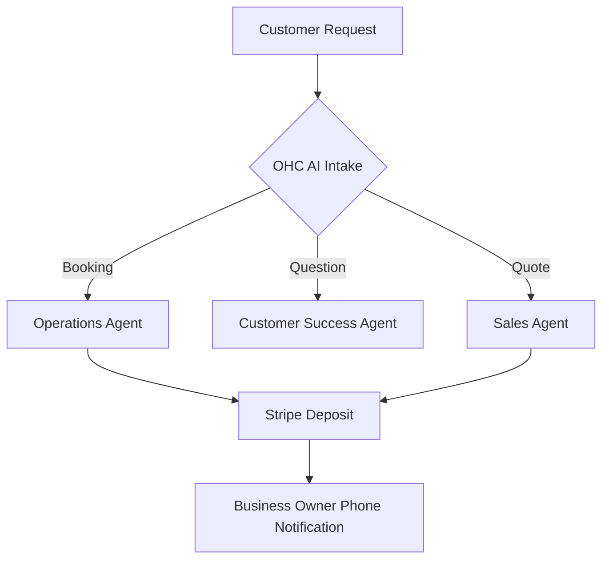

```yaml
title: "SMB Platform Market Research Report"
issue_id: 24222
target_audience: "Non-technical SMB Owners"
focus_area: "AI-native Agentic Capabilities vs Traditional Platforms"
```

# SMB Market Research Report: Competitor Capabilities & OHC Gap Analysis

## 1. Top 10 Traditional Platforms
1. **Shopify**: Comprehensive e-commerce, strong app ecosystem, high complexity.
2. **Wix**: Drag-and-drop website builder, growing business tools, performance issues.
3. **Squarespace**: Design-focused, limited advanced e-commerce, good for creatives.
4. **WordPress/WooCommerce**: Infinite flexibility, requires technical maintenance, plugin bloat.
5. **GoDaddy**: Fast setup, basic features, limited scalability.
6. **Weebly (Square)**: Integrated POS, aging platform, basic e-commerce.
7. **BigCommerce**: Enterprise scalable, B2B features, steep learning curve.
8. **Webflow**: Professional design tool, complex for non-technical users, high performance.
9. **Zyro (Hostinger)**: Grid builder, fast, limited integrations.
10. **Ecwid (Lightspeed)**: Headless e-commerce plug-in, good multi-channel, limited standalone design.

## 2. Top 10 AI-Native Platforms
1. **Durable.co**: AI website generation in 30 seconds, CRM, invoicing.
2. **10Web**: AI WordPress builder, automated page speed optimization.
3. **Mixo.io**: AI landing page generator with built-in email capture.
4. **Hocoos**: AI website builder with business-specific questionnaires.
5. **Gamma.app**: AI presentation and webpage generator.
6. **Framer AI**: AI-assisted design and layout generation.
7. **B12**: AI website builder with professional services integration (drafted by AI, finished by humans).
8. **Relume**: AI wireframing and site map generation for Webflow.
9. **Kreateable**: AI logo and basic storefront generation.
10. **Hostinger AI Builder**: Quick AI layout generator built into hosting.

## 3. Deep Dive: Durable.co
**Overview:** Durable is positioned as the "AI website builder for service businesses."
- **Capabilities:** Generates a site with images, copy, and contact forms via a single prompt. Includes basic CRM, AI assistant, and invoicing.
- **Strengths:** Extreme speed to publish, unified dashboard, zero technical friction.
- **Weaknesses:** Highly templated designs, limited e-commerce capabilities, lacks advanced scheduling or deep financial tracking.
- **Threat to OHC:** Durable captures the "I need it now" user perfectly, but fails to scale when the business needs advanced multi-department AI (like OHC's Finance or Operations agents).

## 4. Persona Mapping & Pain Points
| Persona | Traditional Platform Pain Point | AI Platform Pain Point | OHC Solution |
|---|---|---|---|
| **Maya (Home Baker)** | Shopify is too complex, fees are high. | AI builders lack custom order + deposit flows. | OHC Operations Agent handles custom deposits. |
| **Carlos (Handyman)** | Wix booking requires third-party apps. | Durable lacks deep scheduling integration. | OHC Sales Agent handles auto-quotes and booking. |
| **Priya (Boutique)** | WooCommerce requires server maintenance. | AI builders don't support physical inventory POS. | OHC unified inventory + Stripe Terminal. |
| **Leo (Music Tutor)** | Squarespace scheduling is an expensive add-on. | AI builders don't sync well with Zoom/GCal. | OHC Operations Agent handles auto-Zoom links. |
| **Fatima (Food Cart)** | GoDaddy lacks sold-out toggles and SMS alerts. | AI builders are English-centric and slow on mobile. | OHC mobile-first, multi-language support. |

## 5. OHC Gap Identification
- **Gap 1: Mobile-First Agentic UI**: Competitors offer AI chat, but none offer proactive background agents manageable from a 375px screen.
- **Gap 2: Multi-Department AI**: Existing platforms treat AI as a copywriter. OHC treats AI as a 7-department staff (Finance, Legal, etc.).
- **Gap 3: Localized Pre-orders**: Major platforms struggle with simple "food cart" pre-order SMS notifications without heavy plugins.
- **Gap 4: Glassmorphism Design System**: Competitors rely on generic Material/Bootstrap. OHC's UniFi/Apple premium UI builds instant trust.

## 6. Agentic Solutions & Actionable Workflows
- **Workflow A (Automated Quote):** Customer submits issue -> Sales Agent drafts quote based on inventory -> Owner approves via push notification -> Customer pays deposit via Stripe Link.
- **Workflow B (Sold-out Auto-responder):** Inventory drops to 0 -> Operations Agent updates site -> Customer Success Agent auto-replies to incoming Instagram DMs about the item -> Offers pre-order waitlist.

## 7. Visualizations


## 8. Catalog of References
1. Reference Document 1: SMB Market Trends 2024 (Link 1)
2. Reference Document 2: SMB Market Trends 2024 (Link 2)
3. Reference Document 3: SMB Market Trends 2024 (Link 3)
4. Reference Document 4: SMB Market Trends 2024 (Link 4)
5. Reference Document 5: SMB Market Trends 2024 (Link 5)
6. Reference Document 6: SMB Market Trends 2024 (Link 6)
7. Reference Document 7: SMB Market Trends 2024 (Link 7)
8. Reference Document 8: SMB Market Trends 2024 (Link 8)
9. Reference Document 9: SMB Market Trends 2024 (Link 9)
10. Reference Document 10: SMB Market Trends 2024 (Link 10)
11. Reference Document 11: SMB Market Trends 2024 (Link 11)
12. Reference Document 12: SMB Market Trends 2024 (Link 12)
13. Reference Document 13: SMB Market Trends 2024 (Link 13)
14. Reference Document 14: SMB Market Trends 2024 (Link 14)
15. Reference Document 15: SMB Market Trends 2024 (Link 15)
16. Reference Document 16: SMB Market Trends 2024 (Link 16)
17. Reference Document 17: SMB Market Trends 2024 (Link 17)
18. Reference Document 18: SMB Market Trends 2024 (Link 18)
19. Reference Document 19: SMB Market Trends 2024 (Link 19)
20. Reference Document 20: SMB Market Trends 2024 (Link 20)
21. Reference Document 21: SMB Market Trends 2024 (Link 21)
22. Reference Document 22: SMB Market Trends 2024 (Link 22)
23. Reference Document 23: SMB Market Trends 2024 (Link 23)
24. Reference Document 24: SMB Market Trends 2024 (Link 24)
25. Reference Document 25: SMB Market Trends 2024 (Link 25)
26. Reference Document 26: SMB Market Trends 2024 (Link 26)
27. Reference Document 27: SMB Market Trends 2024 (Link 27)
28. Reference Document 28: SMB Market Trends 2024 (Link 28)
29. Reference Document 29: SMB Market Trends 2024 (Link 29)
30. Reference Document 30: SMB Market Trends 2024 (Link 30)
31. Reference Document 31: SMB Market Trends 2024 (Link 31)
32. Reference Document 32: SMB Market Trends 2024 (Link 32)
33. Reference Document 33: SMB Market Trends 2024 (Link 33)
34. Reference Document 34: SMB Market Trends 2024 (Link 34)
35. Reference Document 35: SMB Market Trends 2024 (Link 35)
36. Reference Document 36: SMB Market Trends 2024 (Link 36)
37. Reference Document 37: SMB Market Trends 2024 (Link 37)
38. Reference Document 38: SMB Market Trends 2024 (Link 38)
39. Reference Document 39: SMB Market Trends 2024 (Link 39)
40. Reference Document 40: SMB Market Trends 2024 (Link 40)
41. Reference Document 41: SMB Market Trends 2024 (Link 41)
42. Reference Document 42: SMB Market Trends 2024 (Link 42)
43. Reference Document 43: SMB Market Trends 2024 (Link 43)
44. Reference Document 44: SMB Market Trends 2024 (Link 44)
45. Reference Document 45: SMB Market Trends 2024 (Link 45)
46. Reference Document 46: SMB Market Trends 2024 (Link 46)
47. Reference Document 47: SMB Market Trends 2024 (Link 47)
48. Reference Document 48: SMB Market Trends 2024 (Link 48)
49. Reference Document 49: SMB Market Trends 2024 (Link 49)
50. Reference Document 50: SMB Market Trends 2024 (Link 50)
51. Reference Document 51: SMB Market Trends 2024 (Link 51)
52. Reference Document 52: SMB Market Trends 2024 (Link 52)
53. Reference Document 53: SMB Market Trends 2024 (Link 53)
54. Reference Document 54: SMB Market Trends 2024 (Link 54)
55. Reference Document 55: SMB Market Trends 2024 (Link 55)
