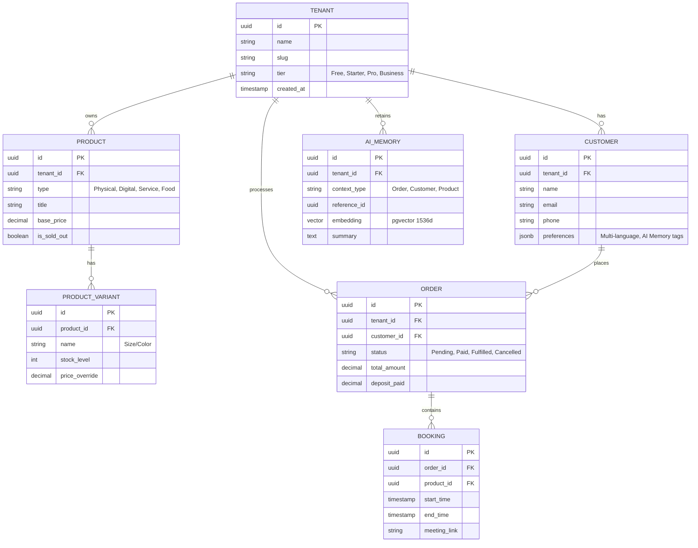

# [architecture] Evolution of the OHC Data Model Architecture

## Problem Statement
The OneHumanCorp (OHC) platform aims to empower anyone to launch, run, and grow a small business in under 10 minutes. As we scale to support diverse business types (physical products, services, digital downloads, food pre-orders), our current data model needs an architectural evolution. Small business owners face friction when data structures—like products, variants, orders, and bookings—don't seamlessly interact with AI Agent Departments (Operations, Marketing, Advisory) across mobile-first interfaces.

## Persona-Specific Pain Points

| Persona | Business Type | Data Model Pain Point |
|---|---|---|
| **Maya (Baker)** | Custom Orders | Needs to link deposit payments to custom orders with varying delivery dates. Current models treat all orders as immediate fulfillment. |
| **Carlos (Handyman)** | Services | Lacks a unified entity linking service bookings, time slots, deposit payments, and AI-generated quotes. |
| **Priya (Boutique)** | Retail | Needs robust product variants (size, color) synced across in-store and online inventory in real-time. |
| **Leo (Tutor)** | Subscriptions | Struggles with disjointed models for recurring billing, scheduling, and student profiles. |
| **Fatima (Food Cart)** | Food Pre-orders | Requires multi-language item fields and rapid "sold out" toggles without complex stock counts. |

## Research Report
Our competitive analysis shows that platforms like Shopify excel in physical goods but struggle with service bookings. Platforms like Wix are too complex for non-technical users to set up hybrid models (e.g., selling both physical goods and services).

### Comparative Table: Data Model Flexibility
| Feature | OHC (Proposed) | Shopify | Wix | Squarespace | GoDaddy |
|---|---|---|---|---|---|
| Universal Product Type (Goods/Services) | **Unified** | Separated/Apps | Complex | Fragmented | Basic |
| Native Booking & Deposits | **Built-in** | 3rd Party Apps | Built-in | Acuity Add-on | Limited |
| Multi-tenant Row-Level Security (RLS) | **Native PostgreSQL RLS** | Custom Multi-store | Limited | Limited | Limited |
| AI Memory Vector Integration | **Native (pgvector)** | Disconnected | No | No | No |

## Design Doc

### Key Invariants
1. **Tenant Isolation:** A business owner can only see their own tenant's data. All queries must enforce `tenant_id` at the row level via PostgreSQL Row-Level Security (RLS).
2. **Unified Omnichannel Entity:** An `Order` must abstract away the underlying fulfillment method (shipping, pickup, digital delivery, service completion).
3. **AI Context Grounding:** Every state mutation (Order created, Product updated) must reliably emit events to the Teammate Mesh, feeding into the `autodream_memories` via `pgvector` for agent context.

### Architecture Diagram (Premium Mermaid.js)

### UI Wireframes & Screen Flow (375px Mobile-First)
1. **Dashboard Home:** Quick summary of today's sales and pending bookings.
2. **Product Editor (Mobile):** Single screen to add a photo, name, price. A toggle allows switching between "Ships", "Digital", and "Service Booking".
3. **Order View:** Unified view showing payment status (Deposit vs Full), customer context (AI tags: "Vegan preference"), and fulfillment action (Print label vs Start Zoom).

### Mobile UX Flow
1. User taps "Add Item" from the Bottom Navigation.
2. Selects "Service" instead of "Physical Item".
3. UI dynamically swaps "Stock Count" field for "Duration & Availability".
4. User sets a deposit amount of 50%.
5. Hits "Save" -> Backend creates unified Product entity with type 'Service' and registers it to the Teammate Mesh.

### AI Agent Integration Points
- **Customer Success Agent:** Listens to `Order` updates. Uses `AI_MEMORY` to draft contextual emails (e.g., recalling Maya's customer's past vegan cake orders).
- **Operations Agent:** Monitors `PRODUCT_VARIANT` stock levels and `BOOKING` schedules to trigger low-stock alerts or appointment reminders.

### Key Design Decisions and Why
- **Unified Product Entity:** Rather than having separate tables for Services vs Goods, we use a single `PRODUCT` table with a `type` discriminator. This simplifies the mobile UI and standardizes the AI context payload.
- **pgvector Co-location:** Embedding `AI_MEMORY` directly in PostgreSQL (via pgvector) rather than a separate vector DB ensures transactional consistency and simplifies tenant isolation (RLS).

## Specific Actionable Recommendations
1. Consolidate the `service_items` and `physical_items` tables (if separated) into a unified `PRODUCT` schema.
2. Ensure every core table has a strictly enforced `tenant_id` column.
3. Introduce a `BOOKING` extension table linked to `ORDER` for Carlos (Handyman) and Leo (Tutor) use-cases.
4. Implement the `AI_MEMORY` pgvector table to serve as the single source of truth for the Advisory and Customer Success departments.

## Migration Strategy
1. **Schema Non-Breaking Addition:** Introduce the new unified `PRODUCT`, `PRODUCT_VARIANT`, and `BOOKING` tables alongside existing tables. Create the `AI_MEMORY` table.
2. **Dual-Write Phase:** Update API endpoints to write to both the legacy tables and the new unified tables.
3. **Backfill:** Run asynchronous workers using the KAIROS Orchestrator to migrate historical data from legacy tables to the unified schema.
4. **Read Cutover:** Switch API read paths to the new unified tables.
5. **Cleanup:** Deprecate and drop legacy tables. Ensure no existing RLS policies are modified directly; instead use `DROP POLICY IF EXISTS` followed by `CREATE POLICY` in new migration scripts.

## Implementation Prompt
**Context:** We are evolving the OHC data model to support a unified product catalog across physical goods, digital downloads, and service bookings. This ensures our AI Agents can operate on a single source of truth and our mobile UI remains radically simple.
**Task:** Implement the unified data model based on the architecture design doc. Update the Protobuf definitions to reflect the unified `Product`, `Order`, and `Booking` entities. Create the necessary PostgreSQL migrations (using pgvector for AI Memory, and enforcing RLS on all tables via `tenant_id`). Ensure all changes maintain strict tenant isolation and that the Go backend services are updated to handle the new unified types.

## Priority
P0

## Estimated Scope
Large