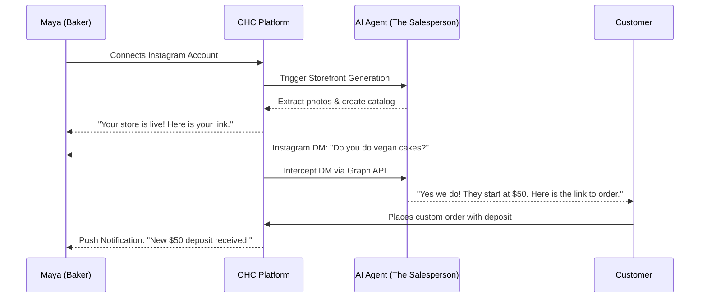
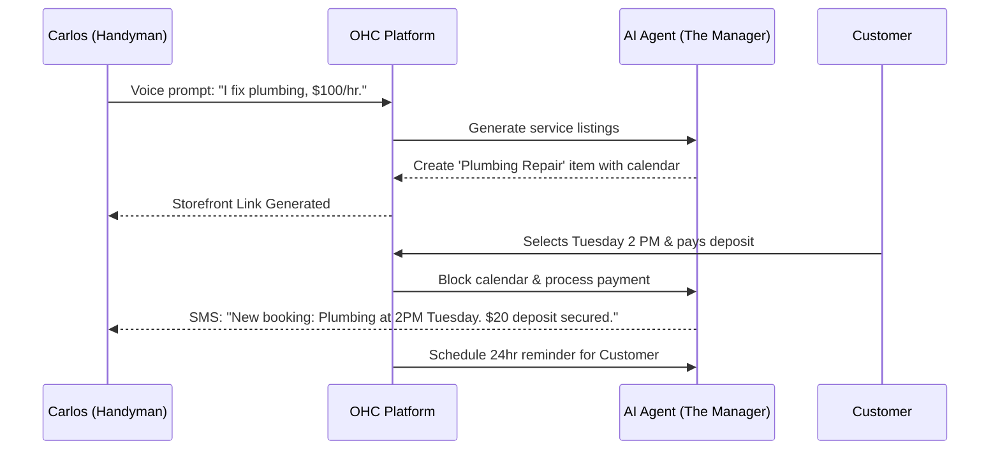
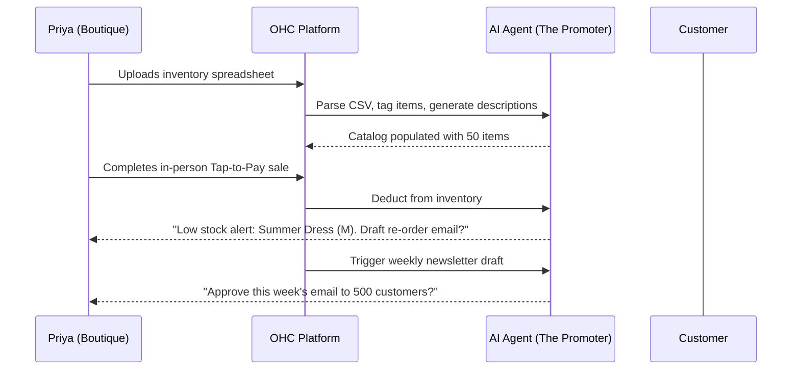
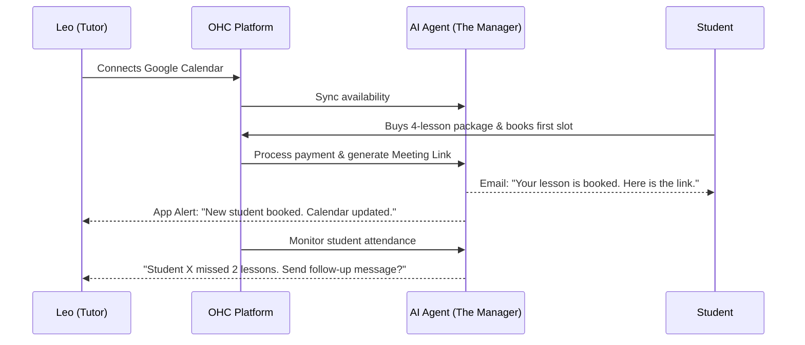
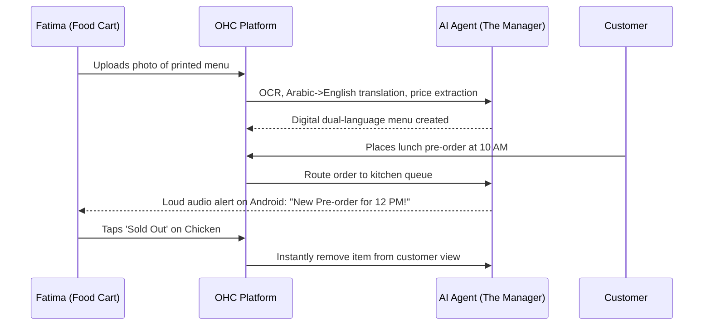

# Comprehensive Research Report: Business Journey Architecture

## Executive Summary
OneHumanCorp (OHC) aims to allow anyone to launch, run, and grow a business from their phone in under 10 minutes. This report details the end-to-end user journeys for five primary personas, maps their acquisition, onboarding, activation, retention, revenue, and referral flows, and identifies critical friction points. By leveraging AI background agents invisibly, OHC can mitigate these friction points and guarantee a seamless Day 1 experience.

## Key Personas

| Persona | Business Type | Key Needs | Hardware Profile |
|---------|---------------|-----------|------------------|
| **Maya (28)** | Custom Bakery | Photo catalog, deposit-based orders, AI Instagram DM replies | iPhone |
| **Carlos (42)** | Handyman | Service listings, booking calendar, deposit payments, quotes | Low-to-Mid Android |
| **Priya (35)** | Boutique | Online/in-person sync, variant support, tap-to-pay, email marketing | iPhone/Desktop |
| **Leo (22)** | Music Tutor | Booking with calendar sync, auto meeting links, subscription | iPhone |
| **Fatima (50)**| Food Cart | Pre-orders, sold-out toggles, printable daily lists, Arabic/English UI | Low-end Android |

---

## End-to-End User Journeys

### 1. Maya (Custom Baker)
**Acquisition:** Clicks an Instagram ad showing a competitor's AI agent handling DMs.
**Onboarding:** Connects Instagram; OHC auto-generates a storefront from her existing photos.
**Activation:** First deposit received for a custom cake order.
**Retention:** Push notifications when the "Salesperson" agent successfully quotes a price over DM.
**Revenue:** Upgrades to Pro to get unlimited AI DM responses.
**Referral:** Mentions OHC in an Instagram Story to other bakers.

### 2. Carlos (Handyman)
**Acquisition:** Word-of-mouth from a contractor friend.
**Onboarding:** Speaks into the app (voice onboarding): "I fix pipes and do painting."
**Activation:** First booked appointment with a $20 deposit.
**Retention:** Receives daily schedule briefing via push notification.
**Revenue:** Starts on Free, upgrades to Starter when he hits 10 appointments.
**Referral:** Tells subcontractors to use the app for invoicing him.

### 3. Priya (Boutique Owner)
**Acquisition:** Searches "best inventory app for clothing stores".
**Onboarding:** Uploads a CSV of her current inventory from her old POS.
**Activation:** Sells first item in-store using Tap-to-Pay.
**Retention:** Weekly AI-generated email marketing drafts ready for one-tap approval.
**Revenue:** Business Tier for POS + Online Sync.
**Referral:** Invites employees to manage the store as sub-users.

### 4. Leo (Music Tutor)
**Acquisition:** TikTok link-in-bio search.
**Onboarding:** Connects Google Calendar; OHC automatically figures out his free slots.
**Activation:** Student buys a 4-lesson subscription package.
**Retention:** Automated Zoom links generated; no manual admin work.
**Revenue:** Starter tier for subscription billing.
**Referral:** TikTok video showing how he automated his tutoring business.

### 5. Fatima (Food Cart)
**Acquisition:** Direct sales / community outreach. Needs Arabic support.
**Onboarding:** Takes photos of her physical menu; AI translates and creates digital items.
**Activation:** First pre-order received before she opens the cart.
**Retention:** Large text, loud ringtones for new orders. Daily printable prep list.
**Revenue:** Free tier; pays via transaction fees.
**Referral:** Tells other cart owners at the commissary kitchen.

---

## Friction Points & Architectural Gaps

| Persona | Stage | Friction Point (Risk of Abandonment) | Architectural Requirement |
|---------|-------|--------------------------------------|---------------------------|
| **Maya** | Onboarding | Connecting Facebook/Instagram API is notoriously complex and buggy. | **OAuth Abstraction:** AI agent must handle token refreshes and permissions transparently. |
| **Carlos** | Setup | Typing out long service descriptions on a small Android keyboard. | **Voice-to-JSON Pipeline:** OHC must support voice-dictation directly into structured catalog data. |
| **Priya** | Migration | CSV uploads often fail due to strict schema requirements. | **Fuzzy Schema Matching:** Agent must map irregular CSV columns to OHC data model automatically. |
| **Leo** | Activation | Calendar sync conflicts (timezone issues, double booking). | **Distributed State Machine:** Calendar locks must use optimistic concurrency to prevent double bookings. |
| **Fatima** | Daily Use | Missing order notifications if the app goes to sleep in the background. | **Reliable Push Delivery:** Use high-priority FCM/APNs packets. App needs a custom loud ringtone override. |

## AI Background Agent Interventions
To guarantee the **10-minute zero-to-live** mandate, users should never configure settings manually. Instead, OHC will deploy:
1.  **"The Manager" (Operations):** Watches inventory and calendar states. Reacts to webhooks from payment gateways.
2.  **"The Salesperson" (Acquisition):** Listens to connected social channels (Instagram DMs, WhatsApp). Uses RAG against the store catalog to answer questions and generate checkout links.
3.  **"The Promoter" (Marketing):** Runs a CRON job to evaluate weekly sales data and drafts email campaigns.
4.  **"The Accountant" (Finance):** Aggregates Stripe/MercadoPago payouts into a unified daily digest.
