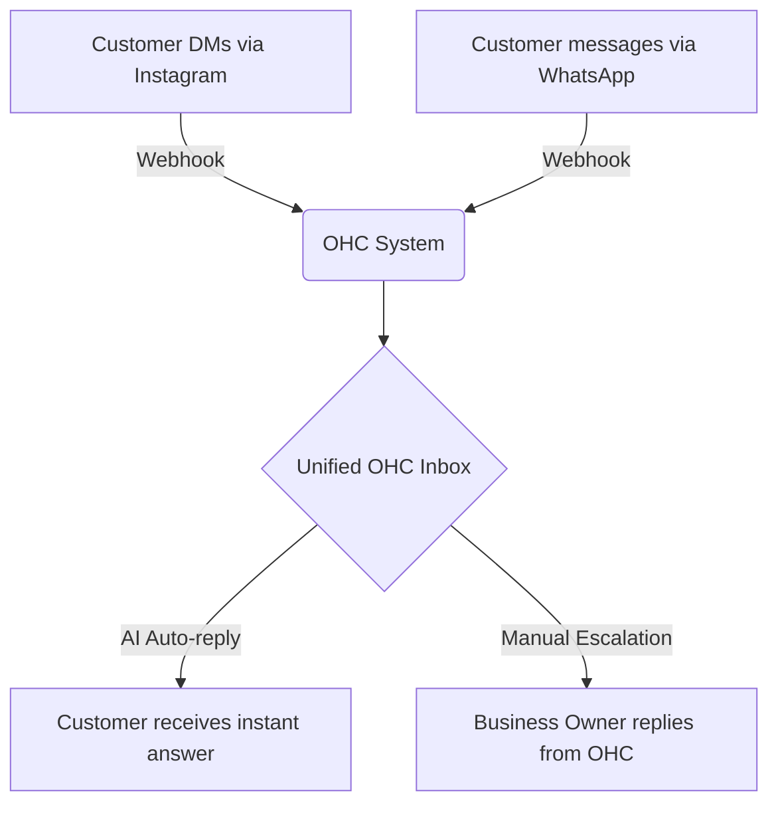
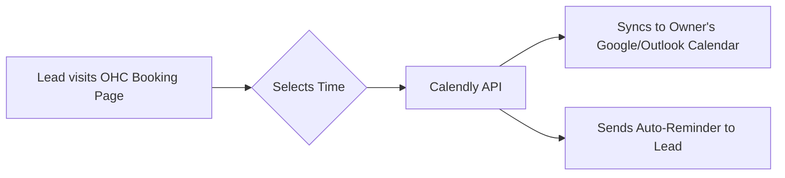
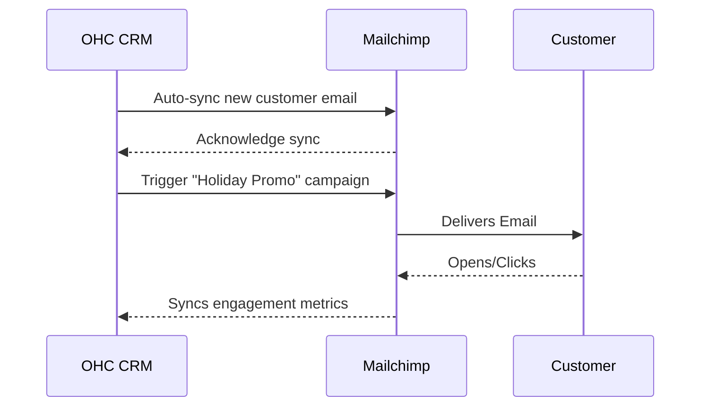
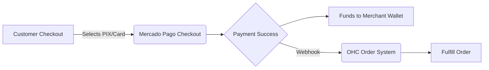
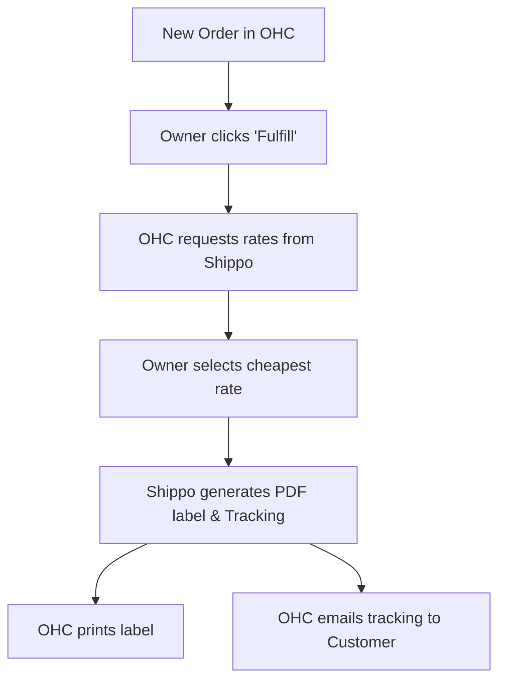
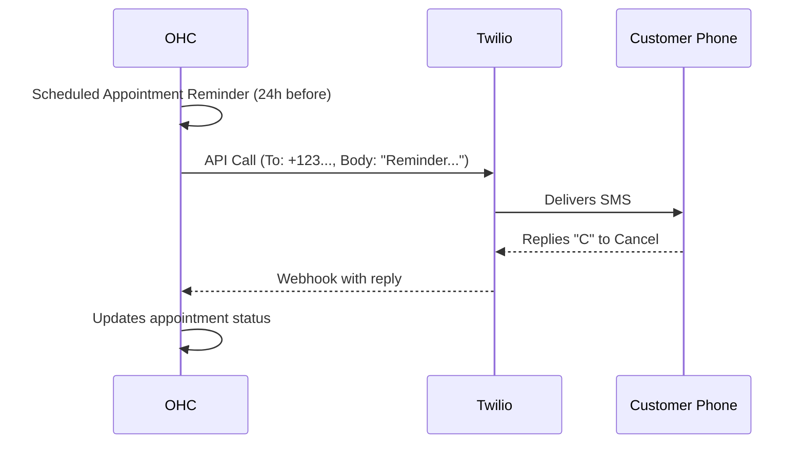
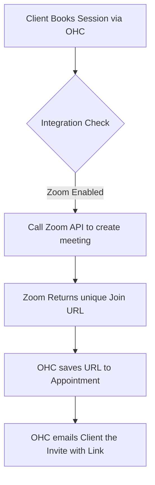

# 🔍 Scout: Tool Integration Research Q4

## 1. Social Media Integration
### Title: Integrate ManyChat for Unified Inbox & DM Automation
**Problem Statement**: Small business owners, like boutique owners, are overwhelmed by messages across Instagram DMs, Facebook, WhatsApp, and TikTok. They lose sales because they cannot reply to customer inquiries fast enough, and constantly switching between apps is frustrating and time-consuming.

**Research Report**:
ManyChat is a leading platform for automating and consolidating chat marketing across Meta platforms and WhatsApp.
*   **Ease of Use**: Very high for non-technical users. It features a drag-and-drop flow builder.
*   **Pricing**: Free tier available (up to 1,000 contacts). Pro tier starts at $15/month.
*   **Reputation**: Excellent (4.6/5 on G2). Widely adopted by small e-commerce and local businesses.
*   **Cloud vs Standalone**: Works seamlessly in Cloud mode via API/Webhooks. In Standalone mode, requires exposing a local webhook tunnel (e.g., ngrok) or polling.

| Feature | ManyChat | Hootsuite | Chatdesk |
| :--- | :--- | :--- | :--- |
| **Focus** | DMs & Chat Automation | Social Publishing | Human + AI Support |
| **Ease of Use** | ⭐⭐⭐⭐⭐ | ⭐⭐⭐ | ⭐⭐⭐⭐ |
| **Pricing** | $15/mo | $99/mo | Custom |
| **SME Fit** | Perfect | Too broad | Too expensive |

**Persona Pain Points (Sophia - Boutique Owner)**:
*   *Pain*: "I miss DM inquiries about dress sizes because I'm busy managing the store."
*   *Pain*: "I can't keep track of who messaged me on WhatsApp vs Instagram."

**Design Doc**:
The ManyChat integration will connect an owner's social accounts to the OHC system. OHC will listen for incoming messages via webhooks and display them in a unified inbox. OHC's internal AI can optionally suggest replies based on the store's inventory and FAQs. When the owner replies from the OHC inbox, the message is routed back to the correct social platform via ManyChat's API.

**Implementation Prompt**:
Build a unified inbox interface that allows users to authenticate their ManyChat account. Ensure incoming messages from Instagram, Facebook, and WhatsApp appear in a single chronological feed. The user must be able to read and reply to these messages directly from the OHC interface without leaving the app.

**Priority**: P1
**Estimated Scope**: Medium

---

## 2. Calendar & Scheduling
### Title: Integrate Calendly for Automated Appointment Booking
**Problem Statement**: Service-based business owners (e.g., consultants, hair stylists) waste hours playing "email ping-pong" trying to find a suitable time to meet with clients. Double bookings and missed appointments hurt their revenue and reputation.

**Research Report**:
Calendly is the industry standard for scheduling automation, supporting Google Calendar, Outlook, and others.
*   **Ease of Use**: Outstanding. Generating a booking link takes seconds.
*   **Pricing**: Free basic tier. Premium starts at $10/month.
*   **Reputation**: Extremely high trust and brand recognition among small businesses.
*   **Cloud vs Standalone**: Cloud works well with OAuth and webhooks. Standalone mode might require polling or user-provided API keys depending on the sync mechanism.

| Feature | Calendly | Acuity Scheduling | YouCanBook.me |
| :--- | :--- | :--- | :--- |
| **Ease of Use** | ⭐⭐⭐⭐⭐ | ⭐⭐⭐⭐ | ⭐⭐⭐⭐ |
| **Customization**| Medium | High | High |
| **Pricing** | Free / $10+ | $16+ | $10.80 |

**Persona Pain Points (Marcus - Freelance Consultant)**:
*   *Pain*: "I spend 20 minutes just trying to find a time to meet a new lead."
*   *Pain*: "Clients forget appointments because I don't have time to send manual reminders."

**Design Doc**:
Users will connect their Calendly account to OHC via OAuth. OHC will retrieve the user's booking links and embed them directly into the business's public-facing OHC website or chat widget. OHC will listen to Calendly webhooks to automatically create new CRM contacts when a booking is made and log the meeting on the contact's timeline.

**Implementation Prompt**:
Create a flow where a business owner can link their Calendly account. Once linked, display their upcoming appointments on the OHC dashboard. Automatically create or update a customer profile in the OHC CRM whenever a new appointment is booked via Calendly.

**Priority**: P0
**Estimated Scope**: Medium

---

## 3. Email Marketing
### Title: Integrate Mailchimp for Seamless Email Campaigns
**Problem Statement**: Small business owners struggle to keep their customer lists updated across their point-of-sale and their email marketing tool. Sending newsletters requires manual CSV exports, which is tedious and error-prone.

**Research Report**:
Mailchimp remains a top choice for small business email marketing due to its recognizable brand and easy template builder.
*   **Ease of Use**: Very high for template creation; managing lists can sometimes be confusing for complete beginners, but OHC will abstract this.
*   **Pricing**: Free up to 500 contacts. Starts at $13/month thereafter.
*   **Reputation**: 4.3/5 on G2. Reliable deliverability and compliance handling.
*   **Cloud vs Standalone**: Cloud supports OAuth. Standalone will need API key provision.

| Feature | Mailchimp | Brevo (Sendinblue) | Constant Contact |
| :--- | :--- | :--- | :--- |
| **Free Tier** | 500 contacts | 300 emails/day | None |
| **Ease of Use** | ⭐⭐⭐⭐ | ⭐⭐⭐⭐ | ⭐⭐⭐ |
| **Deliverability**| Excellent | Good | Good |

**Persona Pain Points (Elena - Bakery Owner)**:
*   *Pain*: "I want to email my loyal customers about holiday specials, but I don't know how to export my customer list."
*   *Pain*: "Designing emails from scratch is too hard."

**Design Doc**:
The integration will automatically sync the OHC CRM contacts to a designated Mailchimp Audience. Changes made in OHC (e.g., adding a tag like "VIP") will sync to Mailchimp. The OHC dashboard will display basic campaign stats (open rate, click rate) pulled via the Mailchimp API so the owner doesn't need to log into Mailchimp daily.

**Implementation Prompt**:
Implement a setting for the business owner to connect their Mailchimp account and select a target audience list. Ensure that any new customer added to OHC is automatically subscribed to this list (respecting opt-in status). Display a simple summary of recent campaign performances on the OHC marketing dashboard.

**Priority**: P1
**Estimated Scope**: Large

---

## 4. Payment Processing
### Title: Integrate Mercado Pago for LATAM Payment Processing
**Problem Statement**: While Stripe is the default for many regions, it is not supported or preferred everywhere. In Latin America, small business owners need a reliable, localized payment processor that supports local payment methods (like PIX in Brazil) and fast settlements.

**Research Report**:
Mercado Pago is the leading payment gateway in Latin America, deeply integrated into the local financial ecosystems.
*   **Ease of Use**: Simple onboarding for LATAM merchants.
*   **Pricing**: Varies by country, typically around 3-4% + fixed fee. No monthly setup fees.
*   **Reputation**: Highly trusted in LATAM; dominant market share.
*   **Cloud vs Standalone**: Fully supported via API in both modes. Webhooks require public endpoints in Cloud, or secure tunnels in Standalone.

| Feature | Mercado Pago | Stripe | PayPal |
| :--- | :--- | :--- | :--- |
| **LATAM Focus** | ⭐⭐⭐⭐⭐ | ⭐⭐ | ⭐⭐⭐ |
| **Local Methods** | Yes (PIX, Boleto, etc) | Limited | Limited |
| **Settlement** | Instant/Next Day | 2-7 days | Instant (to PayPal) |

**Persona Pain Points (Carlos - Electronics Vendor in Brazil)**:
*   *Pain*: "Customers want to pay with PIX, but my current checkout doesn't support it."
*   *Pain*: "I need my funds immediately to buy more inventory, I can't wait a week."

**Design Doc**:
Introduce Mercado Pago as an alternative payment provider in the OHC checkout flow. When the user enables it, OHC will generate Mercado Pago preference links for invoices and checkout pages. Webhooks will be configured to listen for payment success/failure events to update order statuses in OHC automatically.

**Implementation Prompt**:
Add Mercado Pago as a payment option in the billing settings. Enable business owners to accept payments via Mercado Pago on their OHC-generated invoices. Ensure the system correctly marks invoices as paid when the webhook receives a successful payment notification.

**Priority**: P2
**Estimated Scope**: Medium

---

## 5. Shipping & Logistics
### Title: Integrate Shippo for Automated Label Generation and Tracking
**Problem Statement**: Shipping physical products is a nightmare for small e-commerce owners. Copy-pasting addresses into carrier websites to print labels one by one takes hours, and manually sending tracking numbers to customers leads to errors and support tickets.

**Research Report**:
Shippo provides a single API to access dozens of carriers (USPS, UPS, FedEx, DHL, etc.) with discounted rates.
*   **Ease of Use**: Excellent. It abstracts away carrier-specific complexities.
*   **Pricing**: Free starter plan ($0.05 per label or use own carrier rates). Pro plans available.
*   **Reputation**: 4.0/5 on G2. Very popular among small to medium e-commerce platforms.
*   **Cloud vs Standalone**: Perfect for both, as label generation is API-driven and tracking updates via webhooks can be polled if needed in Standalone.

| Feature | Shippo | ShipStation | EasyPost |
| :--- | :--- | :--- | :--- |
| **Developer API** | ⭐⭐⭐⭐⭐ | ⭐⭐⭐ | ⭐⭐⭐⭐⭐ |
| **UI for Owners** | Great | Excellent | Good |
| **Pricing** | Pay-as-you-go | Monthly Subscription | Pay-as-you-go |

**Persona Pain Points (Sarah - Handmade Soap Maker)**:
*   *Pain*: "I spend my entire Sunday printing labels and matching them to boxes."
*   *Pain*: "Customers constantly email asking 'Where is my order?'"

**Design Doc**:
Integrate Shippo API to allow users to generate shipping labels directly from the OHC order management screen. OHC will securely pass package dimensions, weight, and destination to Shippo, retrieve rates, and let the owner buy a label. The resulting PDF label will be presented for printing, and the tracking number will automatically attach to the OHC order.

**Implementation Prompt**:
Build a "Fulfill Order" flow that connects to a user's Shippo account. Allow the user to input box dimensions/weight, see a list of shipping rates, purchase a label, and download the PDF. Automatically send an email to the customer with the tracking number once the label is purchased.

**Priority**: P1
**Estimated Scope**: Large

---

## 6. SMS & Notifications
### Title: Integrate Twilio for Reliable Global SMS Notifications
**Problem Statement**: Email open rates are declining, and for urgent updates (like appointment reminders or order deliveries), business owners need a way to reach customers instantly. Non-native English speakers or older demographics often prefer SMS over email.

**Research Report**:
Twilio is the industry standard for programmable SMS, offering unparalleled global reach and reliability.
*   **Ease of Use**: Twilio is highly technical, so OHC MUST completely abstract the complexity. The business owner should just see "Send SMS".
*   **Pricing**: Pay-as-you-go (approx $0.0079 per SMS in the US).
*   **Reputation**: 4.4/5 on G2. Enterprise-grade reliability.
*   **Cloud vs Standalone**: Works seamlessly in both. In Cloud, OHC might provide a pooled number. In Standalone, the user must provide their own Twilio API keys.

| Feature | Twilio | MessageBird | Vonage |
| :--- | :--- | :--- | :--- |
| **Global Reach** | ⭐⭐⭐⭐⭐ | ⭐⭐⭐⭐ | ⭐⭐⭐⭐ |
| **API Quality** | ⭐⭐⭐⭐⭐ | ⭐⭐⭐⭐ | ⭐⭐⭐ |
| **Cost** | Low | Low | Medium |

**Persona Pain Points (Fatima - Cleaning Service Owner)**:
*   *Pain*: "My clients don't check their email, so they forget I'm coming to clean."
*   *Pain*: "I need a way to quickly text my staff their schedule for the day."

**Design Doc**:
Integrate the Twilio SDK. In OHC Cloud, we can offer SMS as a premium add-on feature using a central OHC Twilio account. In Standalone, users enter their Twilio SID/Token. OHC will use this to dispatch automated SMS for critical events (reminders, order updates) and allow manual 1:1 texting from the CRM profile.

**Implementation Prompt**:
Create a notification settings panel where the business owner can enable SMS reminders for appointments and orders. Provide a text input on customer profiles to send direct SMS messages. Ensure all sent and received SMS messages are logged in the customer's communication history timeline.

**Priority**: P0
**Estimated Scope**: Medium

---

## 7. Video Conferencing
### Title: Integrate Zoom for Auto-Generated Virtual Meetings
**Problem Statement**: Tutors, coaches, and consultants conduct business online. Manually creating a Zoom link and emailing it to a client for every new booking is tedious and leads to errors (sending the wrong link to the wrong client).

**Research Report**:
Zoom remains the dominant player for video conferencing, heavily relied upon by remote service providers.
*   **Ease of Use**: Extremely familiar to end-users and business owners.
*   **Pricing**: Free tier (40-min limit). Pro starts at $14.99/month.
*   **Reputation**: Ubiquitous.
*   **Cloud vs Standalone**: OAuth app required for Cloud. Standalone may require a Server-to-Server OAuth app setup by the user, which is a bit technical but manageable with good documentation.

| Feature | Zoom | Google Meet | Microsoft Teams |
| :--- | :--- | :--- | :--- |
| **Adoption** | ⭐⭐⭐⭐⭐ | ⭐⭐⭐⭐ | ⭐⭐⭐ |
| **Reliability** | Excellent | Excellent | Good |
| **SME Fit** | Perfect | Perfect (if using G-Suite) | Usually Enterprise |

**Persona Pain Points (David - Online Math Tutor)**:
*   *Pain*: "I constantly forget to send the Zoom link before the session starts, and parents complain."
*   *Pain*: "I accidentally used the same Zoom link for two back-to-back students, and they joined the same room."

**Design Doc**:
Integrate Zoom API via OAuth. When an appointment is scheduled in OHC (either manually or via the booking page), OHC will automatically call the Zoom API to generate a unique meeting room. This link is attached to the OHC appointment record and automatically injected into the confirmation and reminder emails sent to the client.

**Implementation Prompt**:
Enable business owners to authenticate their Zoom account. Add a "Generate Zoom Link" toggle to the appointment creation form. When enabled, automatically create a Zoom meeting, store the join URL, and ensure it is included in the automated emails sent to the customer for that appointment.

**Priority**: P1
**Estimated Scope**: Medium