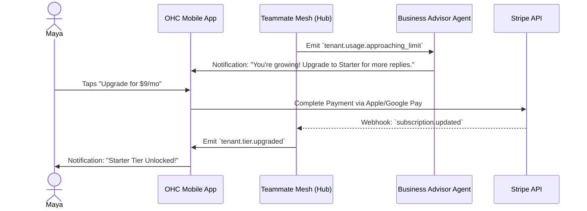

# Architecture Brief: Multi-Tenant SaaS Tiers & Unified Billing

## Title
OHC Multi-Tenant Tiers & Unified Billing: Abstracting Subscription Complexity

## Problem Statement
Small business owners (Maya, Carlos, Priya) struggle with complex payment setups and opaque subscription tiers. Currently, OHC lacks a formalized, transparent multi-tenant tier system to handle feature usage limits seamlessly. Forcing a non-technical user to navigate raw Stripe Connect setups or hit hard technical errors when reaching action limits breaks the "Grandmother Test" and leads to onboarding drop-offs. The platform requires an architecture to transparently manage platform subscriptions (Free, Starter, Pro, Business) and customer payments while gracefully handling limit exceedances via clear upgrade paths.

## Research Report
### Context and Personas
The tier system is designed for our core personas:
-   **Maya (Home Baker)**: Starts on Free, needing basic order limits and AI response capabilities for Instagram DMs.
-   **Priya (Boutique Owner)**: Will likely upgrade to Starter or Pro for inventory sync and increased product volume limits.
-   **Carlos (Handyman)**: Needs the Starter tier for increased quote generation volume.

### Competitive Analysis
-   **Shopify/Wix**: Often use confusing ad-supported free tiers or gate essential features behind expensive upgrades, causing user frustration.
-   **OHC Advantage**: OHC offers a genuinely useful Free tier based on *volume limits* (products, actions) rather than feature gating. The "Business Advisory" agent can proactively, and in plain language, suggest upgrades based on actual business velocity.

### Identified Tier System
1.  **Free:** $0/mo. 10 Products, 1 AI Department, 100 AI actions/mo, 500MB Storage, OHC Subdomain.
2.  **Starter:** $9/mo. 100 Products, 3 AI Departments, 1,000 AI actions/mo, 5GB Storage, Custom Domain.
3.  **Pro:** $29/mo. Unlimited Products, 10 AI Departments, Unlimited AI actions, 50GB Storage, Custom Domain + SSL.
4.  **Business:** $79/mo. Unlimited everything, 500GB Storage, Multi-domain.

## Design Doc

### Key Design Decisions
-   **Graceful Degradation:** When tier limits (like AI actions or storage) are reached, the system pauses actions rather than returning technical errors. It presents a plain-language explanation and a 1-tap upgrade prompt.
-   **AI Advisory Integration:** AI agents (The Advisor) monitor tier usage. They proactively suggest upgrades during the weekly health report based on usage patterns (e.g., "You're getting lots of custom cake requests! Upgrade to Starter for more AI replies.").
-   **Billing Sync:** Integration with Stripe webhooks to handle asynchronous tier upgrades, payments, and proration transparently in the background.

### Architecture Diagram (Mermaid.js)

### Mobile UX Flow (375px First)
-   **Upgrade Prompts**: Displayed as friendly "Business Health" cards, avoiding terms like "Rate Limit Exceeded."
-   **1-Tap Checkout**: Utilize native Apple Pay/Google Pay via Stripe Elements to minimize friction during tier upgrades.
-   **Plain-Language Ledger**: Simplify payment history views in the UI.

## Implementation Prompt
**To Implementer Agent:**
Implement the multi-tenant SaaS tier architecture to support the Free, Starter, Pro, and Business tiers. Ensure that usage limits (e.g., product counts, AI actions) are evaluated based on the tenant's current subscription. Implement graceful degradation so that exceeding limits returns structured feedback allowing the UI to present a plain-language upgrade path using 1-tap Apple/Google Pay flows, rather than generic API errors. Integrate Stripe webhooks to automatically synchronize subscription state changes (upgrades, cancellations) back to the tenant's local state.

## Priority
P0

## Estimated Scope
Large
