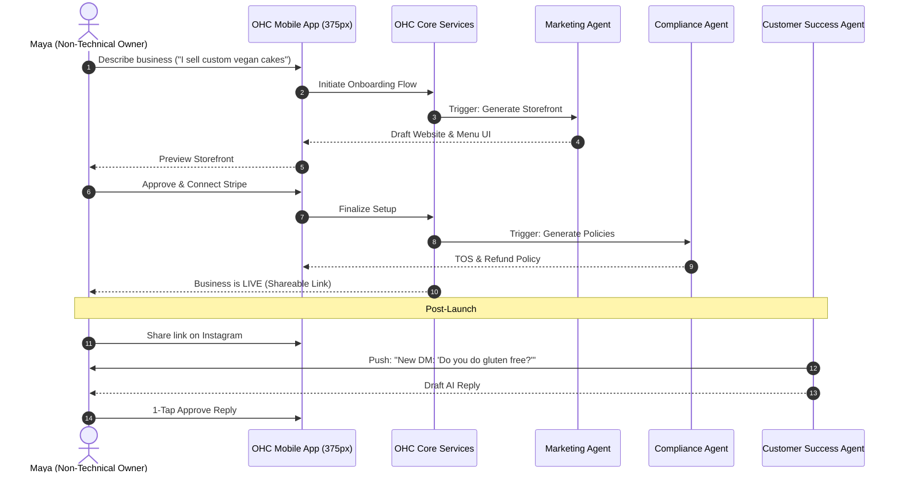

# OHC Business Journey Architecture & Persona Flows

## 1. Title
`[architecture] Business Journey Architecture & Persona Flows`

## 2. Problem Statement
Everyday people with great business ideas—like Maya the home baker or Carlos the freelance handyman—are often paralyzed by the technical complexity required to get started online. Existing platforms assume a baseline of technical literacy, forcing users to configure domains, build websites from scratch, manage complex inventory settings, and stitch together disparate tools for bookings, payments, and customer management. This "tech tax" prevents non-technical founders from launching their businesses and focusing on what they do best. OHC aims to eliminate this friction entirely, allowing anyone to go from an idea to a fully operational, AI-managed business in under 10 minutes directly from their smartphone.

## 3. Research Report & Competitive Analysis
### Market Gap Analysis
- **Shopify:** Powerful but overwhelming. Requires 30-60 minutes for initial setup, relies on a complex web of third-party apps for basic features like bookings or advanced product variants, and has a desktop-first management paradigm.
- **Wix / Squarespace:** Drag-and-drop complexity. Geared towards semi-technical or design-savvy users. AI is bolted on as an assistant, not integrated as the core infrastructure that runs the business.
- **GoDaddy:** Basic and fast, but lacks depth for complex flows (like bookings with deposits or custom order management).

### Findings
- **Mobile Dependency:** Over 70% of solopreneurs manage their business entirely from their phone. A 375px mobile-first experience is non-negotiable.
- **Immediate Value (Time to Value):** Users abandon setups that require more than 3 steps before seeing a live, tangible output (like a generated storefront or a bookable link).
- **Fear of Mistakes:** Non-technical users hesitate to publish because they fear getting legal policies, tax settings, or pricing wrong. Built-in AI advisory and compliance agents are critical to building confidence.

## 4. Design Doc

### 4.1 Architecture Diagram (End-to-End Journey)

### 4.2 Mobile UX Flow (375px First)
1. **Acquisition & Welcome (0-1 min):**
   - Clean, full-screen input: "What are you building today?"
   - User types plain text or speaks into the microphone (e.g., "I'm Carlos, a handyman doing plumbing and painting in Austin").
2. **AI Magic (1-3 mins):**
   - Progress indicators with premium Glassmorphism effects while AI agents parallel-process: designing the site, setting up service catalogs, drafting initial copy.
3. **Activation & Review (3-5 mins):**
   - User reviews the generated mobile storefront.
   - Minimal toggles to adjust pricing or upload real photos.
4. **Launch & Monetization (5-10 mins):**
   - 1-tap Stripe Connect integration (or OHC managed payments).
   - Confetti animation and a prominent "Share Link" button for Instagram/TikTok bios.
5. **Retention Loop (Daily):**
   - Daily push notifications from the "Business Advisory" agent: "You had 3 bookings today. Don't forget to ask for a review after the plumbing job tomorrow."

### 4.3 Key Design Decisions
- **No Manual Layouts:** The storefront design is fully AI-generated and template-driven. Users can tweak colors and fonts but cannot break the mobile layout.
- **Conversational Setup:** Replaces complex multi-step forms with a single natural language input, lowering the barrier to entry.
- **Invisible Departments:** The user never configures an "agent." They just see plain English notifications ("Your Legal Protector has drafted a new refund policy for custom cakes. Approve?").

## 5. Implementation Prompt
**Prompt for Implementer Agent:**
Implement the new "Magic Onboarding Flow" for the OHC mobile application. The flow must allow a non-technical user to describe their business in plain text, which will trigger the backend Orchestrator to generate a complete business profile, a drafted mobile-first storefront, and initial product/service catalogs.

**Critical User Journey (CUJ):**
1. User opens the app and enters a natural language description of their business on the welcome screen.
2. The UI transitions to a loading state with smooth, premium animations indicating AI progress.
3. The user is presented with a fully drafted storefront and catalog.
4. The user approves the draft and is given a shareable URL.

**Acceptance Criteria:**
- The entire flow must be designed for a 375px screen width, with touch targets >= 44x44px.
- Use the OHC Premium Token library (Glassmorphism, Outfit + Inter typography).
- Network requests to the Orchestrator must be resilient, showing optimistic UI where applicable and handling retries gracefully.
- Include a 100% E2E Playwright test covering the happy path from the initial description to the generation of the shareable link, starting from the UI login.
- Do not prescribe database schema changes or API endpoint structures—design these based on the existing backend conventions.

## 6. Priority & Scope
- **Priority:** P0 (Critical - Core Platform Value)
- **Estimated Scope:** Large
