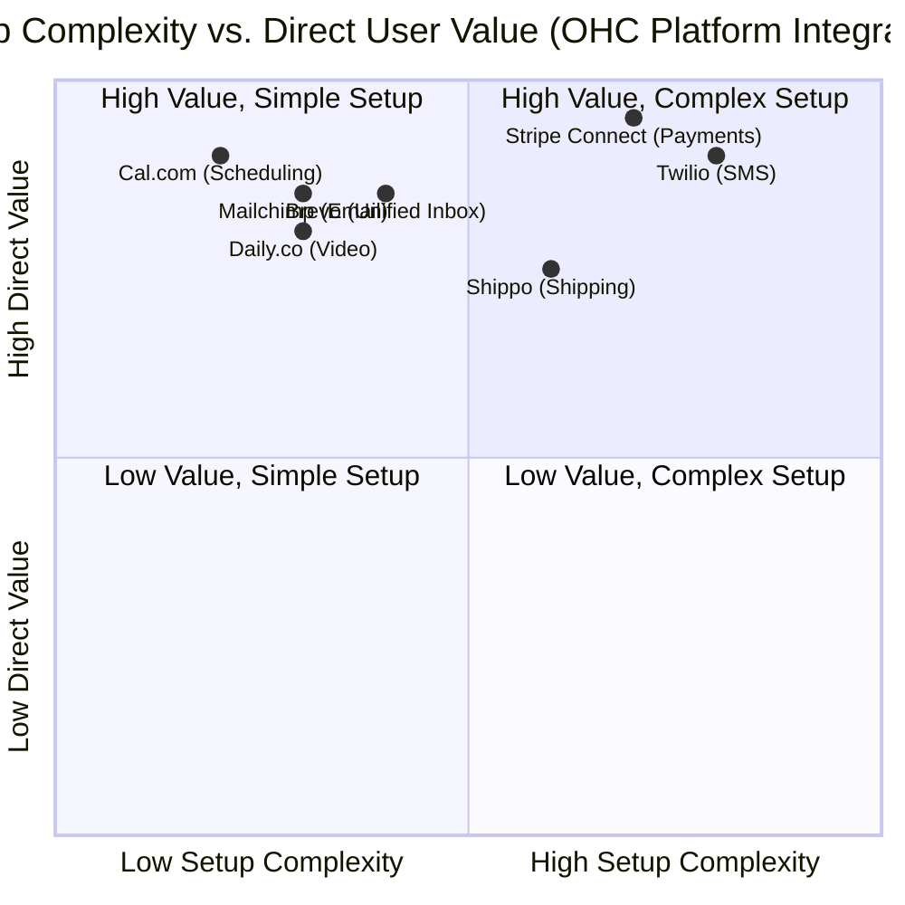

# OHC Scout: Tool Integration Research Report

## Executive Summary
This report evaluates seven critical tool categories required to expand the OneHumanCorp (OHC) platform's capabilities. The selected tools have been assessed strictly through the lens of a non-technical small business owner, ensuring they fulfill the "Radical Simplicity" and "Mobile-First" non-negotiables while functioning effectively in both Cloud and Standalone environments.

## Persona-Specific Pain Point Summaries

*   **🧁 Maya (The Home Baker):** Overwhelmed by disorganized Instagram DMs asking about cake options. Needs an automated way to capture custom order requests, take deposits via Stripe, and easily arrange deliveries on her iPhone.
*   **🔧 Carlos (The Freelance Handyman):** Loses track of quote requests sent via SMS and WhatsApp. Requires a dead-simple booking page to secure timeslots and AI-assisted quotes that can be sent directly to clients' phones.
*   **👗 Priya (The Boutique Owner):** Needs a seamless bridge between her physical store and online presence. Relies on email marketing to alert loyal customers of new stock, and needs a unified tap-to-pay solution.
*   **🎵 Leo (The Music Tutor):** Tired of manually creating Zoom links and checking his Google Calendar for conflicts. Needs a subscription-based payment model and automated video link generation that syncs natively with his calendar.
*   **🍜 Fatima (The Food Cart Operator):** Operates in a fast-paced environment with a low-end Android phone. Needs loud, reliable SMS notifications when pre-orders arrive, bypassing the need to constantly monitor a web dashboard.

## Tool Landscape: Setup Complexity vs. User Value

## Comparative Tool Overview

| Category | Recommended Tool | Target Persona | Est. Pricing | Cloud/Standalone Support |
| :--- | :--- | :--- | :--- | :--- |
| **Social Media Inbox** | Brevo Conversations | Maya, Carlos | Free - $17/mo | Cloud |
| **Scheduling** | Cal.com | Leo, Carlos | Free (Indiv) / $12/mo | Cloud & Standalone |
| **Email Marketing** | Mailchimp | Priya, Leo | Free (<500) / $20/mo | Cloud |
| **Payments** | Stripe Connect | All Personas | 2.9% + 30¢ / txn | Cloud |
| **Shipping** | Shippo | Priya, Maya | Free (5¢/label) / $17/mo | Cloud |
| **SMS/Alerts** | Twilio | Fatima, Carlos | ~$0.0083 / msg | Cloud & Standalone |
| **Video** | Daily.co | Leo | 10k mins free, then $0.004/min| Cloud & Standalone |

---

## Issue Briefs

### [Social Media Integration] Unified Customer Inbox via Brevo
**Problem Statement:** Maya receives cake inquiries across Instagram DMs, Facebook Messenger, and WhatsApp. She currently loses sales because messages slip through the cracks, and she has to manually switch between apps.
**Research Report:** Brevo offers a strong multi-channel Conversations API/feature set that unifies WhatsApp, Facebook, Instagram, and web chat. It has a generous free tier for small businesses and affordable upgrades (starting at $17/mo for standard marketing features). Unlike enterprise tools like Intercom, it is tailored for SMBs. However, deep integration requires stable OAuth connections.
**Design Doc:** OHC will provide a "Unified Inbox" screen. In the background, the OHC Customer Success Agent connects to the Brevo API. When a customer messages Maya on Instagram, it appears in her OHC app inbox. Maya replies in the OHC app, and the message routes back to the customer's Instagram.
**Implementation Prompt:** Implement a unified inbox UI that aggregates messages from an external provider. The user must be able to view a chronological chat history and type a reply directly within OHC. The setup flow should consist of a single "Connect Instagram/WhatsApp" button.
**Priority:** P1
**Estimated Scope:** Medium

### [Calendar & Scheduling] Automated Booking System via Cal.com
**Problem Statement:** Carlos and Leo need customers to pick available times for services without the back-and-forth "when are you free?" text messages.
**Research Report:** Cal.com is an open-source, developer-friendly scheduling infrastructure. It supports multi-tenant Cloud deployments via its API and Atoms (UI components), and is perfectly suited for Standalone/self-hosted modes. It natively handles timezone conversions, calendar conflict checks, and dynamic group links. Pricing is free for individuals and $12/user/mo for teams.
**Design Doc:** Integrate Cal.com Atoms into the OHC storefront. The Operations Agent will sync the OHC user's Google/Apple calendar. Customers visiting Carlos's page will see a clean, mobile-optimized date/time picker. Upon selection, OHC locks the slot and triggers a deposit invoice.
**Implementation Prompt:** Embed a scheduling component on the public storefront that allows a customer to select an available timeslot. Create a backend service that registers the booking and updates the business owner's internal OHC dashboard.
**Priority:** P0
**Estimated Scope:** Medium

### [Email Marketing] Automated Campaigns via Mailchimp
**Problem Statement:** Priya wants to tell her boutique customers about a summer sale, but exporting her customer list and sending bulk emails manually is tedious and risks spam filters.
**Research Report:** Mailchimp remains the industry standard for SMB email marketing. It offers a free tier for up to 500 contacts and 1,000 monthly sends, which is ample for early-stage OHC users. Standard plans begin at $20/mo. The API allows robust audience syncing and campaign triggering.
**Design Doc:** The OHC Marketing & Advertising Agent will sync Priya's customer list to a Mailchimp Audience via API. Priya simply tells the AI, "Send an email about my 20% off summer sale." OHC drafts the email, sends the API payload to Mailchimp to create the campaign, and pushes it out.
**Implementation Prompt:** Build a "Campaigns" interface where the user can draft an announcement. Connect this to a provider interface that syncs the OHC customer database to an external email marketing list and dispatches the drafted email campaign.
**Priority:** P2
**Estimated Scope:** Large

### [Payment Processing] Universal Checkout & POS via Stripe Connect
**Problem Statement:** Businesses need to accept online payments (deposits, subscriptions) and in-person payments securely, without needing technical knowledge to set up merchant accounts.
**Research Report:** Stripe Connect is the ideal infrastructure for multi-tenant platforms like OHC. It handles KYC, onboarding, and tax reporting. Pricing is standard (2.9% + 30¢), and it supports Stripe Terminal for in-person tap-to-pay (crucial for Priya).
**Design Doc:** OHC will implement Stripe Connect standard onboarding. The Finance & Payments Agent will utilize Stripe Payment Links for quick invoicing via SMS, and Stripe Terminal SDKs within the Flutter mobile app to allow Carlos and Priya to take tap-to-pay transactions on their phones.
**Implementation Prompt:** Implement a streamlined onboarding flow utilizing Stripe Connect's hosted components. Create a universal checkout experience for the storefront that handles one-time payments and subscriptions, and populate the internal dashboard with transaction records.
**Priority:** P0
**Estimated Scope:** Large

### [Shipping & Logistics] Seamless Label Generation via Shippo
**Problem Statement:** Priya and Maya need to ship physical goods, but manually calculating shipping rates and copying addresses into carrier websites takes hours.
**Research Report:** Shippo aggregates rates from USPS, UPS, FedEx, and DHL. Their Starter plan is free (with a 5¢/label fee when using custom accounts, or free with default accounts) and the Pro plan is $17/mo. Shippo’s API makes it incredibly easy to validate addresses and generate printable labels.
**Design Doc:** When a physical product order is placed, the OHC Operations Agent queries the Shippo API for shipping rates. Maya sees a "Print Label" button in her order details. Clicking it generates a PDF label (via Shippo) formatted for her mobile screen to print via a Bluetooth printer.
**Implementation Prompt:** Add a "Fulfillment" step to the order management flow. Integrate a shipping provider to validate the destination address, retrieve real-time shipping rates, and generate a downloadable PDF shipping label.
**Priority:** P1
**Estimated Scope:** Medium

### [SMS & Notifications] Reliable Alerts via Twilio
**Problem Statement:** Fatima cannot constantly check a web dashboard while cooking. She needs an immediate, loud text message notification whenever a new pre-order is placed.
**Research Report:** Twilio is the gold standard for programmatic SMS. At $0.0083 per inbound/outbound message in the US, it is highly cost-effective. Twilio's infrastructure guarantees high deliverability, which is critical for real-time operations like food carts. It also supports Standalone mode easily via API keys.
**Design Doc:** The Customer Success Agent monitors the order queue. Upon payment confirmation, it triggers a Twilio SMS API call directly to Fatima's registered mobile number with a short, plain-language summary: "New Order: 2x Chicken Over Rice. Pickup in 15m."
**Implementation Prompt:** Create a notification preferences screen allowing users to opt-in to SMS alerts. Implement a backend webhook listener that triggers an external SMS API call to the business owner whenever a new order is marked as 'paid'.
**Priority:** P0
**Estimated Scope:** Small

### [Video Conferencing] Automated Virtual Lessons via Daily.co
**Problem Statement:** Leo spends too much time manually generating video links for every online guitar lesson and emailing them to students.
**Research Report:** Daily.co is a developer-first WebRTC video platform. It offers 10,000 free participant-minutes per month, making it effectively free for early-stage tutors like Leo. Beyond the free tier, it scales affordably ($0.004/min). It allows fully white-labeled video rooms to be embedded natively into the OHC web or mobile app.
**Design Doc:** Upon a successful booking for a virtual service, the OHC Operations Agent calls the Daily.co API to provision a unique, time-bounded video room. The link is automatically attached to the calendar invite and the customer's receipt. Leo and the student join the video directly through the OHC browser interface.
**Implementation Prompt:** Modify the service booking flow to support "Virtual" locations. When selected, automatically generate a unique video room URL via an external WebRTC provider and expose a "Join Video" button on the appointment details screen that opens the embedded video component.
**Priority:** P2
**Estimated Scope:** Medium
