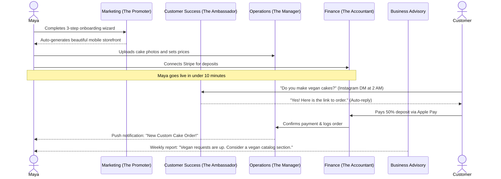
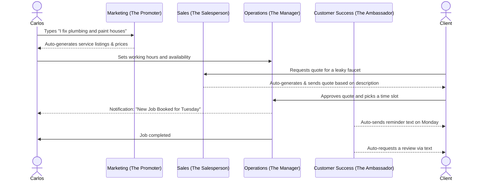
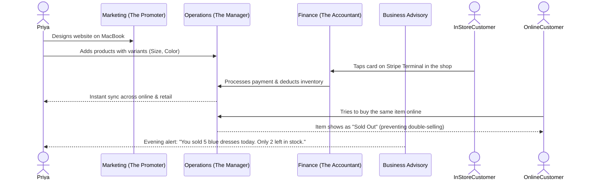
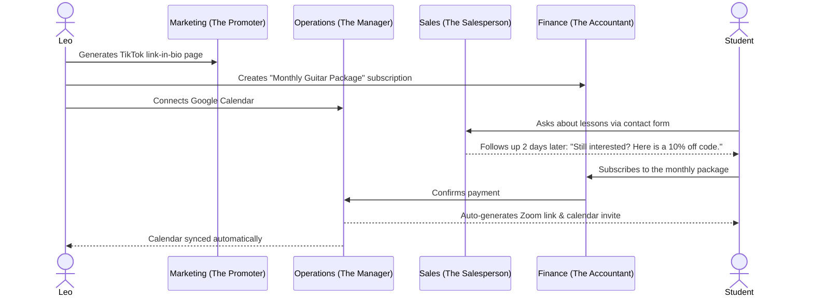
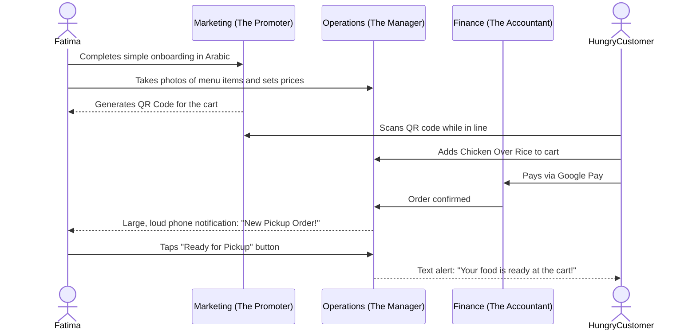

# Business Journey Architecture

This document maps out the complete end-to-end user journey for the 5 key personas of OneHumanCorp (OHC): Maya (The Home Baker), Carlos (The Freelance Handyman), Priya (The Boutique Owner), Leo (The Music Tutor), and Fatima (The Food Cart Operator). The goal is to highlight how OHC effortlessly guides non-technical small business owners from zero to a live, growing business in under 10 minutes.

---

## 1. Maya — The Home Baker

Maya bakes custom cakes from her kitchen and sells them via Instagram DMs. She's overwhelmed by Shopify's complexity and needs an easy, mobile-only way to show her catalog, accept deposits, and have an AI agent reply to standard DM questions.

**Acquisition:** Maya sees a targeted Instagram Reel of another baker easily setting up a beautiful storefront on their phone using OHC. The "Link in Bio" CTA leads her to a clean, simple landing page.
**Onboarding:** Maya downloads the OHC app. The wizard asks 3 plain-language questions: "What's your business name?", "What do you sell?", and "Connect your Instagram?". AI instantly drafts a beautiful storefront template.
**Activation:** Maya uploads three photos of her cakes right from her camera roll and sets a price. She connects her bank account (Stripe) and goes live. This all takes under 10 minutes. Success is her very first order.
**Retention:** Push notifications on her iPhone ping her for new orders. Every morning, the "Advisory" agent gives her a 2-sentence summary: "You have 3 cake deliveries today. 2 people asked about vegan options overnight—I replied to them for you."
**Revenue:** Maya starts on the Free tier. When she hits the AI Actions limit (because she's getting too many Instagram inquiries that the agent is answering), she gets a friendly notification suggesting the $9/mo Starter tier to unlock more AI assistance.
**Referral:** Maya adds a "Powered by OHC" badge to her storefront. When other bakers ask her how she handles orders so smoothly, she texts them her referral link.

---

## 2. Carlos — The Freelance Handyman

Carlos does repairs and home improvements. He relies entirely on word-of-mouth, has no website, and only has an Android phone. He needs a service listing, booking calendar, and automated quoting.

**Acquisition:** A fellow contractor tells Carlos about OHC over lunch. Carlos searches for it on Google and clicks the link.
**Onboarding:** The web UI prompts him: "Describe what you do." He types "I fix plumbing and paint houses." The AI automatically creates service listings ("Plumbing Fixes", "Painting") with placeholder prices that he adjusts.
**Activation:** Carlos sets his available working hours on a simple calendar view. He connects his bank account and gets a custom link he can text to past clients. Success is his first online booking.
**Retention:** Carlos checks his customer inbox daily on his Android phone. The AI quotes generator saves him hours each week by automatically sending estimates based on what customers type in the booking form.
**Revenue:** Carlos upgrades to the Pro tier ($29/mo) because he wants a custom domain (`carlosrepairs.com`) to look more professional to higher-paying clients.
**Referral:** Carlos uses the "Salesperson" agent to automatically text past clients asking for a Google Review, which boosts his local SEO and brings in new clients organically.

---

## 3. Priya — The Boutique Owner

Priya sells clothing in-store and wants to expand online. She uses both a MacBook and an iPhone. She needs inventory sync, variants, in-person payments, and analytics.

**Acquisition:** Priya searches "easy inventory and online store" and clicks an OHC ad highlighting "No-code retail sync."
**Onboarding:** Priya signs up on her MacBook. The wizard asks for her store name and location. She uses the "Promoter" agent to design a clean, Glassmorphism-styled website that matches her boutique's aesthetic.
**Activation:** She adds 10 products with variants (size/color). She orders the Stripe Terminal card reader. Success is completing her first in-person sale using the OHC app that instantly updates her online inventory.
**Retention:** Priya uses both mobile and desktop to check her daily analytics. The "Accountant" agent provides clear, plain-language revenue summaries every evening.
**Revenue:** Priya starts on the Starter tier ($9/mo). As her online orders grow, she upgrades to Pro ($29/mo) to unlock the unlimited product catalog and automated email marketing campaigns.
**Referral:** Priya loves the email marketing feature and shows it to other shop owners in her neighborhood association.

---

## 4. Leo — The Music Tutor

Leo teaches guitar online and in-person. He needs lesson booking with calendar sync, auto-generated Zoom links, subscription pricing, and a simple link-in-bio for TikTok.

**Acquisition:** Leo clicks a link-in-bio of another creator on TikTok and notices it looks incredibly sleek (OHC's premium Glassmorphism design).
**Onboarding:** He signs up entirely on his iPhone. He selects "Services/Bookings" and the AI generates a portfolio page. He connects his Google Calendar.
**Activation:** Leo sets up a "Monthly Guitar Package" subscription. He adds his new link to his TikTok bio. Success is his first student signing up for a recurring package.
**Retention:** The "Operations" agent automatically handles Zoom link generation and calendar invites. The "Salesperson" agent follows up with students who inquired but didn't book.
**Revenue:** Leo uses the Starter tier ($9/mo) for his custom link-in-bio. He upgrades to Pro ($29/mo) to support unlimited subscription billing for his growing student base.
**Referral:** Leo's students love the automated reminders and smooth payment process, making them more likely to recommend him to friends.

---

## 5. Fatima — The Food Cart Operator

Fatima runs a halal food cart. She wants to take pre-orders for pickup. She uses a low-end Android phone, has a slow data connection, and needs Arabic language support.

**Acquisition:** A local community center helps small vendors digitize and recommends OHC for its simplicity and multi-language support.
**Onboarding:** Fatima selects Arabic in the app. The wizard is simple and visual. She selects "Food & Beverage" and uses her phone to take photos of her menu items.
**Activation:** She sets her prices and toggles her availability. The app provides a QR code which she prints and tapes to her food cart. Success is her first customer scanning the code and ordering ahead.
**Retention:** The app works perfectly on her slow connection. It gives her large, easy-to-read notifications and a printable/viewable daily order list. The interface is high-contrast and uses large tap targets (≥ 44x44px).
**Revenue:** Fatima stays on the Free tier, which is perfect for her simple 10-item menu.
**Referral:** Customers love skipping the line and tell other cart operators about the QR code system.

---

## Friction Points Analysis

While OHC is designed to be radically simple, we must identify and mitigate key friction points where non-technical users might abandon the flow:

1. **Connecting Bank Accounts (Stripe Onboarding):**
   - *Friction:* Asking a user (e.g., Carlos or Fatima) for sensitive bank details or their Social Security Number (required by Stripe KYC) during onboarding can cause immediate trust issues and abandonment.
   - *Mitigation:* Defer KYC and bank connection until *after* the user receives their first order. Let them go live instantly and accrue a balance, then prompt them to connect Stripe to cash out.
2. **AI Action Limits on Free Tier:**
   - *Friction:* If Maya's AI agent suddenly stops replying to DMs because she hit her monthly 100-action limit, she may think the app is broken.
   - *Mitigation:* The "Advisory" agent must gracefully warm her up to the limit: "You're at 80% of your AI capacity. At this rate, upgrading to Starter for $9/mo will save you 5 hours of typing this weekend."
3. **Inventory Management Complexity:**
   - *Friction:* Priya trying to upload 50 items with multiple color and size variants on a mobile phone could be extremely tedious.
   - *Mitigation:* The app should prompt her to take a single video panning across her store, and use the "Operations" AI agent (via Native Vision) to automatically detect, categorize, and draft product listings.
4. **Calendar Permissions (Google Calendar):**
   - *Friction:* Leo might struggle with OAuth scopes or hesitate to give OHC "full access" to his personal calendar.
   - *Mitigation:* Ensure scopes are strictly read/write for specific calendars, and provide a clear, plain-language explanation of exactly *why* access is needed (e.g., "So we never double-book you").
5. **Slow Data Connections:**
   - *Friction:* Fatima's low-end Android on a 3G network might fail to load heavy WebP images or real-time UI components, causing her to miss a pre-order notification.
   - *Mitigation:* Implement aggressive service worker caching and SMS fallback. If the app is offline for >3 minutes, the "Operations" agent should automatically send critical new orders via standard SMS.
