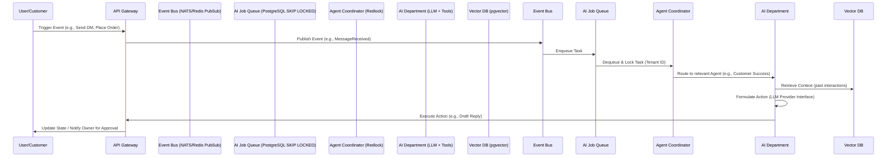
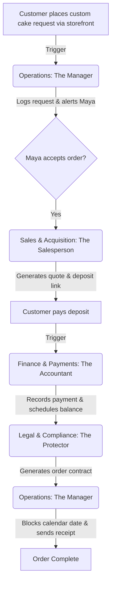

# AI Agent Department Architecture

## 1. Problem Statement
Small business owners—from bakers to handymen—are overwhelmed by the sheer volume of "invisible work" required to run a business. They spend hours answering repetitive questions, drafting social media posts, managing bookings, calculating margins, and generating reports. Competitor platforms (Shopify, Wix, Squarespace) offer AI, but treat it as a bolt-on tool or a reactive chatbot.

Users need AI that operates *autonomously* in the background, acting as true functional departments (Customer Success, Operations, Marketing) rather than mere prompt-and-response utilities. They need a system that does the heavy lifting invisibly, seamlessly integrating into their day-to-day operations to save time and reduce burnout.

## 2. Persona-Specific Pain Point Summaries

| Persona | Business Type | Core Pain Point | How AI Departments Help |
|---------|---------------|-----------------|-------------------------|
| **Maya (28)** | Home Baker | Drowning in Instagram DMs ("do you do vegan?"); overwhelmed by managing custom order deposits. | **Customer Success** drafts DM replies while she sleeps. **Operations** tracks custom deposits. |
| **Carlos (42)** | Handyman | Losing leads because he can't quote fast enough while on the job; no central inbox. | **Sales & Acquisition** auto-generates quotes from customer descriptions. **Operations** books calendar slots. |
| **Priya (35)** | Boutique | Struggling to keep in-store and online inventory synced; needs easy insights. | **Operations** tracks stock. **Business Advisory** sends daily sales summaries to her iPhone. |
| **Leo (22)** | Music Tutor | Chasing inactive students for re-booking; managing Zoom links manually. | **Customer Success** auto-emails inactive students. **Operations** creates Zoom links for bookings. |
| **Fatima (50)** | Food Cart | Handling chaotic pre-orders during rush hour; limited English proficiency. | **Operations** provides a simple, printable daily order list. **Customer Success** manages multi-lingual interactions. |

## 3. Market Feature Gap Analysis

### Competitive Comparison
| Feature | OHC | Shopify | Wix | Squarespace |
|---------|-----|---------|-----|-------------|
| **AI Paradigm** | **Autonomous Departments** | Reactive Chatbot (Sidekick) | Guided Setup (Wix AI) | Basic Text/Image Gen |
| **Trigger Mechanism** | **Event-Driven (State Changes)** | User Prompts | User Prompts | User Prompts |
| **Mobile Management** | **100% Native (375px first)** | Partial | Partial | None |
| **Cross-Discipline** | **Yes (Marketing + Ops + Finance)**| Store Only | Fragmented | Portfolio + Store |

### OHC Differentiation
OHC is the ONLY platform treating AI as core infrastructure. Instead of asking the user to generate an email, the **Customer Success** agent proactively drafts it based on the `OrderShipped` event and asks the user for a 1-tap approval on mobile.

## 4. AI Department Architecture

The platform's AI agents are functionally divided into relatable "Departments" to mirror real-world business operations.

### High-Level Event Flow

### Key Architectural Decisions

1. **Event-Driven Execution:** Agents are triggered by domain events (e.g., `InventoryLow`, `CartAbandoned`) over an Event Bus, ensuring background autonomy.
2. **PostgreSQL Job Queue with `SKIP LOCKED`:** Guarantees reliable, at-least-once processing of background tasks without deadlocks.
3. **Redis Redlock Coordination:** Ensures cross-agent coordination (e.g., preventing Marketing and Finance from modifying the same record simultaneously).
4. **Vector Memory (pgvector):** Agents retain state and history via embeddings, allowing them to provide highly contextualized actions (e.g., remembering a customer's allergy).
5. **Human-in-the-Loop Approval:** By default, high-risk actions (e.g., sending refunds, posting to social media) are generated as "Drafts" requiring 1-tap approval from the business owner on the mobile UI.

## 5. Department Interaction Workflow

Example: Maya's Custom Cake Order

## 6. Actionable Recommendations for OHC Implementation

1. **Implement the AI Job Queue:** Utilize PostgreSQL with `SKIP LOCKED` for processing asynchronous agent tasks. This is resilient, avoids the overhead of Kafka for small deployments, and handles tenant isolation natively.
2. **Build the "Agent Activity Feed" UI:** Design a 375px-first mobile feed component where business owners can see a timeline of agent actions and provide 1-tap approvals for drafted actions. Use Glassmorphism tokens (`backdrop-filter: blur(20px) saturate(200%)`).
3. **Establish Prompt Routing:** Create a routing layer that inspects incoming events and dispatches them to the correct department's `system_prompt` and toolset.
4. **Develop the Provider Abstraction Layer:** Implement a unified LLM Provider interface with Gemini Pro as the primary engine, but allow seamless fallback to OpenAI GPT-4o for resilience.
5. **Implement Cost Metering:** Instrument every agent invocation with OpenTelemetry to track token usage per `tenant_id`, enabling accurate billing and tier enforcement.
