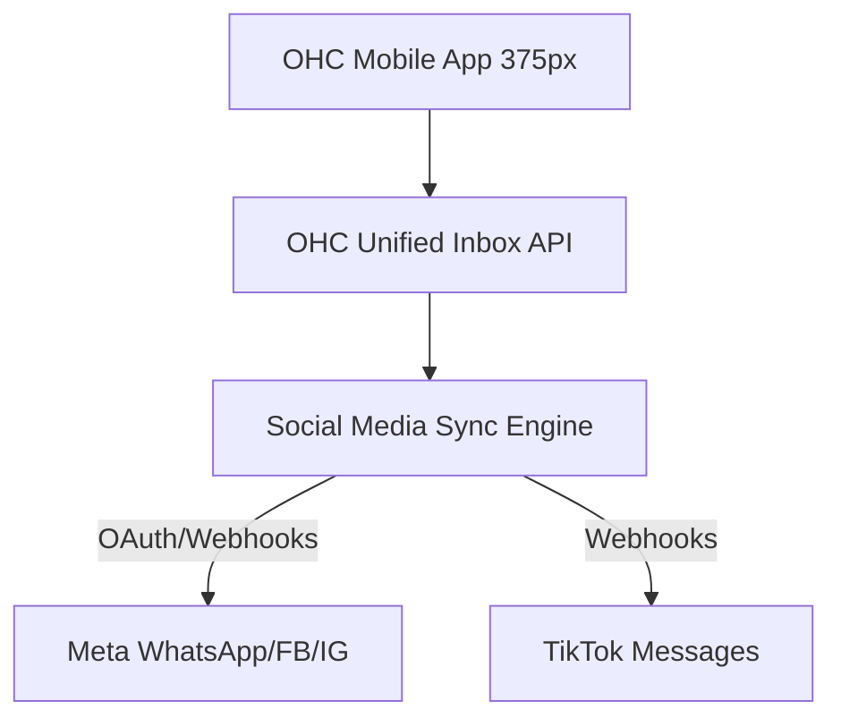
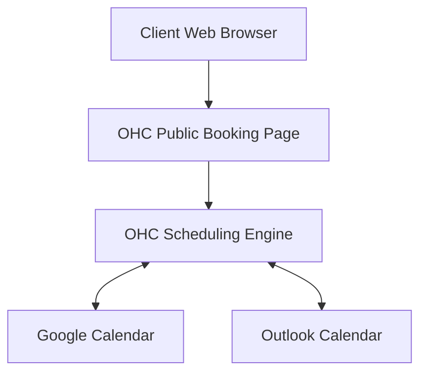
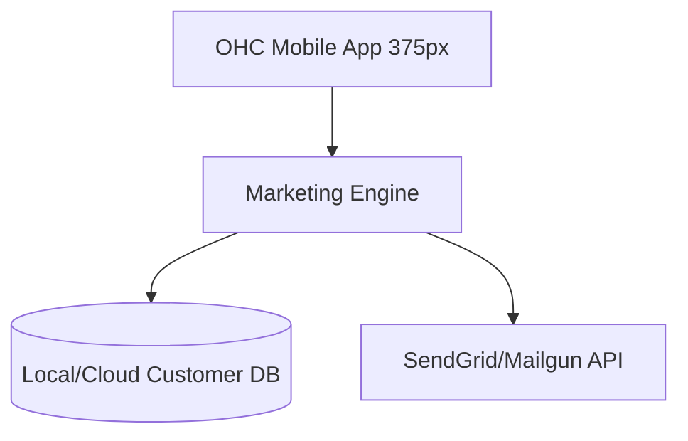
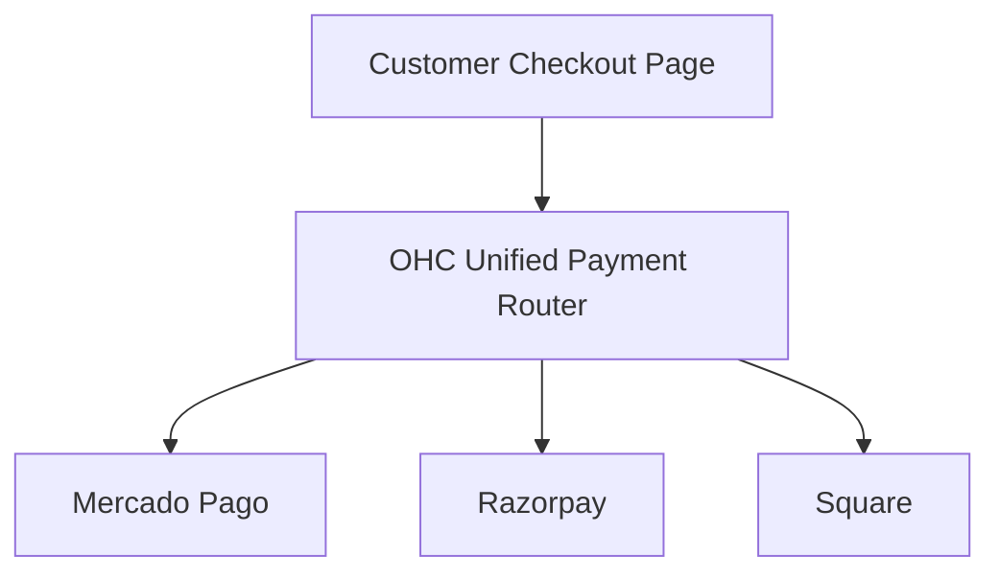
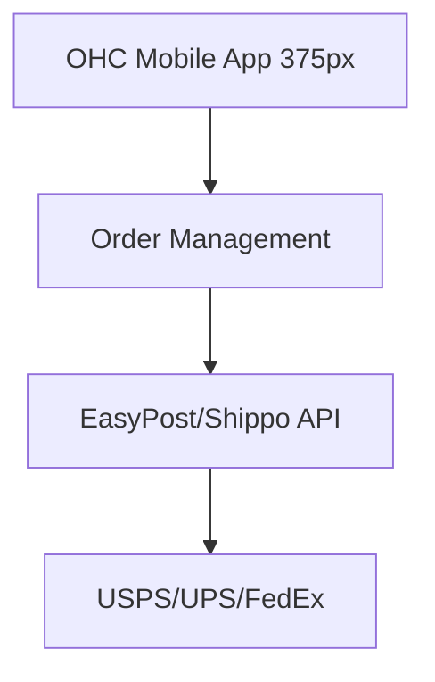
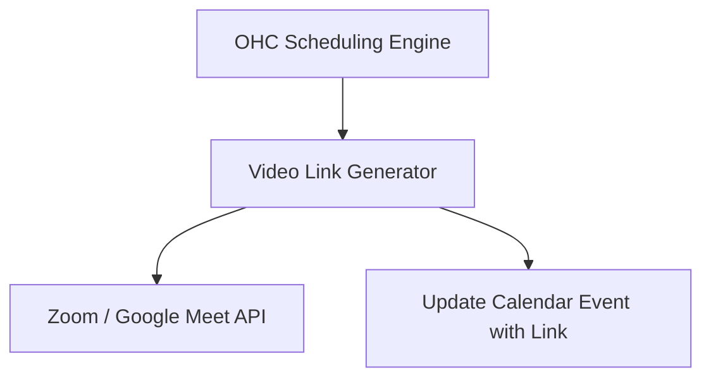

# Tool Integration Research Report - Q4

This report evaluates potential tool integrations across 7 categories to expand OHC's capabilities for small business owners in both Cloud and Standalone environments.

---

## [Social Media Integration] Unified Inbox Sync

### Title
Implement Unified Inbox Sync for Instagram, Facebook, WhatsApp, and TikTok

### Problem Statement
Small business owners (like food cart operators or independent bakers) receive customer inquiries, orders, and feedback across multiple social media platforms. Checking 4-5 different apps constantly is overwhelming, leads to missed sales, and interrupts their actual work. They need one simple inbox where all customer messages appear automatically, and where they can reply without switching apps.

### Research Report
**Evaluated Tools:** Meta Graph API (Instagram/FB/WhatsApp), TikTok for Business API, Chatwoot (Self-hosted/Cloud).
- **Ease of Use for Non-Technical Users:** The integration must hide the OAuth complexity. Users should only need to click "Connect Instagram" and authorize.
- **Pricing:** Social APIs are generally free for basic messaging. Chatwoot has a free community edition (good for Standalone) and reasonable cloud pricing.
- **Reputation/Reliability:** Meta APIs can be strict regarding 24-hour reply windows. Webhooks are reliable but require robust retry mechanisms.
- **Cloud vs. Standalone:** Both are supported. Standalone can use local Chatwoot IPC or direct API integrations with long-polling/webhooks proxied securely.

### Design Doc



**Mobile UX Flow (375px):**
1. **Home Screen (375px):** A single "Messages (3 New)" notification bubble on the main dashboard.
2. **Inbox View:** A unified list of messages with small icons indicating the source (IG, WA, etc.).
3. **Chat View:** Simple chat interface. When the user replies, the system routes it back to the correct social platform invisibly.
4. **Settings:** A "Connections" page with toggle switches for "Connect Instagram", "Connect WhatsApp", etc.

### Implementation Prompt
Create a "Unified Inbox" feature where users can read and reply to messages from Instagram, Facebook, WhatsApp, and TikTok from a single screen. The setup must be a one-click authorization process. Replies sent from OHC must appear in the customer's native app. Ensure the feature degrades gracefully if a social network disconnects, prompting the user to reconnect without failing the entire app.

### Priority
P0

### Estimated Scope
Large

---

## [Calendar & Scheduling] Smart Booking Assistant

### Title
Integrate Google Calendar & Outlook Sync with Auto-Booking Page

### Problem Statement
Independent service providers (like handymen, tutors, or consultants) waste hours playing phone tag or sending back-and-forth emails just to find a time to meet. They need a simple public link they can text to clients to let them pick an available slot, which should automatically sync with their personal phone calendar to prevent double-booking.

### Research Report
**Evaluated Tools:** Google Calendar API, Microsoft Graph API (Outlook), Cal.com (Open Source).
- **Ease of Use for Non-Technical Users:** Connecting the calendar must be a standard OAuth flow. The booking page needs to generate automatically without the user designing it.
- **Pricing:** Basic Calendar APIs are free. Cal.com has a generous free tier and open-source version for Standalone.
- **Reputation/Reliability:** Google and Microsoft APIs are industry standards. Timezone handling is notoriously tricky and must be handled entirely by the platform.
- **Cloud vs. Standalone:** Supported in both. Standalone will require a secure tunnel or proxy for the public booking link if the host is not publicly accessible.

### Design Doc



**Mobile UX Flow (375px):**
1. **Home Screen (375px):** "Share Booking Link" prominent button.
2. **Setup View:** "Connect your Calendar" button. User selects working hours (e.g., 9 AM - 5 PM).
3. **Daily View:** A unified schedule showing both personal events (imported) and new bookings (highlighted).

### Implementation Prompt
Develop a "Smart Booking" feature that allows users to connect their existing Google or Outlook calendar. Once connected, generate a unique, mobile-friendly booking link that the business owner can share. The public page must only show available time slots based on the owner's linked calendar and working hours. When a client books, it should automatically create an event on the owner's calendar and send a confirmation text to the client.

### Priority
P1

### Estimated Scope
Medium

---

## [Email Marketing] Simplified Customer Campaigns

### Title
One-Click Customer Email Announcements

### Problem Statement
Small business owners want to tell their existing customers about a new promotion, a holiday closure, or a new product. Standard tools like Mailchimp are too complex, requiring them to design templates and manage lists manually. They just want to type a quick message, perhaps attach a photo, and hit "Send to all past customers."

### Research Report
**Evaluated Tools:** SendGrid, Mailgun, Amazon SES.
- **Ease of Use for Non-Technical Users:** Must avoid drag-and-drop template builders. A simple rich-text editor is preferred. List management should be completely automatic (auto-populated from past sales).
- **Pricing:** SES is cheapest but hard to set up. SendGrid/Mailgun offer decent low-volume free tiers and simple APIs.
- **Reputation/Reliability:** High deliverability requires proper domain authentication, which OHC will need to handle or abstract away (e.g., sending from a generic platform email on behalf of the user).
- **Cloud vs. Standalone:** Cloud integrates directly. Standalone users can configure their own SMTP credentials or route through an OHC cloud relay for simplicity.

### Design Doc



**Mobile UX Flow (375px):**
1. **Marketing Tab (375px):** "Send an Announcement" button.
2. **Compose View:** Simple text box with "Add Photo" button. Looks like composing a standard email.
3. **Audience View:** Checkboxes for "All Customers", "Recent Customers", or "VIPs".
4. **Success Screen:** Confirmation that the message is being sent out.

### Implementation Prompt
Implement a "Broadcast Message" feature. The user should be able to type a simple message, upload an image, and send it as a branded email to their automatically maintained customer list. The system must handle unsubscribe links and CAN-SPAM compliance invisibly. The user should see a simple summary of how many people received the email.

### Priority
P2

### Estimated Scope
Medium

---

## [Payment Processing] Local & Global Payment Alternatives

### Title
Plug-and-Play Alternative Payment Gateways

### Problem Statement
While Stripe is great, many business owners operate in regions where Stripe is unavailable or prefer local payment methods with lower fees (e.g., Mercado Pago in LATAM, Paytm in India, CashApp). They need the ability to accept payments through the tools their local customers actually use.

### Research Report
**Evaluated Tools:** Mercado Pago API, Razorpay, Square/CashApp Pay APIs.
- **Ease of Use for Non-Technical Users:** Connecting must be as simple as entering a few API keys or a standard OAuth login.
- **Pricing:** Varies heavily by region, but generally competitive with local markets.
- **Reputation/Reliability:** Mercado Pago and Razorpay are dominant in their respective regions.
- **Cloud vs. Standalone:** Fully supported in both. Webhooks for payment confirmation will require routing to the correct instance.

### Design Doc



**Mobile UX Flow (375px):**
1. **Settings -> Payments (375px):** List of available payment providers by region.
2. **Provider Setup:** "Connect Mercado Pago" -> redirects to Mercado Pago login.
3. **Invoice View:** When creating an invoice, the user sees "Payments enabled via Mercado Pago".
4. **Customer View:** Checkout page dynamically shows the connected local payment options.

### Implementation Prompt
Create a "Local Payments" expansion. Allow users to activate regional payment providers (like Mercado Pago or Razorpay) alongside or instead of standard credit card processing. The checkout page should automatically display the active payment methods. Payment statuses (pending, paid, failed) must be normalized so the business owner sees a consistent "Invoice Paid" notification regardless of the provider used.

### Priority
P1

### Estimated Scope
Large

---

## [Shipping & Logistics] Frictionless Package Shipping

### Title
Instant Shipping Label Generation & Tracking

### Problem Statement
Makers and e-commerce sellers spend too much time copying customer addresses from their sales platform into a separate shipping website, guessing package weights, and paying retail shipping rates. They need to print a label directly from the order screen and automatically text the tracking number to the customer.

### Research Report
**Evaluated Tools:** EasyPost API, Shippo API.
- **Ease of Use for Non-Technical Users:** Needs a simple interface to select package size (e.g., "Small Box", "Envelope") rather than inputting exact dimensions every time.
- **Pricing:** EasyPost offers heavily discounted USPS rates and charges pennies per label API call.
- **Reputation/Reliability:** EasyPost and Shippo are highly reliable industry standards.
- **Cloud vs. Standalone:** Fully compatible with both. Printing labels in Standalone mode can utilize local OS print dialogue natively.

### Design Doc



**Mobile UX Flow (375px):**
1. **Order Details (375px):** A prominent "Create Shipping Label" button on any paid order.
2. **Shipping View:** Quick selection of pre-saved package sizes (e.g., "Standard Mailer").
3. **Purchase View:** Shows the exact cost (e.g., "$3.45 via USPS"). User taps "Buy & Print".
4. **Confirmation:** "Label Printed. Tracking info sent to customer."

### Implementation Prompt
Integrate a shipping label generation system for product orders. When an order is marked paid, the user should be able to tap "Get Label", select a box size, and purchase postage directly within OHC. The system must automatically generate a printable PDF label and send an automatic tracking notification to the customer.

### Priority
P2

### Estimated Scope
Medium

---

## [SMS & Notifications] Global SMS Alerts

### Title
Reliable Automated SMS Notifications

### Problem Statement
Many small business owners and their customers are not always online or checking email. Critical updates—like "Your food is ready", "Appointment confirmed", or "Invoice due"—are missed. They need automatic text messages sent to customers to keep everyone informed instantly.

### Research Report
**Evaluated Tools:** Twilio, MessageBird, Vonage.
- **Ease of Use for Non-Technical Users:** Completely invisible to the user. They just flip a switch saying "Text customers when order is ready."
- **Pricing:** SMS costs vary by country. Needs a system where users perhaps buy "credits" or have a monthly allowance to prevent platform abuse.
- **Reputation/Reliability:** Twilio is the gold standard for global delivery but requires strict A2P 10DLC compliance in the US, which is a major hurdle for small businesses. OHC may need to register as an ISV.
- **Cloud vs. Standalone:** Works in both, but API credentials management is simpler in Cloud. Standalone users might need to provide their own Twilio keys if not using a centralized OHC credit system.

### Design Doc

```mermaid
graph TD;
    OHC_Events[OHC Event Bus (Order Ready, Appt Booked)] --> SMS_Service[OHC SMS Dispatcher];
    SMS_Service --> Twilio[Twilio API];
    Twilio --> CustomerPhone[Customer Mobile Device];
```

**Mobile UX Flow (375px):**
1. **Settings -> Notifications (375px):** Simple toggles: "Text customer when appointment is booked", "Text customer when order ships".
2. **Customer View:** Customer receives a standard text message (e.g., "Hi from Jane's Bakery! Your order #123 is ready for pickup.").

### Implementation Prompt
Add automatic SMS notifications for key business events. Provide the user with simple settings to enable or disable automated texts for things like booking confirmations, reminders, and order pickups. The complex telecom compliance and routing should be handled by the platform, ensuring messages are delivered reliably without the business owner needing to understand SMS regulations.

### Priority
P1

### Estimated Scope
Medium

---

## [Video Conferencing] Auto-Generated Video Links

### Title
Zero-Touch Video Meeting Links

### Problem Statement
Tutors, consultants, and online coaches struggle with manually creating Zoom or Google Meet links and emailing them to clients before every meeting. Often, links are lost or forgotten, leading to delayed starts. They need a unique meeting link automatically generated and attached to every calendar booking.

### Research Report
**Evaluated Tools:** Zoom API, Google Workspace API (Meet), Daily.co.
- **Ease of Use for Non-Technical Users:** Should happen automatically if "Online Meeting" is selected for a service.
- **Pricing:** Daily.co has a generous free tier for embedded video. Zoom requires a paid account for the host to use the API effectively. Google Meet is free if linked to a Google account.
- **Reputation/Reliability:** Zoom and Meet are what customers expect. Daily.co is easier to embed directly in the app.
- **Cloud vs. Standalone:** Both supported.

### Design Doc



**Mobile UX Flow (375px):**
1. **Service Setup (375px):** User creates a service (e.g., "1 Hour Tutoring"). They select a toggle: "This is an online video meeting."
2. **Booking Flow:** When a client books, they automatically receive an email/text with a unique "Join Video Call" link.
3. **Daily Agenda:** The user's daily schedule in OHC has a big "Start Video Call" button next to the appointment.

### Implementation Prompt
Implement automatic video conferencing link generation for appointments. When a user configures a service as "Online", the system must automatically create a unique video meeting room for every booking. This link must be automatically included in the calendar invite and the reminder notifications sent to the client. The business owner should simply see a "Join Call" button on their daily schedule when it's time to meet.

### Priority
P2

### Estimated Scope
Small
